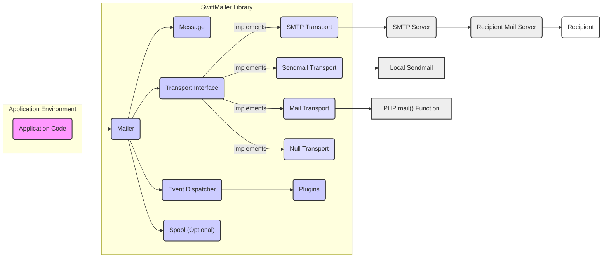
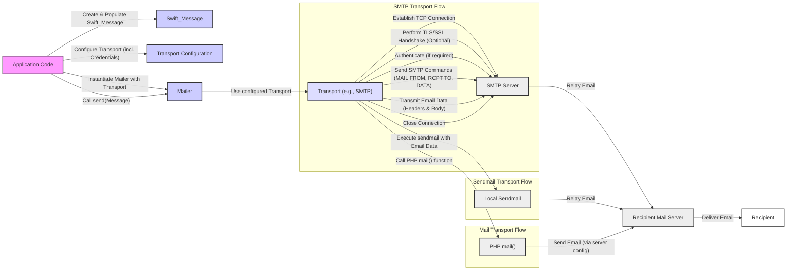

# Project Design Document: SwiftMailer Library

**Version:** 1.1
**Date:** October 26, 2023
**Author:** AI Software Architect

## 1. Introduction

This document provides an enhanced design overview of the SwiftMailer library, a widely used PHP library for sending emails. This document aims to provide a more granular and comprehensive understanding of the library's architecture, components, data flow, and security considerations, specifically tailored for threat modeling activities.

## 2. Goals

*   Provide a clear, concise, and detailed description of the SwiftMailer library's architecture and functionality.
*   Identify key components and their specific responsibilities and interactions.
*   Outline the data flow within the library and with external systems, including potential transformation points.
*   Highlight relevant security considerations with specific examples of potential threats for effective threat modeling.

## 3. Target Audience

This document is intended for:

*   Security engineers and architects performing threat modeling and security assessments.
*   Developers integrating SwiftMailer into their applications, requiring a deeper understanding of its security implications.
*   Anyone seeking a detailed understanding of SwiftMailer's internal design and potential attack surfaces.

## 4. System Overview

SwiftMailer is a standalone PHP library designed to simplify the process of sending emails from PHP applications. It offers an abstraction layer over various mail transfer protocols, providing a consistent API for developers. The core function of SwiftMailer is to construct email messages programmatically and reliably transmit them to a designated mail server.

## 5. System Architecture

The following diagram illustrates a more detailed architecture of SwiftMailer and its interactions:

### 5.1. Key Components

*   **Application Code:** The PHP code that initiates the email sending process using SwiftMailer. Responsible for defining email content and invoking SwiftMailer's API.
*   **SwiftMailer Library:** The core set of classes and interfaces.
    *   **Mailer:** The central class responsible for accepting a `Message` and using a `Transport` to send it. Manages the overall sending process.
    *   **Message:** Represents the email itself, encapsulating properties like:
        *   Sender address(es)
        *   Recipient address(es) (To, CC, BCC)
        *   Subject
        *   Body (plain text and/or HTML)
        *   Headers (including custom headers)
        *   Attachments
    *   **Transport Interface:** Defines the contract for different email sending mechanisms.
    *   **Transport Implementations:** Concrete classes implementing the `Transport` interface:
        *   **SMTP Transport:** Handles sending emails via the Simple Mail Transfer Protocol to an SMTP server. Manages connection establishment, authentication, and message transmission.
        *   **Sendmail Transport:** Executes the local `sendmail` program to send emails. Relies on the security configuration of the local system.
        *   **Mail Transport:** Uses PHP's built-in `mail()` function. Limited in features and relies on the server's `mail` configuration.
        *   **Null Transport:** A mock transport used for testing purposes, discarding emails instead of sending them.
    *   **Event Dispatcher:** A component that allows for hooking into the email sending process via events. Plugins can subscribe to these events.
    *   **Plugins:** Extend SwiftMailer's functionality by listening to events. Examples include:
        *   Logging plugins
        *   Anti-spam header injection plugins
        *   Bounce tracking plugins
    *   **Spool (Optional):** A mechanism for queuing emails to be sent asynchronously. Can use various storage backends (e.g., file system, database).
*   **External Systems:**
    *   **SMTP Server:** A Mail Transfer Agent (MTA) that receives emails from SwiftMailer (via SMTP Transport) and relays them.
    *   **Local Sendmail:** The system's `sendmail` executable used by the Sendmail Transport.
    *   **PHP mail() Function:** The built-in PHP function used by the Mail Transport.
    *   **Recipient Mail Server:** The MTA responsible for the recipient's email domain.
    *   **Recipient:** The end-user who ultimately receives the email.

## 6. Data Flow

The detailed data flow for sending an email using SwiftMailer involves several steps and potential transformations:

1. The **Application Code** constructs a `Swift_Message` object, populating it with email details (sender, recipients, subject, body, headers, attachments). This involves data input from various sources within the application.
2. The **Application Code** instantiates a `Swift_Mailer` object, providing a configured `Transport` instance (e.g., `Swift_SmtpTransport`). The transport configuration might include sensitive information like SMTP server credentials.
3. The **Application Code** calls the `send()` method of the `Mailer`, passing the `Message` object.
4. The `Mailer` interacts with the configured **Transport**.
5. **If using SMTP Transport:**
    *   The `SMTP Transport` establishes a TCP connection to the specified **SMTP Server**.
    *   Optionally, a TLS/SSL handshake is performed to encrypt the communication channel.
    *   If required, the `SMTP Transport` performs authentication with the **SMTP Server** using provided credentials.
    *   The `SMTP Transport` transmits the email message data, formatted according to the SMTP protocol, to the **SMTP Server**. This includes:
        *   `MAIL FROM` command with the sender address.
        *   `RCPT TO` command(s) with recipient addresses.
        *   `DATA` command followed by email headers and body.
    *   The connection is closed.
6. **If using Sendmail Transport:**
    *   The `Sendmail Transport` executes the local `sendmail` command, passing the email data as arguments or via standard input.
7. **If using Mail Transport:**
    *   The `Mail Transport` calls PHP's `mail()` function with the recipient, subject, and body.
8. The **SMTP Server** (or local `sendmail`) receives the email and attempts to deliver it to the **Recipient Mail Server** based on the recipient's domain.
9. The **Recipient Mail Server** receives the email and delivers it to the **Recipient's** inbox.

The following diagram illustrates the detailed data flow:

## 7. Security Considerations

Several security aspects are critical when using SwiftMailer, presenting potential attack vectors:

*   **SMTP Authentication Security:**
    *   **Threat:** Credentials (username and password) for the SMTP server could be compromised if stored insecurely (e.g., hardcoded, in version control).
    *   **Mitigation:** Store credentials securely using environment variables, configuration files with restricted access, or dedicated secrets management solutions.
*   **TLS/SSL Encryption Vulnerabilities:**
    *   **Threat:** If TLS/SSL is not enabled or configured correctly, email content and authentication credentials can be intercepted during transmission (Man-in-the-Middle attack). Older TLS versions might have known vulnerabilities.
    *   **Mitigation:** Always enable TLS/SSL. Ensure the latest secure TLS versions are used and that certificate verification is enabled to prevent connection to rogue servers.
*   **Email Header Injection:**
    *   **Threat:** If user-supplied data is directly incorporated into email headers without proper sanitization, attackers can inject malicious headers to:
        *   Add unintended recipients (BCC).
        *   Spoof the sender address.
        *   Manipulate email routing.
    *   **Mitigation:**  Sanitize all user-provided input before including it in email headers. Use SwiftMailer's API to set headers, which provides some level of protection.
*   **Attachment Security Risks:**
    *   **Threat:** Malicious attachments can be sent to recipients, potentially containing malware or exploiting vulnerabilities in the recipient's email client.
    *   **Mitigation:** Implement strict validation of file types and sizes for attachments. Consider scanning attachments for malware before sending. Inform users about the risks of opening attachments from unknown senders.
*   **Configuration Management Weaknesses:**
    *   **Threat:** Insecurely stored or managed SwiftMailer configuration (including transport settings and credentials) can be exploited by attackers gaining access to the application's environment.
    *   **Mitigation:** Store configuration securely with appropriate access controls. Avoid storing sensitive information in publicly accessible files.
*   **Logging Sensitive Information:**
    *   **Threat:** Logging email content, recipient lists, or SMTP credentials can expose sensitive information if logs are not properly secured.
    *   **Mitigation:**  Review logging configurations to ensure sensitive data is not logged. Implement secure log storage and access controls.
*   **Dependency Vulnerabilities:**
    *   **Threat:**  Vulnerabilities in SwiftMailer itself or its dependencies could be exploited if the library is not kept up-to-date.
    *   **Mitigation:** Regularly update SwiftMailer and its dependencies to the latest stable versions to patch known security flaws.
*   **Spool Security Concerns (if used):**
    *   **Threat:** If the email spool is used, the storage mechanism (e.g., file system, database) could be a target for attackers to access or manipulate queued emails.
    *   **Mitigation:** Secure the spool storage location with appropriate file system permissions or database access controls. Encrypt spooled email data if it contains sensitive information.
*   **Insufficient Input Validation (Application Responsibility):**
    *   **Threat:** While SwiftMailer provides some basic validation, the application is primarily responsible for validating email addresses and content. Insufficient validation can lead to issues like sending emails to invalid addresses or including malicious content.
    *   **Mitigation:** Implement robust input validation in the application code before passing data to SwiftMailer.
*   **Abuse and Rate Limiting:**
    *   **Threat:** If not properly controlled, attackers could abuse the email sending functionality to send spam or phishing emails.
    *   **Mitigation:** Implement rate limiting and other abuse prevention mechanisms at the application level.

## 8. Deployment Considerations

SwiftMailer's security is influenced by its deployment environment:

*   **Web Servers:** Ensure the web server environment is secure, with proper file permissions and access controls to prevent unauthorized modification of SwiftMailer's files or configuration.
*   **Command-Line Scripts:** When used in scripts, ensure the script's environment and any configuration files are protected.
*   **Containerized Environments:** Secure the container image and the container runtime environment. Avoid embedding sensitive information directly in the image. Use secrets management for credentials.

## 9. Assumptions and Constraints

*   It is assumed that the underlying operating system and network infrastructure have basic security measures in place.
*   This document primarily focuses on the security aspects directly related to SwiftMailer. Broader application security considerations are outside its scope.
*   The security of the SMTP server and recipient mail servers is assumed to be the responsibility of their respective administrators.

## 10. Future Considerations

*   Detailed security analysis of SwiftMailer's internal code for potential vulnerabilities.
*   Assessment of the security implications of different plugin implementations.
*   Regular review of SwiftMailer's security advisories and updates.

This improved design document provides a more detailed and security-focused overview of the SwiftMailer library, enhancing its value for threat modeling and security assessments.
