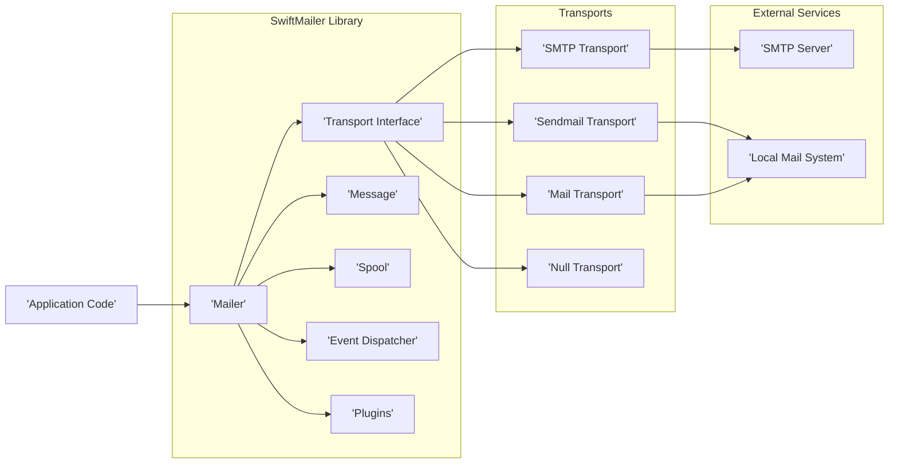
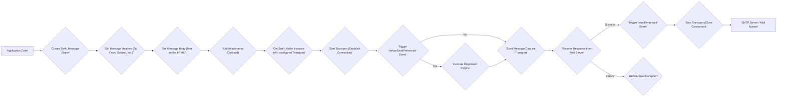

# Project Design Document: SwiftMailer

**Version:** 1.1
**Date:** October 26, 2023
**Author:** AI Software Architect

## 1. Introduction

This document provides an enhanced architectural design of the SwiftMailer library, a widely used PHP library for sending emails. This detailed design serves as a robust foundation for subsequent threat modeling exercises, offering a comprehensive understanding of the system's internal structure, data movement, and interactions with external entities.

## 2. Goals and Objectives

The primary objective of this document remains to furnish a clear and granular depiction of SwiftMailer's architecture, specifically tailored to facilitate thorough and effective threat modeling. Key objectives include:

*   Detailed identification and description of core components and their specific functionalities.
*   Precise mapping of data flow pathways within the system, highlighting transformation points.
*   Comprehensive understanding of external dependencies and the nature of their interactions.
*   Sharp focus on potentially security-sensitive areas and operations within the library.
*   Provision of a solid, well-articulated basis for identifying potential threats, vulnerabilities, and attack vectors.

## 3. Architectural Overview

SwiftMailer simplifies the process of sending emails in PHP by providing an abstraction layer over various email transmission methods. It offers a consistent API for constructing and sending emails, regardless of the underlying transport mechanism, and includes features for message composition, queuing, and event management.

**Key Architectural Components:**

*   **Mailer:** The central orchestrator for sending emails. It accepts a transport, builds messages, manages the sending process (either directly or via a spool), and handles events and plugins.
*   **Transport Interface:** Defines a contract for sending emails, with concrete implementations for different protocols. This abstraction allows the Mailer to be transport-agnostic.
*   **Message:** Represents the email itself, encapsulating all necessary information such as headers, body (plain text and HTML), recipients, and attachments.
*   **Spool:** A queuing mechanism for storing emails to be sent later. This can improve performance and resilience, especially for high-volume email sending.
*   **Event Dispatcher:** Enables developers to subscribe to and react to events during the email sending lifecycle, facilitating custom logic and extensions.
*   **Plugins:** Provide a way to extend SwiftMailer's functionality, offering features like DKIM signing, anti-spam header injection, and custom delivery logic.

## 4. Component Details

This section provides a more detailed examination of SwiftMailer's core components, outlining their specific functionalities, inputs, outputs, dependencies, and crucial security considerations relevant for threat modeling.

### 4.1. Mailer (`Swift_Mailer`)

*   **Functionality:**
    *   Accepts a concrete implementation of `Swift_Transport` to handle the actual email transmission.
    *   Provides factory methods for creating `Swift_Message` objects.
    *   Offers methods for sending messages directly (`send()`) or through a spool (`sendQueuedMessages()`).
    *   Manages the registration and invocation of event listeners via the `Swift_Events_EventDispatcher`.
    *   Registers and executes registered plugins at appropriate stages of the email sending process.
*   **Inputs:**
    *   An instance of `Swift_Transport`.
    *   `Swift_Message` objects ready for sending.
    *   Configuration parameters related to spooling (if enabled).
    *   Registered event listeners (closures or callable objects).
    *   Registered plugins implementing `Swift_Plugins_Interface`.
*   **Outputs:**
    *   Integer representing the number of successfully sent emails.
    *   Dispatched events to registered listeners.
*   **Dependencies:**
    *   `Swift_Transport` interface and its implementations.
    *   `Swift_Message` class.
    *   `Swift_Spool` interface and its implementations (optional).
    *   `Swift_Events_EventDispatcher`.
    *   `Swift_Plugins_Interface` and registered plugin implementations.
*   **Security Considerations:**
    *   **Transport Configuration:** Improperly configured transport (e.g., incorrect server details, wrong port, missing encryption) can lead to emails being sent insecurely or to unintended recipients.
    *   **Plugin Management:**  The Mailer's reliance on plugins means vulnerabilities in plugins can directly impact the security of the email sending process. Careful selection and vetting of plugins are essential.
    *   **Event Listener Security:** While providing flexibility, poorly written or malicious event listeners could interfere with the sending process or introduce vulnerabilities.

### 4.2. Transport Interface (`Swift_Transport`)

*   **Functionality:**
    *   Defines the `isStarted()`, `start()`, `stop()`, and `send()` methods that concrete transport implementations must adhere to.
    *   Manages the underlying connection to the mail server or system.
    *   Handles authentication procedures when required by the transport protocol.
*   **Inputs:**
    *   Formatted email data from a `Swift_Message` object.
    *   Transport-specific configuration parameters (e.g., SMTP server hostname, port, username, password, encryption method).
*   **Outputs:**
    *   Boolean indicating the success or failure of the email transmission for each recipient.
*   **Implementations:**
    *   **SMTP Transport (`Swift_SmtpTransport`):** Communicates with an SMTP server over TCP/IP. Supports various authentication methods (PLAIN, LOGIN, CRAM-MD5, etc.) and encryption (TLS/SSL).
    *   **Sendmail Transport (`Swift_SendmailTransport`):** Uses the local `sendmail` binary to send emails. Relies on the security configuration of the underlying operating system.
    *   **Mail Transport (`Swift_MailTransport`):** Leverages PHP's built-in `mail()` function. Security is heavily dependent on the server's mail configuration.
    *   **Null Transport (`Swift_NullTransport`):** A non-sending transport primarily used for testing purposes.
*   **Security Considerations:**
    *   **SMTP Transport:**
        *   **Man-in-the-Middle (MITM) Attacks:** Vulnerable if TLS/SSL is not enabled or if certificate verification is disabled or bypassed.
        *   **Credential Exposure:**  Storing or transmitting SMTP credentials insecurely can lead to unauthorized access to the mail server.
        *   **Authentication Weaknesses:**  Using insecure authentication methods can be exploited.
    *   **Sendmail Transport:**
        *   **Command Injection:** If email data is not properly sanitized before being passed to the `sendmail` command, attackers could inject arbitrary commands.
        *   **Privilege Escalation:**  If the `sendmail` binary runs with elevated privileges, vulnerabilities could lead to privilege escalation.
    *   **Mail Transport:**
        *   **Header Injection Vulnerabilities:** If user-provided data is directly used in email headers without sanitization, attackers can inject malicious headers.
        *   **Server Configuration Issues:** Security depends entirely on the underlying mail server configuration, which is outside SwiftMailer's control.

### 4.3. Message (`Swift_Message`)

*   **Functionality:**
    *   Provides methods for setting and retrieving email headers (e.g., `setTo()`, `setFrom()`, `setSubject()`, `getHeaders()`).
    *   Allows setting the email body in plain text (`setBody()`) and HTML (`addPart()`).
    *   Supports adding attachments (`attach()`) and embedded images (`embed()`).
    *   Offers methods for setting message priority, read receipts, and other email-specific features.
*   **Inputs:**
    *   Recipient email addresses (To, Cc, Bcc).
    *   Sender email address and name.
    *   Email subject line.
    *   Plain text and/or HTML content for the email body.
    *   File paths or data streams for attachments and embedded images.
    *   Custom headers as key-value pairs.
*   **Outputs:**
    *   A structured representation of the email ready for transmission by a transport.
*   **Security Considerations:**
    *   **Header Injection:** Failure to sanitize user inputs used in header values can allow attackers to inject arbitrary headers, potentially leading to spam, phishing, or other malicious activities.
    *   **Cross-Site Scripting (XSS):** If HTML content is generated from user input without proper encoding, it can lead to XSS vulnerabilities when the email is viewed in an HTML-enabled email client.
    *   **Attachment Security:** SwiftMailer itself does not perform malware scanning on attachments. Sending or receiving malicious attachments is a significant risk that needs to be addressed by the application or mail server.

### 4.4. Spool (`Swift_Spool`)

*   **Functionality:**
    *   Provides an interface for different spooling mechanisms (e.g., file system, database, in-memory).
    *   Allows messages to be stored temporarily and sent later, often in batches.
    *   Implementations include `Swift_FileSpool`, `Swift_DoctrineSpool`, and custom implementations.
*   **Inputs:**
    *   `Swift_Message` objects to be stored in the queue.
    *   Configuration parameters specific to the spool implementation (e.g., file path, database connection details).
*   **Outputs:**
    *   Storage of email messages in the chosen spool mechanism.
*   **Security Considerations:**
    *   **Storage Security:** The security of the spool depends on the underlying storage mechanism.
        *   **File Spool:** Requires appropriate file system permissions to prevent unauthorized access, modification, or deletion of spooled emails.
        *   **Database Spool:** Requires secure database credentials and access controls to protect the stored email data. Encryption of sensitive data at rest might be necessary.
    *   **Denial of Service (DoS):** A large number of malicious emails spooled could consume excessive storage space or processing resources when the queue is processed.

### 4.5. Event Dispatcher (`Swift_Events_SimpleEventDispatcher`)

*   **Functionality:**
    *   Implements the Observer pattern, allowing components to subscribe to and be notified of specific events during the email sending process (e.g., `beforeSendPerformed`, `sendPerformed`).
    *   Provides methods for attaching listeners (`bind()`) and dispatching events (`dispatchEvent()`).
*   **Inputs:**
    *   Event listeners (callbacks or objects implementing event interfaces).
    *   Event objects containing information about the event.
*   **Outputs:**
    *   Invocation of registered event listeners when a corresponding event is dispatched.
*   **Security Considerations:**
    *   **Malicious Event Listeners:** If an attacker can register a malicious event listener, they could intercept email data, modify messages, or disrupt the sending process. Proper control over who can register listeners is crucial.
    *   **Information Disclosure:** Events might contain sensitive information about the email being sent. Ensure that only authorized listeners have access to these events.

### 4.6. Plugins (`Swift_Plugins_Interface`)

*   **Functionality:**
    *   Provide a modular way to extend SwiftMailer's functionality.
    *   Plugins can hook into the email sending process at various stages to modify messages, add headers, or perform other actions.
    *   Examples include plugins for DKIM signing, anti-spam headers (e.g., Sender Policy Framework - SPF), and custom logging.
*   **Inputs:**
    *   `Swift_Message` objects being processed.
    *   Configuration parameters specific to the plugin.
*   **Outputs:**
    *   Modified `Swift_Message` objects (e.g., with added headers or altered content).
    *   Side effects based on the plugin's functionality (e.g., logging to a file).
*   **Security Considerations:**
    *   **Plugin Vulnerabilities:** Third-party plugins may contain security vulnerabilities that could be exploited. Thoroughly vet and regularly update plugins.
    *   **Configuration Errors:** Incorrectly configured plugins can introduce security weaknesses (e.g., improperly configured DKIM signing might fail to protect against spoofing).

## 5. Data Flow

The data flow diagram below illustrates the typical sequence of actions when sending an email using SwiftMailer, highlighting key decision points and potential areas of interest for threat modeling.

**Detailed Data Flow:**

1. **Application Code:** The application initiates the email sending process.
2. **Create `Swift_Message` Object:** A new `Swift_Message` object is instantiated.
3. **Set Message Headers:**  Essential headers like recipient addresses, sender address, and subject are set.
4. **Set Message Body:** The email content (plain text and/or HTML) is added.
5. **Add Attachments (Optional):** Any necessary files are attached to the message.
6. **Get `Swift_Mailer` Instance:** An instance of `Swift_Mailer` is obtained, configured with the desired transport.
7. **Start Transport:** The chosen transport mechanism establishes a connection to the mail server or system.
8. **Trigger 'beforeSendPerformed' Event:** The event dispatcher triggers the `beforeSendPerformed` event, allowing listeners and plugins to act before the email is sent.
9. **Execute Registered Plugins:** If plugins are registered, they are executed to potentially modify the message or perform other actions.
10. **Send Message Data via Transport:** The `Swift_Mailer` uses the configured transport to transmit the formatted email data to the mail server.
11. **Receive Response from Mail Server:** The transport receives a response from the mail server indicating success or failure.
12. **Trigger 'sendPerformed' Event:** The event dispatcher triggers the `sendPerformed` event, providing feedback on the sending outcome.
13. **Handle Error/Exception:** If the sending fails, an error or exception is raised, requiring the application to handle it appropriately.
14. **Stop Transport:** The transport closes the connection to the mail server.
15. **SMTP Server / Mail System:** The email is delivered to the intended recipient(s) by the mail server.

## 6. Security Considerations

This section expands on the security considerations, providing more specific examples and potential attack vectors:

*   **Input Validation and Sanitization:**  Crucially important for preventing header injection and XSS attacks. Always sanitize user-provided data before incorporating it into email headers or the HTML body. Use appropriate escaping functions for HTML content.
*   **Output Encoding:** Encode output, especially when rendering dynamic content in HTML emails, to mitigate XSS risks.
*   **Transport Layer Security (TLS/SSL) Enforcement:**  Mandatory for SMTP to protect credentials and email content from eavesdropping. Ensure proper certificate verification is enabled.
*   **Secure Credential Management:** Store SMTP credentials securely (e.g., using environment variables or dedicated secrets management solutions) and avoid hardcoding them.
*   **Attachment Security Practices:**  Implement checks on attachment file types and sizes. Consider integrating with anti-malware scanning services. Inform users about the risks of opening attachments from unknown sources.
*   **Protection Against Header Injection:**  Strictly control the construction of email headers. Avoid directly concatenating user input into header values.
*   **Vetting and Updating Plugins:** Only use reputable and actively maintained plugins. Regularly update plugins to patch known vulnerabilities.
*   **Spool Security Measures:** Implement appropriate access controls and encryption for the chosen spool mechanism to protect sensitive email data at rest.
*   **Robust Error Handling:** Implement proper error handling to prevent the leakage of sensitive information in error messages.
*   **Secure Configuration Management:**  Securely manage SwiftMailer's configuration settings, particularly transport credentials and plugin configurations.
*   **Dependency Updates:** Keep SwiftMailer and all its dependencies updated to benefit from the latest security patches.
*   **Rate Limiting:** Implement rate limiting to prevent abuse of the email sending functionality, such as spamming.

## 7. Deployment Considerations

The environment in which SwiftMailer is deployed significantly impacts its security posture. Consider the following:

*   **Web Servers (Shared Hosting vs. Dedicated/VPS):** Shared hosting environments may introduce risks due to shared resources and potential vulnerabilities in other hosted applications. Dedicated servers or VPS offer more control over security configurations.
*   **Cloud Environments (AWS, Azure, GCP):** Leverage cloud-specific security features like firewalls, network segmentation, and identity and access management (IAM) to secure SwiftMailer deployments.
*   **Containerized Environments (Docker, Kubernetes):**  Secure container images by using minimal base images, scanning for vulnerabilities, and implementing proper network policies. Manage secrets securely within the container orchestration platform.
*   **Command-Line Tools and Scripts:** Ensure the security of the environment where these scripts are executed, particularly regarding credential management and access control.
*   **Background Job Processors (e.g., Symfony Messenger, Laravel Queues):** Secure the communication channels and storage mechanisms used by the queue system.

## 8. Assumptions and Constraints

*   This document assumes a foundational understanding of email protocols (SMTP) and general web application security principles.
*   The focus is primarily on the SwiftMailer library itself. Security considerations for the surrounding application code and infrastructure are mentioned but not exhaustively detailed.
*   The security considerations are based on common threats and vulnerabilities. A comprehensive security assessment might uncover additional risks specific to a particular implementation or environment.

## 9. Future Considerations

*   **Enhanced Authentication for Transports:** Explore tighter integration with modern authentication protocols like OAuth 2.0 for SMTP to improve security and reduce reliance on passwords.
*   **Improved Logging and Auditing:** Implement more detailed logging of email sending activities, including security-relevant events, to aid in monitoring and incident response.
*   **Native Support for Email Signing and Encryption:** Consider built-in support for standards like S/MIME or PGP to facilitate end-to-end email security.
*   **Advanced Rate Limiting and Throttling Mechanisms:** Implement more sophisticated rate limiting to prevent abuse and protect against denial-of-service attacks.
*   **Content Security Policy (CSP) for HTML Emails:** Explore ways to integrate CSP headers for HTML emails to further mitigate XSS risks in supporting email clients.

This enhanced design document provides a more granular and security-focused view of SwiftMailer's architecture. It serves as a valuable resource for threat modeling, enabling security professionals to identify potential vulnerabilities and implement appropriate mitigations to ensure the secure delivery of emails.