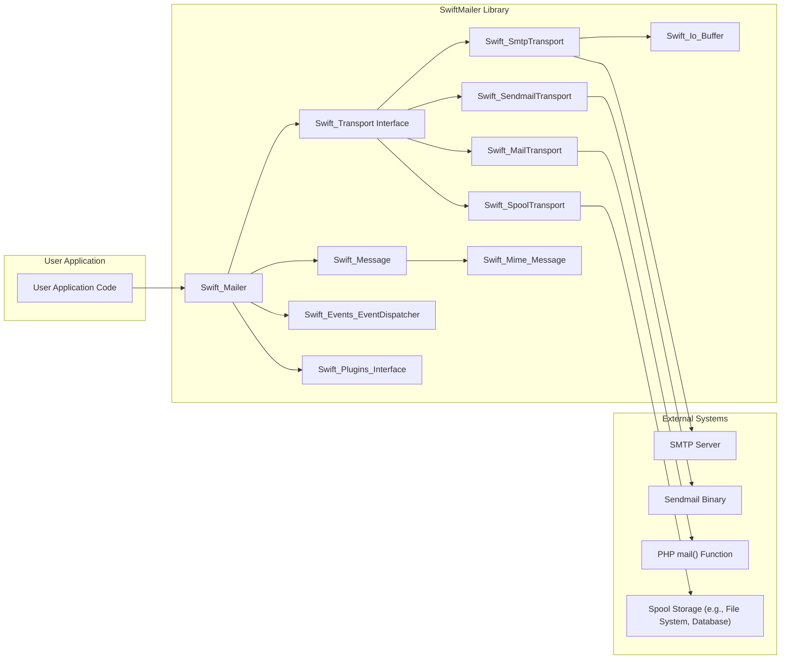
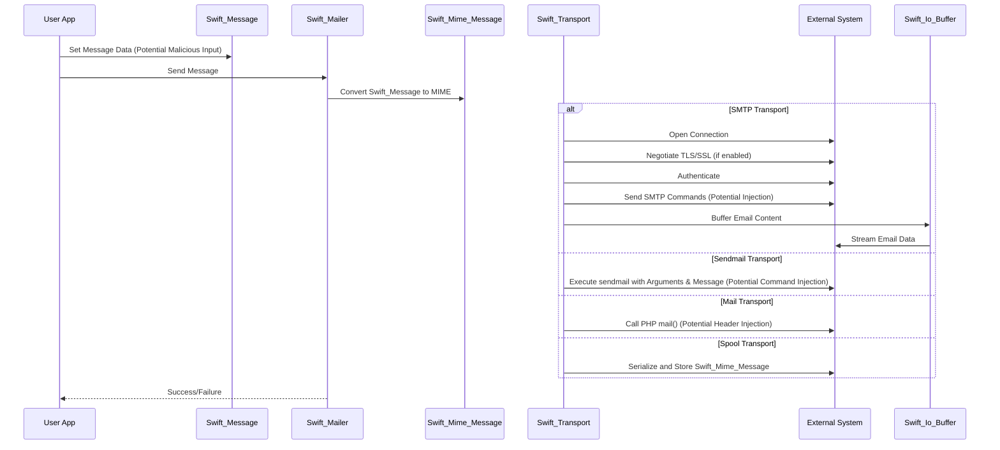

## Project Design Document: SwiftMailer (Improved)

**1. Introduction**

This document provides an enhanced architectural design of the SwiftMailer library, a widely used PHP library for sending emails. This detailed design serves as a robust foundation for subsequent threat modeling activities, offering a comprehensive understanding of the library's internal components, data flow, and interactions with external systems. The goal is to provide the necessary context to identify potential security vulnerabilities.

**2. Goals**

* To deliver a clear, comprehensive, and more granular architectural overview of the SwiftMailer library.
* To identify key components and articulate their specific responsibilities and internal workings relevant to security.
* To illustrate the data flow within the library during email composition and sending with greater detail, highlighting potential data transformation points.
* To highlight potential areas of security concern with more specific examples and context for effective threat modeling.

**3. Scope**

This document focuses on the core functionality of SwiftMailer related to email composition, transport, and delivery, with a particular emphasis on aspects relevant to security. It includes:

* A detailed breakdown of the main classes and interfaces involved in sending emails and their security-relevant functions.
* An in-depth look at the different transport mechanisms supported by SwiftMailer, including their specific security implications.
* A thorough examination of the process of message creation, customization, and potential injection points.
* A detailed illustration of the interaction with external mail servers and the data exchanged.
* Consideration of plugin architecture and its security implications.

This document does not cover:

* Extremely low-level implementation details of individual methods unless directly relevant to security vulnerabilities.
* The internal workings of specific third-party mail servers beyond their interaction protocols with SwiftMailer.
* Exhaustive lists of all configuration options, focusing instead on those with significant security ramifications.
* The complete history of the project or its detailed development lifecycle.

**4. High-Level Architecture**

SwiftMailer's architecture centers around the `Mailer` object, which utilizes a specific `Transport` to facilitate email transmission. The `Message` object encapsulates the email content and metadata. The `EventDispatcher` and plugin system allow for extensibility, which also introduces potential security considerations.

* **User Application:** The codebase that integrates and utilizes the SwiftMailer library to send emails. This is the origin of the email data.
* **Swift_Mailer:** The core orchestrator responsible for the email sending process. It manages the selected transport and dispatches events.
* **Swift_Message:** Represents the high-level email message, containing recipients, sender, subject, and the body in various formats. It's a user-friendly representation.
* **Swift_Transport Interface:** Defines the standard contract for all email transport mechanisms, ensuring interoperability.
* **Swift_SmtpTransport:** Implements the SMTP protocol, handling connection, authentication, encryption, and data transmission to an SMTP server.
* **Swift_SendmailTransport:** Executes the local `sendmail` binary, passing the constructed email for delivery. Security heavily relies on the system's `sendmail` configuration.
* **Swift_MailTransport:** Leverages PHP's built-in `mail()` function, inheriting its security characteristics and limitations.
* **Swift_SpoolTransport:** Queues emails for deferred sending, utilizing a storage mechanism. Security considerations include the integrity and confidentiality of the spooled messages.
* **Swift_Events_EventDispatcher:** Facilitates the observer pattern, allowing plugins and listeners to interact with the sending process at various stages. This introduces potential for malicious interception or modification.
* **Swift_Plugins_Interface:** Defines the interface for creating plugins that can modify SwiftMailer's behavior. Improperly implemented plugins can introduce vulnerabilities.
* **Swift_Mime_Message:**  The internal representation of the email message, adhering to MIME standards. This is where headers and body parts are structured for transmission.
* **Swift_Io_Buffer:**  Used for buffering data during communication with external systems, particularly relevant for SMTP transport.

**5. Component Details**

This section provides a more detailed examination of key SwiftMailer components, focusing on their security-relevant aspects:

* **Swift_Mailer:**
    * **Responsibility:**  Central point for sending emails. Selects and utilizes the configured `Swift_Transport`. Manages event dispatching.
    * **Security Relevance:**  Improper configuration of the transport can lead to insecure communication. Vulnerabilities in event handling could be exploited.

* **Swift_Message:**
    * **Responsibility:**  Represents the email content. Provides methods for setting headers, body (plain and HTML), and attachments.
    * **Security Relevance:**  User input used to populate message properties is a primary injection point for header injection and cross-site scripting (XSS) attacks in HTML emails. Attachment handling requires careful consideration to prevent malicious file uploads or execution.

* **Swift_Transport Interface:**
    * **Responsibility:**  Defines the standard methods (`isStarted()`, `start()`, `stop()`, `send()`) for all transport implementations.
    * **Security Relevance:** Ensures a consistent way to interact with different transport mechanisms, but the security implementation is delegated to the concrete transport classes.

* **Swift_SmtpTransport:**
    * **Responsibility:**  Handles all aspects of the SMTP protocol, including connection establishment, TLS/SSL negotiation, authentication, and message transmission.
    * **Security Relevance:**  Critical for secure email delivery. Vulnerabilities can arise from:
        * **Insecure TLS/SSL configuration:**  Using outdated protocols or weak ciphers.
        * **Plaintext authentication:**  Exposing credentials if TLS is not used or fails.
        * **Vulnerabilities in the underlying socket implementation.**
        * **Improper handling of server responses, potentially leading to information disclosure.**

* **Swift_SendmailTransport:**
    * **Responsibility:**  Executes the `sendmail` binary with the constructed email.
    * **Security Relevance:** Highly dependent on the security of the system's `sendmail` configuration. Major security risks include:
        * **Command injection:** If email headers or body contain characters that are not properly escaped when passed to the `sendmail` command.
        * **Privilege escalation:** If the PHP process running SwiftMailer has elevated privileges.

* **Swift_MailTransport:**
    * **Responsibility:**  Uses PHP's built-in `mail()` function to send emails.
    * **Security Relevance:** Inherits the security characteristics of the `mail()` function, which can be vulnerable to:
        * **Header injection:**  If user-provided data is directly included in headers without sanitization.
        * **Reliance on potentially insecure system mail configurations.**

* **Swift_SpoolTransport:**
    * **Responsibility:**  Serializes and stores emails for later delivery.
    * **Security Relevance:** Security concerns include:
        * **Unauthorized access to the spool storage:**  Potentially exposing email content.
        * **Tampering with spooled messages:**  Modifying email content before sending.
        * **Denial of service:**  Filling the spool storage.

* **Swift_Events_EventDispatcher:**
    * **Responsibility:**  Manages the dispatching of events during the email sending process.
    * **Security Relevance:**  If not carefully managed, malicious actors could register event listeners to:
        * **Intercept and modify email content.**
        * **Leak sensitive information.**
        * **Disrupt the sending process.**

* **Swift_Plugins_Interface and Plugins:**
    * **Responsibility:**  Allows for extending SwiftMailer's functionality.
    * **Security Relevance:**  Plugins, especially third-party ones, can introduce vulnerabilities if they:
        * **Contain security flaws in their code.**
        * **Improperly handle email data.**
        * **Introduce new attack vectors.**

* **Swift_Mime_Message:**
    * **Responsibility:**  Structures the email according to MIME standards, including headers and body parts.
    * **Security Relevance:**  Incorrect MIME encoding or handling can lead to vulnerabilities, particularly related to how email clients interpret the message.

* **Swift_Io_Buffer:**
    * **Responsibility:**  Buffers data during communication, especially with SMTP servers.
    * **Security Relevance:**  Potential vulnerabilities could arise from buffer overflows or improper handling of sensitive data within the buffer.

**6. Data Flow (Detailed)**

The data flow for sending an email using SwiftMailer involves a series of transformations and interactions. Understanding this flow is crucial for identifying potential points of vulnerability.

1. **Message Composition:** The User Application provides data (recipient, sender, subject, body, attachments) to the `Swift_Message` object. This data is a potential source of malicious input.
2. **Mailer Invocation:** The User Application calls the `send()` method of `Swift_Mailer`, passing the `Swift_Message`.
3. **Transport Selection:** `Swift_Mailer` uses the configured `Swift_Transport` implementation.
4. **Message Preparation (MIME Encoding):** The `Swift_Message` is transformed into a `Swift_Mime_Message`, encoding headers and body parts according to MIME standards. This involves string manipulation and encoding, which could be vulnerable to injection attacks if not handled correctly.
5. **Transport-Specific Handling:**
    * **SMTP:**
        * `Swift_SmtpTransport` opens a connection to the SMTP server.
        * If configured, TLS/SSL negotiation occurs.
        * Authentication credentials are sent (if required).
        * SMTP commands (MAIL FROM, RCPT TO, DATA) are constructed and sent, incorporating data from the `Swift_Mime_Message`. This is a critical point for potential command injection if data is not properly escaped.
        * The email content is streamed to the server via the `Swift_Io_Buffer`.
    * **Sendmail:**
        * `Swift_SendmailTransport` constructs the command-line arguments for the `sendmail` binary, including recipient information.
        * The `Swift_Mime_Message` content is passed to `sendmail` via standard input.
    * **Mail:**
        * `Swift_MailTransport` formats the recipient, subject, and body for the PHP `mail()` function. Header injection vulnerabilities are possible here.
    * **Spool:**
        * `Swift_SpoolTransport` serializes the `Swift_Mime_Message` and stores it in the configured storage.
6. **Event Dispatching:** Before and after sending, the `Swift_Mailer` dispatches events, allowing plugins and listeners to interact with the message data.
7. **Delivery/Storage:** The email is either delivered to the external mail server or stored in the spool.

**7. Security Considerations (Detailed for Threat Modeling)**

This section provides more specific security considerations to guide threat modeling efforts:

* **SMTP Transport Vulnerabilities:**
    * **Threat:** Man-in-the-Middle attack leading to credential theft or email interception.
    * **Vulnerability:**  Lack of TLS/SSL or use of weak ciphers.
    * **Mitigation:** Enforce TLS/SSL with strong ciphers. Verify server certificates.
    * **Threat:**  Exposure of authentication credentials.
    * **Vulnerability:**  Using plaintext authentication over an unencrypted connection.
    * **Mitigation:**  Use secure authentication mechanisms (e.g., OAuth 2.0) or ensure TLS/SSL is active.
    * **Threat:**  Information disclosure through server responses.
    * **Vulnerability:**  Improper parsing or handling of verbose SMTP server responses.
    * **Mitigation:**  Sanitize or avoid logging sensitive server response data.

* **Sendmail Transport Vulnerabilities:**
    * **Threat:**  Remote Command Execution.
    * **Vulnerability:**  Insufficient sanitization of email headers (e.g., `From`, `To`, `Cc`, `Bcc`) or body content leading to command injection when passed to the `sendmail` binary.
    * **Mitigation:**  Strictly sanitize all user-provided data before incorporating it into email headers or body when using `SendmailTransport`. Consider using alternative transports if command injection risks are high.
    * **Threat:**  Unauthorized email sending.
    * **Vulnerability:**  Incorrect `sendmail` permissions allowing the web server user to send emails without proper authorization.
    * **Mitigation:**  Configure `sendmail` with appropriate permissions and restrictions.

* **Mail Transport Vulnerabilities:**
    * **Threat:**  Email Header Injection (e.g., adding unauthorized recipients, modifying sender information).
    * **Vulnerability:**  Directly using unsanitized user input in email headers when calling the `mail()` function.
    * **Mitigation:**  Thoroughly sanitize all user-provided data before including it in email headers. Use SwiftMailer's built-in methods for setting headers, which provide some level of protection.
    * **Threat:**  Spam or phishing attacks originating from the server.
    * **Vulnerability:**  Compromised web server allowing attackers to leverage the `mail()` function.
    * **Mitigation:**  Secure the web server and PHP environment. Implement rate limiting for email sending.

* **Spool Transport Vulnerabilities:**
    * **Threat:**  Unauthorized access to spooled emails, leading to information disclosure.
    * **Vulnerability:**  Insecure file system permissions or database access controls for the spool storage.
    * **Mitigation:**  Implement strong access controls for the spool storage. Encrypt spooled messages if they contain sensitive information.
    * **Threat:**  Tampering with spooled emails.
    * **Vulnerability:**  Lack of integrity checks for spooled messages.
    * **Mitigation:**  Implement mechanisms to verify the integrity of spooled messages (e.g., digital signatures).

* **Message Security Vulnerabilities:**
    * **Threat:**  Cross-Site Scripting (XSS) attacks targeting email recipients.
    * **Vulnerability:**  Including unsanitized user-provided content in HTML email bodies.
    * **Mitigation:**  Sanitize all user-provided content before including it in HTML emails. Use Content Security Policy (CSP) headers where possible.
    * **Threat:**  Distribution of malware through email attachments.
    * **Vulnerability:**  Allowing users to upload and send arbitrary file types as attachments without proper scanning.
    * **Mitigation:**  Implement attachment scanning for malware. Restrict allowed attachment types.

* **Plugin and Event Listener Vulnerabilities:**
    * **Threat:**  Malicious code execution or data manipulation through vulnerable plugins or event listeners.
    * **Vulnerability:**  Security flaws in third-party plugins or custom event listeners.
    * **Mitigation:**  Thoroughly vet and audit all plugins and event listeners. Follow secure coding practices when developing custom extensions. Implement a mechanism to disable or restrict plugins if necessary.

**8. Deployment Considerations**

The security of a SwiftMailer deployment is heavily influenced by the environment in which it operates. Key considerations include:

* **Web Server Security:** A compromised web server can lead to the exploitation of SwiftMailer vulnerabilities.
* **PHP Configuration:**  Settings like `disable_functions` and `open_basedir` can impact the security of transport mechanisms like `MailTransport`.
* **Operating System Security:** The security of the underlying operating system affects the security of `SendmailTransport` and spool storage.
* **Network Security:** Network segmentation and firewall rules can limit the impact of potential vulnerabilities.

**9. Technologies Used**

* **PHP:** The core programming language.
* **SMTP Protocol:** For secure and reliable email transmission.
* **TLS/SSL:** For encrypting communication over SMTP.
* **Various SMTP Authentication Mechanisms:** (PLAIN, LOGIN, CRAM-MD5, OAuth 2.0).
* **Sendmail or other MTAs:** For local email delivery.
* **MIME (Multipurpose Internet Mail Extensions):** For structuring email content.
* **Potentially various storage mechanisms:** (File system, databases) for spooling.