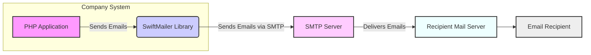
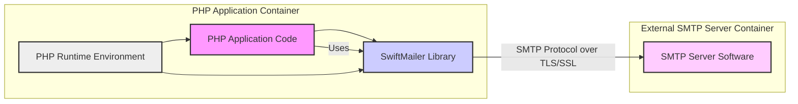
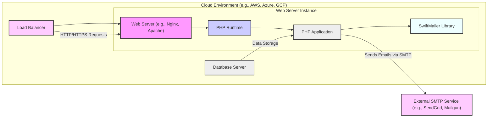

# BUSINESS POSTURE

This project, SwiftMailer, is a PHP library designed to provide a simple and feature-rich way to send emails from PHP applications. It aims to abstract the complexities of email protocols and server interactions, allowing developers to easily integrate email functionality into their projects.

- Business Priorities and Goals:
  - Provide a reliable and easy-to-use PHP library for sending emails.
  - Support various email sending methods and protocols (SMTP, Sendmail, etc.).
  - Ensure compatibility with different PHP versions and environments.
  - Maintain a stable and well-documented library for the PHP community.
  - Facilitate efficient and secure email delivery for applications.

- Business Risks:
  - Email Delivery Failure: If SwiftMailer fails to send emails reliably, critical business processes that depend on email communication (e.g., password resets, order confirmations, notifications) could be disrupted.
  - Security Vulnerabilities: Security flaws in SwiftMailer could be exploited to send unauthorized emails, inject malicious content into emails, or gain access to sensitive information if email sending is mishandled.
  - Reputation Damage: If SwiftMailer is used to send spam or phishing emails due to vulnerabilities or misconfiguration, it could damage the reputation of the applications using it and potentially SwiftMailer itself.
  - Data Breaches: If email content or SMTP credentials are exposed due to vulnerabilities, sensitive data could be compromised.
  - Dependency Risk: As a library, SwiftMailer introduces a dependency. Vulnerabilities in SwiftMailer or its dependencies could impact applications using it.

# SECURITY POSTURE

- Security Controls:
  - security control: Input validation is likely implemented within SwiftMailer to sanitize email addresses, headers, and body content to prevent injection attacks. (Implementation details are within the SwiftMailer codebase).
  - security control: Support for TLS/SSL encryption for SMTP connections to ensure secure communication with mail servers. (Configurable within SwiftMailer when setting up SMTP transport).
  - security control: Open source nature allows for community review and scrutiny of the code, potentially leading to faster identification and resolution of security vulnerabilities. (GitHub repository: https://github.com/swiftmailer/swiftmailer).

- Accepted Risks:
  - accepted risk: Reliance on the security of the underlying PHP runtime environment. Vulnerabilities in PHP itself could indirectly affect SwiftMailer.
  - accepted risk: Potential vulnerabilities in third-party dependencies if SwiftMailer relies on any external libraries (needs to be verified by inspecting project dependencies).
  - accepted risk: Misconfiguration by developers using SwiftMailer. Incorrectly configured SMTP settings or insecure coding practices in applications using SwiftMailer can introduce vulnerabilities.

- Recommended Security Controls:
  - security control: Implement automated Static Application Security Testing (SAST) and Dynamic Application Security Testing (DAST) in the development pipeline to identify potential vulnerabilities in SwiftMailer code.
  - security control: Integrate dependency vulnerability scanning to detect and manage vulnerabilities in any third-party libraries used by SwiftMailer.
  - security control: Conduct regular security code reviews by security experts to proactively identify and address potential security weaknesses.
  - security control: Provide clear and comprehensive security guidelines and best practices for developers using SwiftMailer, focusing on secure configuration and usage.

- Security Requirements:
  - Authentication:
    - Requirement: Support for various SMTP authentication mechanisms (e.g., PLAIN, LOGIN, CRAM-MD5, NTLM) to securely authenticate with SMTP servers.
    - Requirement: Secure handling and storage of SMTP credentials. SwiftMailer should not store credentials in plaintext in logs or configuration files if possible. Applications using SwiftMailer are responsible for secure credential management.
  - Authorization:
    - Requirement: While SwiftMailer itself doesn't handle authorization, applications using it must implement proper authorization controls to ensure only authorized users or processes can send emails.
    - Requirement: Applications should restrict the ability to configure email sending parameters (sender address, recipient addresses, etc.) to authorized users or roles.
  - Input Validation:
    - Requirement: Robust input validation for all email components, including recipient addresses, sender addresses, subject, headers, and body, to prevent injection attacks (e.g., header injection, email body injection).
    - Requirement: Input validation should be applied on both the client-side (application using SwiftMailer) and within the SwiftMailer library itself.
  - Cryptography:
    - Requirement: Mandatory support for TLS/SSL encryption for SMTP connections to protect the confidentiality and integrity of email communication during transit.
    - Requirement: Consider support for email signing technologies like DKIM and S/MIME to enhance email authenticity and integrity (depending on project goals and user demand).

# DESIGN

## C4 CONTEXT

- Context Diagram Elements:
  - - Name: PHP Application
    - Type: Software System
    - Description: The web application or system built using PHP that integrates the SwiftMailer library to send emails. This is the primary user of SwiftMailer.
    - Responsibilities:
      - Composing email content (body, subject, headers).
      - Configuring SwiftMailer with SMTP server details and credentials.
      - Handling user input related to email sending (if applicable).
      - Implementing authorization to control who can send emails.
      - Handling errors and responses from SwiftMailer.
    - Security controls:
      - Input validation on user-provided email data before passing it to SwiftMailer.
      - Authorization checks to ensure only authorized actions related to email sending are performed.
      - Secure storage and management of SMTP credentials (ideally not within the application code directly, but using environment variables or secrets management).

  - - Name: SwiftMailer Library
    - Type: Software System / Library
    - Description: The SwiftMailer PHP library itself. It's responsible for taking email messages from the PHP application and sending them via configured transport mechanisms, primarily SMTP.
    - Responsibilities:
      - Accepting email messages from PHP applications.
      - Validating email message format and content (to a certain extent).
      - Establishing connections to SMTP servers.
      - Authenticating with SMTP servers.
      - Sending emails via SMTP protocol.
      - Handling SMTP server responses and errors.
    - Security controls:
      - security control: Input validation within the library to prevent injection attacks.
      - security control: Implementation of TLS/SSL for secure SMTP connections.
      - security control: Secure handling of SMTP authentication processes.

  - - Name: SMTP Server
    - Type: Software System
    - Description: The Simple Mail Transfer Protocol (SMTP) server responsible for receiving emails from SwiftMailer and relaying them to recipient mail servers. This could be a service provided by an email provider (e.g., Gmail SMTP, SendGrid, Mailgun) or an organization's own mail server.
    - Responsibilities:
      - Receiving emails via SMTP protocol.
      - Authenticating senders (SwiftMailer).
      - Relaying emails to recipient mail servers.
      - Handling email queues and delivery retries.
      - Implementing spam filtering and other email security measures.
    - Security controls:
      - security control: SMTP authentication mechanisms to verify senders.
      - security control: TLS/SSL encryption for SMTP communication.
      - security control: Spam filtering and anti-malware measures.
      - security control: Access control lists and rate limiting to prevent abuse.

  - - Name: Recipient Mail Server
    - Type: Software System
    - Description: The mail server that receives the email from the SMTP server and stores it in the recipient's mailbox. This is the mail server of the email recipient's domain.
    - Responsibilities:
      - Receiving emails from sending SMTP servers.
      - Performing spam filtering and virus scanning on incoming emails.
      - Storing emails in user mailboxes.
      - Providing access to emails for recipients (via protocols like POP3, IMAP, or webmail).
    - Security controls:
      - security control: Spam filtering and anti-malware measures.
      - security control: Authentication and authorization for mailbox access.
      - security control: Email encryption at rest (depending on the server).

  - - Name: Email Recipient
    - Type: Person / System
    - Description: The intended recipient of the email sent via SwiftMailer. This could be a human user or another system that processes emails.
    - Responsibilities:
      - Receiving and reading emails.
      - Potentially interacting with links or attachments in emails.
    - Security controls:
      - security control: Spam filters and email client security features to protect against malicious emails.
      - security control: User awareness and training to recognize phishing and malicious emails.

## C4 CONTAINER

- Container Diagram Elements:
  - - Name: PHP Application Code
    - Type: Container / Code
    - Description: The custom PHP code of the application that utilizes the SwiftMailer library to implement email sending functionality. This includes application logic, configuration, and integration points with SwiftMailer.
    - Responsibilities:
      - Implementing application-specific email sending logic.
      - Configuring SwiftMailer with necessary settings.
      - Handling user interactions related to email.
      - Managing SMTP credentials securely.
    - Security controls:
      - security control: Input validation on user inputs before using them in email content or configurations.
      - security control: Authorization checks to control access to email sending features.
      - security control: Secure configuration management to protect SMTP credentials.

  - - Name: SwiftMailer Library
    - Type: Container / Library
    - Description: The SwiftMailer PHP library, packaged as a set of PHP files. It provides the core email sending functionalities.
    - Responsibilities:
      - Providing API for PHP applications to compose and send emails.
      - Handling SMTP protocol communication.
      - Implementing security features like TLS/SSL and input validation.
    - Security controls:
      - security control: Input validation within the library.
      - security control: TLS/SSL encryption for SMTP.
      - security control: Secure SMTP authentication handling.

  - - Name: PHP Runtime Environment
    - Type: Container / Runtime
    - Description: The PHP runtime environment (e.g., PHP-FPM, mod_php) that executes the PHP application code and the SwiftMailer library. This includes the PHP interpreter, necessary extensions, and configuration.
    - Responsibilities:
      - Executing PHP code.
      - Providing necessary PHP extensions for SwiftMailer (e.g., OpenSSL for TLS/SSL).
      - Managing resources for the PHP application.
    - Security controls:
      - security control: Security hardening of the PHP runtime environment (e.g., disabling unnecessary functions, configuring security extensions).
      - security control: Regular patching and updates of the PHP runtime to address security vulnerabilities.

  - - Name: SMTP Server Software
    - Type: Container / Application
    - Description: The software running on the SMTP server that handles email sending and receiving. This could be software like Postfix, Exim, Sendmail, or cloud-based SMTP services.
    - Responsibilities:
      - Receiving and sending emails via SMTP.
      - Implementing SMTP protocol.
      - Handling authentication and encryption.
      - Managing email queues and delivery.
    - Security controls:
      - security control: SMTP authentication.
      - security control: TLS/SSL encryption.
      - security control: Spam filtering and anti-malware.
      - security control: Access controls and rate limiting.
      - security control: Regular security updates and patching of the SMTP server software.

## DEPLOYMENT

Deployment Scenario: Cloud-based Web Application

- Deployment Diagram Elements:
  - - Name: Web Server Instance
    - Type: Infrastructure / Virtual Machine / Container
    - Description: A virtual machine or container instance in the cloud environment hosting the web server (e.g., Nginx, Apache) and the PHP runtime environment. This instance runs the PHP application and SwiftMailer library.
    - Responsibilities:
      - Hosting and serving the PHP application.
      - Executing PHP code.
      - Running the web server software.
    - Security controls:
      - security control: Operating system hardening and security configuration.
      - security control: Regular patching and updates of the OS and web server software.
      - security control: Network security groups/firewalls to restrict access to necessary ports.
      - security control: Intrusion detection and prevention systems (IDS/IPS) at the infrastructure level.

  - - Name: Web Server (e.g., Nginx, Apache)
    - Type: Software / Web Server
    - Description: The web server software responsible for handling HTTP/HTTPS requests and serving the PHP application.
    - Responsibilities:
      - Handling incoming HTTP/HTTPS requests.
      - Serving static content.
      - Proxying requests to the PHP runtime.
    - Security controls:
      - security control: Web server security configuration (e.g., disabling unnecessary modules, setting proper permissions).
      - security control: Regular patching and updates of the web server software.
      - security control: Protection against common web attacks (e.g., DDoS, web application firewalls - WAF if applicable).

  - - Name: PHP Runtime
    - Type: Software / Runtime Environment
    - Description: The PHP runtime environment installed on the web server instance, responsible for executing PHP code.
    - Responsibilities:
      - Executing PHP code of the application and SwiftMailer.
      - Providing necessary PHP extensions.
    - Security controls:
      - security control: PHP runtime security hardening (e.g., disabling dangerous functions, configuring security extensions).
      - security control: Regular patching and updates of the PHP runtime.

  - - Name: PHP Application
    - Type: Software / Application Code
    - Description: The deployed PHP application code that integrates and uses the SwiftMailer library.
    - Responsibilities:
      - Implementing application logic.
      - Utilizing SwiftMailer for email sending.
    - Security controls:
      - security control: Secure coding practices in the application code.
      - security control: Input validation and output encoding within the application.
      - security control: Secure configuration management.

  - - Name: SwiftMailer Library
    - Type: Software / Library
    - Description: The SwiftMailer library files deployed within the PHP application's directory.
    - Responsibilities:
      - Providing email sending functionality to the PHP application.
    - Security controls:
      - security control: Security features implemented within the SwiftMailer library itself (input validation, TLS/SSL).

  - - Name: Load Balancer
    - Type: Infrastructure / Load Balancer
    - Description: A load balancer distributing incoming HTTP/HTTPS traffic across multiple web server instances (if scaling is needed, only one instance is shown for simplicity).
    - Responsibilities:
      - Distributing traffic to web server instances.
      - Improving application availability and scalability.
    - Security controls:
      - security control: DDoS protection.
      - security control: SSL termination.
      - security control: Access control and security policies.

  - - Name: Database Server
    - Type: Infrastructure / Database
    - Description: A database server used by the PHP application for data storage (e.g., MySQL, PostgreSQL).
    - Responsibilities:
      - Storing application data.
      - Providing data persistence.
    - Security controls:
      - security control: Database access controls and authentication.
      - security control: Database encryption at rest and in transit.
      - security control: Regular database backups.
      - security control: Database security hardening and patching.

  - - Name: External SMTP Service (e.g., SendGrid, Mailgun)
    - Type: External Service / Cloud Service
    - Description: A cloud-based SMTP service used to send emails. This offloads the complexity of managing an SMTP server.
    - Responsibilities:
      - Receiving emails from SwiftMailer via SMTP.
      - Relaying emails to recipient mail servers.
      - Handling email delivery and deliverability.
    - Security controls:
      - security control: SMTP authentication.
      - security control: TLS/SSL encryption.
      - security control: Spam filtering and anti-abuse measures provided by the service.
      - security control: API access controls and authentication for service management.

## BUILD

```mermaid
flowchart LR
    A["Developer"] --> B["Code Repository (GitHub)"];
    B --> C["CI/CD Pipeline (e.g., GitHub Actions)"];
    C --> D["Build Process (Composer install, etc.)"];
    D --> E["Security Checks (SAST, Dependency Scan)"];
    E --> F["Build Artifacts (PHP Library Files)"];
    F --> G["Package Manager (e.g., Composer) / Distribution"];

    style A fill:#f9f,stroke:#333,stroke-width:2px
    style B fill:#ccf,stroke:#333,stroke-width:2px
    style C fill:#eee,stroke:#333,stroke-width:2px
    style D fill:#eff,stroke:#333,stroke-width:2px
    style E fill:#fcf,stroke:#333,stroke-width:2px
    style F fill:#eee,stroke:#333,stroke-width:2px
    style G fill:#fcf,stroke:#333,stroke-width:2px

    linkStyle 0,1,2,3,4,5 stroke:#333,stroke-width:1px;
```

- Build Process Description:
  - Developer commits code changes to the Code Repository (GitHub).
  - The CI/CD Pipeline (e.g., GitHub Actions) is triggered by code changes.
  - Build Process involves steps like installing dependencies using Composer, running tests, and preparing the library for distribution.
  - Security Checks are performed during the build process, including:
    - Static Application Security Testing (SAST) to analyze the code for potential vulnerabilities.
    - Dependency vulnerability scanning to check for known vulnerabilities in third-party libraries.
  - Build Artifacts are generated, which are the packaged PHP library files.
  - Build Artifacts are published to a Package Manager (e.g., Packagist/Composer) or made available for direct download/distribution.

- Build Process Security Controls:
  - security control: Code Repository Security: Access control to the code repository, branch protection, and code review processes to ensure only authorized and reviewed code is merged.
  - security control: CI/CD Pipeline Security: Secure configuration of the CI/CD pipeline, access control to pipeline configurations and secrets, and use of secure build environments.
  - security control: Automated Security Checks: Integration of SAST and dependency scanning tools into the CI/CD pipeline to automatically detect vulnerabilities.
  - security control: Build Environment Security: Secure and hardened build environments to prevent tampering with the build process.
  - security control: Artifact Signing: Signing build artifacts to ensure integrity and authenticity.
  - security control: Dependency Management: Using a dependency management tool like Composer to manage and track dependencies, and regularly updating dependencies to address vulnerabilities.
  - security control: Supply Chain Security: Minimizing dependencies and carefully vetting any third-party libraries used.

# RISK ASSESSMENT

- Critical Business Processes:
  - For SwiftMailer library itself: Ensuring the library is available, functional, and secure for developers to use in their applications. Maintaining the reputation and trust in the library within the PHP community.
  - For applications using SwiftMailer: Email communication is often critical for various business processes such as:
    - Transactional emails (order confirmations, password resets, account verification).
    - Notifications and alerts.
    - Marketing and communication campaigns.
    - Customer support and communication.
    Disruption or compromise of email sending can directly impact these processes.

- Data to Protect and Sensitivity:
  - SwiftMailer library code itself: Source code is publicly available, but protecting against unauthorized modifications to the repository is important for maintaining integrity.
  - Email Content: Emails sent using SwiftMailer can contain sensitive data, including:
    - Personal Identifiable Information (PII) of users (names, email addresses, etc.).
    - Transactional data (order details, financial information).
    - Confidential business communications.
    Sensitivity of email data varies depending on the application and the content of the emails. Some emails may contain highly sensitive personal or business information that requires strong protection.
  - SMTP Credentials: SMTP server usernames and passwords used to configure SwiftMailer. These are highly sensitive and must be protected to prevent unauthorized email sending and potential abuse.

# QUESTIONS & ASSUMPTIONS

- Questions:
  - What is the primary use case for this design document? Is it for threat modeling the SwiftMailer library itself, or for applications that use SwiftMailer? (Assumption: Primarily for applications using SwiftMailer).
  - What are the specific compliance requirements (e.g., GDPR, HIPAA, PCI DSS) that applications using SwiftMailer might need to adhere to? (Assumption: General security best practices are the primary focus, but compliance requirements should be considered for specific applications).
  - What is the expected scale and performance requirements for email sending in applications using SwiftMailer? (Assumption: Scalability and performance are important, but security is the primary focus of this document).
  - Are there any specific security concerns or past incidents related to SwiftMailer or similar email sending libraries that should be considered? (Assumption: General email security best practices and common email-related threats are the main focus).

- Assumptions:
  - SwiftMailer is used in a typical web application environment, likely deployed in the cloud or on-premise servers.
  - Security is a significant concern for applications using SwiftMailer, especially regarding data confidentiality, integrity, and availability of email communication.
  - Applications using SwiftMailer handle some level of sensitive data in emails, requiring appropriate security measures to protect this data.
  - Developers using SwiftMailer are expected to follow security best practices and properly configure the library and their applications to ensure secure email sending.