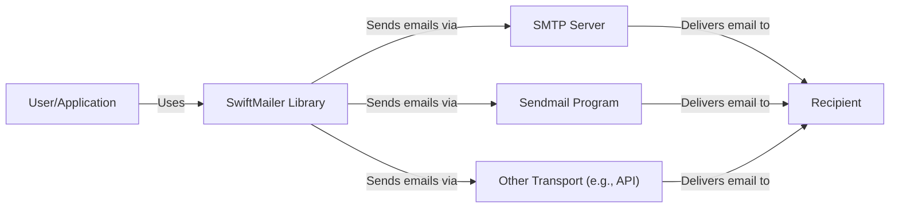
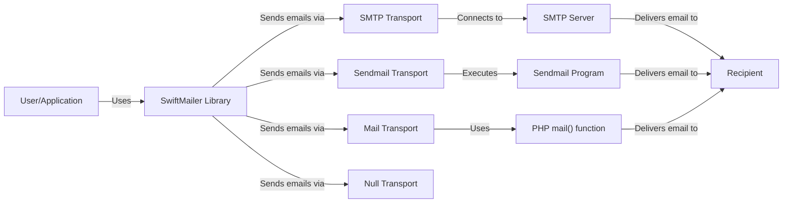
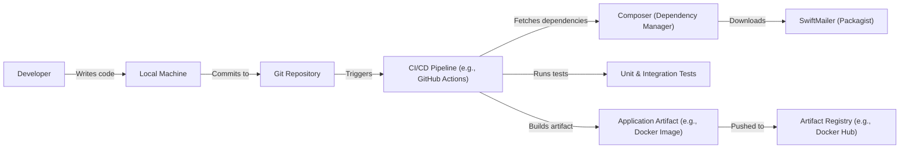

# BUSINESS POSTURE

Business Priorities and Goals:

*   Provide a flexible and extensible mailer library for PHP applications.
*   Support a wide range of email sending methods (SMTP, sendmail, direct delivery, etc.).
*   Maintain high code quality and reliability.
*   Ensure ease of use for developers.
*   Provide comprehensive documentation.

Most Important Business Risks:

*   Compromise of the library leading to unauthorized email sending (spam, phishing).
*   Vulnerabilities that allow attackers to inject malicious content into emails.
*   Data breaches exposing sensitive information contained in emails.
*   Reputational damage due to security incidents.
*   Loss of user trust if the library is perceived as insecure.
*   Inability to send critical emails due to misconfiguration or library failure.

# SECURITY POSTURE

Existing Security Controls:

*   security control: Input validation: The library likely performs some input validation to prevent common injection vulnerabilities, although specific details would need to be confirmed from the code and documentation.
*   security control: Escaping: The library should properly escape data to prevent cross-site scripting (XSS) and other injection attacks when generating email content.
*   security control: Secure defaults: The library should use secure defaults where possible (e.g., preferring TLS for SMTP connections).
*   security control: Documentation: The project provides documentation, which should include security considerations and best practices. (https://swiftmailer.symfony.com/docs/introduction.html)

Accepted Risks:

*   accepted risk: Reliance on third-party dependencies: The library may rely on external libraries, which could introduce their own vulnerabilities.
*   accepted risk: User misconfiguration: Users may misconfigure the library, leading to security issues (e.g., using weak passwords, disabling TLS).
*   accepted risk: Platform vulnerabilities: The security of the library depends on the underlying PHP environment and operating system.

Recommended Security Controls:

*   security control: Regularly update dependencies to address known vulnerabilities.
*   security control: Implement comprehensive input validation and sanitization to prevent injection attacks.
*   security control: Provide clear guidance on secure configuration and usage.
*   security control: Conduct regular security audits and penetration testing.
*   security control: Implement a Content Security Policy (CSP) if the library generates HTML email content.
*   security control: Offer support for modern authentication mechanisms (e.g., OAuth 2.0 for SMTP).
*   security control: Provide mechanisms for signing and encrypting emails (e.g., S/MIME, PGP).

Security Requirements:

*   Authentication:
    *   The library must support secure authentication mechanisms for connecting to mail servers (e.g., TLS, STARTTLS, strong password hashing).
    *   The library should support modern authentication protocols like OAuth 2.0 where applicable.
*   Authorization:
    *   The library should only allow authorized users/applications to send emails. This is primarily managed by the mail server configuration, but the library should facilitate secure configuration.
*   Input Validation:
    *   All user-provided input (e.g., email addresses, subject lines, message bodies) must be rigorously validated and sanitized to prevent injection attacks.
    *   Specific validation rules should be applied based on the type of data (e.g., email address format validation).
*   Cryptography:
    *   The library must use strong cryptographic algorithms for secure communication (e.g., TLS 1.2 or higher).
    *   The library should support email signing and encryption (e.g., S/MIME, PGP) as optional features.
    *   Sensitive data (e.g., passwords) must be securely stored and handled.

# DESIGN

## C4 CONTEXT

C4 Context Element List:

*   Element:
    *   Name: User/Application
    *   Type: Person/System
    *   Description: A user or application that uses the SwiftMailer library to send emails.
    *   Responsibilities: Integrates with the SwiftMailer library, provides email data (sender, recipient, subject, body), and handles any responses or errors.
    *   Security controls: Authenticates to the application using secure methods. Input validation before passing data to SwiftMailer.

*   Element:
    *   Name: SwiftMailer Library
    *   Type: Library
    *   Description: The SwiftMailer library itself, a PHP library for sending emails.
    *   Responsibilities: Provides an API for sending emails, handles different transport mechanisms, manages email composition, and performs necessary encoding and escaping.
    *   Security controls: Input validation, output encoding, secure configuration options, secure defaults.

*   Element:
    *   Name: SMTP Server
    *   Type: System
    *   Description: An external SMTP server used to relay emails.
    *   Responsibilities: Receives emails from SwiftMailer, authenticates the connection, and relays the emails to the recipient's mail server.
    *   Security controls: TLS encryption, authentication (username/password, OAuth), spam filtering, rate limiting.

*   Element:
    *   Name: Sendmail Program
    *   Type: System
    *   Description: The local Sendmail program on the server.
    *   Responsibilities: Receives emails from SwiftMailer and delivers them locally or relays them to another mail server.
    *   Security controls: Secure configuration, access control, regular updates.

*   Element:
    *   Name: Other Transport (e.g., API)
    *   Type: System
    *   Description: Other transport mechanisms, such as a mail sending API (e.g., Amazon SES, Mailgun).
    *   Responsibilities: Receives emails from SwiftMailer via its API and handles delivery.
    *   Security controls: API authentication (API keys, OAuth), TLS encryption, rate limiting, sender verification.

*   Element:
    *   Name: Recipient
    *   Type: Person
    *   Description: The recipient of the email.
    *   Responsibilities: Receives and views the email.
    *   Security controls: Email client security, spam filtering, phishing protection.

## C4 CONTAINER

Since SwiftMailer is a library, the container diagram is essentially an extension of the context diagram. The "containers" are the different transport mechanisms.

C4 Container Element List:

*   Element:
    *   Name: User/Application
    *   Type: Person/System
    *   Description: A user or application that uses the SwiftMailer library to send emails.
    *   Responsibilities: Integrates with the SwiftMailer library, provides email data (sender, recipient, subject, body), and handles any responses or errors.
    *   Security controls: Authenticates to the application using secure methods. Input validation before passing data to SwiftMailer.

*   Element:
    *   Name: SwiftMailer Library
    *   Type: Library
    *   Description: The SwiftMailer library itself.
    *   Responsibilities: Provides an API for sending emails, handles different transport mechanisms, manages email composition, and performs necessary encoding and escaping.
    *   Security controls: Input validation, output encoding, secure configuration options, secure defaults.

*   Element:
    *   Name: SMTP Transport
    *   Type: Component
    *   Description: The component within SwiftMailer that handles sending emails via SMTP.
    *   Responsibilities: Establishes a connection to an SMTP server, authenticates, and sends the email data.
    *   Security controls: TLS encryption, authentication (username/password, OAuth), connection pooling.

*   Element:
    *   Name: Sendmail Transport
    *   Type: Component
    *   Description: The component within SwiftMailer that handles sending emails via the local Sendmail program.
    *   Responsibilities: Executes the Sendmail program and passes the email data to it.
    *   Security controls: Secure configuration of the Sendmail program.

*   Element:
    *   Name: Mail Transport
    *   Type: Component
    *   Description: Uses PHP's built in `mail()` function.
    *   Responsibilities: Formats email according to the requirements of PHP's mail() function.
    *   Security controls: Relies on the security of the underlying PHP and system configuration.

*   Element:
    *   Name: Null Transport
    *   Type: Component
    *   Description: Does not send any emails. Used for testing or disabling email sending.
    *   Responsibilities: Discards email data.
    *   Security controls: N/A

*   Element:
    *   Name: SMTP Server
    *   Type: System
    *   Description: An external SMTP server.
    *   Responsibilities: Receives emails from SwiftMailer, authenticates the connection, and relays the emails.
    *   Security controls: TLS encryption, authentication, spam filtering, rate limiting.

*   Element:
    *   Name: Sendmail Program
    *   Type: System
    *   Description: The local Sendmail program.
    *   Responsibilities: Receives emails from SwiftMailer and delivers them.
    *   Security controls: Secure configuration, access control, regular updates.

*   Element:
    *   Name: PHP mail() function
    *   Type: System
    *   Description: PHP's built in `mail()` function.
    *   Responsibilities: Sends email using underlying system.
    *   Security controls: Relies on the security of the underlying PHP and system configuration.

*   Element:
    *   Name: Recipient
    *   Type: Person
    *   Description: The recipient of the email.
    *   Responsibilities: Receives and views the email.
    *   Security controls: Email client security, spam filtering, phishing protection.

## DEPLOYMENT

SwiftMailer, being a library, is deployed as part of the PHP application that uses it.  There isn't a separate deployment process for SwiftMailer itself.  The deployment of the *application* using SwiftMailer can vary widely. Here are a few possibilities, with one described in detail:

Possible Deployment Solutions:

1.  Traditional Web Server (Apache/Nginx + PHP-FPM): Application files (including SwiftMailer) are deployed to a web server.
2.  Containerized (Docker): The application and its dependencies (including SwiftMailer) are packaged into a Docker container and deployed to a container orchestration platform (e.g., Kubernetes, Docker Swarm).
3.  Serverless (AWS Lambda, Azure Functions, Google Cloud Functions): The application code (including SwiftMailer) is deployed as a serverless function.  This is less common for email-heavy applications but possible.
4.  Platform-as-a-Service (PaaS) (Heroku, AWS Elastic Beanstalk): The application code is deployed to a PaaS platform, which handles the underlying infrastructure.

Detailed Deployment (Containerized with Kubernetes):

```mermaid
graph LR
    Developer["Developer"] -- "Pushes code" --> GitRepo["Git Repository"]
    GitRepo -- "Triggers build" --> CI["CI/CD Pipeline"]
    CI -- "Builds Docker image" --> DockerImage["Docker Image"]
    DockerImage -- "Pushed to" --> ContainerRegistry["Container Registry"]
    ContainerRegistry -- "Pulled by" --> Kubernetes["Kubernetes Cluster"]
    Kubernetes -- "Deploys" --> Pod["Application Pod"]
    Pod -- "Contains" --> AppContainer["Application Container (with SwiftMailer)"]
    AppContainer -- "Sends emails via" --> SMTPServer["SMTP Server (External)"]

```

Deployment Element List:

*   Element:
    *   Name: Developer
    *   Type: Person
    *   Description: The developer writing the application code.
    *   Responsibilities: Writes code, commits to the Git repository.
    *   Security controls: Strong authentication to Git repository, code review.

*   Element:
    *   Name: Git Repository
    *   Type: System
    *   Description: The source code repository (e.g., GitHub, GitLab).
    *   Responsibilities: Stores the application code, triggers CI/CD pipelines.
    *   Security controls: Access control, branch protection rules, audit logs.

*   Element:
    *   Name: CI/CD Pipeline
    *   Type: System
    *   Description: The continuous integration and continuous deployment pipeline (e.g., Jenkins, GitLab CI, GitHub Actions).
    *   Responsibilities: Builds the Docker image, runs tests, and deploys the application.
    *   Security controls: Secure configuration, access control, secrets management.

*   Element:
    *   Name: Docker Image
    *   Type: Artifact
    *   Description: The packaged application, including SwiftMailer and all dependencies.
    *   Responsibilities: Provides a consistent and reproducible environment for the application.
    *   Security controls: Image scanning for vulnerabilities, minimal base image.

*   Element:
    *   Name: Container Registry
    *   Type: System
    *   Description: A registry for storing Docker images (e.g., Docker Hub, Amazon ECR, Google Container Registry).
    *   Responsibilities: Stores and distributes Docker images.
    *   Security controls: Access control, image signing, vulnerability scanning.

*   Element:
    *   Name: Kubernetes Cluster
    *   Type: System
    *   Description: The container orchestration platform.
    *   Responsibilities: Manages the deployment and scaling of the application containers.
    *   Security controls: Network policies, role-based access control (RBAC), pod security policies.

*   Element:
    *   Name: Application Pod
    *   Type: Component
    *   Description: A running instance of the application container.
    *   Responsibilities: Executes the application code.
    *   Security controls: Resource limits, security context.

*   Element:
    *   Name: Application Container (with SwiftMailer)
    *   Type: Container
    *   Description: The container running the application code, including the SwiftMailer library.
    *   Responsibilities: Handles application logic, sends emails using SwiftMailer.
    *   Security controls: Minimal privileges, regular updates, vulnerability scanning.

*   Element:
    *   Name: SMTP Server (External)
    *   Type: System
    *   Description: The external SMTP server used to send emails.
    *   Responsibilities: Receives and relays emails.
    *   Security controls: TLS encryption, authentication, spam filtering.

## BUILD

The build process for an application using SwiftMailer typically involves dependency management (using Composer) and potentially other steps like code compilation, minification, and testing. Since SwiftMailer is a library, it's included as a dependency.

Build Process Description:

1.  Developer writes code and commits it to a Git repository.
2.  A CI/CD pipeline (e.g., GitHub Actions, Jenkins) is triggered.
3.  The CI/CD pipeline checks out the code.
4.  Composer, the PHP dependency manager, is used to install dependencies, including SwiftMailer. Composer downloads SwiftMailer from Packagist (the main PHP package repository).
5.  Unit and integration tests are run to ensure code quality and functionality.
6.  An application artifact is built. This could be a simple ZIP file, a tarball, or, more commonly, a Docker image.
7.  The artifact is pushed to an artifact registry (e.g., Docker Hub, a private registry).

Security Controls in Build Process:

*   security control: Dependency Management: Composer.lock file ensures consistent and reproducible builds, pinning dependency versions to prevent unexpected changes.
*   security control: Dependency Scanning: Tools like Composer audit or Dependabot (for GitHub) can be used to scan dependencies for known vulnerabilities.
*   security control: Static Analysis: Static analysis tools (e.g., PHPStan, Psalm) can be used to identify potential code quality and security issues.
*   security control: Unit/Integration Tests: Automated tests help ensure that the code functions as expected and can catch security-related bugs.
*   security control: Secret Management: Sensitive information (e.g., API keys, passwords) should be managed securely and not hardcoded in the repository. CI/CD systems provide mechanisms for managing secrets.
*   security control: Build Environment Security: The CI/CD environment itself should be secured, with access control and regular updates.
*   security control: Artifact Signing: If building Docker images, consider signing them to ensure their integrity.
*   security control: Supply Chain Security: Use tools to analyze and verify the integrity of third-party dependencies.

# RISK ASSESSMENT

Critical Business Processes:

*   Sending transactional emails (e.g., password resets, order confirmations, shipping notifications).
*   Sending marketing emails (e.g., newsletters, promotional offers).
*   Sending notifications and alerts.

Data to Protect and Sensitivity:

*   Email addresses: Personally Identifiable Information (PII). Sensitivity: Medium.
*   Email content: Can contain PII, sensitive business information, or confidential data. Sensitivity: Varies from Low to High, depending on the content.
*   SMTP credentials: Highly sensitive. Compromise allows attackers to send emails on behalf of the organization. Sensitivity: High.
*   API keys (if using a mail sending API): Highly sensitive. Compromise allows attackers to use the organization's mail sending quota and potentially access other services. Sensitivity: High.
*   Application logs: May contain sensitive information, including email addresses and parts of email content. Sensitivity: Medium.

# QUESTIONS & ASSUMPTIONS

Questions:

*   What specific transport mechanisms are most commonly used by users of this library? (SMTP, Sendmail, other?)
*   Are there any known security vulnerabilities in the current version of SwiftMailer or its dependencies?
*   What is the process for reporting security vulnerabilities in SwiftMailer?
*   What level of security testing (e.g., penetration testing, code audits) has been performed on SwiftMailer?
*   Does SwiftMailer have any built-in features for rate limiting or preventing abuse?
*   What are the plans for future development of SwiftMailer, particularly regarding security enhancements?
*   Are there any specific compliance requirements (e.g., GDPR, HIPAA) that need to be considered?

Assumptions:

*   BUSINESS POSTURE: The organization using SwiftMailer prioritizes email deliverability and reliability. They also have a moderate risk tolerance, but are concerned about major security breaches.
*   SECURITY POSTURE: The organization has basic security practices in place, such as using firewalls and keeping systems updated. They are likely using a secure configuration for their mail server.
*   DESIGN: The application using SwiftMailer is a typical web application, likely deployed on a web server or in a containerized environment. The application uses a single transport mechanism (e.g., SMTP) for sending all emails. The build process uses Composer for dependency management.