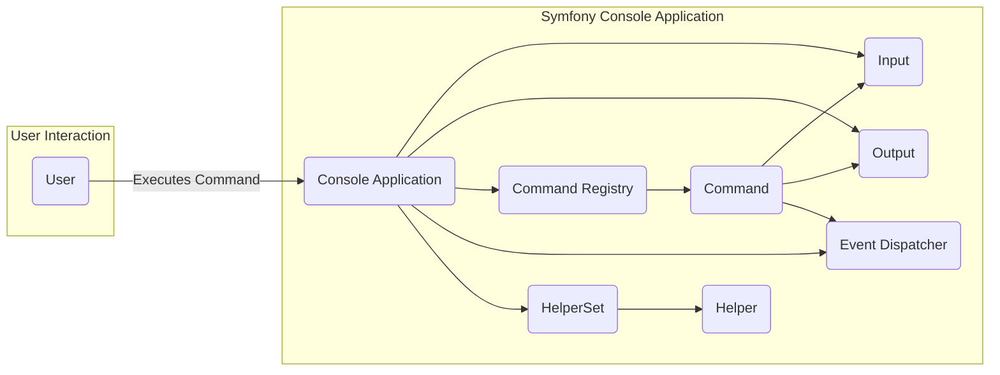
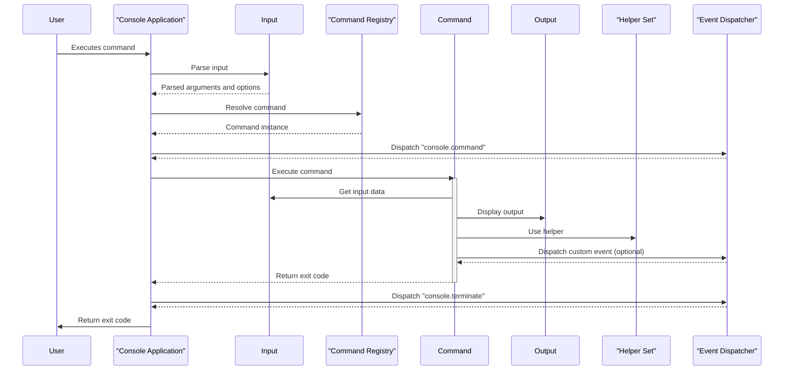

# Project Design Document: Symfony Console Component

**Version:** 1.1
**Date:** October 26, 2023
**Author:** AI Software Architect

## 1. Introduction

This document provides a detailed design overview of the Symfony Console component, a standalone PHP library that empowers developers to build elegant and testable command-line interfaces (CLIs). This document serves as a crucial foundation for subsequent threat modeling activities, meticulously outlining the key components, data flows, and interactions within the system. It aims to provide a clear understanding of the console's architecture for security analysis.

## 2. Goals and Objectives

*   To furnish a robust and adaptable framework for constructing CLI applications using PHP.
*   To offer essential functionalities such as argument parsing, option handling, command registration, and output formatting.
*   To enable developers to create well-structured, maintainable, and easily understandable CLI tools.
*   To facilitate comprehensive testing of CLI commands through its decoupled design.
*   To be readily usable as an independent component or seamlessly integrated within the broader Symfony framework.

## 3. Scope

This design document concentrates on the fundamental functionalities of the Symfony Console component, specifically encompassing:

*   Definition and registration of console commands.
*   Management of user input, including arguments and options.
*   Generation and formatting of output displayed to the user.
*   Implementation of event dispatching mechanisms for extending core functionality.
*   Provision of helper components designed for common CLI-related tasks.

This document explicitly excludes:

*   The specific implementation details of individual commands built using the console component.
*   In-depth analysis of integration points with other Symfony components, unless directly pertinent to the console's internal operation.
*   Examination of the internal workings of the broader Symfony framework.

## 4. High-Level Architecture

**Description:**

*   **User:** The external entity that interacts with the CLI application by invoking commands through the command line.
*   **Console Application:** The core orchestrator responsible for initializing the console environment, processing user input, and delegating execution to the appropriate command.
*   **Input:** The component dedicated to parsing and interpreting command-line arguments and options supplied by the user.
*   **Output:** The component responsible for managing the presentation of information back to the user, including formatting, styling, and verbosity control.
*   **Command Registry:** The central repository that stores and manages the collection of available commands within the application.
*   **Command:** Represents a discrete action that can be performed by the console application. It encapsulates the specific logic for that action.
*   **Event Dispatcher:** The mechanism that enables the triggering and handling of custom events during the command's lifecycle, facilitating extensibility and decoupling.
*   **HelperSet:** A container holding a collection of utility objects (Helpers) that provide reusable functionalities for commands.
*   **Helper:** A specific utility class designed to assist commands with common tasks, such as prompting for user input or formatting tabular data.

## 5. Component Details

### 5.1. Console Application (`Symfony\Component\Console\Application`)

*   **Responsibilities:**
    *   Initializing and configuring the console environment.
    *   Registering available commands, making them accessible for execution.
    *   Receiving and managing input and output streams.
    *   Resolving the specific command to be executed based on the user-provided command name.
    *   Dispatching relevant events at various stages of the command lifecycle.
    *   Managing the collection of helper objects within the `HelperSet`.
    *   Handling exceptions that occur during command execution.

### 5.2. Input (`Symfony\Component\Console\Input`)

*   **Responsibilities:**
    *   Parsing raw command-line arguments provided by the user.
    *   Parsing command-line options, including both flags and options with values.
    *   Validating the provided input against the defined arguments and options for the target command.
    *   Providing a structured interface to access the parsed arguments and options.
    *   Facilitating interactive input by prompting the user for information when needed.

*   **Key Classes:**
    *   `InputInterface`: Defines the contract for input objects, ensuring consistent interaction.
    *   `ArgvInput`: Implements input parsing specifically from the `$_SERVER['argv']` array, the standard way of receiving command-line arguments in PHP.
    *   `StringInput`: Enables input to be provided as a string, useful for testing or programmatic invocation.
    *   `InputDefinition`: Defines the expected structure of input for a command, specifying its arguments and options.
    *   `InputArgument`: Represents a single argument that a command expects.
    *   `InputOption`: Represents a single option (flag or value) that a command accepts.

### 5.3. Output (`Symfony\Component\Console\Output`)

*   **Responsibilities:**
    *   Presenting information to the user through the command line.
    *   Formatting output text with colors, styles (bold, italics, etc.), and other visual enhancements.
    *   Managing different levels of output verbosity, allowing users to control the amount of information displayed.
    *   Providing distinct output streams for standard output (stdout) and standard error (stderr).

*   **Key Classes:**
    *   `OutputInterface`: Defines the interface for output objects, ensuring consistent output methods.
    *   `ConsoleOutput`: Implements output directly to the console.
    *   `BufferedOutput`: Implements output to an internal buffer, primarily used for testing and capturing output programmatically.
    *   `FormatterInterface`: Defines the contract for output formatters, responsible for applying styles and colors.
    *   `OutputFormatter`: Provides the default implementation for formatting console output.

### 5.4. Command (`Symfony\Component\Console\Command\Command`)

*   **Responsibilities:**
    *   Defining the command's name, a concise description, and more detailed help text.
    *   Specifying the arguments and options that the command accepts.
    *   Implementing the core business logic of the command within the `execute()` method.
    *   Providing access to the `Input` and `Output` objects for interacting with the user.
    *   Leveraging `Helper` objects from the `HelperSet` to perform common CLI tasks.

### 5.5. Command Registry (`Symfony\Component\Console\Application`)

*   **Responsibilities:**
    *   Maintaining a collection of registered `Command` instances.
    *   Mapping command names (strings) to their corresponding `Command` objects.
    *   Resolving the appropriate `Command` object to execute based on the command name provided in the user input.

### 5.6. Event Dispatcher (`Symfony\Component\EventDispatcher\EventDispatcher`)

*   **Responsibilities:**
    *   Managing the registration of event listeners, which are functions or methods that execute when specific events occur.
    *   Dispatching events at predefined points within the command's lifecycle, allowing for decoupled extensions and modifications.
    *   Enabling developers to intercept and customize the console's behavior without directly modifying core components.

*   **Key Events:**
    *   `console.command`: Dispatched immediately before a command's `execute()` method is invoked. This allows listeners to perform pre-processing or validation.
    *   `console.terminate`: Dispatched immediately after a command's `execute()` method has completed. This allows listeners to perform post-processing or cleanup.
    *   `console.error`: Dispatched when an exception or error occurs during the execution of a command. This allows listeners to handle errors gracefully or log them.

### 5.7. HelperSet (`Symfony\Component\Console\Helper\HelperSet`)

*   **Responsibilities:**
    *   Acting as a container for a collection of `Helper` objects.
    *   Providing a centralized point for commands to access and utilize registered helpers.

### 5.8. Helper (`Symfony\Component\Console\Helper`)

*   **Examples:**
    *   `QuestionHelper`: Facilitates asking interactive questions to the user and retrieving their input.
    *   `TableHelper`: Simplifies the process of formatting and displaying data in tabular form.
    *   `ProgressHelper`: Provides visual feedback to the user about the progress of long-running tasks.
    *   `FormatterHelper`: Offers utilities for formatting text with colors, styles, and other visual attributes.

## 6. Data Flow

The typical sequence of actions when a console command is executed follows this path:

1. The **User** initiates a command execution by typing a command-line script, including the command name and any relevant arguments or options.
2. The operating system passes the input to the **Console Application**.
3. The **Input** component takes the raw input string and parses it to extract the command name, arguments, and options.
4. The **Console Application** consults the **Command Registry** to locate the corresponding **Command** object based on the parsed command name.
5. The **Console Application** triggers the `console.command` event, notifying any registered listeners that a command is about to be executed.
6. The **Console Application** invokes the `execute()` method of the resolved **Command** object.
7. Within the `execute()` method:
    *   The **Command** interacts with the **Input** component to retrieve the parsed arguments and options.
    *   The **Command** utilizes the **Output** component to display information, prompts, or results to the user.
    *   The **Command** may leverage **Helper** objects from the **HelperSet** to perform common tasks like asking questions or formatting output.
    *   The **Command** might dispatch custom application-specific events using the **Event Dispatcher**.
8. The **Command** completes its execution, returning an integer exit code to indicate success or failure.
9. The **Console Application** dispatches the `console.terminate` event, signaling that the command has finished executing.
10. The **Console Application** returns the exit code to the operating system, which can then be used by other scripts or processes.

## 7. Security Considerations (Preliminary for Threat Modeling)

This section highlights potential security considerations that will be thoroughly investigated during the subsequent threat modeling process.

*   **Insufficient Input Validation:** Lack of proper validation for user-supplied arguments and options can create vulnerabilities, potentially leading to command injection attacks or unexpected application behavior due to malformed data. For example, a command expecting an integer might crash or behave unpredictably if it receives a string.
*   **Command Injection Vulnerabilities:** If the console application constructs system commands based on user input without adequate sanitization or escaping, attackers could inject malicious commands that are then executed by the operating system with the application's privileges.
*   **Exposure of Sensitive Information:** Commands that handle sensitive data (e.g., API keys, database credentials, personal information) require careful handling to prevent exposure through logging, output, or temporary files. Secure storage mechanisms and proper redaction techniques are essential.
*   **Denial of Service (DoS) Attacks:** Maliciously crafted input, such as excessively long strings or requests for computationally intensive operations, could overwhelm the console application and its underlying resources, leading to a denial of service for legitimate users.
*   **Information Disclosure through Errors:** Verbose error messages or stack traces, while helpful for debugging, might inadvertently reveal sensitive information about the application's internal workings, file paths, or dependencies to potential attackers.
*   **Vulnerabilities in Dependencies:** The Symfony Console component relies on external libraries. Security vulnerabilities discovered in these dependencies could indirectly impact the security of applications utilizing the console. Regular updates and security audits of dependencies are crucial.
*   **Insecure Event Listeners:** If event listeners are not implemented with security in mind, they could introduce vulnerabilities. For instance, a poorly written listener might perform insecure operations or expose sensitive data when triggered by a console event.
*   **Inadequate Output Sanitization:** If the console application displays user-provided data without proper sanitization, it could be vulnerable to output encoding issues or even cross-site scripting (XSS) attacks if the output is somehow rendered in a web context (though less common for CLI).

## 8. Dependencies

The Symfony Console component relies on the following key dependencies:

*   **PHP (>= 7.2.5):** The core programming language in which the component is written. The specific version requirement ensures access to necessary language features and security patches.
*   **Symfony EventDispatcher Component:** Provides the foundation for the event handling mechanism within the console, enabling extensibility and decoupling.
*   **Symfony Polyfill-Mbstring Component:** Offers polyfills for the `mbstring` PHP extension, ensuring consistent string handling across different PHP environments.
*   **Symfony Polyfill-PHP80 Component:** Provides polyfills for PHP 8.0 features, enhancing compatibility with older PHP versions if needed.
*   **Symfony Polyfill-PHP81 Component:** Provides polyfills for PHP 8.1 features, further enhancing compatibility.

## 9. Deployment Considerations

The Symfony Console component is typically deployed either as an integral part of a larger PHP application or as a standalone CLI utility. Key deployment considerations include:

*   **PHP Version Compatibility:** Ensuring that the target server or execution environment meets the minimum PHP version requirements of the Symfony Console component and its dependencies.
*   **File System Permissions:** Properly configuring file system permissions for the console application's files and directories, as well as any files it interacts with, to prevent unauthorized access or modification.
*   **Environment Variable Management:** Securely managing environment variables that the console application might depend on for configuration or sensitive information, avoiding hardcoding credentials.
*   **Security Hardening of the Environment:** Implementing general security best practices for the server or environment where the console application is deployed, such as keeping the operating system and PHP installation up-to-date with security patches.
*   **Limiting Exposure:** If the console application is not intended for public access, ensure it is deployed in an environment that restricts external access to prevent unauthorized command execution.

This revised document offers a more detailed and refined design overview of the Symfony Console component, providing a stronger foundation for a comprehensive threat modeling exercise. The enhanced component descriptions, more detailed data flow diagrams, and expanded security considerations will be instrumental in identifying potential vulnerabilities and designing effective security mitigations.
