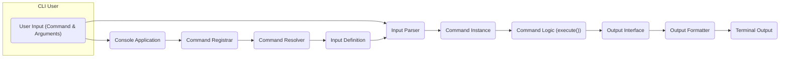
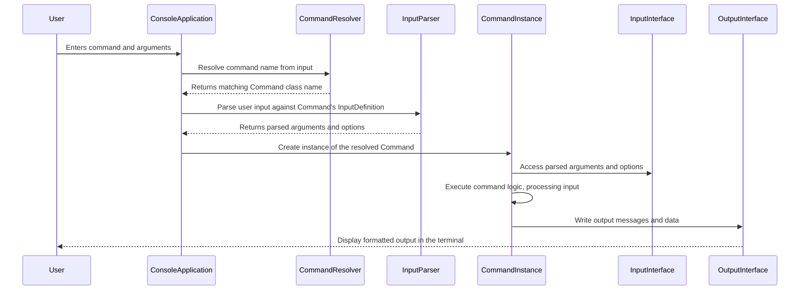

# Project Design Document: Symfony Console Component

**Version:** 1.1
**Date:** October 26, 2023
**Author:** AI Software Architect

## 1. Introduction

This document provides an enhanced and detailed design overview of the Symfony Console component. It outlines the component's purpose, architecture, key components, data flow, and crucial security considerations. This document serves as a refined foundation for subsequent threat modeling activities.

### 1.1. Purpose

The Symfony Console component empowers developers to create robust, testable, and user-friendly command-line interfaces (CLIs) in PHP. It offers a comprehensive suite of features, including sophisticated argument and option parsing, flexible input/output handling, streamlined command registration, and helpful utilities for formatting console output.

### 1.2. Scope

This design document focuses on the core functionalities of the Symfony Console component as found in the linked GitHub repository, with a particular emphasis on aspects relevant to security. It comprehensively covers the process of defining, registering, and executing console commands, including the handling of user input and the generation of output. It deliberately excludes details of specific application implementations that utilize the console component but aims to provide a solid understanding of the component itself.

### 1.3. Target Audience

This document is intended for a technical audience, specifically:

*   Security engineers responsible for performing threat modeling and security assessments.
*   Software developers actively working with or extending the Symfony Console component.
*   System architects designing and integrating systems that interact with the Symfony Console.

## 2. System Overview

The Symfony Console component provides a structured framework for building CLI applications. It promotes a clear separation of concerns by providing mechanisms to define individual "commands," each encapsulating a specific action the CLI application can perform. The component manages the entire lifecycle of a command execution, from receiving user input to displaying the final output.

**Detailed Stages of a Console Command Execution:**

*   **User Input:** The user interacts with the CLI by providing a command string, which may include arguments and options.
*   **Command Registration:**  At application startup, available commands are registered with the central `Console Application`. This registration process makes the commands discoverable and executable.
*   **Command Resolution:** The `Command Resolver` analyzes the user's input and attempts to match it to a registered command based on the command name.
*   **Input Definition Loading:** Once a command is resolved, its `InputDefinition` is loaded. This definition specifies the expected arguments and options for that particular command.
*   **Input Parsing:** The `Input Parser` takes the raw user input and the command's `InputDefinition` to validate and extract the provided arguments and options. This involves type checking and handling default values.
*   **Command Instantiation:**  An instance of the resolved command class is created. This object will contain the logic to perform the requested action.
*   **Input Injection:** The parsed arguments and options are injected into the command instance, typically through method arguments or properties.
*   **Command Execution:** The `execute()` method of the command instance is invoked. This method contains the core business logic of the command, performing the desired action.
*   **Output Handling:** During execution, the command interacts with the `Output Interface` to generate output messages, status updates, or results.
*   **Output Formatting:** The `Output Formatter` applies styling (e.g., colors, bold text) and formatting rules to the output generated by the command.
*   **Terminal Output:** The final, formatted output is sent to the terminal and displayed to the user.

## 3. Key Components

This section provides a more in-depth look at the primary components of the Symfony Console, highlighting their responsibilities and potential security implications.

*   **`Console Application`:**
    *   **Description:** The central orchestrator of the console application lifecycle. It manages command registration, receives user input, resolves the appropriate command, and handles exceptions that may occur during execution.
    *   **Responsibilities:**
        *   Registering and managing the collection of available console commands.
        *   Receiving the raw command-line input from the user.
        *   Delegating the resolution of the command name to the `Command Resolver`.
        *   Handling global exception scenarios that occur during command execution.
        *   Providing access to the `InputInterface` and `OutputInterface` for commands.
    *   **Potential Security Concerns:**  A compromised `Console Application` could lead to unauthorized command execution or denial of service. Improper exception handling might leak sensitive information.

*   **`Command`:**
    *   **Description:** Represents a specific action that the console application can perform. Each distinct command is implemented as a class that extends the base `Command` class.
    *   **Responsibilities:**
        *   Defining the command's unique name, a helpful description, and the expected arguments and options.
        *   Implementing the core business logic within the `execute()` method, which performs the command's intended function.
        *   Utilizing the `InputInterface` to access user-provided data and the `OutputInterface` to display results.
    *   **Potential Security Concerns:**  Vulnerabilities within the `execute()` method could allow for arbitrary code execution, data manipulation, or access to sensitive resources. Lack of input validation within a command is a major risk.

*   **`InputInterface`:**
    *   **Description:** An abstraction layer providing methods to access user input, regardless of the input source (e.g., command-line arguments, interactive prompts). Concrete implementations handle the specifics of different input methods.
    *   **Responsibilities:**
        *   Retrieving the value of a specific argument by its name.
        *   Retrieving the value of a specific option by its name (including handling boolean flags).
        *   Checking if a particular argument or option was provided by the user.
    *   **Potential Security Concerns:**  If input is not properly sanitized after retrieval from the `InputInterface`, it can be exploited in injection attacks within the command logic.

*   **`OutputInterface`:**
    *   **Description:** An abstraction layer for writing output to the console. Concrete implementations handle different output streams, such as standard output (stdout) and standard error (stderr).
    *   **Responsibilities:**
        *   Writing text strings to the output stream.
        *   Formatting output with different styles (e.g., colors, bold, italics) using tags.
        *   Controlling the verbosity level of the output.
    *   **Potential Security Concerns:**  Improper handling of output could lead to information leakage if sensitive data is inadvertently displayed. Lack of output sanitization could allow for terminal manipulation.

*   **`InputDefinition`:**
    *   **Description:**  Defines the structure of the input expected by a specific command. It specifies the names, descriptions, types, and whether arguments and options are required or optional.
    *   **Responsibilities:**
        *   Storing the configuration of expected arguments and options for a command.
        *   Providing metadata used by the `Input Parser` for validation and extraction.
    *   **Potential Security Concerns:**  Incorrect or overly permissive definitions might allow unexpected input, potentially leading to errors or vulnerabilities in the parsing stage.

*   **`InputArgument`:**
    *   **Description:** Represents a single positional argument that a command accepts.
    *   **Responsibilities:**
        *   Storing the argument's name, a descriptive help message, its mode (e.g., required, optional, array), and a default value if applicable.

*   **`InputOption`:**
    *   **Description:** Represents a single named option (flag or value) that a command accepts.
    *   **Responsibilities:**
        *   Storing the option's name, an optional shortcut, its mode (e.g., flag, requires a value, optional value), and a default value.

*   **`InputParser`:**
    *   **Description:** The component responsible for taking the raw user input string and interpreting it according to the command's `InputDefinition`.
    *   **Responsibilities:**
        *   Tokenizing the input string to separate the command name, arguments, and options.
        *   Identifying the target command based on the first token.
        *   Extracting the values of arguments and options based on their defined structure.
        *   Performing basic validation of the input against the `InputDefinition`.
    *   **Potential Security Concerns:**  Vulnerabilities in the parser could allow attackers to craft malicious input strings that bypass validation, inject unexpected values, or cause parsing errors leading to exploitable states.

*   **`CommandLoaderInterface` (and implementations like `ContainerCommandLoader`):**
    *   **Description:**  An interface defining how command classes are loaded and instantiated. Implementations provide different strategies, such as loading from a dependency injection container.
    *   **Responsibilities:**
        *   Locating and instantiating the appropriate command class based on the provided command name.
        *   Potentially managing the lifecycle of command instances.
    *   **Potential Security Concerns:**  If the command loading mechanism is not secure, it could be exploited to load and execute arbitrary code by providing a malicious command name or manipulating the loading process.

*   **Helper Components (e.g., `QuestionHelper`, `ProgressBarHelper`, `TableHelper`):**
    *   **Description:** Provide reusable utility functions to simplify common tasks within console commands, such as prompting the user for input, displaying progress bars, and formatting tabular data.
    *   **Responsibilities:**
        *   Encapsulating common console interaction patterns.
        *   Providing convenient methods for user interaction and output formatting.
    *   **Potential Security Concerns:**  Input validation within helpers like `QuestionHelper` is crucial to prevent injection vulnerabilities when prompting for user input. Improper use of helpers could also lead to information disclosure.

## 4. Data Flow

The execution of a Symfony Console command follows a well-defined data flow, starting with user input and culminating in the display of formatted output.

**Step-by-Step Data Flow:**

1. **User Input:** The user types a command string into the terminal, including the command name and any associated arguments or options.
2. **Command Resolution:** The `Console Application` receives the input and delegates to the `Command Resolver` to determine which command should be executed based on the command name.
3. **Input Parsing:** The `Console Application` utilizes the `Input Parser`, providing it with the raw user input and the `InputDefinition` of the resolved command. The parser extracts and validates the arguments and options.
4. **Command Instantiation:** The `Console Application` creates a new instance of the resolved `Command` class.
5. **Input Access:**  Within the `Command`'s `execute()` method, the command logic accesses the parsed arguments and options through the `InputInterface`.
6. **Command Execution:** The core logic of the command is executed, processing the input data and performing the intended action.
7. **Output Generation:** During execution, the `Command` interacts with the `OutputInterface` to write messages, status updates, and results.
8. **Output Display:** The `OutputInterface` formats the output, and the `Console Application` sends the formatted output to the terminal for display to the user.

## 5. Security Considerations

This section details critical security considerations relevant to the Symfony Console component, providing specific examples of potential vulnerabilities.

*   **Insufficient Input Validation:** Failure to properly validate user-provided input (arguments and options) within the command's `execute()` method can lead to various injection attacks, such as:
    *   **Command Injection:**  If user input is directly incorporated into shell commands without proper sanitization (e.g., using `escapeshellarg()` or `Process` component), attackers can execute arbitrary commands on the server.
    *   **SQL Injection:** If user input is used in database queries without proper escaping or parameterization, attackers can manipulate the queries to access or modify sensitive data.
    *   **Path Traversal:** If user input specifies file paths, insufficient validation can allow attackers to access files outside of the intended directory.
*   **Output Injection/Terminal Manipulation:**  If data being outputted to the console is not sanitized, attackers might inject control characters or escape sequences to manipulate the terminal display, potentially leading to misleading information or even execution of commands if the user copies and pastes the output.
*   **Insecure Command Loading:** If commands are loaded dynamically from untrusted sources, attackers could introduce malicious command classes that execute arbitrary code when invoked. This is particularly relevant when using custom `CommandLoaderInterface` implementations.
*   **Information Disclosure through Error Messages:**  Displaying overly detailed error messages in production environments can reveal sensitive information about the application's internal workings, database structure, or file paths, aiding attackers in reconnaissance.
*   **Cross-Site Scripting (CSS) in Console Output (Less Common but Possible):** While less common in typical CLI scenarios, if console output is later rendered in a web interface without proper sanitization, it could be susceptible to CSS attacks.
*   **Lack of Authorization/Access Control:**  Failing to implement proper authorization checks before executing sensitive commands can allow unauthorized users to perform actions they should not be permitted to.
*   **Vulnerable Dependencies:**  The Symfony Console component relies on other Symfony components and potentially third-party libraries. Vulnerabilities in these dependencies can indirectly affect the security of the console component. Regularly updating dependencies is crucial.
*   **Sensitive Data Exposure in Output:**  Accidentally outputting sensitive information like passwords, API keys, or personal data in console output can lead to security breaches. Implement mechanisms to mask or redact such information.

## 6. Dependencies

The Symfony Console component relies on several other Symfony components and potentially third-party libraries for its functionality. These dependencies are important to consider during security assessments.

*   `symfony/polyfill-mbstring`: Provides support for multibyte string functions.
*   `symfony/service-contracts`: Defines interfaces related to dependency injection and service locators.
*   Potentially other Symfony components depending on the specific features used within the console application and its commands (e.g., `symfony/filesystem`, `symfony/process`, `symfony/validator`).

## 7. Deployment

The Symfony Console component is typically deployed as a library within a larger PHP application. The console application is commonly invoked through an executable script (e.g., `bin/console`) located in the application's root directory. This script bootstraps the Symfony application and utilizes the Console component to handle command execution. In some cases, console commands might be triggered programmatically within other parts of the application.

## 8. Future Considerations

*   **Enhanced Built-in Input Validation:** Exploring the integration of more sophisticated and declarative input validation mechanisms directly within the console component, reducing the burden on individual command developers.
*   **Automated Security Auditing Tools:** Developing or integrating with tools that can automatically analyze console commands for potential security vulnerabilities, such as command injection or SQL injection risks.
*   **Role-Based Access Control (RBAC) for Commands:** Implementing a more robust RBAC system to control which users or roles can execute specific console commands, enhancing security for applications with privileged operations.
*   **Improved Output Sanitization Options:** Providing more flexible and configurable options for sanitizing console output to prevent terminal manipulation and information leakage.
*   **Standardized Secure Coding Practices Documentation:**  Creating comprehensive documentation and best practices guidelines specifically for developing secure Symfony Console commands.
