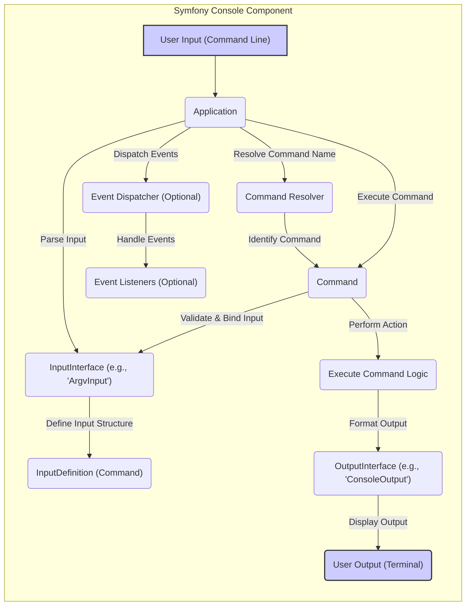

# Project Design Document: Symfony Console Component

**Version:** 1.1
**Date:** October 26, 2023
**Author:** AI Software Architect

## 1. Introduction

This document provides a detailed design overview of the Symfony Console component. It aims to clearly articulate the architecture, key components, and data flow within the system. This document will serve as the foundation for subsequent threat modeling activities, enabling a comprehensive security analysis of the component. This revision includes more detail on component interactions and potential security considerations.

## 2. Goals

*   Provide a clear and concise description of the Symfony Console component's architecture.
*   Identify key components and their specific responsibilities.
*   Illustrate the data flow within the component, highlighting transformation points.
*   Serve as a basis for identifying potential security vulnerabilities during threat modeling, providing concrete examples.

## 3. Scope

This document focuses specifically on the core functionality and architecture of the Symfony Console component as found in the provided GitHub repository. It covers the process of handling command-line input, resolving commands, executing them, and managing output. It explicitly includes the interaction with the operating system's command-line interface. It does not delve into specific commands implemented by users or integrations with other Symfony components beyond the necessary interactions for the console's operation. Configuration aspects directly related to the console component are within scope.

## 4. Target Audience

This document is intended for:

*   Security engineers and architects performing threat modeling and security assessments.
*   Developers working on or integrating with the Symfony Console component, requiring a deep understanding of its internals.
*   Quality assurance engineers designing test cases.
*   Anyone seeking a detailed understanding of the component's internal workings for auditing or educational purposes.

## 5. High-Level Overview

The Symfony Console component provides a robust and structured way to create command-line interfaces (CLIs) in PHP. It handles the entire lifecycle of a console command, from parsing user input to displaying output. It decouples command definition from execution, promoting maintainability and testability. The component is designed to be extensible, allowing developers to easily add new commands and customize its behavior.

## 6. Architectural Design

The Symfony Console component employs a modular design, with well-defined components interacting to manage the command execution process.

### 6.1. Key Components

-   **`Application`:** The central point of interaction for the console application. It is responsible for:
    -   Registering available `Command` objects.
    -   Receiving and processing user input.
    -   Resolving the appropriate `Command` to execute based on the input.
    -   Managing the execution of the resolved `Command`.
    -   Handling exceptions and errors during execution.
-   **`InputInterface`:** Defines the contract for objects that represent the input provided to the console application. Key implementations include:
    -   `ArgvInput`: Parses command-line arguments directly from the `$_SERVER['argv']` array.
    -   `StringInput`: Allows providing input as a string, useful for testing or programmatic execution.
-   **`OutputInterface`:** Defines the contract for objects responsible for displaying output to the user. Key implementations include:
    -   `ConsoleOutput`: Handles formatted output to the standard output and error streams of the terminal, supporting colors and styling.
    -   `BufferedOutput`: Stores output in a buffer, useful for testing or capturing output programmatically.
-   **`Command`:** An abstract class that serves as the base for all executable commands. Each concrete command extending this class is responsible for:
    -   Defining its name, description, arguments, and options through the `configure()` method.
    -   Implementing the command's logic within the `execute()` method.
    -   Optionally interacting with input and output objects.
-   **`InputDefinition`:**  Holds the definition of expected arguments and options for a specific `Command`. It is used for:
    -   Validating user input against the defined structure.
    -   Providing help messages for the command.
-   **`InputArgument`:** Represents a positional argument that a command expects.
-   **`InputOption`:** Represents an optional named parameter (flag or value) for a command.
-   **`CommandLoaderInterface` (Optional):**  An interface that allows for deferred loading of commands. Implementations can dynamically discover and register commands, improving performance for applications with many commands.
-   **`EventDispatcher` (Optional):** The Symfony Event Dispatcher component enables decoupling and extensibility by allowing components to dispatch and listen to events during the command lifecycle. This allows for cross-cutting concerns like logging or auditing.

### 6.2. Component Interactions

### 6.3. Data Flow

1. **User Input:** The user enters a command string with arguments and options in the terminal. This input is typically captured by the operating system's shell.
2. **Input Reception:** The `Application` receives the raw command-line input, often as an array of strings (e.g., `$_SERVER['argv']`).
3. **Input Parsing:** An `InputInterface` implementation (like `ArgvInput`) parses the raw input string, identifying the command name, arguments, and options based on predefined rules (e.g., using `--` for options).
4. **Command Resolution:** The `Application` uses a `CommandResolver` (either internal or a custom implementation) to determine the appropriate `Command` object to execute based on the parsed command name.
5. **Input Definition Retrieval:** The `Application` retrieves the `InputDefinition` associated with the resolved `Command`. This definition specifies the expected arguments and options.
6. **Input Validation and Binding:** The parsed input is validated against the `InputDefinition`. If validation fails, an error is typically displayed to the user. If successful, the parsed values are bound to the `Command` object, making them accessible within the command's execution logic.
7. **Command Execution:** The `Application` calls the `execute()` method of the resolved `Command`. The `InputInterface` and `OutputInterface` objects are typically passed to the `execute()` method, allowing the command to interact with the input and output streams.
8. **Command Logic:** The `execute()` method contains the core logic of the command, performing the intended actions. This might involve interacting with the file system, databases, network services, or other parts of the application.
9. **Output Handling:** During execution, the `Command` uses an `OutputInterface` implementation (like `ConsoleOutput`) to display information, warnings, or errors to the user. The `OutputInterface` handles formatting the output according to the chosen style and verbosity level.
10. **Event Dispatching (Optional):** At various stages of the command lifecycle (e.g., before command execution, after successful execution, on error), the `Application` may dispatch events through the `EventDispatcher`. Registered event listeners can then react to these events.
11. **Output Display:** The `OutputInterface` writes the formatted output to the terminal's standard output or error stream.

## 7. Security Considerations (For Threat Modeling)

This section outlines potential security considerations that should be thoroughly investigated during the threat modeling process.

-   **Command Injection:**
    -   **Risk:** If user-provided input (arguments or options) is directly incorporated into system calls (e.g., using `exec()`, `shell_exec()`, `proc_open()`) without proper sanitization, attackers could inject arbitrary commands.
    -   **Example:** A command that takes a filename as input and uses it in a `grep` command without sanitizing could be vulnerable.
-   **Denial of Service (DoS):**
    -   **Risk:** Maliciously crafted input could lead to excessive resource consumption (CPU, memory, disk I/O), making the console application unresponsive.
    -   **Example:** Providing an extremely large number of arguments or options, or input that triggers computationally expensive operations within a command.
-   **Information Disclosure:**
    -   **Risk:** Error messages, verbose output, or logging might inadvertently reveal sensitive information (e.g., file paths, database credentials, internal application details).
    -   **Example:**  A command failing due to an incorrect database password and displaying the connection string in the error message.
-   **Argument/Option Parsing Vulnerabilities:**
    -   **Risk:**  Flaws in the argument or option parsing logic could be exploited to bypass intended behavior, inject unexpected values, or cause crashes.
    -   **Example:**  Providing specially crafted option values that are not properly validated, leading to unexpected state changes.
-   **Third-Party Command Vulnerabilities:**
    -   **Risk:** If the console application utilizes commands provided by external libraries or dependencies, vulnerabilities in those components could be exploited through the console interface.
    -   **Example:** A third-party library used for image processing having a vulnerability that can be triggered by a specific input file provided through the console.
-   **Sensitive Data Handling:**
    -   **Risk:** Commands that handle sensitive data (e.g., passwords, API keys, personal information) might not implement adequate security measures for storage, processing, or transmission.
    -   **Example:** A command that allows users to set passwords but stores them in plain text in a configuration file.
-   **Event Listener Security:**
    -   **Risk:** If the event dispatcher is used, malicious actors might be able to register event listeners that perform unauthorized actions or interfere with the normal execution flow.
    -   **Example:** An attacker registering an event listener that logs sensitive data to an insecure location.
-   **Insecure File System Operations:**
    -   **Risk:** Commands that interact with the file system (e.g., creating, deleting, modifying files) could be vulnerable to path traversal attacks or other file system manipulation vulnerabilities if input paths are not properly validated and sanitized.
    -   **Example:** A command that allows users to specify a file path for writing data without proper validation, allowing them to overwrite arbitrary files.

## 8. Future Considerations (Out of Scope for Initial Threat Model)

-   Integration with interactive console features, such as prompts, progress bars, and autocompletion.
-   Support for different input and output formats beyond plain text.
-   Advanced command discovery and registration mechanisms, potentially involving network lookups.
-   Features for building more complex, interactive command-line applications.

## 9. Conclusion

This document provides an enhanced and more detailed design overview of the Symfony Console component, elaborating on its architecture, key components, and data flow. The included security considerations offer a starting point for a thorough threat modeling exercise. By understanding the intricacies of the component's design, security professionals and developers can proactively identify and mitigate potential vulnerabilities, ensuring the robustness and security of applications built using the Symfony Console.