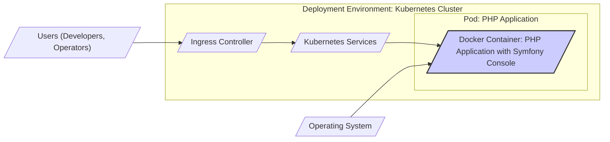
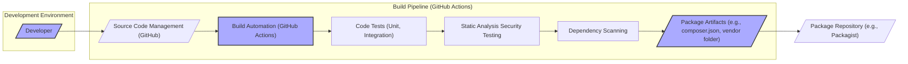

# BUSINESS POSTURE

The Symfony Console component is a PHP library that simplifies the creation of command-line interfaces (CLIs). It provides tools to define commands, handle user input, format output, and manage application flow within a CLI environment.

Business priorities and goals:
- Enable developers to build robust and user-friendly command-line tools efficiently.
- Promote code reusability and maintainability in CLI application development.
- Offer a flexible and extensible framework for various CLI use cases, from simple scripts to complex applications.

Business risks:
- Vulnerabilities in the Symfony Console component could be exploited by malicious actors if used in publicly accessible or security-sensitive applications.
- Poorly designed or implemented CLI commands, even if the component itself is secure, can introduce security risks in applications using the component.
- Lack of awareness or improper usage of the component's features by developers can lead to insecure CLI applications.

# SECURITY POSTURE

Existing security controls:
- security control: Open-source project with community review and scrutiny. Described in project's public nature and contribution model.
- security control: Regular updates and bug fixes provided by the Symfony team and community. Described in project's release cycle and changelogs.
- security control: Unit and integration tests to ensure code quality and prevent regressions. Implemented in the project's test suite within the GitHub repository.

Accepted risks:
- accepted risk: Reliance on community vigilance for identifying and reporting security vulnerabilities.
- accepted risk: Potential for undiscovered vulnerabilities to exist in the codebase despite testing and review.
- accepted risk: Security of applications built using Symfony Console is ultimately the responsibility of the application developers.

Recommended security controls:
- recommended security control: Implement automated static analysis security testing (SAST) in the CI/CD pipeline to identify potential vulnerabilities early in the development process.
- recommended security control: Integrate dependency scanning to detect and manage known vulnerabilities in third-party libraries used by Symfony Console.
- recommended security control: Conduct regular security audits and penetration testing, especially before major releases, to proactively identify and address security weaknesses.

Security requirements:
- Authentication: Not directly applicable to the Symfony Console component itself, as it is a library. Authentication is typically handled by the application using the console component.
- Authorization: Not directly applicable to the Symfony Console component itself. Authorization logic for command execution is the responsibility of the application using the console component.
- Input validation:
    - security requirement: Implement robust input validation for command arguments and options to prevent injection attacks and unexpected behavior. This should be implemented within the Symfony Console component to encourage secure usage by developers.
    - security requirement: Sanitize user input received through the console before processing it within the application logic. This is the responsibility of the application developer using the console component.
- Cryptography:
    - security requirement: If Symfony Console is used in applications that handle sensitive data, ensure that appropriate cryptographic measures are used to protect data in transit and at rest. This is the responsibility of the application developer using the console component, but Symfony Console should not hinder the implementation of cryptography.

# DESIGN

## C4 CONTEXT

```mermaid
flowchart LR
    subgraph "Symfony Console Project"
        C(["Symfony Console Component"])
    end
    U[/"PHP Developers"/] --> C
    A[/"PHP Applications"/] <-- C
    O[/"Operating System"/] <-- A
    P[/"Package Managers (Composer)"/] --> C
    style C fill:#f9f,stroke:#333,stroke-width:2px
```

Context Diagram Elements:
- Element:
    - Name: PHP Developers
    - Type: User
    - Description: Software developers who use the Symfony Console component to build command-line interfaces for their PHP applications.
    - Responsibilities: Utilize Symfony Console to create CLI commands, define input arguments and options, and handle command execution logic.
    - Security controls: Secure development practices, input validation in application code, secure configuration of development environments.
- Element:
    - Name: Symfony Console Component
    - Type: Software System
    - Description: A PHP library providing tools and functionalities to build command-line interfaces.
    - Responsibilities: Provide a framework for defining commands, parsing user input, formatting output, and managing command execution flow.
    - Security controls: Input validation within the component, secure coding practices, community review, automated testing.
- Element:
    - Name: PHP Applications
    - Type: Software System
    - Description: Applications built using PHP that integrate the Symfony Console component to provide command-line interfaces.
    - Responsibilities: Utilize Symfony Console to expose application functionalities through CLI commands, handle user interactions, and process data.
    - Security controls: Application-level authentication and authorization, input validation, secure data handling, secure deployment practices.
- Element:
    - Name: Operating System
    - Type: Environment
    - Description: The underlying operating system (e.g., Linux, macOS, Windows) where PHP applications using Symfony Console are executed.
    - Responsibilities: Provide the runtime environment for PHP and the Symfony Console component, manage system resources, and handle user interactions through the command line.
    - Security controls: Operating system security hardening, access control mechanisms, security updates and patching.
- Element:
    - Name: Package Managers (Composer)
    - Type: Software System
    - Description: A dependency management tool for PHP that is used to install and manage the Symfony Console component and its dependencies.
    - Responsibilities: Download, install, and update the Symfony Console component and its dependencies in PHP projects.
    - Security controls: Secure package repositories, integrity checks of downloaded packages, dependency vulnerability scanning.

## C4 CONTAINER

```mermaid
flowchart LR
    subgraph "Symfony Console Project"
        subgraph "PHP Runtime Environment"
            C(["Symfony Console Library (PHP Code)"])
        end
    end
    U[/"PHP Developers"/] --> C
    A[/"PHP Applications"/] <-- C
    P[/"Package Managers (Composer)"/] --> C
    style C fill:#f9f,stroke:#333,stroke-width:2px
```

Container Diagram Elements:
- Element:
    - Name: Symfony Console Library (PHP Code)
    - Type: Container
    - Description: The core PHP code of the Symfony Console component, providing classes, interfaces, and functions for building command-line interfaces.
    - Responsibilities: Implement the functionalities of the Symfony Console component, including command definition, input parsing, output formatting, and command execution.
    - Security controls: Secure coding practices, input validation within the component, automated testing, static analysis, dependency scanning.

## DEPLOYMENT

Symfony Console is a PHP library and does not have a dedicated deployment architecture in the traditional sense. It is deployed as part of PHP applications that use it. The deployment architecture is determined by the application itself.

Common Deployment Scenarios for PHP Applications using Symfony Console:

1.  Web Server Environment (e.g., Apache, Nginx with PHP-FPM): Symfony Console commands can be executed via SSH or other remote access methods on the server.
2.  Containerized Environment (e.g., Docker, Kubernetes): Symfony Console commands are executed within containers as part of application orchestration.
3.  Serverless Environment (e.g., AWS Lambda, Google Cloud Functions): Less common for CLI applications, but theoretically possible to execute commands in serverless functions triggered by events.
4.  Local Development Environment: Developers run Symfony Console commands directly on their local machines for development and testing.

Detailed Deployment Diagram (Example: Containerized Environment - Docker):



Deployment Diagram Elements (Containerized Environment - Docker/Kubernetes):
- Element:
    - Name: Docker Container: PHP Application with Symfony Console
    - Type: Container Instance
    - Description: A Docker container running a PHP application that includes the Symfony Console library. This container encapsulates the application code, PHP runtime, and Symfony Console component.
    - Responsibilities: Execute the PHP application and Symfony Console commands within the containerized environment.
    - Security controls: Container image security scanning, least privilege container configuration, network policies, resource limits.
- Element:
    - Name: Kubernetes Pod: PHP Application
    - Type: Pod
    - Description: A Kubernetes Pod that hosts one or more Docker containers, in this case, the PHP application container. Pods provide a shared network namespace and storage volumes for containers.
    - Responsibilities: Manage the lifecycle of the PHP application container, provide networking and storage resources within the Kubernetes cluster.
    - Security controls: Pod security policies/admission controllers, network segmentation, resource quotas, RBAC for pod access.
- Element:
    - Name: Kubernetes Services
    - Type: Service
    - Description: Kubernetes Services provide a stable endpoint to access the PHP application Pods. They abstract away the underlying Pod IPs and provide load balancing.
    - Responsibilities: Expose the PHP application to other services within the cluster or externally through Ingress.
    - Security controls: Network policies to control access to services, service account security, TLS encryption for service communication.
- Element:
    - Name: Ingress Controller
    - Type: Load Balancer/Reverse Proxy
    - Description: An Ingress controller manages external access to the Kubernetes cluster, typically acting as a reverse proxy and load balancer.
    - Responsibilities: Route external requests to the appropriate Kubernetes Services, handle TLS termination, and provide other ingress functionalities.
    - Security controls: Web Application Firewall (WAF), rate limiting, TLS configuration, access control lists.
- Element:
    - Name: Operating System
    - Type: Infrastructure
    - Description: The underlying operating system of the Kubernetes nodes where the Docker containers and Pods are running.
    - Responsibilities: Provide the runtime environment for containers, manage system resources, and ensure the security of the underlying infrastructure.
    - Security controls: OS security hardening, kernel security features, security updates and patching, intrusion detection systems.

## BUILD



Build Process Description:
1. Developer (Developer): Developers write code for Symfony Console and contribute to the project via pull requests.
    - Security controls: Secure coding practices, code review.
2. Source Code Management (GitHub): The source code of Symfony Console is hosted on GitHub.
    - Security controls: Access control to the repository, branch protection rules, audit logs.
3. Build Automation (GitHub Actions): GitHub Actions is used for continuous integration and build automation.
    - Security controls: Secure configuration of GitHub Actions workflows, secrets management, access control to workflow execution.
4. Code Tests (Unit, Integration): Automated tests are executed to ensure code quality and functionality.
    - Security controls: Test coverage, secure test data management.
5. Static Analysis Security Testing (SAST): SAST tools are used to automatically analyze the code for potential security vulnerabilities.
    - Security controls: SAST tool configuration, vulnerability reporting and remediation process.
6. Dependency Scanning: Dependency scanning tools are used to identify known vulnerabilities in third-party libraries used by Symfony Console.
    - Security controls: Dependency scanning tool configuration, vulnerability database updates, vulnerability reporting and remediation process.
7. Package Artifacts (e.g., composer.json, vendor folder): Build artifacts are created, including the composer.json file and vendor folder containing dependencies.
    - Security controls: Integrity checks of build artifacts, secure storage of artifacts during the build process.
8. Package Repository (e.g., Packagist):  Symfony Console packages are published to package repositories like Packagist for distribution.
    - Security controls: Secure package repository, package signing, vulnerability reporting and disclosure process.

# RISK ASSESSMENT

Critical business process: Ensuring the security and reliability of PHP applications that utilize the Symfony Console component. While the component itself is a library, its vulnerabilities can directly impact applications using it.

Data to protect:
- Source code of Symfony Console: Sensitivity: Public, but integrity and availability are important to maintain trust and prevent supply chain attacks.
- Package artifacts: Sensitivity: Public, but integrity is critical to prevent malicious package distribution.
- Vulnerability information: Sensitivity: Confidential until publicly disclosed, needs to be managed securely to allow for coordinated vulnerability disclosure.

Data sensitivity:
- Publicly available code and packages: Low confidentiality sensitivity, high integrity and availability sensitivity.
- Vulnerability information before disclosure: High confidentiality sensitivity, high integrity and availability sensitivity for security team.

# QUESTIONS & ASSUMPTIONS

Questions:
- What is the intended risk appetite for applications using Symfony Console? (Assumption: Risk appetite varies widely depending on the application and organization using it.)
- Are there specific compliance requirements that applications using Symfony Console need to adhere to? (Assumption: Compliance requirements are application-specific and not directly imposed on the component itself.)
- What are the most common use cases for Symfony Console in security-sensitive applications? (Assumption: Use cases vary, but might include CLI tools for system administration, security automation, or data processing.)

Assumptions:
- BUSINESS POSTURE: The primary business goal is to provide a useful and reliable tool for PHP developers. Security is a secondary but important consideration.
- SECURITY POSTURE: Symfony Console benefits from open-source community security practices. Security is primarily addressed through secure coding, testing, and community review.
- DESIGN: Symfony Console is designed as a modular and extensible library. Security considerations are focused on input validation and preventing common vulnerabilities in CLI applications.
- DEPLOYMENT: Deployment is application-dependent. Security in deployment is the responsibility of the application developers and operators.
- BUILD: The build process leverages standard open-source CI/CD practices with some level of automated security checks.