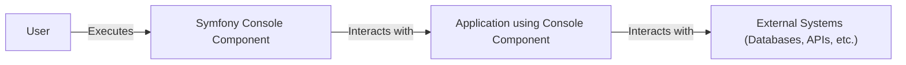
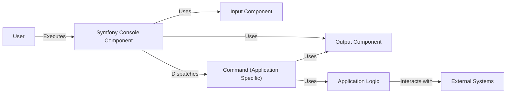
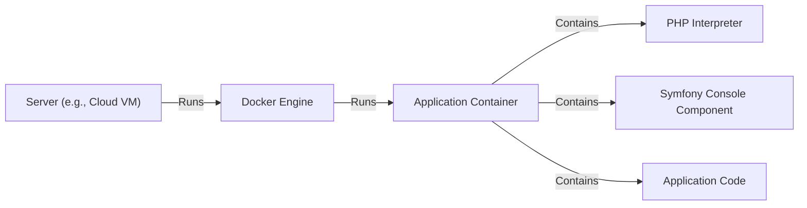
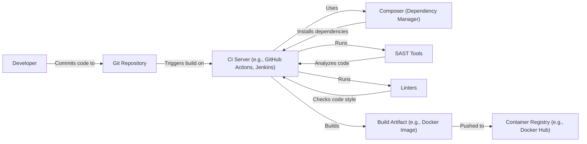

# BUSINESS POSTURE

Business Priorities and Goals:

*   Provide a robust and user-friendly command-line interface (CLI) component for PHP applications.
*   Enable developers to easily create, manage, and execute console commands.
*   Offer a structured and maintainable way to handle application tasks outside of the web request-response cycle.
*   Promote code reusability and consistency across different projects.
*   Facilitate testing of command-line interactions.
*   Provide comprehensive documentation and support for the component.

Most Important Business Risks:

*   Vulnerabilities in the console component could allow attackers to execute arbitrary code on the server, potentially leading to data breaches, system compromise, or denial of service.
*   Poorly designed or implemented commands could negatively impact application performance or stability.
*   Lack of proper input validation could expose the application to injection attacks.
*   Insufficient error handling could lead to unexpected behavior or crashes.
*   Inadequate documentation or support could hinder adoption and usage of the component.

# SECURITY POSTURE

Existing Security Controls:

*   security control: Input validation: The component likely includes mechanisms for validating user input to prevent common injection attacks. (Needs to be verified in the code/documentation).
*   security control: Escaping output: The component should properly escape output to prevent cross-site scripting (XSS) vulnerabilities if command output is displayed in a web context. (Needs to be verified in the code/documentation).
*   security control: Error handling: The component provides structured error handling to prevent sensitive information leakage and ensure graceful degradation. (Needs to be verified in the code/documentation).
*   security control: Code reviews: Symfony, as a large open-source project, likely has a robust code review process to identify and address security vulnerabilities.
*   security control: Community scrutiny: The open-source nature of the project allows for community scrutiny, which can help identify and report security issues.
*   security control: Static analysis: The project likely uses static analysis tools to identify potential security vulnerabilities during development. (Needs to be verified in project configuration).

Accepted Risks:

*   accepted risk: The component relies on the security of the underlying PHP environment and any third-party dependencies.
*   accepted risk: The component's security ultimately depends on the secure implementation of individual commands by developers using the component.

Recommended Security Controls:

*   security control: Implement strict input validation and sanitization for all command arguments and options.
*   security control: Enforce least privilege principle: Commands should only have the necessary permissions to perform their intended tasks.
*   security control: Consider using a secure coding standard (e.g., OWASP guidelines) for developing commands.
*   security control: Regularly update dependencies to address known vulnerabilities.
*   security control: Provide security documentation and guidelines for developers using the component.
*   security control: Implement automated security testing (e.g., SAST, DAST) as part of the CI/CD pipeline.

Security Requirements:

*   Authentication:
    *   Not directly applicable to the console component itself, as it typically operates in a trusted environment. However, commands interacting with external services might require authentication.
*   Authorization:
    *   Commands should be designed with the principle of least privilege in mind. If commands require specific permissions, an authorization mechanism should be implemented (e.g., role-based access control).
*   Input Validation:
    *   All user-supplied input (arguments, options) must be strictly validated and sanitized to prevent injection attacks. Type hinting, regular expressions, and whitelisting should be used where appropriate.
*   Cryptography:
    *   If commands handle sensitive data, appropriate cryptographic techniques (e.g., hashing, encryption) should be used to protect the data at rest and in transit. The component itself doesn't inherently require cryptography, but specific commands might.

# DESIGN

## C4 CONTEXT

Element Descriptions:

*   User:
    *   Name: User
    *   Type: Person
    *   Description: A person who interacts with the application through the command-line interface.
    *   Responsibilities: Executes commands, provides input, and views output.
    *   Security controls: None (external to the system).

*   Symfony Console Component:
    *   Name: Symfony Console Component
    *   Type: Software System
    *   Description: The core component providing the framework for building command-line applications.
    *   Responsibilities: Parses input, dispatches commands, handles output, and manages the command lifecycle.
    *   Security controls: Input validation, output escaping, error handling.

*   Application using Console Component:
    *   Name: Application using Console Component
    *   Type: Software System
    *   Description: The specific application that utilizes the Symfony Console Component to implement its command-line interface.
    *   Responsibilities: Defines commands, handles business logic, interacts with external systems.
    *   Security controls: Application-specific security measures, adherence to secure coding practices.

*   External Systems:
    *   Name: External Systems
    *   Type: Software System
    *   Description: External systems that the application interacts with, such as databases, APIs, or other services.
    *   Responsibilities: Varies depending on the specific system.
    *   Security controls: External system's security measures.

## C4 CONTAINER

Element Descriptions:

*   User:
    *   Name: User
    *   Type: Person
    *   Description: A person who interacts with the application through the command-line interface.
    *   Responsibilities: Executes commands, provides input, and views output.
    *   Security controls: None (external to the system).

*   Symfony Console Component:
    *   Name: Symfony Console Component
    *   Type: Software System
    *   Description: The core component providing the framework for building command-line applications.
    *   Responsibilities: Parses input, dispatches commands, handles output, and manages the command lifecycle.
    *   Security controls: Input validation, output escaping, error handling.

*   Input Component:
    *   Name: Input Component
    *   Type: Container
    *   Description: Handles input parsing and validation.
    *   Responsibilities: Parses command-line arguments and options, validates input against defined rules.
    *   Security controls: Input validation, type checking, whitelisting.

*   Output Component:
    *   Name: Output Component
    *   Type: Container
    *   Description: Handles output formatting and display.
    *   Responsibilities: Formats output, handles different output styles (e.g., normal, verbose, quiet).
    *   Security controls: Output escaping (if output is displayed in a web context).

*   Command (Application Specific):
    *   Name: Command (Application Specific)
    *   Type: Container
    *   Description: Represents a specific command implemented by the application.
    *   Responsibilities: Executes the command's logic, interacts with application services, and produces output.
    *   Security controls: Adherence to secure coding practices, least privilege principle.

*   Application Logic:
    *   Name: Application Logic
    *   Type: Container
    *   Description: Contains the core business logic of the application.
    *   Responsibilities: Performs application-specific tasks, interacts with external systems.
    *   Security controls: Application-specific security measures.

*   External Systems:
    *   Name: External Systems
    *   Type: Software System
    *   Description: External systems that the application interacts with.
    *   Responsibilities: Varies depending on the specific system.
    *   Security controls: External system's security measures.

## DEPLOYMENT

Possible Deployment Solutions:

1.  Standalone PHP Script: The application using the console component can be deployed as a standalone PHP script that is executed directly on the server.
2.  Web Server with CLI Access: The application can be deployed on a web server, and the console commands can be executed via SSH or a similar mechanism.
3.  Containerized Deployment (e.g., Docker): The application and its dependencies can be packaged into a container and deployed using a container orchestration platform (e.g., Kubernetes, Docker Swarm).
4.  Serverless Functions: Individual commands could potentially be deployed as serverless functions, although this is less common.

Chosen Solution (Containerized Deployment with Docker):

Element Descriptions:

*   Server:
    *   Name: Server
    *   Type: Infrastructure Node
    *   Description: The physical or virtual server that hosts the Docker Engine.
    *   Responsibilities: Provides the underlying infrastructure for running containers.
    *   Security controls: Server hardening, firewall, intrusion detection/prevention systems.

*   Docker Engine:
    *   Name: Docker Engine
    *   Type: Software
    *   Description: The runtime environment for managing and running containers.
    *   Responsibilities: Creates, runs, and manages containers.
    *   Security controls: Docker security best practices, regular updates.

*   Application Container:
    *   Name: Application Container
    *   Type: Container
    *   Description: The container that encapsulates the application and its dependencies.
    *   Responsibilities: Runs the application code and console commands.
    *   Security controls: Minimal base image, least privilege principle, regular security scans.

*   PHP Interpreter:
    *   Name: PHP Interpreter
    *   Type: Software
    *   Description: The PHP interpreter that executes the application code.
    *   Responsibilities: Executes PHP code.
    *   Security controls: Secure PHP configuration, regular updates.

*   Symfony Console Component:
    *   Name: Symfony Console Component
    *   Type: Software Component
    *   Description: The Symfony Console Component within the container.
    *   Responsibilities: Provides the framework for building command-line applications.
    *   Security controls: Input validation, output escaping, error handling.

*   Application Code:
    *   Name: Application Code
    *   Type: Code
    *   Description: The application-specific code, including the console commands.
    *   Responsibilities: Implements the application's functionality.
    *   Security controls: Secure coding practices, adherence to security guidelines.

## BUILD

Build Process Description:

1.  Developer commits code changes to the Git repository.
2.  The commit triggers a build on the CI server (e.g., GitHub Actions, Jenkins).
3.  The CI server checks out the code from the repository.
4.  Composer is used to install the project's dependencies, including the Symfony Console Component.
5.  Static Application Security Testing (SAST) tools are run to analyze the code for potential security vulnerabilities.
6.  Linters are run to check code style and enforce coding standards.
7.  If all checks pass, the CI server builds the build artifact (e.g., a Docker image).
8.  The build artifact is pushed to a container registry (e.g., Docker Hub).

Security Controls in Build Process:

*   security control: Dependency management with Composer: Ensures that dependencies are tracked and managed securely.
*   security control: SAST tools: Identify potential security vulnerabilities in the code.
*   security control: Linters: Enforce coding standards and prevent common coding errors.
*   security control: Automated build process: Ensures consistency and repeatability of builds.
*   security control: Secure container registry: Protects the build artifact from unauthorized access or modification.
*   security control: Supply chain security: Composer can be configured to verify the integrity of downloaded packages.

# RISK ASSESSMENT

Critical Business Processes:

*   Execution of scheduled tasks: Many applications rely on console commands to perform scheduled tasks (e.g., sending emails, generating reports, processing data).
*   System administration: Console commands are often used for system administration tasks (e.g., managing users, clearing caches, deploying updates).
*   Data manipulation: Commands can be used to import, export, or modify data.

Data Sensitivity:

*   The sensitivity of the data handled by console commands varies depending on the specific application.
*   Commands might interact with:
    *   Personally Identifiable Information (PII)
    *   Financial data
    *   Authentication credentials
    *   Configuration secrets
    *   Application-specific sensitive data

# QUESTIONS & ASSUMPTIONS

Questions:

*   Are there any specific compliance requirements (e.g., PCI DSS, GDPR) that the application must adhere to?
*   What is the expected level of access for users executing console commands?
*   Are there any existing security policies or guidelines that should be followed?
*   What are the specific external systems that the commands will interact with, and what are their security considerations?
*   What is the deployment environment (e.g., cloud provider, on-premise)?
*   What are the specific mechanisms for input validation and output escaping used by the component?
*   What static analysis tools are used in the project?

Assumptions:

*   BUSINESS POSTURE: The primary goal is to provide a secure and reliable console component for PHP applications.
*   SECURITY POSTURE: The Symfony project follows secure development practices, but specific security controls need to be verified.
*   DESIGN: The component is used within a trusted environment (e.g., a server or container), and direct user access is limited. The deployment will be containerized using Docker. The build process will include security checks.