## Project Design Document: Symfony Finder Component (Improved)

**1. Introduction**

This document provides an enhanced design overview of the Symfony Finder component. This standalone PHP library offers an efficient mechanism for locating files and directories based on a rich set of criteria. The purpose of this document is to furnish a clear and detailed understanding of the component's architecture, functionality, and data flow, specifically tailored to facilitate comprehensive threat modeling.

**2. Project Overview**

The Symfony Finder component streamlines the process of discovering files and directories within a file system. It presents a fluent interface for defining precise search parameters based on various file and directory attributes, including name, size, modification time, content, and more. Common use cases for this component in PHP applications include:

*   Identifying files of a specific type within a directory structure.
*   Locating files modified within a defined time window.
*   Finding specific configuration files based on naming conventions.
*   Implementing file management functionalities within applications.

**3. Goals**

*   To provide a highly detailed and unambiguous description of the Symfony Finder component's architecture and its operational mechanisms.
*   To clearly identify the key components of the Finder and elucidate their interactions and dependencies.
*   To meticulously outline the flow of data within the component, highlighting potential input and output points.
*   To establish a robust and informative foundation specifically designed to support effective threat modeling activities.

**4. Non-Goals**

*   This document focuses exclusively on the Symfony Finder component and does not delve into the broader architecture or implementation details of the Symfony framework.
*   A detailed, line-by-line code walkthrough of the Finder component is outside the scope of this document.
*   This document serves as an input for security analysis and does not present a finalized security assessment or threat model.

**5. Architecture and Design**

The Symfony Finder component is built upon an object-oriented design paradigm. The central element is the `Finder` class, which serves as the primary interface for configuring search parameters and initiating the file system traversal process.

*   **Core Functionality Breakdown:**
    *   **Path Definition:** Users specify one or more starting points for the search, which can be directories or individual files. This is a critical input point for potential path traversal vulnerabilities.
    *   **Filter Application:**  A series of filters can be applied to refine the search results. These filters operate on various file and directory attributes:
        *   **Filename Filtering:**  Matching filenames using wildcard patterns (e.g., `*.log`) or regular expressions. This is a potential area for ReDoS vulnerabilities if complex regex are used.
        *   **File Size Filtering:**  Filtering based on file size (e.g., files larger than 1MB).
        *   **Modification Time Filtering:**  Filtering based on the last modification timestamp (e.g., files modified in the last week).
        *   **Content Filtering:**  Searching for specific content within files using regular expressions. This can be resource-intensive and a potential area for ReDoS.
        *   **File Type Filtering:**  Distinguishing between files and directories.
        *   **Permissions Filtering:** Filtering based on read, write, or execute permissions (though this is less common and might rely on underlying OS capabilities).
    *   **File System Traversal:** The component navigates the file system, typically recursively, starting from the defined paths. The depth of traversal can be configured. Uncontrolled recursion can lead to DoS.
    *   **Result Iteration:**  The matching files and directories are returned as an iterable object. This allows for efficient processing, especially when dealing with a large number of results.

*   **Key Classes and Interfaces with Functional Descriptions:**
    *   `Symfony\Component\Finder\Finder`: The central class for configuring and executing file searches. It offers a fluent API for adding search paths and applying filters. This is the primary interaction point for users.
    *   `Symfony\Component\Finder\SplFileInfo`: Extends the standard `SplFileInfo` class, providing Finder-specific methods and representing a single file or directory found during the search. This object holds metadata about the found item.
    *   `Symfony\Component\Finder\Iterator\RecursiveDirectoryIterator`:  Used for the recursive traversal of directory structures. Its behavior is crucial for understanding the scope of the search.
    *   `Symfony\Component\Finder\Iterator\FilenameFilterIterator`:  Filters the results based on specified filename patterns (wildcards or regular expressions). The implementation of the regex matching is important for security.
    *   `Symfony\Component\Finder\Iterator\FileTypeFilterIterator`:  Filters results to include only files or only directories.
    *   `Symfony\Component\Finder\Iterator\SizeFilterIterator`:  Filters results based on file size comparisons.
    *   `Symfony\Component\Finder\Iterator\DateRangeFilterIterator`:  Filters results based on a specified date range for modification time.
    *   `Symfony\Component\Finder\Iterator\ContentsFilterIterator`:  Filters results based on the content of the files, using regular expressions. This is a high-risk area for performance and security issues.
    *   `Symfony\Component\Finder\Iterator\ExcludeDirectoryFilterIterator`:  Excludes specific directories from the search traversal.
    *   `Symfony\Component\Finder\Iterator\DepthFilterIterator`:  Limits the depth of the recursive directory traversal. This can be used to mitigate DoS risks.

*   **Configuration Mechanisms:**
    *   **Path Specification:**  Starting paths are added using the `in()` method of the `Finder` class. The validation and sanitization of these paths are critical.
    *   **Filter Application:** Filters are applied through methods like `name()`, `size()`, `date()`, `contains()`, `files()`, `directories()`, and `excludePath()`. The parameters passed to these methods are potential injection points.
    *   **Traversal Options:**  Options like traversal depth (`depth()`), ignoring dot files (`ignoreDotFiles()`), and following symbolic links (`followLinks()`) influence the scope and behavior of the search. Following symbolic links can introduce security risks.

*   **Error Handling Strategy:**
    *   The component primarily relies on standard PHP exceptions to signal errors, such as invalid file paths or permission denials encountered during file system access. How these exceptions are handled by the calling application is important.

**6. Data Flow (Detailed)**

The data flow within the Symfony Finder component involves the following stages:

1. **Input Phase:**
    *   **Starting Paths:**  One or more strings representing file system locations are provided as input. These paths are the initial entry points for the search. Unvalidated paths are a primary attack vector.
    *   **Filter Criteria:**  Strings, integers, or date/time objects defining the search constraints are provided. These inputs, especially regular expressions, require careful handling.
    *   **Configuration Options:**  Parameters controlling traversal depth, symbolic link handling, etc., are set. Insecure configurations can lead to vulnerabilities.

2. **Processing Phase:**
    *   The `Finder` object is instantiated and configured using the provided input.
    *   An initial iterator (typically `RecursiveDirectoryIterator`) is created based on the starting paths.
    *   A chain of filter iterators is constructed, each responsible for applying a specific filter (filename, size, date, content, etc.). The order of these iterators can impact performance.
    *   The iterators traverse the file system. For each encountered file or directory:
        *   The `RecursiveDirectoryIterator` yields the current file or directory.
        *   Each filter iterator in the chain evaluates the current item against its specific criteria.
        *   If an item does not match a filter, it is excluded from further processing.
    *   If a file or directory passes through all the filter iterators, it is considered a match.

3. **Output Phase:**
    *   Matching files and directories are encapsulated as `SplFileInfo` objects.
    *   These `SplFileInfo` objects are yielded by the final iterator in the chain.
    *   The `Finder` object returns an iterable collection of these `SplFileInfo` objects to the calling application. The application then processes these results.

**7. Key Components and Interactions (Mermaid Flowchart - Enhanced)**

```mermaid
graph LR
    UA["User Application"] --> FC("Finder Class");
    FC -- "addPath()" --> PC["Path Configuration"];
    FC -- "filter methods (name, size, etc.)" --> FCfg["Filter Configuration"];
    FC --> II["Iterator Initialization"];
    PC --> II;
    FCfg --> II;
    II --> RDI{{"RecursiveDirectoryIterator"}};
    RDI -- "Next File/Directory" --> FFI{{"FilenameFilterIterator"}};
    FFI -- "Matches Name Filter" --> SFI{{"SizeFilterIterator"}};
    FFI -- "Does Not Match" --> RDI;
    SFI -- "Matches Size Filter" --> DFI{{"DateRangeFilterIterator"}};
    SFI -- "Does Not Match" --> RDI;
    DFI -- "Matches Date Filter" --> CFI{{"ContentsFilterIterator"}};
    DFI -- "Does Not Match" --> RDI;
    CFI -- "Matches Content Filter" --> SFO["SplFileInfo Object"];
    CFI -- "Does Not Match" --> RDI;
    SFO --> RS["Result Set (Iterable of SplFileInfo)"];
    RDI -- "No More Entries" --> RS;
    RS --> UA;
    style UA fill:#f9f,stroke:#333,stroke-width:2px
    style RS fill:#f9f,stroke:#333,stroke-width:2px
```

**8. Security Considerations (Detailed for Threat Modeling)**

This section expands on potential security concerns, providing more specific examples relevant to threat modeling:

*   **Path Traversal Vulnerabilities:**
    *   **Threat:** An attacker could manipulate input paths (e.g., using `../`) to access files and directories outside the intended scope of the application.
    *   **Example:** If a user-provided filename is used as part of the search path without proper sanitization, an attacker could provide a path like `/var/www/../../../../etc/passwd` to access sensitive system files.
    *   **Mitigation Considerations:**  Strictly validate and sanitize all user-provided input used to construct file paths. Use absolute paths where possible and avoid relying on relative paths derived from user input.

*   **Denial of Service (DoS):**
    *   **Threat 1: Excessive Resource Consumption:**  Specifying very broad search criteria or starting the search in a large directory tree can lead to excessive CPU, memory, and I/O usage, potentially making the application unresponsive.
    *   **Example:** Searching for `*` in the root directory `/` without any other filters.
    *   **Threat 2: Recursive Symbolic Link Loops:** If the `followLinks()` option is enabled, malicious symbolic link configurations could lead to infinite recursion, exhausting server resources.
    *   **Mitigation Considerations:** Implement timeouts for file system operations. Limit the depth of recursive searches. Provide options to restrict the search scope. Carefully consider the implications of `followLinks()`.

*   **Information Disclosure:**
    *   **Threat:**  Improperly defined filters might inadvertently include sensitive files or directories in the search results, exposing confidential information to unauthorized users.
    *   **Example:** A filter intended to find log files might accidentally include backup files containing sensitive data if the filename pattern is too broad.
    *   **Mitigation Considerations:**  Design filters with the principle of least privilege in mind. Thoroughly test filter configurations to ensure they only return the intended results.

*   **Regular Expression Vulnerabilities (ReDoS):**
    *   **Threat:**  Using complex or poorly written regular expressions in the `name()` or `contains()` filters can be exploited to cause excessive backtracking in the regex engine, leading to high CPU usage and potential denial of service.
    *   **Example:** A regex like `^(a+)+$` applied to a long string of 'a's can cause exponential backtracking.
    *   **Mitigation Considerations:**  Carefully review and test all regular expressions used in filters. Avoid overly complex or nested quantifiers. Consider using alternative, non-regex-based filtering methods where appropriate.

*   **Permissions Issues:**
    *   **Threat:** While the Finder itself doesn't change permissions, if the application using the Finder operates with elevated privileges, vulnerabilities in the Finder or its usage could lead to unintended access or modification of files.
    *   **Example:** An application using the Finder to locate files for processing might inadvertently operate on files it shouldn't have access to if the search scope is not properly controlled.
    *   **Mitigation Considerations:**  Run the application with the minimum necessary privileges. Enforce strict access controls on the directories and files being searched.

*   **Injection Attacks (Indirect):**
    *   **Threat:** If filter criteria are constructed using unsanitized user input, an attacker might be able to inject malicious patterns that could lead to unexpected behavior or information disclosure, although this is less direct than SQL injection, for example.
    *   **Example:**  If a user-provided string is directly used in a `name()` filter without sanitization, an attacker might inject wildcard characters to broaden the search scope unintentionally.
    *   **Mitigation Considerations:**  Sanitize and validate all user input used to construct filter criteria. Use parameterized queries or prepared statements where applicable (though less directly relevant to file system operations).

**9. Conclusion**

This improved design document provides a more detailed and nuanced understanding of the Symfony Finder component, specifically tailored for effective threat modeling. By elaborating on the component's architecture, data flow, and potential security considerations, this document serves as a valuable resource for identifying and mitigating potential vulnerabilities in applications that utilize this library. The enhanced descriptions and the detailed security considerations provide a solid foundation for a comprehensive security analysis.
