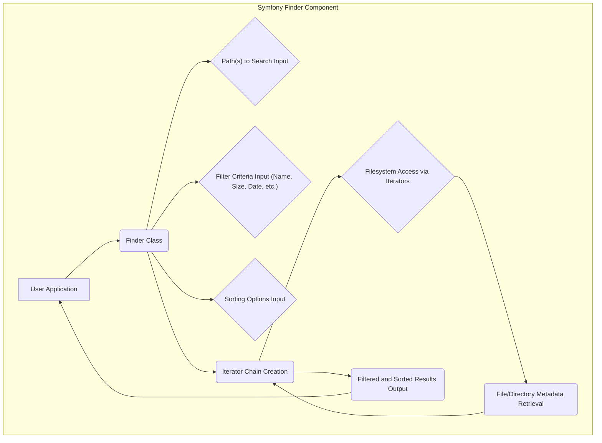

## Project Design Document: Symfony Finder Component (Improved)

**1. Introduction**

This document provides an enhanced design overview of the Symfony Finder component, specifically tailored for subsequent threat modeling activities. It aims to provide a comprehensive understanding of the component's functionality, architecture, and critical security considerations. This document will serve as a robust foundation for identifying potential security vulnerabilities and attack vectors within the Finder component, enabling proactive security measures.

**2. Project Overview**

The Symfony Finder component is a robust and widely adopted standalone PHP library designed to efficiently locate files and directories based on a rich set of criteria. It offers a fluent and expressive interface for defining precise search parameters, including path specifications, name patterns, file size constraints, modification dates, and even content-based filtering. Its prevalence in PHP applications for filesystem management makes a thorough security analysis crucial.

**3. Goals**

* Deliver a clear and in-depth understanding of the Symfony Finder component's functionality and underlying architecture.
* Precisely identify key components, data flows, and interaction points within the Finder to facilitate accurate threat identification.
* Explicitly highlight areas of potential security concern and vulnerability entry points to guide targeted threat modeling efforts.
* Serve as a definitive reference point for security engineers, developers, and architects involved in the secure development and deployment of applications utilizing the Symfony Finder.

**4. Target Audience**

This document is primarily intended for:

* Security engineers and analysts responsible for conducting threat modeling and security assessments of applications leveraging the Symfony Finder.
* Developers actively working with, extending, or integrating the Symfony Finder component into their projects.
* Software architects designing systems that incorporate the Symfony Finder and need to understand its security implications.

**5. Scope**

This document comprehensively covers the core functionality and architectural design of the Symfony Finder component as represented in the official GitHub repository (https://github.com/symfony/finder). The focus is on the internal logical structure, data flow mechanisms, and potential security boundaries within the component itself. While the interaction with consuming applications is acknowledged, the document primarily focuses on the Finder's internal workings. External factors and the broader Symfony framework context are only considered when directly relevant to the Finder's operation and security.

**6. Functional Description**

The Symfony Finder component empowers users to perform sophisticated file and directory searches by allowing them to:

* **Define Starting Points:** Specify one or more directories where the search operation will initiate. This is crucial for defining the scope of the search.
* **Filter by Name:** Utilize regular expressions or glob patterns to precisely match file and directory names, enabling targeted searches based on naming conventions.
* **Filter by Path:** Employ regular expressions or glob patterns to match the complete filesystem path of files and directories, offering granular control over the search scope.
* **Filter by Size:** Identify files based on their size, allowing searches for files larger than, smaller than, or within a specific size range, useful for identifying large or potentially problematic files.
* **Filter by Date and Time:** Locate files based on their modification, creation, or last access timestamps, enabling searches for recently changed or older files.
* **Filter by Content:** Search for files containing specific textual content. This feature, while powerful, is more resource-intensive and requires careful consideration due to potential performance implications.
* **Sort Results:** Order the discovered files and directories according to various criteria, including name, type (file or directory), last modification time, or size, facilitating easier analysis of the results.
* **Limit Results:** Restrict the total number of files and directories returned by the search operation, which is essential for managing performance and preventing excessive output.
* **Ignore Version Control System Directories:** Automatically exclude standard version control system directories (e.g., `.git`, `.svn`), streamlining searches in development environments.
* **Implement Custom Filtering Logic:** Extend the Finder's capabilities by implementing custom `FilterIterator` instances, allowing developers to define highly specific and complex filtering rules tailored to their application's needs.
* **Iterate Over Results:** Access the matched files and directories as an iterable collection of `SplFileInfo` objects, providing a standard and convenient way to process the search results.

**7. Architectural Design**

**7.1. High-Level Architecture**

**7.2. Data Flow**

1. **Initialization and Configuration:** The user application instantiates the central `Finder` class. The application then configures the finder instance by providing:
    *  The starting directory or directories for the search operation using methods like `in()` or `path()`. This defines the initial search scope.
    *  Specific filter criteria using methods such as `name()`, `size()`, `date()`, and `contains()`. These methods define the conditions for including files in the results.
    *  Desired sorting options using methods like `sortByName()` or `sortByType()`. This determines the order in which results are returned.
    *  Instructions for ignoring specific files or directories, such as using `ignoreDotFiles()` or `ignoreVCS()`.
2. **Iterator Chain Construction:** When the application begins iterating over the `Finder` object (which implements the `IteratorAggregate` interface), the `Finder` dynamically constructs an internal chain of iterators. This chain is crucial for the filtering and processing of filesystem entries. The chain typically includes:
    *  One or more base directory iterators (`RecursiveDirectoryIterator`, `DirectoryIterator`, or `GlobIterator`) responsible for traversing the specified filesystem paths.
    *  A series of `FilterIterator` instances, each applying a specific filter configured by the user (e.g., `FilenameFilterIterator`, `SizeFilterIterator`). These iterators progressively narrow down the result set.
    *  Optionally, a `SortableIterator` if sorting is requested, which arranges the results according to the specified sorting criteria.
3. **Filesystem Interaction:** The iterators within the chain interact directly with the underlying filesystem through PHP's built-in filesystem functions. This interaction involves system calls to the operating system to retrieve information about files and directories.
4. **Filtering and Processing:** As the iterators traverse the filesystem, each `FilterIterator` in the chain applies its defined filtering logic to the metadata of each encountered file or directory. Only items that satisfy all the filter conditions proceed further down the chain.
5. **Sorting (If Enabled):** If sorting is enabled, the `SortableIterator` collects the filtered results and then sorts them based on the configured criteria before yielding them to the user application.
6. **Result Delivery:** The final iterator in the chain yields `SplFileInfo` objects. Each `SplFileInfo` object encapsulates metadata about a found file or directory that matches all the specified criteria.
7. **Consumption by Application:** The user application iterates over the `Finder` object and processes the delivered `SplFileInfo` objects, performing actions based on the search results.

**7.3. Key Modules and Components**

* **`Finder` Class:** The primary interface for interacting with the component. It provides the fluent API for configuring search parameters and orchestrating the iterator chain. It acts as the central point of control.
* **Iterator Implementations:** These classes are responsible for traversing the filesystem and applying filters.
    * **`RecursiveDirectoryIterator`:** Enables recursive traversal of directories, exploring subdirectories.
    * **`DirectoryIterator`:** Iterates over the contents of a single directory non-recursively.
    * **`GlobIterator`:** Finds files and directories matching a specified glob pattern.
    * **`MultiplePcreFilterIterator`:** A powerful and flexible filter iterator that uses PCRE regular expressions for matching both filenames and paths.
    * **`FilenameFilterIterator`:** Filters filesystem entries based on their names using simple string matching or regular expressions.
    * **`PathFilterIterator`:** Filters filesystem entries based on their full paths using simple string matching or regular expressions.
    * **`SizeFilterIterator`:** Filters files based on their size, allowing comparisons (greater than, less than, equal to).
    * **`DateFilterIterator`:** Filters files based on their modification, creation, or access timestamps, allowing comparisons based on date ranges.
    * **`FileTypeFilterIterator`:** Filters based on whether the filesystem entry is a file or a directory.
    * **`ContentsFilterIterator`:** Filters files based on their content by searching for a specific string or pattern within the file. This is a more resource-intensive operation.
    * **Custom `FilterIterator` Implementations:** Allows developers to create bespoke filtering logic by extending the `FilterIterator` class. This offers significant flexibility but requires careful implementation to avoid introducing vulnerabilities.
* **`SortableIterator`:** An iterator decorator that enables sorting the elements yielded by another iterator. It provides the sorting functionality for the Finder.
* **`SplFileInfo`:** A standard PHP class used to represent information about a file or directory. The Finder returns instances of this class, providing a consistent way to access file metadata.

**8. Security Considerations**

* **Path Traversal Vulnerabilities:** If user-supplied input is directly incorporated into the paths provided to the `in()` or `path()` methods without proper sanitization, attackers could potentially bypass intended directory restrictions and access sensitive files or directories outside the intended scope. For example, using ".." in the path could allow navigation to parent directories.
* **Regular Expression Denial of Service (ReDoS):** When user-provided input is used to construct regular expressions for name or path filtering (e.g., in the `name()` or `path()` methods), maliciously crafted or overly complex regular expressions can lead to excessive backtracking and CPU consumption, potentially causing a denial-of-service condition.
* **Resource Exhaustion:** Performing searches on very large filesystems or utilizing content-based filtering (`contains()`) without appropriate safeguards can consume significant system resources (CPU, memory, and I/O). Lack of limits or timeouts could lead to resource exhaustion and impact the availability of the application.
* **Injection through Filenames/Paths (Downstream Vulnerabilities):** While the Finder itself primarily discovers files, if the consuming application processes the results without proper encoding or validation, vulnerabilities could arise if malicious filenames or paths containing special characters or escape sequences are encountered. This could lead to command injection or other issues in subsequent processing steps.
* **Information Disclosure through Unintended Access:** If the Finder is used to search in directories containing sensitive information and the results are not appropriately secured or access is not properly controlled, it could lead to the unintended disclosure of confidential data.
* **Vulnerabilities in Dependencies:** Although the Finder has minimal direct dependencies, vulnerabilities in the underlying PHP filesystem functions or the PCRE library (used for regular expressions) could indirectly impact the security of the Finder component. Keeping PHP and its extensions up-to-date is crucial.
* **Symbolic Link Exploitation:** The way the Finder handles symbolic links (whether it follows them or not) can have security implications. If the Finder is configured to follow symbolic links without proper validation, attackers could potentially use symbolic links to trick the application into accessing files or directories outside the intended search scope. This is often referred to as a symlink race condition.
* **Exposure of Internal Paths:** Error messages or logging that inadvertently reveal internal server paths when the Finder encounters issues could provide valuable information to attackers, aiding in reconnaissance and further attacks.

**9. Dependencies**

* **PHP Core:** The fundamental functionality of the Finder relies heavily on core PHP filesystem functions (e.g., `opendir`, `readdir`, `stat`).
* **PCRE Extension (Perl Compatible Regular Expressions):**  The PCRE extension is essential for the regular expression matching capabilities used in various filter methods.

**10. Deployment Considerations**

The security of the Symfony Finder is also influenced by how it is deployed and used within a larger PHP application. Key considerations include:

* **Filesystem Permissions:** Ensure that the PHP process running the application has the necessary read permissions only to the directories that the application legitimately needs to access. Granting overly broad permissions increases the potential attack surface. Employ the principle of least privilege.
* **Input Sanitization and Validation:**  Thoroughly sanitize and validate any user-provided input that influences the Finder's configuration, such as search paths and filter patterns. This is crucial to prevent path traversal and ReDoS attacks. Use established sanitization techniques and consider using parameterized queries or prepared statements if the input is used in database queries later.
* **Resource Limits and Timeouts:** Implement appropriate resource limits (e.g., maximum execution time, memory limits) to prevent the Finder from consuming excessive resources during lengthy filesystem operations. Set timeouts to prevent indefinite waiting for filesystem operations.
* **Secure Configuration of Finder Options:** Carefully configure the Finder's options, such as whether to follow symbolic links, based on the specific security requirements of the application. Understand the implications of each configuration setting.
* **Error Handling and Logging:** Implement robust error handling to prevent the disclosure of sensitive information in error messages. Log relevant events for auditing and security monitoring purposes, but ensure logs do not inadvertently expose sensitive data.

**11. Potential Threat Areas (for Detailed Threat Modeling)**

The following areas represent specific targets for in-depth investigation during a dedicated threat modeling exercise:

* **Path Injection Points:** Analyze all code paths where user-supplied data can influence the directories being searched (e.g., parameters to `in()` and `path()` methods). Consider how relative paths, URL-encoded characters, and other potentially malicious inputs are handled.
* **Regular Expression Vulnerability Analysis:** Examine the construction and usage of regular expressions within the filter methods (`name()`, `path()`, `contains()`). Evaluate the potential for ReDoS attacks by crafting inputs that cause excessive backtracking.
* **Resource Consumption Attack Vectors:**  Assess how an attacker could manipulate search parameters or trigger operations that lead to excessive CPU, memory, or I/O usage, potentially causing a denial of service. Consider scenarios involving very large directories or complex content filtering.
* **Symbolic Link Race Conditions:** Investigate the Finder's behavior when encountering symbolic links. Determine if an attacker could manipulate symbolic links to cause the Finder to access or process unintended files or directories.
* **Error Handling Information Disclosure:** Review the Finder's error handling mechanisms and logging practices to ensure that sensitive internal paths or other confidential information are not exposed in error messages or logs.
* **Filesystem Interaction Vulnerabilities:** Explore potential race conditions or other vulnerabilities related to the Finder's interaction with the underlying filesystem, particularly in scenarios involving concurrent access or modifications to the filesystem.
* **Security of Custom Filter Logic:** If the application utilizes custom `FilterIterator` implementations, thoroughly review their code for potential vulnerabilities, as these custom filters operate with the same privileges as the core Finder component. Ensure proper input validation and secure coding practices are followed in custom filters.

This improved document provides a more comprehensive and security-focused design overview of the Symfony Finder component. It serves as a valuable resource for conducting thorough threat modeling and implementing appropriate security measures to mitigate potential risks.
