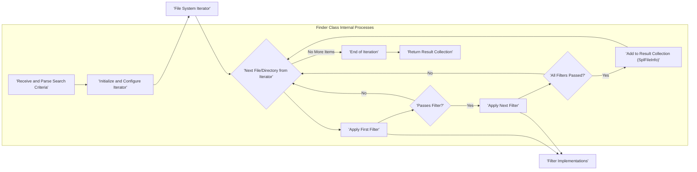
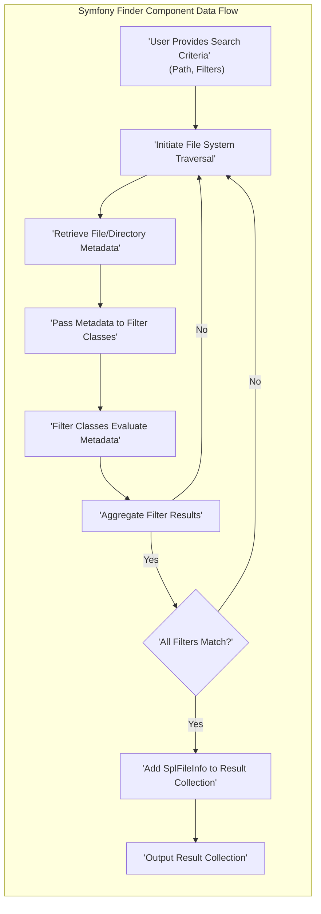

# Project Design Document: Symfony Finder Component

**Version:** 1.1
**Date:** October 26, 2023
**Author:** AI Software Architect

## 1. Introduction

This document provides an enhanced and more detailed design overview of the Symfony Finder component. Its primary purpose remains to clearly articulate the component's architecture, functionality, and data flow, specifically to facilitate thorough threat modeling and security analysis. This document serves as a foundational resource for identifying potential vulnerabilities and designing robust security controls.

The Symfony Finder component is a PHP library engineered for the efficient location of files and directories based on a comprehensive set of criteria. It offers a fluent and expressive interface for specifying intricate search parameters, including path specifications, name patterns (with support for wildcards and regular expressions), file content inspection, date-based filtering, and more.

## 2. Goals and Objectives

The overarching goals of the Symfony Finder component are:

*   To provide a straightforward and intuitive Application Programming Interface (API) for locating files and directories within a file system.
*   To offer a rich and versatile set of filtering options based on a wide array of file and directory attributes.
*   To achieve high efficiency in traversing directory structures, minimizing resource consumption.
*   To ensure cross-platform compatibility, operating seamlessly across different operating systems.
*   To facilitate smooth integration with other Symfony components and general PHP projects.

Specifically for threat modeling purposes, the key objectives of this design document are to:

*   Clearly delineate the component's boundaries, responsibilities, and interactions with external entities.
*   Precisely identify all potential input sources and output destinations, including data formats.
*   Thoroughly describe the internal workings, algorithms, and data flow within the component.
*   Sharply highlight areas within the component's design and implementation where security vulnerabilities could potentially arise.

## 3. Scope

This design document encompasses the core functionality of the Symfony Finder component as represented in the linked GitHub repository. It focuses on the complete lifecycle of a search operation, from the definition of search criteria to the retrieval of results. This includes the process of defining search parameters, the mechanisms for traversing the file system, the application of various filters, and the structure of the returned results.

The document explicitly excludes:

*   Concrete usage examples of the Finder component within the context of a larger application or framework.
*   Detailed explanations of the underlying file system operations performed by the host operating system.
*   In-depth performance optimization strategies and low-level implementation details beyond the high-level architectural design.
*   Comprehensive coverage of all error handling mechanisms, although it will address potential error scenarios that are directly relevant to security considerations.

## 4. High-Level Architecture

The Symfony Finder component can be conceptually represented by the following high-level architecture diagram:

```mermaid
graph LR
    subgraph "User/Application"
        A["'User Input: Search Criteria' \n (Path(s), Filters, Options)"]
    end
    B["'Finder Class' \n (Orchestration, Configuration)"]
    C["'Iterator Implementation' \n (e.g., RecursiveDirectoryIterator)"]
    D["'Filter Classes' \n (e.g., NameFilter, SizeFilter, ContentFilter)"]
    E["'File System'"]
    F["'Result Collection' \n (Array of SplFileInfo Objects)"]

    A --> B
    B -- "Configure Search Parameters" --> C
    B -- "Delegate Filtering Logic" --> D
    C -- "Traverse Directory Structure" --> E
    E -- "File/Directory Metadata" --> C
    C -- "Evaluate Against Filters" --> D
    D -- "Match Found?" --> B
    B --> F
    F --> "User/Application"
```

**Description of Components:**

*   **User/Application:** The external entity (typically a PHP script or another software component) that interacts with the Finder component by providing the necessary search criteria. This includes the starting path(s), desired filters, and any optional configurations.
*   **Finder Class:** This is the central component and the primary entry point for using the library. It is responsible for orchestrating the entire search process, configuring the appropriate iterator based on the provided paths and options, and delegating the filtering logic to the relevant filter classes.
*   **Iterator Implementation:**  A concrete implementation of a PHP iterator interface (often `RecursiveDirectoryIterator`, `FilesystemIterator`, or a custom iterator). This component is responsible for efficiently traversing the specified directory structure(s) within the file system.
*   **Filter Classes:**  A collection of specialized classes, each responsible for evaluating whether a given file or directory matches a specific criterion. Examples include filters for filename patterns, size ranges, modification dates, and file content.
*   **File System:** The underlying operating system's file system, which is the target of the search operation. The Finder component interacts with the file system through PHP's built-in file system functions.
*   **Result Collection:**  A data structure (typically an array or an object implementing the `IteratorAggregate` interface) that holds the collection of `SplFileInfo` objects representing the files and directories that satisfy all the specified search criteria.

## 5. Detailed Design

The core functionality of the Finder component can be broken down into the following detailed steps:

1. **Initialization and Configuration:**
    *   A user or application instantiates the `Finder` class, creating a new Finder object.
    *   The user specifies the starting directory or directories for the search operation using methods such as `in()`. This method accepts string or array of strings representing the paths.
    *   The user defines filtering criteria through a chainable interface, using methods like:
        *   `name(string $pattern)`: Filters results based on the filename, supporting wildcard characters (`*`, `?`) and regular expressions.
        *   `path(string $pattern)`: Filters results based on the directory path, also supporting wildcards and regular expressions.
        *   `contains(string $text)`: Filters results based on the content of the files. This can be resource-intensive for large files.
        *   `date(string $expression)`: Filters results based on the file's last modification or access date, using a human-readable expression.
        *   `size(string $expression)`: Filters results based on the file size, using a human-readable expression (e.g., `> 10K`, `< 2MB`).
        *   `files()`: Restricts the results to only files.
        *   `directories()`: Restricts the results to only directories.
        *   `ignoreDotFiles(bool $ignore = true)`:  Excludes (or includes) dot files and directories from the results.
        *   `filter(callable $callback)`: Allows the user to define custom filtering logic using a PHP callable. This offers significant flexibility but also introduces potential security risks if the callback is not carefully implemented.
    *   The user can configure traversal options, such as the maximum depth of recursion, using the `depth(int $level)` method.

2. **Directory Traversal and Iteration:**
    *   When the user initiates the iteration (e.g., using a `foreach` loop on the `Finder` object), the `Finder` class internally creates and configures an appropriate iterator object. This is typically an instance of `RecursiveDirectoryIterator` or `FilesystemIterator`, depending on the specified paths and options.
    *   The iterator begins traversing the specified directory structure(s). It yields information about each encountered file and directory, including its path, filename, and other metadata.

3. **Filter Application and Evaluation:**
    *   For each file or directory encountered by the iterator, the `Finder` class iterates through the configured filters.
    *   Each filter class implements specific logic to determine if the current file or directory matches the filter's criteria. For example, the `NameFilter` compares the filename against the provided pattern, and the `SizeFilter` checks if the file size falls within the specified range.
    *   Filters are typically applied sequentially. A file or directory must satisfy *all* applied filters to be included in the results.
    *   The `contains()` filter reads the content of the file and searches for the specified text. This operation can be resource-intensive and should be used with caution, especially on untrusted input.
    *   Custom filters defined using the `filter()` method are executed as PHP callables. The security of these custom filters is entirely the responsibility of the developer implementing them.

4. **Result Collection and Storage:**
    *   If a file or directory successfully passes all the configured filters, a `SplFileInfo` object representing that file or directory is created and added to an internal collection within the `Finder` object.
    *   The `SplFileInfo` object provides a standard interface for accessing various attributes of the file or directory, such as its path, filename, size, modification time, and permissions.

5. **Output and Iteration:**
    *   The `Finder` class implements the `IteratorAggregate` interface, which allows it to be directly used in `foreach` loops.
    *   When iterated over, the `Finder` object yields the `SplFileInfo` objects representing the files and directories that matched the search criteria.



## 6. Data Flow

The data flow within the Symfony Finder component can be visualized as follows:

1. **Input:** The process begins with the user providing search criteria to the `Finder` object. This input includes the starting path(s) and a set of filters defining the desired characteristics of the files and directories to be found.
2. **Traversal Initiation:** Upon iteration, the configured file system iterator begins traversing the specified directory structure.
3. **Metadata Retrieval:** For each file or directory encountered during traversal, the iterator retrieves metadata such as the path, filename, size, modification time, and permissions.
4. **Filter Processing:** This metadata is then passed to the configured filter classes. Each filter evaluates the metadata against its specific criteria.
5. **Evaluation and Decision:** The filter classes perform their evaluation logic and return a boolean value indicating whether the file or directory matches the filter's criteria.
6. **Aggregation of Filter Results:** The `Finder` class aggregates the results from all applied filters. A file or directory is considered a match only if it passes *all* the filters.
7. **Result Storage:** Matching files and directories, represented as `SplFileInfo` objects, are added to the internal result collection.
8. **Output:** Finally, the `Finder` object provides access to the result collection, allowing the user to iterate over the found files and directories and access their metadata.



## 7. Security Considerations

Based on the detailed design, the following security considerations are paramount for the Symfony Finder component:

*   **Path Traversal Vulnerabilities:**  A critical concern arises if user-supplied input directly influences the starting paths provided to the `in()` method or the patterns used in `path()` filters without proper sanitization. Attackers could potentially craft malicious paths (e.g., using `../`) to access files and directories outside the intended scope, leading to unauthorized data access or modification.
    *   **Mitigation:** The primary responsibility for mitigating path traversal vulnerabilities lies with the application utilizing the Finder. Input validation and sanitization of all user-provided path components are crucial. The application should ensure that resolved paths remain within the expected boundaries.
*   **Denial of Service (DoS) Attacks:**
    *   **Excessive File System Traversal:** Providing overly broad starting paths or using extremely permissive filters can force the Finder to traverse vast portions of the file system. This can consume excessive server resources (CPU, memory, I/O), potentially leading to a denial of service.
    *   **Regular Expression Denial of Service (ReDoS):**  Carefully crafted, computationally expensive regular expressions used in `name()` or `path()` filters can cause catastrophic backtracking in the regex engine, leading to high CPU utilization and potential denial of service.
    *   **Content-Based Filtering Abuse:**  Malicious actors could trigger `contains()` filters on a large number of extremely large files, forcing the server to read and process significant amounts of data, potentially exhausting resources.
    *   **Mitigation:** Implement safeguards such as timeouts on Finder operations, limits on the depth of traversal, and restrictions on the complexity of regular expressions allowed in filters. Consider rate-limiting or input validation to prevent abuse. Warn users about the performance implications of broad searches and content-based filtering.
*   **Information Disclosure:** If the application using the Finder does not adequately control the output of the component, it could inadvertently expose sensitive information about the file system structure, the existence of specific files, or even the content of files.
    *   **Mitigation:** The application should carefully manage how the returned file paths and potentially file contents are used and displayed to prevent unintended information leakage. Apply appropriate access controls and sanitization to the output.
*   **Remote Code Execution (Less Likely, but a Concern with Custom Filters):** If the application allows users to define custom filters using the `filter()` method with untrusted input, this could potentially lead to remote code execution vulnerabilities if the provided callable executes arbitrary code.
    *   **Mitigation:** Exercise extreme caution when using custom filters, especially with user-provided logic. Thoroughly vet and sanitize any input used to construct or execute custom filters. Consider sandboxing or other security measures to limit the impact of potentially malicious custom filters.
*   **Permissions Bypass:** While the Finder itself operates under the permissions of the PHP process, vulnerabilities in the application logic using the Finder could lead to unintended access to files. For example, if the application incorrectly constructs paths based on user input and then uses the Finder, it might inadvertently access files the user should not have permission to see.
    *   **Mitigation:** Adhere to the principle of least privilege for the PHP process. Ensure that the application logic correctly handles file paths and permissions.
*   **Symbolic Link Exploitation:** If the Finder encounters symbolic links, it could potentially traverse outside the intended directory structure if not handled carefully. This could be exploited to access sensitive files or directories.
    *   **Mitigation:**  Be aware of the behavior of the underlying iterator regarding symbolic links. Consider options to prevent following symbolic links if necessary for security.

## 8. Assumptions and Constraints

The design and security considerations of the Symfony Finder component are based on the following assumptions and constraints:

*   **Reliance on Underlying File System:** The component's functionality and security are inherently tied to the security and behavior of the underlying operating system's file system and its access control mechanisms.
*   **PHP Environment Security:** The security of the Finder component is dependent on the security of the PHP environment in which it is running, including the configuration of PHP itself and any installed extensions.
*   **Responsibility for Input Validation:** The primary responsibility for validating and sanitizing user-provided input (such as paths and filter patterns) lies with the application that utilizes the Finder component. The Finder itself does not perform extensive input sanitization.
*   **Performance Trade-offs:** Certain filtering operations, particularly content-based filtering and those using complex regular expressions, can have significant performance implications. Developers should be aware of these trade-offs when designing their applications.
*   **Standard PHP Error Handling:** The component relies on standard PHP error handling mechanisms for reporting file system access errors and other issues.
*   **No Built-in Security Hardening:** The Finder component does not include built-in mechanisms for preventing all potential security vulnerabilities. Security hardening is primarily the responsibility of the application developer.

## 9. Future Considerations

Potential future enhancements and changes to the Symfony Finder component that could have implications for its design and security include:

*   **Native Support for Cloud Storage:** Extending the component to directly search within cloud storage services (e.g., AWS S3, Google Cloud Storage, Azure Blob Storage). This would introduce new security considerations related to authentication, authorization, and data transfer security for these services.
*   **Asynchronous Operations:** Implementing asynchronous file system traversal and filtering to improve performance for large directory structures. This would require careful consideration of concurrency control, potential race conditions, and secure handling of asynchronous callbacks.
*   **More Granular Control over Permissions:** Providing options to specify the level of file system access the Finder should have, potentially allowing for more fine-grained control and reducing the risk of unintended access.
*   **Enhanced Logging and Auditing:** Adding more comprehensive logging capabilities to track Finder operations, which could be valuable for security auditing and incident response.
*   **Built-in Input Sanitization (with Opt-in):**  Potentially offering optional built-in input sanitization mechanisms for common vulnerabilities like path traversal, although this could introduce compatibility issues and might not be a complete solution.

This enhanced design document provides a more detailed and security-focused overview of the Symfony Finder component. By thoroughly understanding its architecture, data flow, and potential security vulnerabilities, developers can build more robust and secure applications that leverage this powerful file searching library.