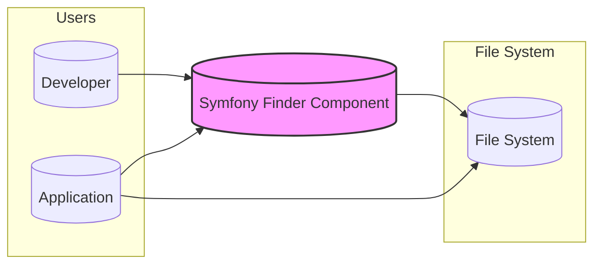
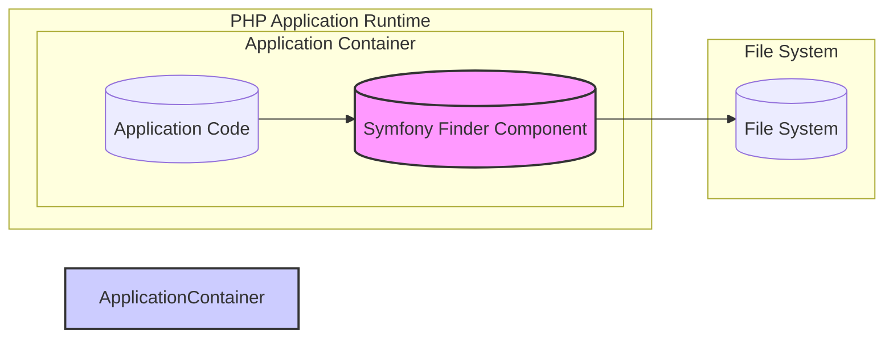
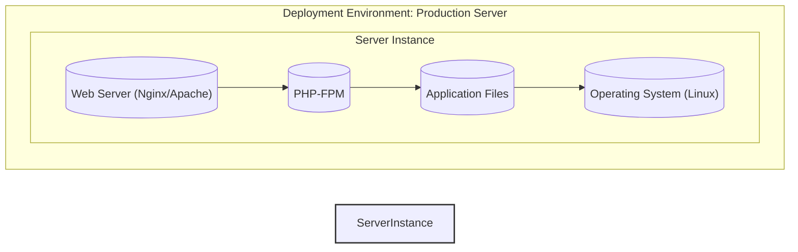

# BUSINESS POSTURE

The Symfony Finder component is a PHP library that efficiently locates files and directories based on various criteria. It simplifies file system traversal and filtering, making it easier for developers to manage and process files within their applications.

Business priorities and goals for using Symfony Finder:

- Efficient file management: Streamline operations that require locating files, such as backups, content management, log processing, and application deployment.
- Improved developer productivity: Provide a convenient and expressive API for file system interactions, reducing development time and complexity.
- Consistent file handling: Ensure uniform file searching and filtering logic across different parts of an application or project.

Most important business risks to address:

- Incorrect file processing: If file selection criteria are flawed, the wrong files might be processed, leading to data corruption, application errors, or security vulnerabilities.
- Performance bottlenecks: Inefficient file searching can slow down applications, especially when dealing with large file systems.
- Denial of Service:  Uncontrolled or malicious use of file system operations could potentially lead to resource exhaustion and denial of service.
- Information Disclosure: If file paths or file contents are inadvertently exposed due to improper handling, it could lead to information disclosure.

# SECURITY POSTURE

Existing security controls:

- security control: Input validation within the Finder component to prevent unexpected behavior from provided paths and patterns. (Implemented within the `Finder` class methods, e.g., path validation, pattern validation).
- security control:  Principle of least privilege in file system access. The Finder component operates with the permissions of the PHP process executing it. (Implicit in the design, relies on the application's environment setup).
- accepted risk:  Reliance on the security of the underlying operating system and file system permissions. (Documented implicitly by assuming standard OS security practices).
- accepted risk:  Vulnerabilities in dependencies. (Addressed by Symfony project's dependency management and security advisories, but inherent risk exists).

Recommended security controls:

- security control: Implement static analysis security testing (SAST) on the Finder component code to identify potential vulnerabilities during development.
- security control: Integrate dependency scanning to detect known vulnerabilities in third-party libraries used by the Finder component (if any).
- security control:  Provide clear documentation and examples emphasizing secure usage of the Finder component, especially regarding input sanitization and handling of sensitive file paths.

Security requirements:

- Authentication: Not directly applicable to a library component like Finder. Authentication is handled at the application level that uses the Finder.
- Authorization:  Finder operates within the authorization context of the application using it. Applications must ensure that the PHP process running Finder has appropriate permissions to access the file system locations being searched.
- Input validation:
    - Requirement: Validate all input paths and patterns provided to the Finder component to prevent path traversal vulnerabilities and unexpected behavior.
    - Requirement: Sanitize input to prevent injection attacks if input is used in shell commands or other potentially unsafe operations (though Finder itself does not execute shell commands).
- Cryptography: Not directly applicable to the core functionality of Finder. Cryptography might be relevant if applications using Finder are dealing with encrypted files, but this is outside the scope of the Finder component itself.

# DESIGN

## C4 CONTEXT



Context Diagram Description:

- Context Element List:
    - Element:
        - Name: Developer
        - Type: User
        - Description: Software developers who use the Symfony Finder component in their PHP projects.
        - Responsibilities: Integrate and utilize the Finder component to implement file system operations within their applications. Configure Finder with appropriate paths and search criteria.
        - Security controls: Responsible for using the Finder component securely, validating inputs to Finder, and ensuring the application using Finder has appropriate file system permissions.
    - Element:
        - Name: Application
        - Type: Software System
        - Description: PHP applications that incorporate the Symfony Finder component to perform file system operations.
        - Responsibilities: Utilize Finder to locate and process files as part of their business logic. Manage file system access and permissions.
        - Security controls: Application-level security controls, including input validation, authorization, and secure handling of file paths and content.
    - Element:
        - Name: Symfony Finder Component
        - Type: Software System
        - Description: A PHP library for efficiently finding files and directories based on specified criteria.
        - Responsibilities: Provide a robust and secure API for file system traversal and filtering. Validate input paths and patterns.
        - Security controls: Input validation, code quality checks, and adherence to secure coding practices during development.
    - Element:
        - Name: File System
        - Type: External System
        - Description: The underlying file system where files and directories are stored.
        - Responsibilities: Store and manage files and directories. Enforce file system permissions.
        - Security controls: Operating system level security controls, including file system permissions, access control lists, and encryption.

## C4 CONTAINER



Container Diagram Description:

- Container Element List:
    - Element:
        - Name: Application Code
        - Type: Software Container
        - Description: The custom PHP code of the application that utilizes the Symfony Finder component.
        - Responsibilities: Implement application-specific logic, including calling the Finder component to perform file operations. Handle application-level security and data processing.
        - Security controls: Application-level security controls, input validation before calling Finder, authorization checks, secure data handling.
    - Element:
        - Name: Symfony Finder Component
        - Type: Software Container
        - Description: The PHP library responsible for file system traversal and filtering.
        - Responsibilities: Provide the file finding functionality. Validate input paths and patterns.
        - Security controls: Input validation within the component, code quality checks, and secure coding practices.
    - Element:
        - Name: File System
        - Type: External System
        - Description: The underlying file system being accessed by the Finder component.
        - Responsibilities: Store and manage files and directories. Enforce file system permissions.
        - Security controls: Operating system level security controls, file system permissions.

## DEPLOYMENT

Deployment Diagram Description:

For a PHP library like Symfony Finder, deployment is primarily about how it's included in a PHP application and where that application is deployed.  A typical deployment scenario for a PHP application using Symfony Finder is a web application deployed on a Linux server using a web server like Nginx or Apache and PHP-FPM.



Deployment Element List:

- Deployment Element List:
    - Element:
        - Name: Operating System (Linux)
        - Type: Infrastructure
        - Description: The server operating system, typically Linux-based. Provides the foundation for the web server and PHP runtime.
        - Responsibilities: Manage system resources, enforce security policies, provide file system access.
        - Security controls: Operating system hardening, firewall, intrusion detection systems, user access controls, file system permissions.
    - Element:
        - Name: Web Server (Nginx/Apache)
        - Type: Infrastructure Software
        - Description: Web server software responsible for handling HTTP requests and serving the PHP application.
        - Responsibilities: Receive web requests, route requests to PHP-FPM, serve static files.
        - Security controls: Web server configuration (e.g., disabling unnecessary modules, setting appropriate headers), TLS/SSL configuration, access logs, rate limiting.
    - Element:
        - Name: PHP-FPM
        - Type: Runtime Environment
        - Description: PHP FastCGI Process Manager, responsible for executing PHP code.
        - Responsibilities: Execute PHP scripts, manage PHP processes, interact with the file system on behalf of the application.
        - Security controls: PHP configuration hardening (e.g., disabling dangerous functions, setting open_basedir), process isolation, resource limits.
    - Element:
        - Name: Application Files
        - Type: Software Artifact
        - Description: Deployed application code, including the Symfony Finder component and application-specific PHP code.
        - Responsibilities: Contain the application logic and the Finder library.
        - Security controls: File system permissions to restrict access, code reviews, vulnerability scanning of application code and dependencies.

## BUILD

Build Diagram Description:

The build process for a PHP library like Symfony Finder typically involves using Composer for dependency management, running unit tests, and potentially static analysis and linting. For a component within a larger framework like Symfony, the build process is integrated into the Symfony project's overall build and release pipeline.

```mermaid
flowchart LR
    subgraph "Developer Environment"
        Developer[("Developer")]
        CodeEditor[("Code Editor")]
        LocalFileSystem[("Local File System")]
        GitClient[("Git Client")]
    end
    subgraph "CI/CD Pipeline (GitHub Actions)"
        VersionControl[("Version Control (GitHub)")]
        BuildServer[("Build Server (GitHub Actions)")]
        DependencyManager[("Dependency Manager (Composer)")]
        TestRunner[("Test Runner (PHPUnit)")]
        StaticAnalysis[("Static Analysis Tools")]
        ArtifactRepository[("Artifact Repository (Packagist/GitHub Packages)")]
    end

    Developer --> CodeEditor
    CodeEditor --> LocalFileSystem
    Developer --> GitClient
    GitClient --> VersionControl
    VersionControl --> BuildServer
    BuildServer --> DependencyManager
    BuildServer --> TestRunner
    BuildServer --> StaticAnalysis
    BuildServer --> ArtifactRepository
    LocalFileSystem --> BuildServer: Code

    style BuildServer fill:#eef,stroke:#333,stroke-width:2px
```

Build Element List:

- Build Element List:
    - Element:
        - Name: Developer
        - Type: Person
        - Description: Software developer writing and modifying the code.
        - Responsibilities: Write code, run local tests, commit code changes.
        - Security controls: Secure development practices, code reviews, local development environment security.
    - Element:
        - Name: Code Editor
        - Type: Tool
        - Description: Integrated Development Environment (IDE) or text editor used by the developer.
        - Responsibilities: Code editing, syntax highlighting, code completion.
        - Security controls: Plugin security, secure configuration.
    - Element:
        - Name: Local File System
        - Type: Infrastructure
        - Description: Developer's local file system where the code is stored during development.
        - Responsibilities: Store code files.
        - Security controls: Operating system security, file system permissions, backups.
    - Element:
        - Name: Git Client
        - Type: Tool
        - Description: Git command-line tool or GUI client for version control.
        - Responsibilities: Manage code versions, commit changes, push code to remote repository.
        - Security controls: Secure Git configuration, SSH key management, access control to Git repository.
    - Element:
        - Name: Version Control (GitHub)
        - Type: Service
        - Description: GitHub repository hosting the source code.
        - Responsibilities: Store code versions, manage branches, track changes, control access to the codebase.
        - Security controls: Access control, branch protection, audit logs, vulnerability scanning of repository settings.
    - Element:
        - Name: Build Server (GitHub Actions)
        - Type: Service
        - Description: Automated build and CI/CD platform (GitHub Actions in this case).
        - Responsibilities: Automate build process, run tests, perform static analysis, publish artifacts.
        - Security controls: Secure build environment, access control to CI/CD pipelines, secrets management, audit logs.
    - Element:
        - Name: Dependency Manager (Composer)
        - Type: Tool
        - Description: PHP dependency management tool.
        - Responsibilities: Manage project dependencies, download libraries, generate autoloader.
        - Security controls: Integrity checks of downloaded packages (using `composer.lock`), vulnerability scanning of dependencies.
    - Element:
        - Name: Test Runner (PHPUnit)
        - Type: Tool
        - Description: PHP unit testing framework.
        - Responsibilities: Execute unit tests to verify code functionality.
        - Security controls: Secure test environment, test isolation.
    - Element:
        - Name: Static Analysis Tools
        - Type: Tool
        - Description: Tools for static code analysis (e.g., Psalm, PHPStan, linters).
        - Responsibilities: Analyze code for potential bugs, security vulnerabilities, and code style issues.
        - Security controls: Regularly updated analysis rules, secure tool configuration.
    - Element:
        - Name: Artifact Repository (Packagist/GitHub Packages)
        - Type: Service
        - Description: Package repository for distributing PHP libraries (Packagist is the primary one for Symfony components, GitHub Packages is another option).
        - Responsibilities: Host and distribute built packages.
        - Security controls: Package signing, vulnerability scanning of published packages, access control.

# RISK ASSESSMENT

Critical business processes protected by Symfony Finder (indirectly, as a component):

- File-based content management: Applications using Finder for content management rely on it to accurately locate and manage content files.
- Log processing and analysis: Applications processing logs might use Finder to locate relevant log files for analysis.
- Backup and restore operations: Backup systems might use Finder to identify files to be backed up.
- Application deployment: Deployment scripts might use Finder to locate files for deployment.

Data being protected and its sensitivity:

- File paths: Finder operates on file paths. File paths themselves might reveal information about system structure or application logic, but are generally low sensitivity.
- File content (indirectly): While Finder doesn't directly handle file content, it's used to locate files, and the content of those files might be highly sensitive (e.g., user data, configuration files, application secrets). The sensitivity depends entirely on the application using Finder and the files it's designed to find and process.

# QUESTIONS & ASSUMPTIONS

Questions:

- What are the specific use cases for Symfony Finder in the target application or project? (This would help to refine the business posture and risk assessment).
- What are the security requirements of the applications that will use Symfony Finder? (This would help to prioritize security controls and requirements).
- What is the deployment environment for applications using Symfony Finder? (This would help to tailor the deployment diagram and security considerations).

Assumptions:

- BUSINESS POSTURE: The primary business goal is efficient and reliable file management within PHP applications.
- SECURITY POSTURE:  Security is a concern, and basic security practices are expected in the development and deployment of applications using Symfony Finder.  The focus is on preventing common vulnerabilities like path traversal and ensuring secure usage of the component.
- DESIGN: Symfony Finder is used as a component within larger PHP applications, typically web applications. The deployment environment is assumed to be a standard Linux server with a web server and PHP-FPM. The build process follows typical PHP library development practices using Composer and automated testing.