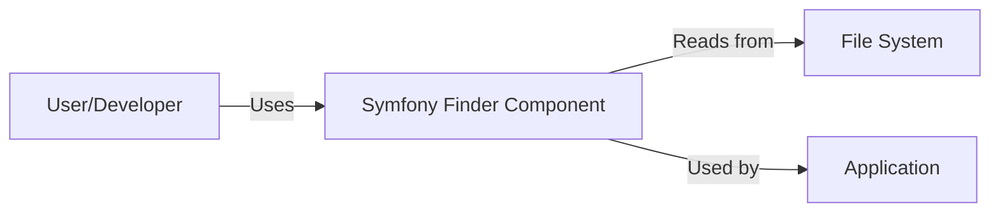
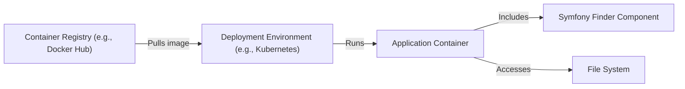
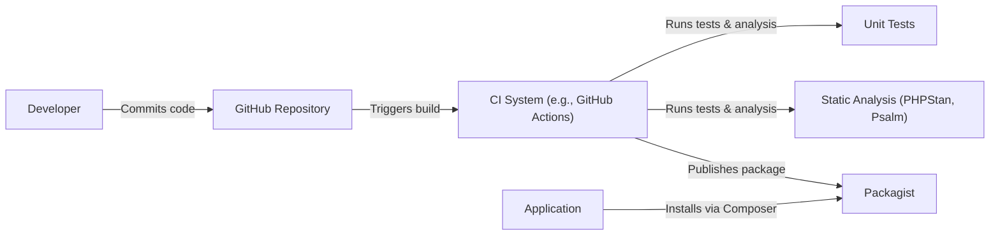

# BUSINESS POSTURE

Business Priorities and Goals:

The Symfony Finder component is a utility library designed to facilitate file and directory searching within a filesystem. Its primary business goals are:

*   Provide a simple, fluent, and easy-to-use API for developers to locate files and directories based on various criteria.
*   Offer high performance and efficiency in file searching operations.
*   Maintain cross-platform compatibility (Windows, macOS, Linux).
*   Ensure flexibility and extensibility to accommodate diverse use cases.
*   Reduce development time and effort for tasks involving file system interactions.
*   Enhance code maintainability and readability by abstracting complex file system operations.

Business Risks:

*   Inaccurate or incomplete search results: If the Finder component fails to locate files correctly or misses certain files, it could lead to application errors, data loss, or incorrect behavior.
*   Performance bottlenecks: Inefficient file searching algorithms or excessive resource consumption could slow down applications, especially when dealing with large file systems.
*   Security vulnerabilities: If the Finder component is susceptible to path traversal or other file system-related attacks, it could expose sensitive data or allow unauthorized access.
*   Compatibility issues: Inconsistencies in behavior across different operating systems or PHP versions could lead to application failures or unexpected results.
*   Lack of features: If the Finder component lacks essential features or customization options, it may not meet the needs of all developers or use cases.

# SECURITY POSTURE

Existing Security Controls:

*   security control: The component itself does not handle authentication or authorization. It operates within the security context of the PHP process that uses it.
*   security control: Input validation is performed to ensure that provided paths and patterns are valid and do not contain potentially harmful characters. (Implemented within the component's code).
*   security control: The component does not directly handle cryptographic operations.
*   security control: The component is part of the Symfony framework, which follows secure coding practices and undergoes regular security audits. (Described in Symfony's security documentation).
*   security control: The component's code is open source and publicly available on GitHub, allowing for community review and scrutiny.

Accepted Risks:

*   accepted risk: The component relies on the underlying operating system's file system permissions for access control. It does not implement its own permission checks.
*   accepted risk: The component may be vulnerable to denial-of-service attacks if used to search extremely large or deeply nested directories.
*   accepted risk: The component does not provide built-in protection against symlink attacks.

Recommended Security Controls:

*   security control: Implement stricter input validation to prevent path traversal vulnerabilities, especially when user-provided input is used to construct search paths.
*   security control: Provide options for limiting the depth of directory recursion to mitigate denial-of-service risks.
*   security control: Offer configuration options for handling symlinks securely, such as allowing users to choose whether to follow symlinks or not.
*   security control: Add documentation and examples demonstrating secure usage patterns, particularly regarding user input and path construction.

Security Requirements:

*   Authentication: Not applicable, as the component does not handle user authentication.
*   Authorization: Relies on the operating system's file system permissions.
*   Input Validation:
    *   Validate all user-provided paths and patterns to prevent path traversal attacks.
    *   Sanitize input to remove or escape potentially harmful characters.
    *   Enforce limits on path length and complexity.
*   Cryptography: Not directly applicable, as the component does not handle encryption or decryption.
*   Error Handling:
    *   Provide clear and informative error messages for invalid input or unexpected conditions.
    *   Handle exceptions gracefully to prevent application crashes.
    *   Avoid exposing sensitive information in error messages.

# DESIGN

## C4 CONTEXT

Element List:

*   User/Developer
    *   Name: User/Developer
    *   Type: Person
    *   Description: A developer who integrates the Symfony Finder component into their application.
    *   Responsibilities:
        *   Writes code that utilizes the Finder component to search for files and directories.
        *   Provides configuration options and search criteria to the Finder component.
        *   Handles the results returned by the Finder component.
    *   Security controls:
        *   Follows secure coding practices.
        *   Provides validated and sanitized input to the Finder component.

*   Symfony Finder Component
    *   Name: Symfony Finder Component
    *   Type: Software Component
    *   Description: The Symfony Finder component, a library for locating files and directories.
    *   Responsibilities:
        *   Provides an API for searching files and directories based on various criteria.
        *   Performs file system operations efficiently and securely.
        *   Returns search results to the calling application.
    *   Security controls:
        *   Performs input validation on paths and patterns.
        *   Relies on the operating system's file system permissions.

*   File System
    *   Name: File System
    *   Type: External System
    *   Description: The underlying file system of the operating system.
    *   Responsibilities:
        *   Stores files and directories.
        *   Provides access to files and directories based on operating system permissions.
    *   Security controls:
        *   Operating system file system permissions.

*   Application
    *   Name: Application
    *   Type: Software System
    *   Description: The application that uses the Symfony Finder component.
    *   Responsibilities:
        *   Uses the Finder component to locate files and directories.
        *   Processes the search results.
    *   Security controls:
        *   Application-specific security controls.

## C4 CONTAINER

Since the Symfony Finder component is a relatively simple library, the Container diagram is essentially the same as the Context diagram.

Element List:

*   User/Developer
    *   Name: User/Developer
    *   Type: Person
    *   Description: A developer who integrates the Symfony Finder component into their application.
    *   Responsibilities:
        *   Writes code that utilizes the Finder component to search for files and directories.
        *   Provides configuration options and search criteria to the Finder component.
        *   Handles the results returned by the Finder component.
    *   Security controls:
        *   Follows secure coding practices.
        *   Provides validated and sanitized input to the Finder component.

*   Symfony Finder Component
    *   Name: Symfony Finder Component
    *   Type: Software Component
    *   Description: The Symfony Finder component, a library for locating files and directories.
    *   Responsibilities:
        *   Provides an API for searching files and directories based on various criteria.
        *   Performs file system operations efficiently and securely.
        *   Returns search results to the calling application.
    *   Security controls:
        *   Performs input validation on paths and patterns.
        *   Relies on the operating system's file system permissions.

*   File System
    *   Name: File System
    *   Type: External System
    *   Description: The underlying file system of the operating system.
    *   Responsibilities:
        *   Stores files and directories.
        *   Provides access to files and directories based on operating system permissions.
    *   Security controls:
        *   Operating system file system permissions.

*   Application
    *   Name: Application
    *   Type: Software System
    *   Description: The application that uses the Symfony Finder component.
    *   Responsibilities:
        *   Uses the Finder component to locate files and directories.
        *   Processes the search results.
    *   Security controls:
        *   Application-specific security controls.

## DEPLOYMENT

The Symfony Finder component is a PHP library and is typically deployed as part of a larger PHP application. It doesn't have its own dedicated deployment process. It is included as a dependency via Composer, a PHP dependency manager.

Possible Deployment Solutions:

1.  Traditional Web Server (Apache, Nginx) with PHP-FPM.
2.  Containerized deployment (Docker) with a web server and PHP-FPM.
3.  Serverless deployment (AWS Lambda, Azure Functions, Google Cloud Functions) with a PHP runtime.

Chosen Deployment Solution (Example: Containerized Deployment):

Element List:

*   Container Registry
    *   Name: Container Registry
    *   Type: Infrastructure
    *   Description: A repository for storing and managing container images.
    *   Responsibilities: Stores the application container image.
    *   Security controls: Access control, image scanning.

*   Deployment Environment
    *   Name: Deployment Environment
    *   Type: Infrastructure
    *   Description: The environment where the application container is deployed (e.g., Kubernetes cluster).
    *   Responsibilities: Orchestrates and manages the application container.
    *   Security controls: Network policies, access control, resource quotas.

*   Application Container
    *   Name: Application Container
    *   Type: Container
    *   Description: A container that runs the PHP application, including the Symfony Finder component.
    *   Responsibilities: Executes the application code.
    *   Security controls: Container security context, resource limits.

*   Symfony Finder Component
    *   Name: Symfony Finder Component
    *   Type: Software Component
    *   Description: The Symfony Finder component, included within the application container.
    *   Responsibilities: Provides file searching functionality.
    *   Security controls: Input validation, reliance on OS file system permissions.

*   File System
    *   Name: File System
    *   Type: External System
    *   Description: The file system accessible to the application container.
    *   Responsibilities: Stores files and directories.
    *   Security controls: Operating system file system permissions, potentially volume mount restrictions.

## BUILD

The Symfony Finder component is built and published as part of the Symfony framework. The build process typically involves the following steps:

1.  Developer commits code changes to the Symfony repository on GitHub.
2.  Continuous Integration (CI) system (e.g., GitHub Actions) triggers a build.
3.  The CI system runs unit tests and static analysis tools (e.g., PHPStan, Psalm).
4.  If all tests and checks pass, the component is packaged and published to Packagist (the main PHP package repository) via Composer.

Security Controls in Build Process:

*   security control: Code review: All code changes are reviewed by other developers before being merged.
*   security control: Unit tests: Automated tests verify the functionality of the component and help prevent regressions.
*   security control: Static analysis: Tools like PHPStan and Psalm detect potential code quality issues and security vulnerabilities.
*   security control: Dependency management: Composer ensures that dependencies are tracked and updated securely.
*   security control: CI/CD pipeline: The automated build process ensures consistency and reduces the risk of manual errors.

# RISK ASSESSMENT

Critical Business Processes:

*   File searching and retrieval: The core functionality of the component is essential for applications that need to locate files based on specific criteria.
*   Application functionality relying on file access: Many applications depend on accessing files for configuration, data processing, or other operations. The Finder component facilitates this access.

Data Protection:

*   The component itself does not store or manage sensitive data directly. However, it can be used to access files that contain sensitive data.
*   Data sensitivity depends on the specific files being accessed by the application using the Finder component.
*   The primary concern is preventing unauthorized access to files through vulnerabilities like path traversal.

# QUESTIONS & ASSUMPTIONS

Questions:

*   Are there any specific file system performance requirements or limitations that need to be considered?
*   Are there any specific security certifications or compliance requirements that the application using the Finder component must adhere to?
*   What is the expected level of user input that will be used to construct search paths?
*   Are there any specific file types or naming conventions that need to be handled differently?

Assumptions:

*   BUSINESS POSTURE: The primary goal is to provide a reliable and efficient file searching utility.
*   SECURITY POSTURE: The underlying operating system's file system permissions are considered a sufficient baseline for access control.
*   DESIGN: The component is used within a PHP application and deployed as part of that application. The application developer is responsible for securing the overall application and providing safe inputs to the Finder.