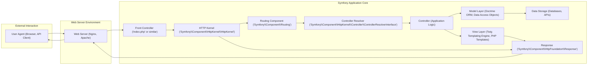
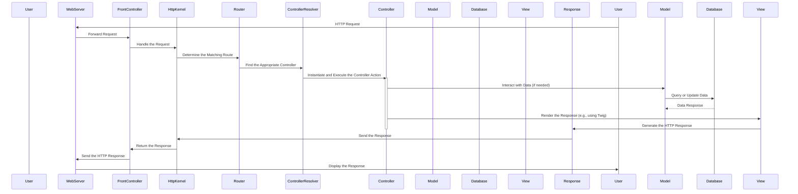

# Project Design Document: Symfony Framework

**Version:** 1.1
**Date:** October 26, 2023
**Author:** AI Software Architect

## 1. Project Overview

This document details the architectural design of the Symfony PHP framework, a versatile platform for building web applications, APIs, and microservices. It provides a structured set of reusable components and a framework that streamlines development. This document serves as a blueprint for understanding Symfony's internal workings, particularly for security analysis and threat modeling.

## 2. Goals

* To clearly articulate the architectural design of the Symfony framework.
* To identify and describe the core components and their interactions within the framework.
* To illustrate the typical flow of a request and response within a Symfony application.
* To outline fundamental security considerations embedded in the framework's architecture.
* To establish a solid foundation for subsequent threat modeling activities.

## 3. Target Audience

* Security engineers and architects tasked with performing threat modeling and security assessments.
* Software developers building applications with or contributing to the Symfony framework.
* DevOps and operations teams responsible for the deployment and maintenance of Symfony applications.

## 4. High-Level Architecture

Symfony applications are built around the concept of an HTTP request-response cycle, orchestrated by the HTTP Kernel. While adhering to principles of the Model-View-Controller (MVC) pattern, its core is more accurately described as a request processing pipeline.

* **User Agent (Browser, API Client):** Represents the entity initiating the request, such as a web browser or a program interacting with an API.
* **Web Server (Nginx, Apache):**  The software responsible for receiving HTTP requests and forwarding them to the Symfony application's entry point.
* **Front Controller ('index.php' or similar):** The initial PHP script that handles all incoming requests. It bootstraps the Symfony application environment.
* **HTTP Kernel ('Symfony\\Component\\HttpKernel\\HttpKernel'):** The central component that manages the request-response lifecycle. It dispatches events and orchestrates the processing of the request.
* **Routing Component ('Symfony\\Component\\Routing'):**  Responsible for matching the incoming request URI to a defined route, which maps to a specific controller action.
* **Controller Resolver ('Symfony\\Component\\HttpKernel\\Controller\\ControllerResolverInterface'):** Determines which controller should be executed based on the matched route.
* **Controller (Application Logic):**  PHP classes containing the specific logic to handle a request. They interact with the Model and View layers.
* **Model Layer (Doctrine ORM, Data Access Objects):** Represents the data and business logic of the application. This often involves interacting with databases through an ORM like Doctrine or custom data access objects.
* **Data Storage (Databases, APIs):** The persistent storage for application data, which can be relational databases, NoSQL databases, or external APIs.
* **View Layer (Twig Templating Engine, PHP Templates):** Responsible for rendering the user interface or API response, typically using the Twig templating engine or plain PHP templates.
* **Response ('Symfony\\Component\\HttpFoundation\\Response'):**  An object representing the HTTP response that will be sent back to the user agent.

## 5. Key Components

* **HTTP Kernel:** The core of Symfony, responsible for handling the request lifecycle from the moment the application receives a request until it sends a response. It acts as a central hub, dispatching events that allow other components to hook into the process.
* **Routing Component:**  A powerful system for defining URL patterns (routes) and mapping them to specific controller actions. It supports route parameters, requirements, and different HTTP methods.
* **Controller:** PHP classes that contain action methods. These methods contain the application's logic for handling specific requests, interacting with models, and rendering views.
* **Templating Engine (Twig):** A flexible, fast, and secure template engine that separates presentation logic from application logic. It offers features like template inheritance, auto-escaping to prevent XSS, and a readable syntax.
* **Dependency Injection Container:** A central registry for application services. It manages the creation and dependencies of objects, promoting loose coupling, reusability, and testability.
* **Event Dispatcher:**  A mechanism that allows different parts of the application to communicate with each other without direct dependencies. Components can dispatch events, and other components can subscribe to and react to those events.
* **Security Component:** Provides a comprehensive set of features for securing applications, including authentication (verifying user identity), authorization (controlling access to resources), and protection against common web vulnerabilities like CSRF.
* **Form Component:** Simplifies the process of creating, rendering, processing, and validating HTML forms. It helps to ensure data integrity and security.
* **Doctrine ORM (Optional):** An optional but commonly used Object-Relational Mapper that facilitates interaction with databases by mapping objects to database tables. It provides features like data mapping, querying, and persistence.
* **Console Component:** Enables the creation of command-line interfaces (CLIs) for performing tasks such as database migrations, cache clearing, and running background jobs.
* **Cache Component:** Offers various caching strategies (e.g., in-memory, file-based, Redis) to improve application performance by storing frequently accessed data.
* **Serializer Component:**  Provides tools for converting objects into various data formats (like JSON or XML) and vice versa, useful for building APIs and data exchange.
* **Validator Component:**  A system for defining and enforcing validation rules on data, ensuring data integrity and preventing invalid data from being processed.

## 6. Data Flow

The typical sequence of events for handling an HTTP request in a Symfony application is as follows:

* The **User Agent** initiates an HTTP request to the application.
* The **Web Server** receives the request and forwards it to the **Front Controller**.
* The **Front Controller** bootstraps the Symfony application and passes the request to the **HttpKernel**.
* The **HttpKernel** uses the **Router** to match the request URI to a defined route.
* The **Router** identifies the corresponding route and provides information to the **ControllerResolver**.
* The **ControllerResolver** determines and instantiates the appropriate **Controller** to handle the request.
* The **Controller**'s action method is executed.
* The **Controller** interacts with the **Model Layer** to fetch or manipulate data, if necessary.
* The **Model Layer** interacts with the **Data Storage** (e.g., a database).
* The **Data Storage** returns data to the **Model Layer**.
* The **Controller** uses the **View Layer** (e.g., Twig) to render the response.
* The **View Layer** generates the final HTTP **Response**.
* The **Response** is sent back through the **HttpKernel**.
* The **HttpKernel** returns the **Response** to the **Front Controller**.
* The **Front Controller** sends the HTTP **Response** back to the **Web Server**.
* The **Web Server** delivers the response to the **User Agent**.

## 7. Security Considerations

The Symfony framework incorporates several architectural features and components designed to enhance security:

* **Input Validation and Sanitization:** The Form and Validator components enable developers to define and enforce strict validation rules on user input, preventing injection attacks (SQL injection, cross-site scripting). Data transformers can sanitize input before it reaches the application logic.
* **Output Escaping:** The Twig templating engine automatically escapes output by default, mitigating cross-site scripting (XSS) vulnerabilities. Developers must explicitly mark content as safe when necessary, requiring careful consideration.
* **Cross-Site Request Forgery (CSRF) Protection:** Symfony provides built-in CSRF protection mechanisms, typically using synchronizer tokens, which help prevent malicious requests originating from other websites.
* **Authentication and Authorization:** The Security component offers a flexible and robust system for authenticating users (verifying their identity) and authorizing access to resources based on roles and permissions. This includes support for various authentication methods and access control lists (ACLs).
* **Session Management:** Symfony provides secure session handling, including options for secure cookie settings (e.g., `HttpOnly`, `Secure`) and protection against session fixation attacks.
* **Security Headers:**  Symfony allows for easy configuration of HTTP security headers like Content Security Policy (CSP), HTTP Strict Transport Security (HSTS), and X-Frame-Options, which provide defense-in-depth against various attacks.
* **Rate Limiting:** While not a core component, Symfony applications can easily integrate with libraries or middleware to implement rate limiting, protecting against brute-force attacks and denial-of-service attempts.
* **Secure File Uploads:**  The framework provides tools for handling file uploads securely, including validation of file types, sizes, and content, helping to prevent malicious file uploads.
* **Dependency Management Security:** Using Composer for dependency management allows developers to track and update third-party libraries, ensuring they are using versions without known security vulnerabilities. Security auditing tools can be integrated into the development process.
* **Error Handling and Logging:** Symfony encourages proper error handling and provides logging capabilities. It's crucial to configure logging to avoid exposing sensitive information in error messages while providing sufficient detail for debugging and security monitoring.

## 8. Deployment Model

Symfony applications can be deployed in various environments:

* **Traditional Web Servers (Apache, Nginx with PHP-FPM):** This is a common deployment model where the web server handles incoming requests and uses PHP-FPM to execute the PHP code. Configuration involves setting up virtual hosts and pointing the web server's document root to the `public/` directory.
* **Containerization (Docker, Podman):** Containerizing Symfony applications with Docker provides isolated and reproducible environments. Docker images typically include the web server, PHP interpreter, and the application code, simplifying deployment and scaling.
* **Platform as a Service (PaaS) (e.g., Heroku, Platform.sh, AWS Elastic Beanstalk):** PaaS providers offer managed environments specifically designed for deploying web applications, often simplifying the deployment process for Symfony applications.
* **Cloud Platforms (AWS, Google Cloud, Azure):** Cloud platforms offer a range of services for deploying and scaling Symfony applications, including virtual machines, managed Kubernetes services, and serverless functions (with some limitations for full framework applications).

## 9. Technology Stack

* **Primary Language:** PHP
* **Web Servers:** Nginx or Apache (recommended)
* **Templating Engine:** Twig (default) or PHP
* **Database Systems (Optional):** MySQL, PostgreSQL, SQLite, MariaDB, SQL Server, Oracle (typically accessed via Doctrine ORM)
* **Dependency Management:** Composer
* **Version Control System:** Git (commonly used)

## 10. Assumptions and Constraints

* This document describes the general architecture of the Symfony framework and may not cover all specific configurations or customizations.
* The security considerations outlined are general best practices and require proper implementation and configuration by developers.
* The focus is on the core framework architecture, and specific bundles or third-party integrations may introduce additional architectural elements and security considerations.
* The described data flow represents a typical web request; API requests or console commands might have slightly different flows.

This improved design document provides a more detailed and comprehensive overview of the Symfony framework's architecture, enhancing its value for threat modeling and security analysis. The expanded descriptions of components, the more detailed data flow diagram, and the enhanced security considerations offer a stronger foundation for identifying potential vulnerabilities and attack vectors.