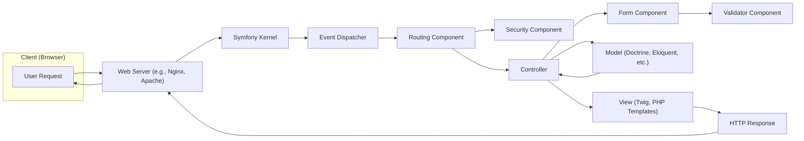
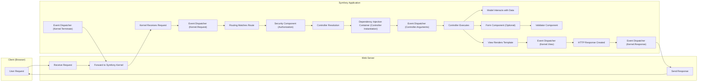

# Project Design Document: Symfony Framework

**Version:** 1.1
**Date:** October 26, 2023
**Author:** Gemini (AI Language Model)

## 1. Introduction

This document provides an enhanced and more detailed architectural overview of the Symfony PHP framework, specifically tailored for threat modeling purposes. It elaborates on the key architectural components, data flow, and security considerations, providing a more robust foundation for security analysts and developers to understand the framework's structure and potential vulnerabilities.

## 2. Goals and Objectives

*   Deliver a refined and more comprehensive architectural overview of the Symfony framework.
*   Provide deeper insights into the interactions between key components.
*   Offer a more granular depiction of the typical data flow within a Symfony application.
*   Elaborate on security features and potential security considerations with specific examples.
*   Serve as an improved and more detailed basis for conducting thorough threat modeling exercises.

## 3. System Architecture

Symfony adheres to the Model-View-Controller (MVC) architectural pattern, emphasizing modularity and extensibility for building complex web applications. This section provides a more detailed breakdown of the architecture.

### 3.1. High-Level Diagram with Enhanced Detail

### 3.2. Key Components with Expanded Descriptions

*   **Kernel:** The central component responsible for bootstrapping the application, handling requests, and managing the application lifecycle. It acts as the core orchestrator.
*   **HTTP Foundation:** Provides object-oriented representations of HTTP requests and responses, abstracting away the underlying PHP superglobals. This allows for easier manipulation and testing.
*   **Event Dispatcher:** A central hub for managing application events. Components can dispatch events, and other components can subscribe to and react to these events, enabling loose coupling and extensibility.
*   **Routing:**  Examines the incoming HTTP request and maps the request URI to a specific controller action. This component is crucial for defining the application's endpoints.
*   **Security Component:** A comprehensive suite of features for handling authentication (identifying users), authorization (determining user permissions), and protection against common web vulnerabilities.
*   **Controller:**  Contains the specific application logic for handling a request. It interacts with the Model to retrieve or manipulate data and prepares the data to be rendered by the View.
*   **Model:** Represents the data layer of the application. Symfony integrates seamlessly with various ORMs like Doctrine ORM and database abstraction layers, providing an interface for interacting with data sources.
*   **View (Templating Engine):** Responsible for rendering the user interface presented to the user. Twig is the default templating engine, offering features like template inheritance, auto-escaping for security, and more.
*   **Form Component:** Simplifies the process of creating, processing, and validating HTML forms. It provides features like data binding, validation rules, and CSRF protection.
*   **Validator Component:** Provides a robust system for defining and enforcing validation rules on data. It can be used to validate data submitted through forms or other sources.
*   **Console Component:** Offers tools for building command-line interfaces (CLIs) for tasks like database migrations, cache clearing, and running background jobs.
*   **Translation Component:** Facilitates the internationalization (i18n) and localization (l10n) of applications by managing translations of text strings.
*   **Mailer Component:** Enables sending emails from the application, supporting various transports and message formats.
*   **Cache Component:** Provides various caching strategies (e.g., in-memory, file-based, Redis) to improve application performance by storing frequently accessed data.
*   **Serializer Component:** Allows for the conversion of objects into different data formats (e.g., JSON, XML) and vice versa, useful for building APIs.

## 4. Data Flow with Enhanced Granularity

The data flow within a Symfony application involves a series of steps, with each component playing a specific role in processing the request and generating the response.

1. **User Request:** A user interacts with the application, initiating an HTTP request through their web browser.
2. **Web Server Reception:** The web server (e.g., Nginx, Apache) receives the incoming HTTP request.
3. **Request to Kernel:** The web server forwards the request to the Symfony application's Kernel, which is the entry point for the application.
4. **Kernel Bootstrapping:** The Kernel initializes the necessary components and services for handling the request.
5. **Event Dispatching (Kernel.Request):** The Kernel dispatches a `KernelEvents::REQUEST` event, allowing listeners to perform actions early in the request lifecycle.
6. **Routing:** The Routing component analyzes the request URI and matches it against the defined routes in the application's configuration.
7. **Security Context:** The Security component checks if the user is authenticated and authorized to access the requested resource based on configured firewalls and access rules.
8. **Controller Resolution:** Based on the matched route, the appropriate controller and action are determined.
9. **Controller Instantiation:** The Dependency Injection Container creates an instance of the resolved controller.
10. **Event Dispatching (Controller.Arguments):** The Kernel may dispatch an event allowing modification of the arguments passed to the controller.
11. **Controller Execution:** The action method within the controller is executed. This is where the core application logic resides.
12. **Model Interaction:** The controller interacts with the Model layer (e.g., using Doctrine ORM) to retrieve, create, update, or delete data from the database or other data sources. Data may be validated using the Validator component.
13. **Form Handling (Optional):** If the request involves a form submission, the Form component handles data binding, validation, and processing.
14. **View Rendering:** The controller prepares the data and passes it to the View layer (e.g., a Twig template). The templating engine renders the HTML markup.
15. **Event Dispatching (Kernel.View):** The Kernel dispatches a `KernelEvents::VIEW` event, allowing listeners to modify the view before rendering.
16. **Response Generation:** The View layer generates the HTML content, and the HTTP Foundation component creates the HTTP response object, including headers and the body.
17. **Event Dispatching (Kernel.Response):** The Kernel dispatches a `KernelEvents::RESPONSE` event, allowing listeners to modify the response before it is sent.
18. **Response to Web Server:** The Symfony application sends the generated HTTP response back to the web server.
19. **Response to Client:** The web server forwards the HTTP response back to the user's web browser.
20. **Event Dispatching (Kernel.Terminate):** The Kernel dispatches a `KernelEvents::TERMINATE` event, signaling the end of the request lifecycle, allowing for cleanup tasks.

### 4.1. Detailed Data Flow Diagram with Component Names

## 5. Security Considerations with Specific Examples

Symfony provides a strong foundation for building secure web applications, but developers must be aware of potential vulnerabilities and implement secure coding practices.

### 5.1. Built-in Security Features with Examples

*   **CSRF Protection:** Symfony automatically includes CSRF tokens in forms generated using the Form component. For AJAX requests, developers need to manually include and validate the CSRF token.
    *   **Example:**  `{{ form_widget(form._token) }}` in Twig templates.
*   **XSS Protection:** Twig, the default templating engine, automatically escapes output by default. Developers can use the `raw` filter sparingly when they need to output unescaped HTML, but this should be done with caution.
    *   **Example:** `{{ user.username }}` will be escaped, while `{{ user.bio|raw }}` will not.
*   **Security Component:** Offers features like firewalls to define security rules for different parts of the application, voters for complex authorization logic, and password hashing using secure algorithms.
    *   **Example:** Configuring an `access_control` rule in `security.yaml` to require authentication for certain URLs.
*   **Session Management:** Symfony handles session management securely, providing options for cookie security attributes (e.g., `secure`, `httponly`, `samesite`).
*   **Parameter Tampering Protection:** Encourages using strong typing and validation to prevent manipulation of request parameters.
    *   **Example:** Using the Validator component to ensure that an ID parameter is an integer.
*   **Rate Limiting:** Can be implemented using third-party bundles or custom middleware to protect against brute-force attacks on login forms or API endpoints.
*   **Security Headers:** Symfony allows setting various security headers like `Content-Security-Policy`, `X-Frame-Options`, and `Strict-Transport-Security` to mitigate various attacks.
    *   **Example:** Configuring headers in the `framework.http_client` section of `config/packages/framework.yaml`.

### 5.2. Potential Security Vulnerabilities with Mitigation Strategies

*   **SQL Injection:** Occurs when untrusted data is directly included in SQL queries.
    *   **Mitigation:** Always use parameterized queries or Doctrine ORM's query builder, which automatically escapes input.
*   **Cross-Site Scripting (XSS):**  Allows attackers to inject malicious scripts into web pages viewed by other users.
    *   **Mitigation:** Rely on Twig's auto-escaping, carefully review any usage of the `raw` filter, and sanitize user-generated content if necessary. Implement a strong Content Security Policy (CSP).
*   **Cross-Site Request Forgery (CSRF):** Enables attackers to perform actions on behalf of authenticated users without their knowledge.
    *   **Mitigation:** Ensure CSRF protection is enabled for all state-changing forms and AJAX requests.
*   **Authentication and Authorization Flaws:**  Weak or improperly configured authentication mechanisms or flawed authorization logic can lead to unauthorized access.
    *   **Mitigation:** Use Symfony's Security component, follow security best practices for password storage, implement robust role-based access control, and regularly review security configurations.
*   **Session Hijacking:** Attackers can steal session IDs to gain unauthorized access to user accounts.
    *   **Mitigation:** Enforce HTTPS, use secure session cookies (`secure`, `httponly`, `samesite`), and consider implementing session fixation protection.
*   **Insecure Dependencies:** Vulnerabilities in third-party libraries can be exploited.
    *   **Mitigation:** Regularly update dependencies using Composer, use tools like `symfony security:check` to identify known vulnerabilities, and carefully review the security advisories of used libraries.
*   **Exposed Sensitive Information:**  Accidental exposure of sensitive data in error messages, logs, or public directories.
    *   **Mitigation:** Configure error reporting to avoid displaying sensitive information in production, secure log files, and restrict access to sensitive directories.
*   **Denial of Service (DoS):**  Exploiting vulnerabilities to overwhelm the application with requests.
    *   **Mitigation:** Implement rate limiting, use caching mechanisms, and consider using a Web Application Firewall (WAF).
*   **File Upload Vulnerabilities:**  Improper handling of file uploads can lead to arbitrary code execution or other security risks.
    *   **Mitigation:** Validate file types and sizes, store uploaded files outside the webroot, and sanitize filenames.
*   **Insecure Deserialization:** Deserializing untrusted data can lead to remote code execution.
    *   **Mitigation:** Avoid deserializing untrusted data. If necessary, use safe serialization formats and implement strict validation.

## 6. Dependencies with Security Implications

Symfony's reliance on external libraries necessitates careful consideration of their security.

*   **PHP:** The underlying PHP version and its extensions can have security vulnerabilities.
    *   **Security Implication:** Keep PHP updated to the latest stable version with security patches.
*   **Composer:**  If Composer itself is compromised, it could lead to the installation of malicious dependencies.
    *   **Security Implication:** Use the latest version of Composer and verify the integrity of downloaded packages.
*   **Twig:** While generally secure, vulnerabilities can be found in templating engines.
    *   **Security Implication:** Keep Twig updated and be cautious when using custom filters or functions.
*   **Doctrine ORM (Optional):** Vulnerabilities in Doctrine could lead to SQL injection if not used correctly.
    *   **Security Implication:** Keep Doctrine updated and follow best practices for query building.
*   **Symfony Components:** Individual Symfony components may have their own dependencies, which need to be considered.
    *   **Security Implication:** Regularly update all Symfony components.
*   **Web Server (Nginx, Apache):** Misconfigurations or vulnerabilities in the web server can expose the application.
    *   **Security Implication:** Follow security hardening guidelines for the chosen web server.
*   **Database (MySQL, PostgreSQL, etc.):** Database vulnerabilities can lead to data breaches.
    *   **Security Implication:** Keep the database server updated and follow database security best practices.

## 7. Deployment Considerations with Security Focus

The deployment environment significantly impacts the security posture of a Symfony application.

*   **Web Server Configuration:**  Properly configure the web server to disable unnecessary modules, set appropriate file permissions, and prevent directory listing.
*   **HTTPS Enforcement:**  Mandate HTTPS for all communication using TLS certificates to encrypt data in transit. Implement HTTP Strict Transport Security (HSTS).
*   **Firewall Configuration:**  Use a firewall to restrict network access to the application, allowing only necessary ports and protocols.
*   **Operating System Security:**  Keep the operating system and its components updated with the latest security patches. Harden the OS by disabling unnecessary services and accounts.
*   **PHP Configuration:**  Secure the `php.ini` configuration by disabling dangerous functions, setting appropriate `open_basedir` restrictions, and configuring error reporting.
*   **Database Security:**  Secure the database server by using strong passwords, restricting access based on IP addresses, and regularly backing up data.
*   **Regular Security Updates:**  Establish a process for regularly applying security patches to Symfony, its dependencies, the web server, the operating system, and the database.
*   **Secrets Management:** Securely manage sensitive credentials (e.g., database passwords, API keys) using environment variables, vault solutions, or Symfony's secret management feature.

## 8. Future Considerations for Enhanced Security

*   **API Security Best Practices:** When building APIs with Symfony, implement robust authentication (e.g., OAuth 2.0, JWT), authorization, input validation, and output encoding.
*   **Microservices Security:** If the application is part of a microservices architecture, focus on securing inter-service communication using mutual TLS (mTLS) or other secure protocols.
*   **Cloud Security Best Practices:** When deploying in the cloud, leverage cloud-specific security features like IAM roles, security groups, and managed security services.
*   **Security Audits and Penetration Testing:** Regularly conduct security audits and penetration testing to identify potential vulnerabilities proactively.
*   **Security Monitoring and Logging:** Implement robust security monitoring and logging to detect and respond to security incidents.

This enhanced design document provides a more in-depth understanding of the Symfony framework's architecture and security considerations, making it a more effective tool for conducting thorough threat modeling and building secure web applications.