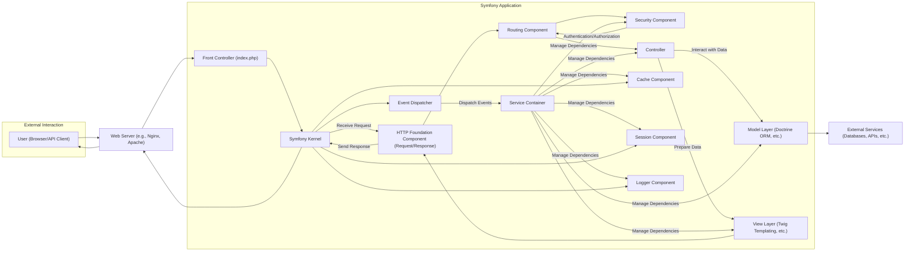
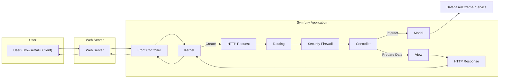

# Project Design Document: Symfony Framework - Improved

**Version:** 2.0
**Date:** October 26, 2023
**Author:** AI Software Architect

## 1. Introduction

This document provides an enhanced architectural design of the Symfony framework, an open-source PHP web framework. This revised document aims to offer a more detailed and structured understanding of the framework's architecture, components, and interactions, specifically tailored for effective threat modeling.

## 2. Goals and Objectives

The primary goals of the Symfony framework remain:

* To provide a robust, flexible, and well-structured foundation for building complex web applications.
* To enforce and promote best practices in web development, notably the Model-View-Controller (MVC) architectural pattern.
* To offer a collection of decoupled and reusable components applicable in various PHP projects.
* To accelerate development through features like code generation, a powerful command-line interface, and a rich ecosystem of bundles (plugins).
* To ensure high performance, scalability, and maintainability of web applications built upon it.
* To prioritize security through built-in features and adherence to secure coding principles.

## 3. High-Level Architecture

The Symfony framework operates on the principle of handling HTTP requests and generating HTTP responses, adhering to the Model-View-Controller (MVC) pattern. The Symfony Kernel is central to managing this lifecycle.

**Explanation of Components:**

* **User (Browser/API Client):** The initiator of requests to the web application, either through a web browser or an API client.
* **Web Server (e.g., Nginx, Apache):**  Receives incoming HTTP requests and directs them to the Symfony application's entry point.
* **Front Controller (index.php):** The initial PHP script executed, responsible for bootstrapping the Symfony Kernel.
* **Symfony Kernel:** The core of the framework, responsible for managing the application lifecycle, handling requests, and orchestrating components.
* **Event Dispatcher:** A central hub for managing application events, allowing components to communicate in a decoupled manner.
* **Service Container:** Manages the instantiation and dependencies of application services, promoting loose coupling and reusability.
* **HTTP Foundation Component (Request/Response):** Provides object-oriented representations of HTTP requests and responses.
* **Routing Component:** Maps incoming HTTP requests to specific controller actions based on defined routes.
* **Security Component:** Handles authentication, authorization, and protection against common web vulnerabilities.
* **Controller:**  Contains the application's business logic for handling specific requests, interacting with the model, and preparing data for the view.
* **Model Layer (Doctrine ORM, etc.):** Represents the data layer, often using an Object-Relational Mapper (ORM) like Doctrine to interact with databases.
* **View Layer (Twig Templating, etc.):** Responsible for rendering the user interface, typically using a templating engine like Twig.
* **Cache Component:** Provides mechanisms for caching data at various levels to improve performance.
* **Session Component:** Manages user session data, including storage and retrieval.
* **Logger Component:** Provides a standardized way to record application events, errors, and debugging information.
* **External Services (Databases, APIs, etc.):** External systems that the Symfony application interacts with, such as databases or third-party APIs.

## 4. Component Breakdown

This section provides a more detailed breakdown of key components, categorized by their primary function:

* **Request Handling & Control Flow:**
    * **`public/index.php` (Front Controller):**  The entry point for all web requests.
    * **`src/Kernel.php` (Application Kernel):** Bootstraps the application, registers services, and handles the request lifecycle.
    * **`config/routes.yaml` / `config/routes/`:** Defines the application's routing rules.
    * **`src/Controller/`:** Contains controller classes responsible for handling specific requests.
    * **`src/EventSubscriber/`:**  Classes that listen for and react to specific events in the application lifecycle.

* **Data Management & Persistence:**
    * **`src/Entity/`:** Defines the data structure (entities) used by the ORM.
    * **`src/Repository/`:** Contains classes responsible for querying and persisting entities using the ORM.
    * **`config/packages/doctrine.yaml`:** Configuration for the Doctrine ORM.
    * **Database (e.g., MySQL, PostgreSQL):** The persistent storage for application data.

* **View & Presentation:**
    * **`templates/`:** Contains Twig template files for rendering HTML and other output formats.
    * **`config/packages/twig.yaml`:** Configuration for the Twig templating engine.
    * **`src/Form/`:** Defines form types for handling user input and data validation.
    * **Assets (CSS, JavaScript, Images in `public/` or using Webpack/Encore):** Static files used for styling and interactivity.

* **Security:**
    * **`config/packages/security.yaml`:** Configuration for the Symfony Security component, including firewalls, providers, and encoders.
    * **`src/Security/`:** Contains custom security-related classes like voters, authenticators, and access decision managers.
    * **Session Storage (configured in `config/packages/framework.yaml`):**  Where user session data is stored.

* **Core Services & Utilities:**
    * **`config/services.yaml`:** Configures the service container and defines application services.
    * **`vendor/symfony/*`:**  The core Symfony components and third-party libraries.
    * **`var/cache/`:**  Directory for storing cached data.
    * **`var/log/`:** Directory for storing application logs.

## 5. Data Flow

A detailed breakdown of the data flow during a typical web request:

1. **User Initiates Request:** A user interacts with the application through their browser or an API client, sending an HTTP request.
2. **Web Server Receives Request:** The web server (e.g., Nginx, Apache) receives the HTTP request.
3. **Front Controller Invoked:** The web server directs the request to the `public/index.php` file.
4. **Kernel Bootstrapping:** `index.php` creates and boots the Symfony Kernel.
5. **Request Object Creation:** The Kernel uses the HTTP Foundation component to create a `Request` object from the incoming HTTP request.
6. **Routing:** The Router component matches the `Request` object's URI to a defined route in the routing configuration.
7. **Security Firewall:** The Security component's firewall intercepts the request to enforce security rules.
    * **Authentication:**  Identifies the user making the request.
    * **Authorization:** Determines if the authenticated user has permission to access the requested resource.
8. **Controller Resolution:** The matched route identifies the specific controller and action to be executed.
9. **Dependency Injection:** The Service Container injects necessary dependencies into the controller.
10. **Business Logic Execution:** The controller action executes the application's business logic.
    * **Model Interaction:** The controller interacts with the Model layer (e.g., using Doctrine) to retrieve or manipulate data.
    * **Data Validation:** Input data might be validated using the Form component.
11. **View Rendering:** The controller passes data to the View layer (e.g., Twig) to render the response content.
12. **Response Object Creation:** The View layer generates the response content, and the HTTP Foundation component creates a `Response` object.
13. **Event Dispatching:**  Events are dispatched throughout the process, allowing other parts of the application to react.
14. **Response Sending:** The Kernel sends the `Response` object back to the web server.
15. **Web Server Sends Response:** The web server sends the HTTP response back to the user's browser or API client.

## 6. Security Considerations (Pre-Threat Model)

Symfony incorporates several security features and promotes secure development practices:

* **Protection against Cross-Site Scripting (XSS):**
    * Twig's automatic output escaping helps prevent the injection of malicious scripts into rendered HTML.
    * Developers are encouraged to use appropriate escaping strategies when handling raw HTML.
* **Protection against Cross-Site Request Forgery (CSRF):**
    * Symfony provides built-in CSRF protection mechanisms for forms, requiring a unique token to validate requests.
* **Protection against SQL Injection:**
    * Doctrine ORM encourages the use of parameterized queries, preventing the direct injection of SQL code.
    * Developers should avoid writing raw SQL queries where possible.
* **Authentication and Authorization:**
    * The Security component provides a flexible and robust system for authenticating users and controlling access to resources.
    * Features include firewalls, user providers, encoders (for password hashing), and access decision voters.
* **Session Management Security:**
    * Secure session handling with options for secure cookies (using the `Secure` and `HttpOnly` flags).
    * Configuration options for session storage mechanisms and cookie lifetimes.
* **Security Headers:**
    * Symfony allows configuration of security-related HTTP headers (e.g., `Content-Security-Policy`, `X-Frame-Options`, `Strict-Transport-Security`) to mitigate various attacks.
* **Input Validation:**
    * The Form component provides tools for defining and enforcing validation rules on user input.
    * Validation helps prevent malformed or malicious data from being processed.
* **Rate Limiting (through third-party bundles or custom implementation):** Can be implemented to protect against brute-force attacks and denial-of-service attempts.
* **Regular Security Audits and Updates:** The Symfony project actively addresses reported security vulnerabilities and releases updates promptly. Security advisories are published for known issues.

## 7. Deployment

Deploying a Symfony application typically involves these steps and considerations:

* **Environment Configuration:** Setting up appropriate environment variables for database credentials, API keys, and other sensitive information. Avoid hardcoding sensitive data.
* **Dependency Management:** Using Composer to install project dependencies on the production environment.
* **Cache Management:** Clearing the application cache after deployment. Consider using a warm-up process for the cache.
* **Asset Management:** Compiling and deploying front-end assets (CSS, JavaScript, images). Tools like Webpack Encore are commonly used.
* **Database Migrations:** Running database migrations to update the schema to the latest version.
* **Web Server Configuration:** Configuring the web server (Nginx or Apache) to correctly serve the application, including setting up virtual hosts and ensuring proper file permissions.
* **PHP-FPM Configuration:** Optimizing PHP-FPM settings for performance and security.
* **Security Hardening:**
    * Ensuring proper file permissions to prevent unauthorized access.
    * Disabling directory listing.
    * Configuring the web server to hide sensitive information.
    * Regularly updating server software and PHP.
* **HTTPS Configuration:** Enforcing HTTPS to encrypt communication between the user and the server.
* **Monitoring and Logging:** Setting up monitoring tools and log aggregation to detect and respond to potential issues.

Common deployment environments include:

* **Traditional Server Deployment:** Deploying directly to physical or virtual servers.
* **Containerization (Docker):** Packaging the application and its dependencies into Docker containers for consistent and reproducible deployments.
* **Platform as a Service (PaaS):** Utilizing platforms like Heroku, Platform.sh, or AWS Elastic Beanstalk for managed infrastructure and deployment workflows.

## 8. Technologies Used

* **Primary Language:** PHP
* **Core Framework:** Symfony
* **Templating Engine:** Twig
* **Object-Relational Mapper (ORM):** Doctrine ORM (default)
* **Dependency Management:** Composer
* **HTTP Server (Common):** Nginx, Apache
* **Database (Common):** MySQL, PostgreSQL, SQLite
* **Caching (Common):** Redis, Memcached, APCu
* **JavaScript Ecosystem (Optional):**  Integration with various front-end frameworks and tools (e.g., React, Vue.js, Webpack/Encore).
* **Testing Frameworks:** PHPUnit, Behat, Symfony Panther

## 9. Future Considerations

* **Continued Evolution of Components:**  Ongoing development and improvement of existing Symfony components and the introduction of new ones.
* **Adoption of Latest PHP Features:**  Leveraging new features and performance improvements in newer PHP versions.
* **Enhanced API Development Capabilities:**  Further improvements to tools and features for building robust and scalable APIs.
* **Improved Developer Experience:**  Focus on making development more efficient and enjoyable through tooling and documentation.
* **Staying Ahead of Security Best Practices:**  Continuously adapting to the evolving security landscape and incorporating new security measures.
* **Integration with Cloud Technologies:**  Strengthening integration with various cloud platforms and services.

This improved design document provides a more detailed and structured overview of the Symfony framework's architecture, specifically tailored for threat modeling purposes. The enhanced component breakdown, data flow description, and security considerations offer a more comprehensive understanding of the system's inner workings and potential vulnerabilities.