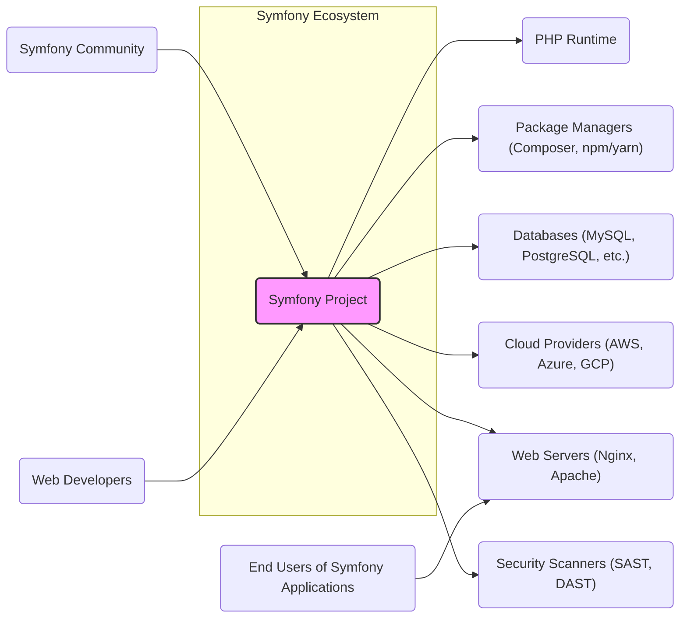
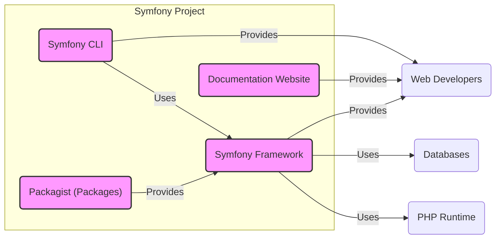
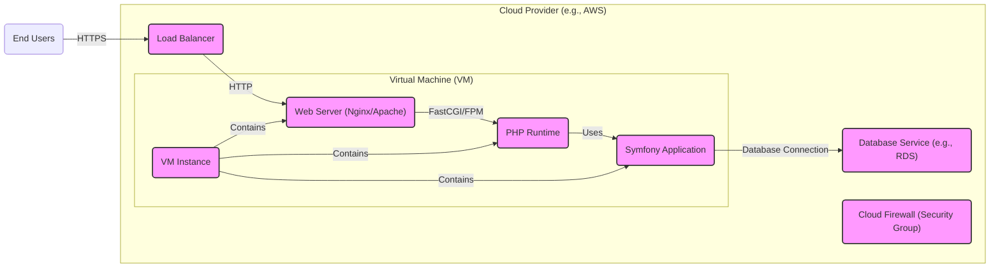
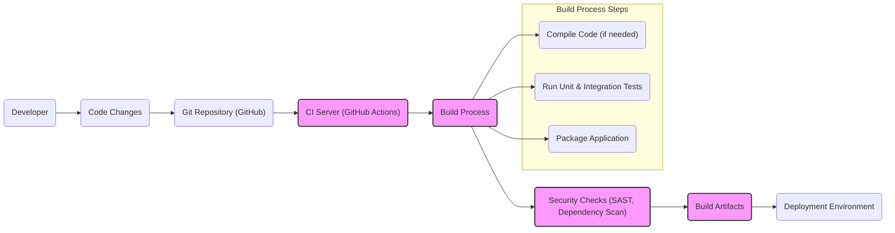

# BUSINESS POSTURE

This project design document outlines the architecture of the Symfony framework, a PHP framework for building web applications and microservices. Understanding the design of Symfony is crucial for organizations considering adopting it, contributing to it, or building applications on top of it.

Business priorities and goals for adopting or using Symfony include:

- Rapid Application Development: Symfony is designed to accelerate the development process through reusable components and a robust set of features.
- Maintainability and Scalability: The framework promotes good coding practices and architectural patterns that lead to maintainable and scalable applications.
- Community Support and Ecosystem: Symfony has a large and active community, providing extensive documentation, support, and a rich ecosystem of bundles (plugins).
- Flexibility and Customization: Symfony is highly flexible and customizable, allowing developers to tailor it to specific project needs.
- Long-Term Support: Symfony provides long-term support (LTS) versions, ensuring stability and security updates for extended periods.

Key business risks associated with using Symfony include:

- Security Vulnerabilities: As with any software framework, Symfony and its dependencies may contain security vulnerabilities that could be exploited.
- Dependency Management: Managing dependencies, especially in a large ecosystem, can introduce risks if not handled properly.
- Complexity: While flexible, Symfony can be complex to learn and configure, potentially leading to misconfigurations or security oversights if not properly understood.
- Open Source Reliance:  Organizations rely on the open-source community for the ongoing maintenance and security of Symfony.

# SECURITY POSTURE

Existing security controls for the Symfony project and applications built with it:

- security control: Symfony Security Component: Provides features for authentication, authorization, and protection against common web vulnerabilities. Implemented within the Symfony framework itself.
- security control: Regular Security Releases: The Symfony project actively monitors for security vulnerabilities and releases security updates promptly. Described in Symfony's security policy and release process.
- security control: Input Validation Features: Symfony provides tools and best practices for input validation to prevent injection attacks. Documented in Symfony's documentation and security guides.
- security control: Cryptography Libraries: Symfony integrates with robust cryptography libraries for secure data handling. Implemented within the Symfony framework.
- security control: Community Security Audits: The large Symfony community acts as a form of continuous security review and vulnerability reporting. Implicitly through community contributions and issue reporting.
- accepted risk: Open Source Vulnerability Disclosure: Security vulnerabilities are publicly disclosed, which could be exploited before patches are applied. Accepted as inherent to open-source development.
- accepted risk: Dependency Vulnerabilities: Vulnerabilities in third-party libraries used by Symfony or applications built with it. Accepted risk that needs to be managed through dependency scanning and updates.

Recommended security controls to enhance the security posture:

- recommended security control: Automated Dependency Scanning: Implement automated tools to scan for vulnerabilities in Symfony's dependencies and application dependencies.
- recommended security control: Static Application Security Testing (SAST): Integrate SAST tools into the development pipeline to identify potential security vulnerabilities in the code.
- recommended security control: Security Code Reviews: Conduct regular security-focused code reviews, especially for critical components and security-sensitive areas.
- recommended security control: Penetration Testing: Perform periodic penetration testing on applications built with Symfony to identify and address security weaknesses.
- recommended security control: Security Training for Developers: Provide security training to developers using Symfony to promote secure coding practices.

Security requirements for projects using Symfony:

- Authentication:
  - Requirement: Securely authenticate users accessing applications built with Symfony.
  - Details: Implement robust authentication mechanisms using Symfony's Security component, supporting various authentication methods (e.g., username/password, multi-factor authentication, OAuth).
- Authorization:
  - Requirement: Enforce granular authorization to control access to resources and functionalities within Symfony applications.
  - Details: Utilize Symfony's authorization features (e.g., access control lists, role-based access control) to define and enforce permissions based on user roles and privileges.
- Input Validation:
  - Requirement: Validate all user inputs to prevent injection attacks and data integrity issues.
  - Details: Implement comprehensive input validation using Symfony's form validation and data sanitization features, ensuring data is validated at multiple layers (client-side and server-side).
- Cryptography:
  - Requirement: Protect sensitive data at rest and in transit using strong cryptography.
  - Details: Employ Symfony's cryptography capabilities to encrypt sensitive data stored in databases or configuration files. Use HTTPS to secure communication between clients and servers.

# DESIGN

## C4 CONTEXT

Context Diagram Elements:

- Element:
  - Name: Symfony Project
  - Type: Software System
  - Description: The Symfony PHP framework, providing a set of reusable components and tools for building web applications and microservices.
  - Responsibilities: Provides the core framework functionalities, components, and tools for web development. Manages security vulnerabilities and releases updates.
  - Security controls: Security component, regular security releases, input validation features, cryptography libraries.

- Element:
  - Name: Web Developers
  - Type: User
  - Description: Developers who use Symfony to build web applications.
  - Responsibilities: Develop, maintain, and deploy applications using Symfony. Adhere to secure coding practices.
  - Security controls: Secure coding practices, using security features of Symfony, code reviews.

- Element:
  - Name: End Users of Symfony Applications
  - Type: User
  - Description: Users who interact with web applications built using Symfony.
  - Responsibilities: Use applications as intended. Report security issues if discovered.
  - Security controls: Strong passwords, awareness of phishing and social engineering.

- Element:
  - Name: Symfony Community
  - Type: User Group
  - Description:  A global community of developers, contributors, and users of Symfony.
  - Responsibilities: Contribute to the development of Symfony, report bugs and security vulnerabilities, provide support and documentation.
  - Security controls: Responsible disclosure of vulnerabilities, code contributions undergo review process.

- Element:
  - Name: PHP Runtime
  - Type: Software System
  - Description: The PHP runtime environment required to execute Symfony applications.
  - Responsibilities: Execute PHP code, manage resources, provide core functionalities for web applications.
  - Security controls: PHP security updates, secure PHP configuration.

- Element:
  - Name: Databases (MySQL, PostgreSQL, etc.)
  - Type: Software System
  - Description: Database systems used by Symfony applications to store and retrieve data.
  - Responsibilities: Store application data securely and reliably. Provide data access to Symfony applications.
  - Security controls: Database access controls, encryption at rest, regular backups, security patching.

- Element:
  - Name: Web Servers (Nginx, Apache)
  - Type: Software System
  - Description: Web servers that host and serve Symfony applications.
  - Responsibilities: Serve web pages and application resources to end users. Handle HTTP requests and responses.
  - Security controls: Web server hardening, HTTPS configuration, access controls, security patching.

- Element:
  - Name: Package Managers (Composer, npm/yarn)
  - Type: Software System
  - Description: Tools used to manage dependencies for Symfony projects and applications.
  - Responsibilities: Download and install required libraries and packages. Manage project dependencies.
  - Security controls: Using trusted package repositories, dependency vulnerability scanning.

- Element:
  - Name: Cloud Providers (AWS, Azure, GCP)
  - Type: Infrastructure
  - Description: Cloud platforms that can host Symfony applications and infrastructure.
  - Responsibilities: Provide infrastructure resources (servers, databases, networking). Ensure infrastructure security and availability.
  - Security controls: Cloud provider security controls (firewalls, IAM, encryption), infrastructure security hardening.

- Element:
  - Name: Security Scanners (SAST, DAST)
  - Type: Software System
  - Description: Security scanning tools used to identify vulnerabilities in Symfony code and applications.
  - Responsibilities: Automatically scan code for security weaknesses. Report identified vulnerabilities.
  - Security controls: Configuration and maintenance of security scanning tools, integration into development pipeline.

## C4 CONTAINER

Container Diagram Elements:

- Element:
  - Name: Symfony Framework
  - Type: Container - PHP Library
  - Description: The core Symfony framework, consisting of reusable components, libraries, and the kernel. Provides the foundation for building web applications.
  - Responsibilities: Provides core functionalities like routing, templating, security, forms, and more. Manages application lifecycle.
  - Security controls: Security component, input validation features, cryptography libraries, regular security updates, code review process.

- Element:
  - Name: Symfony CLI
  - Type: Container - Command Line Interface
  - Description: A command-line tool that provides utilities for creating, developing, and managing Symfony projects.
  - Responsibilities: Project scaffolding, server management, code generation, debugging tools.
  - Security controls: Secure handling of credentials, secure updates of the CLI tool itself.

- Element:
  - Name: Documentation Website
  - Type: Container - Web Application
  - Description: The official Symfony documentation website, providing guides, tutorials, and API documentation.
  - Responsibilities: Provide comprehensive documentation for Symfony. Ensure documentation is accurate and up-to-date.
  - Security controls: Web application security best practices, input validation, access controls, regular security updates.

- Element:
  - Name: Packagist (Packages)
  - Type: Container - Package Repository
  - Description: The primary package repository for PHP packages, including Symfony bundles and components.
  - Responsibilities: Host and distribute PHP packages. Ensure package integrity and availability.
  - Security controls: Package signing, malware scanning, access controls, secure infrastructure.

## DEPLOYMENT

Deployment Architecture: Cloud Virtual Machine (VM)

Deployment Diagram Elements (Cloud VM Deployment):

- Element:
  - Name: Cloud Firewall (Security Group)
  - Type: Infrastructure - Network Security
  - Description: Cloud provider's firewall service to control network traffic to the VM instance.
  - Responsibilities: Filter network traffic based on defined rules. Protect the VM from unauthorized access.
  - Security controls: Network access control lists (ACLs), restricting inbound and outbound traffic to necessary ports and protocols.

- Element:
  - Name: Load Balancer
  - Type: Infrastructure - Network Load Balancer
  - Description: Distributes incoming traffic across multiple VM instances (if scaled horizontally). Provides high availability and scalability.
  - Responsibilities: Distribute traffic, health checks, SSL termination.
  - Security controls: SSL/TLS encryption, protection against DDoS attacks, access logs.

- Element:
  - Name: VM Instance
  - Type: Infrastructure - Virtual Machine
  - Description: A virtual machine instance in the cloud environment hosting the web server, PHP runtime, and Symfony application.
  - Responsibilities: Run the application components. Provide compute resources.
  - Security controls: Operating system hardening, security patching, access controls, monitoring.

- Element:
  - Name: Web Server (Nginx/Apache)
  - Type: Software - Web Server
  - Description: Web server software responsible for handling HTTP requests and serving the Symfony application.
  - Responsibilities: Serve static files, proxy requests to PHP runtime, handle HTTP traffic.
  - Security controls: Web server hardening, HTTPS configuration, access controls, security modules (e.g., mod_security).

- Element:
  - Name: PHP Runtime
  - Type: Software - Runtime Environment
  - Description: The PHP runtime environment executing the Symfony application code.
  - Responsibilities: Execute PHP code, manage resources for the application.
  - Security controls: Secure PHP configuration, security extensions, regular PHP updates.

- Element:
  - Name: Symfony Application
  - Type: Software - Web Application
  - Description: The deployed Symfony application code.
  - Responsibilities: Implement application logic, handle user requests, interact with the database.
  - Security controls: Symfony security features, input validation, authorization, secure coding practices.

- Element:
  - Name: Database Service (e.g., RDS)
  - Type: Infrastructure - Managed Database
  - Description: A managed database service provided by the cloud provider, used by the Symfony application.
  - Responsibilities: Store and manage application data. Ensure data availability and durability.
  - Security controls: Database access controls, encryption at rest and in transit, regular backups, security patching provided by the cloud provider.

## BUILD

Build Process Diagram:

Build Process Description:

1. Developer makes code changes and commits them to a Git repository (e.g., GitHub).
2. A CI server (e.g., GitHub Actions, Jenkins) is triggered by code changes pushed to the repository.
3. The CI server initiates the build process, which typically includes:
    - Compiling code (if necessary for certain Symfony application setups, though PHP is generally interpreted).
    - Running unit and integration tests to ensure code quality and functionality.
    - Packaging the application into deployable artifacts (e.g., a compressed archive or Docker image).
4. Security checks are performed during the build process:
    - Static Application Security Testing (SAST) tools scan the code for potential vulnerabilities.
    - Dependency scanning tools check for known vulnerabilities in project dependencies (using Composer's `require-dev` and production dependencies).
5. If security checks pass and tests are successful, build artifacts are created.
6. Build artifacts are then deployed to the target deployment environment (e.g., cloud VM, containers).

Security Controls in Build Process:

- security control: Automated Build Process (CI/CD): Automates the build and deployment process, reducing manual errors and ensuring consistency. Implemented using CI/CD tools like GitHub Actions.
- security control: Static Application Security Testing (SAST): Integrated into the CI pipeline to automatically scan code for vulnerabilities. Implemented as part of the 'Security Checks' step.
- security control: Dependency Scanning: Automated scanning of project dependencies for known vulnerabilities. Implemented as part of the 'Security Checks' step, using tools like `composer audit`.
- security control: Code Linting and Style Checks: Enforces coding standards and identifies potential code quality issues. Implemented as part of the 'Build Process' step.
- security control: Unit and Integration Tests: Ensures code functionality and reduces the likelihood of introducing bugs, including security-related bugs. Implemented as part of the 'Build Process' step.
- security control: Secure Build Environment:  Ensuring the CI/CD environment itself is secure, with access controls and regular updates. Implemented by securing the CI/CD infrastructure.
- security control: Artifact Signing (optional): Signing build artifacts to ensure integrity and authenticity. Can be implemented as part of the 'Build Artifacts' step.

# RISK ASSESSMENT

Critical business process being protected: Development and operation of web applications built with Symfony. Ensuring the framework itself is secure and reliable for developers to use.

Data being protected and sensitivity:

- Symfony Framework Source Code: High sensitivity. Confidentiality and integrity are crucial to prevent unauthorized modifications or exposure of vulnerabilities.
- Applications Built with Symfony: Sensitivity depends on the application. User data, business logic, and configuration data within applications can be highly sensitive and require strong protection.
- Symfony Documentation: Medium sensitivity. Integrity is important to ensure accurate and safe guidance for developers.
- Packagist Packages: Medium sensitivity. Integrity is crucial to prevent supply chain attacks through malicious packages.

# QUESTIONS & ASSUMPTIONS

Questions:

- What is the specific context for this design document? Is it for evaluating Symfony for a new project, contributing to Symfony, or securing an existing Symfony application?
- What are the specific security concerns and priorities for the organization using or considering Symfony?
- What is the risk appetite of the organization? Are they more risk-averse or willing to accept certain levels of risk for faster development or innovation?
- Are there any existing security policies or standards that need to be considered when using Symfony?

Assumptions:

- BUSINESS POSTURE: It is assumed that the organization values rapid development, maintainability, and security when choosing a web framework like Symfony.
- SECURITY POSTURE: It is assumed that security is a significant concern, and the organization is looking to understand and mitigate security risks associated with using Symfony. It is assumed that basic security controls like using HTTPS and input validation are already considered important.
- DESIGN: The design document assumes a typical web application architecture using Symfony, with common components like web servers, databases, and cloud infrastructure. The deployment example focuses on a cloud VM-based deployment, but other deployment models are possible. The build process assumes a modern CI/CD pipeline is used for development.