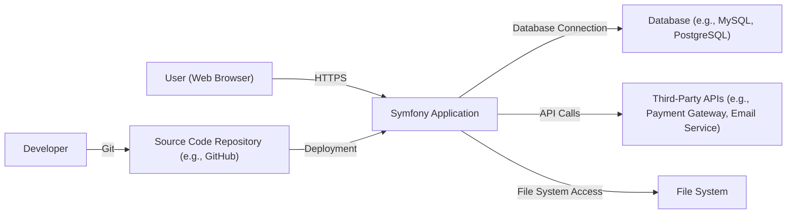
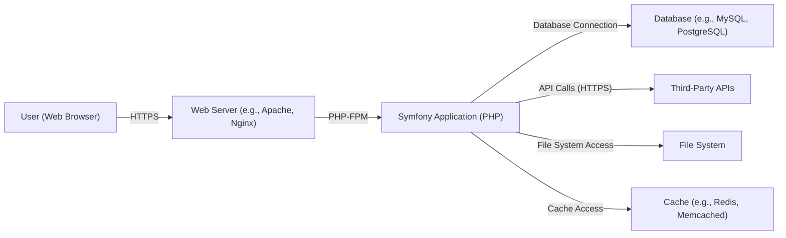
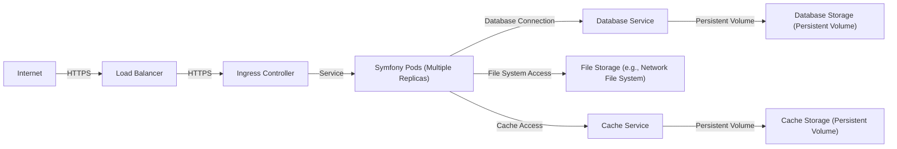
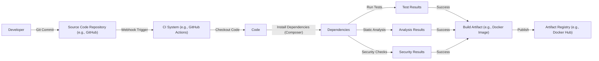

Okay, let's create a design document for the Symfony project, keeping in mind its purpose and potential security considerations.

# BUSINESS POSTURE

Symfony is a widely-used, mature PHP framework for building web applications and APIs.  It's a foundational component for many businesses, from small startups to large enterprises.

Priorities and Goals:

*   Provide a robust, flexible, and performant framework for building web applications.
*   Maintain a large and active community of developers and contributors.
*   Ensure long-term maintainability and stability of the framework.
*   Enable developers to build secure applications by providing secure defaults and tools.
*   Facilitate rapid development and deployment of web applications.

Business Risks:

*   Vulnerabilities in the framework could lead to widespread exploitation of applications built upon it. This is the most critical risk, given Symfony's widespread use.
*   Loss of community trust due to security issues or poor maintenance could lead to a decline in adoption.
*   Inability to adapt to evolving web standards and security threats could render the framework obsolete.
*   Complexity of the framework could hinder developer productivity and increase the likelihood of errors.
*   Lack of backward compatibility in new releases could disrupt existing applications.

# SECURITY POSTURE

Symfony has a well-established security model and a dedicated security team. They follow a responsible disclosure process and have a history of addressing vulnerabilities promptly.

Existing Security Controls:

*   security control: Input Validation: Symfony provides robust mechanisms for validating user input, including form validation, data sanitization, and escaping output to prevent Cross-Site Scripting (XSS) attacks. (Described in Symfony documentation and implemented throughout the framework's components).
*   security control: Authentication and Authorization: Symfony's Security component provides a comprehensive system for managing user authentication and authorization, including support for various authentication methods (e.g., form login, API keys, OAuth) and role-based access control. (Described in Symfony documentation and implemented in the Security component).
*   security control: CSRF Protection: Symfony automatically generates and validates CSRF tokens for forms, protecting against Cross-Site Request Forgery attacks. (Described in Symfony documentation and implemented in the Form component).
*   security control: Session Management: Symfony provides secure session management, including options for configuring session storage, cookie security, and session hijacking prevention. (Described in Symfony documentation and implemented in the HttpFoundation component).
*   security control: Dependency Management: Symfony uses Composer for dependency management, allowing developers to easily update dependencies and address known vulnerabilities in third-party libraries. (Described in Symfony documentation and implemented through Composer integration).
*   security control: Security Advisories: Symfony publishes security advisories for any discovered vulnerabilities and provides patches promptly. (Publicly available on the Symfony website and security mailing list).
*   security control: Secure Coding Practices: The Symfony core team follows secure coding practices and conducts regular security reviews. (Evident in the codebase and development process).
*   security control: Escaping: Symfony's templating engine (Twig) automatically escapes output by default, mitigating XSS vulnerabilities. (Described in Twig documentation and implemented in the Twig component).
*   security control: Parameterized Queries: Symfony's Doctrine ORM uses parameterized queries to prevent SQL injection vulnerabilities. (Described in Doctrine documentation and implemented in the Doctrine component).

Accepted Risks:

*   accepted risk: Reliance on Third-Party Libraries: While Symfony manages dependencies, there's an inherent risk associated with relying on external libraries. Vulnerabilities in these libraries could impact Symfony applications.
*   accepted risk: Developer Error: Even with secure defaults and tools, developers can still introduce vulnerabilities into their applications through coding errors or misconfiguration.
*   accepted risk: Zero-Day Vulnerabilities: There's always a risk of undiscovered vulnerabilities (zero-days) in any software, including Symfony.

Recommended Security Controls:

*   Implement Content Security Policy (CSP): Encourage the use of CSP headers to mitigate the impact of XSS and other code injection attacks.
*   Implement Subresource Integrity (SRI): Encourage the use of SRI to ensure that fetched resources (e.g., JavaScript files) haven't been tampered with.
*   Regular Security Audits: Encourage regular security audits of applications built with Symfony, including penetration testing and code reviews.

Security Requirements:

*   Authentication:
    *   Support for strong password hashing algorithms (e.g., bcrypt, Argon2).
    *   Secure storage of user credentials.
    *   Protection against brute-force attacks.
    *   Multi-factor authentication (MFA) support.
*   Authorization:
    *   Fine-grained access control mechanisms.
    *   Role-based access control (RBAC).
    *   Ability to define custom permissions and access rules.
*   Input Validation:
    *   Strict validation of all user input.
    *   Whitelisting of allowed characters and data types.
    *   Sanitization of input to remove potentially harmful characters.
*   Cryptography:
    *   Use of strong cryptographic algorithms for encryption and hashing.
    *   Secure key management practices.
    *   Protection of sensitive data in transit and at rest.
    *   Avoidance of deprecated or weak cryptographic algorithms.

# DESIGN

## C4 CONTEXT

Context Diagram Element List:

*   Element:
    *   Name: User
    *   Type: Person
    *   Description: A user interacting with the Symfony application through a web browser.
    *   Responsibilities: Accessing the application, providing input, and receiving output.
    *   Security controls: Browser security features (e.g., same-origin policy, HTTPS).

*   Element:
    *   Name: Symfony Application
    *   Type: Software System
    *   Description: The web application built using the Symfony framework.
    *   Responsibilities: Handling user requests, processing data, interacting with other systems, and generating responses.
    *   Security controls: Input validation, authentication, authorization, CSRF protection, session management, output escaping, parameterized queries.

*   Element:
    *   Name: Database
    *   Type: Database
    *   Description: The database used by the Symfony application to store data.
    *   Responsibilities: Storing and retrieving data.
    *   Security controls: Database access controls, encryption at rest, parameterized queries (implemented in Symfony application).

*   Element:
    *   Name: Third-Party APIs
    *   Type: Software System
    *   Description: External APIs used by the Symfony application (e.g., payment gateways, email services).
    *   Responsibilities: Providing specific services to the Symfony application.
    *   Security controls: API authentication, authorization, encryption in transit (HTTPS).

*   Element:
    *   Name: File System
    *   Type: File System
    *   Description: The file system used by the Symfony application to store files (e.g., uploads, logs).
    *   Responsibilities: Storing and retrieving files.
    *   Security controls: File system permissions, secure file storage practices.

*   Element:
    *   Name: Developer
    *   Type: Person
    *   Description: A developer working on the Symfony application.
    *   Responsibilities: Writing code, managing the codebase, deploying the application.
    *   Security controls: Secure coding practices, access controls to the source code repository.

*   Element:
    *   Name: Source Code Repository
    *   Type: Software System
    *   Description: The repository where the Symfony application's source code is stored (e.g., GitHub).
    *   Responsibilities: Version control, code collaboration.
    *   Security controls: Access controls, branch protection rules, code review processes.

## C4 CONTAINER

Container Diagram Element List:

*   Element:
    *   Name: User
    *   Type: Person
    *   Description: A user interacting with the Symfony application through a web browser.
    *   Responsibilities: Accessing the application, providing input, and receiving output.
    *   Security controls: Browser security features (e.g., same-origin policy, HTTPS).

*   Element:
    *   Name: Web Server
    *   Type: Container (Software)
    *   Description: The web server (e.g., Apache, Nginx) that receives requests from users and forwards them to the Symfony application.
    *   Responsibilities: Handling HTTP requests, serving static content, and routing requests to the appropriate application server.
    *   Security controls: Web server configuration hardening, TLS/SSL configuration, access controls.

*   Element:
    *   Name: Symfony Application
    *   Type: Container (PHP Application)
    *   Description: The Symfony application, running as a PHP process (typically using PHP-FPM).
    *   Responsibilities: Handling user requests, processing data, interacting with other systems, and generating responses.
    *   Security controls: Input validation, authentication, authorization, CSRF protection, session management, output escaping, parameterized queries.

*   Element:
    *   Name: Database
    *   Type: Container (Database)
    *   Description: The database used by the Symfony application to store data.
    *   Responsibilities: Storing and retrieving data.
    *   Security controls: Database access controls, encryption at rest, parameterized queries (implemented in Symfony application).

*   Element:
    *   Name: Third-Party APIs
    *   Type: Software System
    *   Description: External APIs used by the Symfony application.
    *   Responsibilities: Providing specific services to the Symfony application.
    *   Security controls: API authentication, authorization, encryption in transit (HTTPS).

*   Element:
    *   Name: File System
    *   Type: File System
    *   Description: The file system used by the Symfony application.
    *   Responsibilities: Storing and retrieving files.
    *   Security controls: File system permissions, secure file storage practices.

*   Element:
    *   Name: Cache
    *   Type: Container (Cache Server)
    *   Description: A caching server (e.g., Redis, Memcached) used to improve performance.
    *   Responsibilities: Storing and retrieving frequently accessed data.
    *   Security controls: Cache access controls, data validation.

## DEPLOYMENT

Symfony applications can be deployed in various ways, including:

1.  Traditional Server Deployment: Deploying the application to a physical or virtual server running a web server (e.g., Apache, Nginx) and PHP-FPM.
2.  Cloud Platform Deployment: Deploying the application to a cloud platform (e.g., AWS, Google Cloud, Azure) using services like virtual machines, container services (e.g., Kubernetes, Docker Swarm), or serverless functions.
3.  Platform-as-a-Service (PaaS) Deployment: Deploying the application to a PaaS provider (e.g., Heroku, Platform.sh) that handles the underlying infrastructure.

We'll describe a Cloud Platform Deployment using Kubernetes:

Deployment Diagram Element List:

*   Element:
    *   Name: Internet
    *   Type: Network
    *   Description: The public internet.
    *   Responsibilities: Routing traffic to the load balancer.
    *   Security controls: Network firewalls, DDoS protection.

*   Element:
    *   Name: Load Balancer
    *   Type: Infrastructure Node
    *   Description: A load balancer that distributes traffic across multiple instances of the application.
    *   Responsibilities: Distributing traffic, health checks.
    *   Security controls: TLS/SSL termination, access controls.

*   Element:
    *   Name: Ingress Controller
    *   Type: Infrastructure Node
    *   Description: An Ingress controller that manages external access to the services in the Kubernetes cluster.
    *   Responsibilities: Routing traffic to the correct services, TLS/SSL termination.
    *   Security controls: Access controls, TLS/SSL configuration.

*   Element:
    *   Name: Symfony Pods
    *   Type: Container Instance
    *   Description: Multiple instances of the Symfony application running in Kubernetes pods.
    *   Responsibilities: Handling user requests, processing data.
    *   Security controls: Container security best practices, network policies.

*   Element:
    *   Name: Database Service
    *   Type: Kubernetes Service
    *   Description: A Kubernetes service that provides a stable endpoint for accessing the database.
    *   Responsibilities: Routing traffic to the database.
    *   Security controls: Network policies.

*   Element:
    *   Name: Database Storage
    *   Type: Persistent Volume
    *   Description: Persistent storage for the database.
    *   Responsibilities: Storing database data.
    *   Security controls: Encryption at rest, access controls.

*   Element:
    *   Name: File Storage
    *   Type: Network File System
    *   Description: Shared file storage for the Symfony application (e.g., for uploads).
    *   Responsibilities: Storing files.
    *   Security controls: Access controls, file system permissions.

*   Element:
    *   Name: Cache Service
    *   Type: Kubernetes Service
    *   Description: A Kubernetes service that provides a stable endpoint for accessing the cache.
    *   Responsibilities: Routing traffic to the cache.
    *   Security controls: Network policies.

*   Element:
    *   Name: Cache Storage
    *   Type: Persistent Volume
    *   Description: Persistent storage for the cache.
    *   Responsibilities: Storing cached data.
    *   Security controls: Access controls.

## BUILD

Symfony's build process typically involves the following steps:

1.  Developer writes code and commits it to a Git repository (e.g., GitHub).
2.  A Continuous Integration (CI) system (e.g., GitHub Actions, Travis CI, CircleCI) is triggered by the commit.
3.  The CI system checks out the code.
4.  The CI system installs dependencies using Composer.
5.  The CI system runs tests (unit tests, integration tests, etc.).
6.  The CI system may perform static analysis (e.g., using PHPStan, Psalm) to detect potential errors and code quality issues.
7.  The CI system may run security checks (e.g., using Symfony's security checker, SensioLabs Security Checker).
8.  If all tests and checks pass, the CI system may build a deployment artifact (e.g., a Docker image, a ZIP archive).
9.  The deployment artifact is published to a registry (e.g., Docker Hub, a private artifact repository).

Build Process Security Controls:

*   security control: Dependency Management: Using Composer to manage dependencies and ensure that known vulnerable libraries are not used.
*   security control: Static Analysis: Using static analysis tools to detect potential code quality issues and security vulnerabilities.
*   security control: Security Checks: Using security checkers to identify known vulnerabilities in the application and its dependencies.
*   security control: Automated Testing: Running automated tests to ensure that the application is functioning correctly and that security controls are working as expected.
*   security control: Least Privilege: Running the CI system with the least privilege necessary to perform its tasks.
*   security control: Secure Build Environment: Ensuring that the CI system is running in a secure environment.
*   security control: Artifact Signing: Signing build artifacts to ensure their integrity.

# RISK ASSESSMENT

Critical Business Processes:

*   User authentication and authorization.
*   Data processing and storage.
*   Interaction with third-party APIs.
*   Serving web content.

Data Sensitivity:

*   User credentials (passwords, API keys): Highly sensitive.
*   Personal data (names, email addresses, etc.): Sensitive, subject to privacy regulations (e.g., GDPR).
*   Financial data (payment information): Highly sensitive, subject to PCI DSS compliance.
*   Application data: Sensitivity varies depending on the specific application.
*   Configuration data: Potentially sensitive, could expose vulnerabilities if leaked.

# QUESTIONS & ASSUMPTIONS

Questions:

*   Are there any specific compliance requirements (e.g., GDPR, PCI DSS, HIPAA) that the Symfony applications built need to adhere to?
*   What is the expected scale of the Symfony applications (number of users, traffic volume)?
*   What are the specific third-party APIs that the Symfony applications will interact with?
*   What are the specific deployment environments that will be used?
*   What is the process for handling security incidents?

Assumptions:

*   BUSINESS POSTURE: The Symfony project prioritizes security and follows best practices for secure software development.
*   SECURITY POSTURE: Developers using Symfony are aware of common web security vulnerabilities and take steps to mitigate them.
*   DESIGN: The Symfony application will be deployed to a secure environment with appropriate network and access controls. The application will use secure communication protocols (e.g., HTTPS) for all sensitive data transmission.