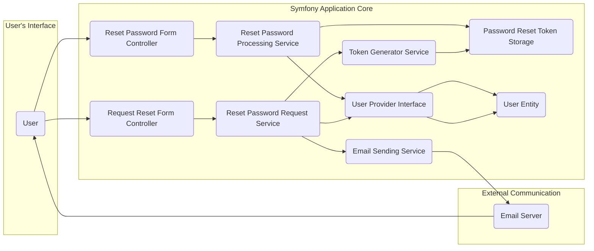
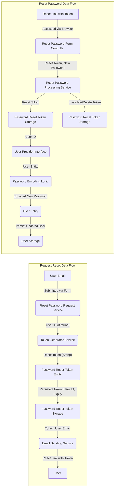

# Project Design Document: Symfony Reset Password Bundle

**Version:** 1.1
**Date:** October 26, 2023
**Author:** AI Software Architect

## 1. Introduction

This document provides an enhanced design specification for the Symfony Reset Password Bundle, a crucial component facilitating secure password recovery for users within a Symfony application. This detailed design serves as a comprehensive blueprint for understanding the bundle's architecture, individual components, and the intricate flow of data during the password reset process. It is specifically crafted to serve as the foundation for thorough threat modeling exercises.

## 2. Goals

* Provide a robust and user-centric mechanism for users to securely reset their forgotten passwords.
* Ensure seamless integration with Symfony's established security component, authentication mechanisms, and user management infrastructure.
* Offer extensive customization options for email templates, allowing branding and tailored messaging, and configurable token expiration durations to balance security and user convenience.
* Proactively mitigate common password reset vulnerabilities, including brute-force attacks targeting the reset request mechanism and attempts to reuse already utilized reset tokens.
* Present a well-defined, intuitive, and thoroughly documented API for developers to easily integrate and extend the bundle's functionality.

## 3. Non-Goals

* Implementing advanced or alternative authentication factors, such as multi-factor authentication (MFA), directly within the password reset flow.
* Providing a complete, standalone user management system. The bundle's scope is strictly limited to the password reset functionality.
* Addressing account recovery scenarios beyond password resets, such as username recovery or account unlocking due to other issues.
* Offering direct, out-of-the-box integration with third-party password management services or identity providers.

## 4. Architecture Overview

The Reset Password Bundle orchestrates a series of interactions involving the user, the application, and external services to enable password resets. The core components and their relationships are illustrated below:

**Component Descriptions:**

*   **User:** The individual initiating the password reset process through their web browser or other client application.
*   **Request Reset Form Controller:**  A Symfony controller responsible for rendering the "forgot password" form and handling the initial submission of the user's email address.
*   **Reset Password Request Service:** A dedicated service that encapsulates the core logic for processing password reset requests. This includes validating the input, retrieving the user, generating the reset token, persisting it, and triggering the email sending process.
*   **Token Generator Service:** A service specifically designed to generate cryptographically secure, unique, and time-limited reset tokens. This service should adhere to best practices for random number generation.
*   **Password Reset Token Storage:** An abstraction layer (likely an interface with Doctrine ORM implementations) responsible for persisting and retrieving password reset tokens. This typically involves a database entity with fields for the token, associated user, expiry timestamp, and potentially a usage flag.
*   **Email Sending Service:** The application's configured service for sending emails. This service handles the actual delivery of the password reset link to the user's email address.
*   **Reset Password Form Controller:** A Symfony controller responsible for rendering the form where the user enters their new password after clicking the reset link and for handling the submission of this new password.
*   **Reset Password Processing Service:** A dedicated service responsible for validating the reset token received from the user, verifying its validity and expiration, updating the user's password securely, and invalidating the used token.
*   **User Provider Interface:** Symfony's interface for retrieving user information from the application's data store based on identifiers like email address or username.
*   **User Entity:** The application's representation of a user, containing their authentication credentials (including the encoded password) and other relevant user data.
*   **Email Server:** The external service responsible for receiving and delivering the password reset email.

## 5. Detailed Design

The password reset functionality is implemented through two distinct workflows: the initial request for a password reset and the subsequent process of resetting the password using the provided token.

### 5.1. Requesting a Password Reset

1. The **User** navigates to the "forgot password" page, typically accessed via a link on the login form, and submits their email address through the **Request Reset Form Controller**.
2. The **Request Reset Form Controller** receives the email address and passes it to the **Reset Password Request Service**.
3. The **Reset Password Request Service** utilizes the **User Provider Interface** to query for the **User Entity** associated with the provided email address.
4. If a matching **User Entity** is found:
    *   The **Token Generator Service** generates a unique, cryptographically secure reset token with a predefined expiration period.
    *   A new **Password Reset Token** entity is created, linking the generated token to the corresponding **User Entity** and setting the expiration timestamp.
    *   The newly created **Password Reset Token** is persisted in the database using the **Password Reset Token Storage**.
    *   The **Email Sending Service** is invoked to send an **Email** to the user's provided email address. This email contains a specially crafted link that includes the generated reset token as a parameter.
5. To prevent email enumeration vulnerabilities, if no user is found for the provided email address, the process should still return a generic success message to the user interface, avoiding explicit indication of whether the email exists in the system. No email is sent in this scenario.

### 5.2. Resetting the Password

1. The **User** clicks on the password reset link received in the **Email**. This link directs the user's browser to a specific route in the application, handled by the **Reset Password Form Controller**, with the reset token included in the URL.
2. The **Reset Password Form Controller** receives the request and displays the password reset form to the **User**, potentially after verifying the basic structure of the token.
3. The **User** enters their desired new password and submits the form to the **Reset Password Form Controller**.
4. The **Reset Password Form Controller** forwards the submitted data, including the reset token and the new password, to the **Reset Password Processing Service**.
5. The **Reset Password Processing Service** retrieves the corresponding **Password Reset Token** from the **Password Reset Token Storage** using the provided token.
6. The service performs crucial validation checks on the retrieved token:
    *   Verifies that a token with the given value exists in the storage.
    *   Confirms that the token has not yet expired by comparing the current time with the token's expiration timestamp.
7. If the token is valid and unexpired:
    *   The **Reset Password Processing Service** retrieves the associated **User Entity** using the relationship defined in the **Password Reset Token**.
    *   The user's password is updated securely. This typically involves encoding the new plain-text password using Symfony's password encoder and setting the encoded value on the **User Entity**.
    *   The updated **User Entity** is persisted back to the database.
    *   To prevent the token from being used again, the **Password Reset Token** is either deleted from the **Password Reset Token Storage** or marked as used (e.g., by setting a `usedAt` timestamp).
    *   The **User** is typically redirected to a success confirmation page or automatically logged into the application.
8. If the token is invalid (does not exist or has expired), the **Reset Password Processing Service** informs the user, and an appropriate error message is displayed.

## 6. Data Flow

The following diagrams illustrate the movement of key data elements during both the password reset request and the password reset execution phases:

**Key Data Elements:**

*   **User Email:** The email address provided by the user to initiate the reset.
*   **User ID:** The unique identifier of the user account.
*   **Reset Token (String):** The randomly generated, unique string representing the reset token.
*   **Password Reset Token Entity:** The database entity holding the reset token, associated user, and expiration details.
*   **Expiry Timestamp:** The date and time after which the reset token is no longer valid.
*   **Reset Link with Token:** The URL sent to the user containing the reset token as a query parameter.
*   **New Password (Plain Text):** The new password entered by the user on the reset form.
*   **Encoded New Password:** The securely hashed and salted version of the new password.

## 7. Security Considerations

Security is paramount in the design of the Reset Password Bundle. The following considerations are crucial for mitigating potential threats:

*   **Token Generation Security:**
    *   Reset tokens must be generated using a cryptographically secure pseudo-random number generator (CSPRNG).
    *   The generated tokens should have sufficient length to prevent brute-force guessing attempts. A minimum of 32 characters is recommended.
    *   Consider incorporating a salt or other entropy sources into the token generation process.
*   **Secure Token Storage:**
    *   Reset tokens should be stored securely in the database. While the tokens themselves are designed to be unguessable, protecting the database is essential.
    *   Use appropriate database security measures, including access controls and encryption at rest.
    *   Index the token column in the database for efficient lookup during the reset process.
*   **Token Expiration Management:**
    *   Implement a mandatory expiration period for reset tokens. This limits the window of opportunity for attackers to exploit compromised tokens.
    *   The expiration time should be configurable but have a reasonable default (e.g., 15-60 minutes).
*   **Single-Use Tokens:**
    *   Ensure that each reset token can be used only once. Upon successful password reset, the token should be immediately invalidated or deleted to prevent reuse in replay attacks.
*   **Secure Email Transmission:**
    *   All communication related to the password reset process, especially the email containing the reset link, must be transmitted over HTTPS to prevent eavesdropping and man-in-the-middle attacks.
    *   Configure the email sending service to use TLS encryption.
*   **Rate Limiting on Reset Requests:**
    *   Implement rate limiting on the "request password reset" endpoint to prevent attackers from repeatedly requesting password resets for numerous email addresses in an attempt to enumerate valid accounts or overwhelm the system.
    *   Consider using techniques like CAPTCHA or account lockout after multiple failed attempts.
*   **Preventing Email Enumeration:**
    *   Avoid explicitly disclosing whether an email address exists in the system during the reset request process. Regardless of whether a user is found, provide a generic success message to the user.
*   **Protection Against Clickjacking Attacks:**
    *   Implement appropriate HTTP headers, such as `X-Frame-Options` and `Content-Security-Policy`, to prevent the password reset form from being embedded in malicious websites.
*   **Logging and Monitoring:**
    *   Log all password reset requests (both successful and failed attempts), including timestamps and user identifiers (if available). This can help in detecting suspicious activity.
    *   Monitor for unusual patterns, such as a high volume of reset requests from a single IP address or for non-existent email addresses.

## 8. Deployment Considerations

*   **Database Configuration:** The bundle requires a correctly configured database connection to store and manage password reset tokens. Ensure the database user has the necessary permissions.
*   **Email Service Configuration:** A properly configured email sending service (e.g., using Symfony Mailer) is essential for sending password reset emails. This includes setting up SMTP credentials or using an email provider.
*   **Secret Key Management:** Ensure the application's `secret` parameter in Symfony's configuration is securely managed. This key might be used in token generation or other security-sensitive operations.
*   **Environment Variables:** Utilize environment variables to manage sensitive configuration settings, such as email credentials and potentially token expiration times, instead of hardcoding them.
*   **Scalability:** Consider the scalability of the token storage mechanism if the application anticipates a high volume of password reset requests. Choose a database and storage strategy that can handle the expected load.

## 9. Future Considerations

*   **Customizable Token Generation Strategies:** Allow developers to plug in custom token generation logic, potentially using different hashing algorithms or incorporating application-specific data into the tokens.
*   **Alternative Token Storage Options:** Provide flexibility in choosing the token storage mechanism, allowing for alternatives to database storage, such as in-memory caches for high-throughput scenarios (with appropriate caveats regarding persistence).
*   **Enhanced Logging and Auditing:** Implement more detailed logging of password reset events, including IP addresses, user agents, and outcomes, to facilitate more comprehensive security auditing and incident response.
*   **Integration with Security Monitoring Tools:** Explore integration with security information and event management (SIEM) systems or other security monitoring tools to proactively detect and respond to suspicious password reset activity.
*   **Admin Interface for Token Management:** Consider adding an administrative interface to view, revoke, or manage existing password reset tokens.
