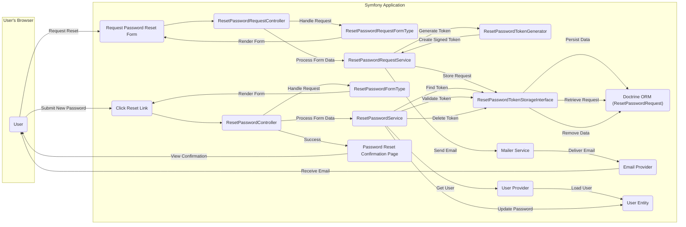

# Project Design Document: Symfony Reset Password Bundle

**Version:** 1.1
**Date:** October 26, 2023
**Author:** AI Software Architect

## 1. Introduction

This document provides a detailed design overview of the Symfony Reset Password Bundle (referenced from [https://github.com/symfonycasts/reset-password-bundle](https://github.com/symfonycasts/reset-password-bundle)). This document aims to clearly articulate the bundle's architecture, components, and data flow to facilitate effective threat modeling. It outlines the key functionalities and interactions within the bundle and with the broader Symfony application, providing a foundation for security analysis.

## 2. Goals

*   Provide a clear and comprehensive description of the Reset Password Bundle's architecture and functionality.
*   Identify and describe the key components of the bundle and their specific responsibilities.
*   Illustrate the detailed data flow during the password reset process, highlighting key interactions.
*   Outline potential security considerations and vulnerabilities to inform subsequent threat modeling activities.

## 3. High-Level Architecture

The Reset Password Bundle integrates seamlessly into a Symfony application to provide a secure and user-friendly password reset mechanism. It involves user interaction through web forms and backend processing to generate, securely store, and validate time-sensitive reset tokens. The process ensures that only the legitimate owner of an account can initiate a password reset.

## 4. Detailed Design

### 4.1. Components

*   **`ResetPasswordRequestController`**:
    *   Primary entry point for users initiating the password reset process.
    *   Responsible for displaying the password reset request form (`ResetPasswordRequestFormType`).
    *   Handles the submission of the email address provided by the user.
    *   Upon successful form submission and validation, it delegates the token generation and email sending to the `ResetPasswordRequestService`.
    *   Implements measures to prevent abuse, such as rate limiting (application-level implementation is assumed).

*   **`ResetPasswordRequestFormType`**:
    *   A standard Symfony Form Type dedicated to collecting the user's email address for the purpose of initiating a password reset.
    *   Includes basic validation to ensure the email field is present and conforms to a valid email format.
    *   Should be protected against CSRF attacks through Symfony's built-in mechanisms.

*   **`ResetPasswordRequestService`**:
    *   The central orchestrator for handling password reset requests.
    *   Receives the validated email address from the `ResetPasswordRequestController`.
    *   Queries the application's `User Provider` to locate the user associated with the provided email.
    *   Utilizes the `ResetPasswordTokenGenerator` to create a unique, signed, and time-limited reset token.
    *   Interacts with the `ResetPasswordTokenStorageInterface` to persist the generated token, the associated user, and the token's expiry timestamp.
    *   Leverages the Symfony `Mailer Service` to dispatch an email to the user containing a secure link embedded with the generated reset token.

*   **`ResetPasswordTokenGenerator`**:
    *   Specifically designed to generate cryptographically secure reset tokens.
    *   Employs a combination of random data, timestamps, and a secret signing key (configured within the application) to ensure token uniqueness, integrity, and prevent tampering.
    *   The signing mechanism allows the application to verify the authenticity of the token upon its return.

*   **`ResetPasswordTokenStorageInterface`**:
    *   Defines the contract for how reset password request data (including the token) is stored and retrieved.
    *   Provides methods for:
        *   `storeToken(object $resetToken, object $user)`: Persisting a new reset password request.
        *   `findResetPasswordRequest(string $selector)`: Locating a reset password request based on a selector (typically derived from the token).
        *   `findTokenBy(string $hashedToken)`: Finding a reset password request by its hashed token value.
        *   `countNonExpiredSince(DateTimeImmutable $date, string $userIdentifier)`: Counting non-expired requests for a given user.
        *   `removeResetPasswordRequest(object $resetPasswordRequest)`: Deleting a reset password request after it has been used or expired.
    *   The default implementation utilizes Doctrine ORM, storing `ResetPasswordRequest` entities in a database.

*   **`ResetPasswordRequest` (Entity)**:
    *   A Doctrine entity representing a single password reset request.
    *   Contains essential information such as:
        *   `user`: A reference to the associated user entity.
        *   `requestedAt`: The timestamp when the reset request was initiated.
        *   `expiresAt`: The timestamp indicating when the token will expire.
        *   `selector`: A non-sensitive part of the token used for indexing.
        *   `hashedToken`: The securely hashed version of the actual reset token.

*   **`Mailer Service`**:
    *   Symfony's standard service for sending emails.
    *   Configured with details of the email transport (e.g., SMTP server).
    *   Used by the `ResetPasswordRequestService` to send the password reset link to the user.
    *   Email content should be carefully crafted to avoid revealing sensitive information and should encourage users to be cautious of phishing attempts.

*   **`ResetPasswordController`**:
    *   Handles the user's interaction after they click the password reset link received via email.
    *   Extracts the reset token from the URL.
    *   Utilizes the `ResetPasswordService` to validate the provided token.
    *   If the token is valid, it presents the password reset form (`ResetPasswordFormType`) to the user, allowing them to enter their new password.
    *   Upon successful submission of the new password, it delegates the password update process to the `ResetPasswordService`.

*   **`ResetPasswordFormType`**:
    *   A Symfony Form Type dedicated to collecting the user's new password.
    *   Typically includes fields for the new password and a confirmation field to ensure the user has entered the password correctly.
    *   Should enforce strong password requirements (e.g., minimum length, complexity) through validation rules.
    *   Must be protected against CSRF attacks.

*   **`ResetPasswordService`**:
    *   The core service responsible for validating the reset token and updating the user's password.
    *   Receives the reset token from the `ResetPasswordController`.
    *   Interacts with the `ResetPasswordTokenStorageInterface` to retrieve the corresponding `ResetPasswordRequest` and validate the token (checking for existence, expiry, and ensuring it hasn't been used already).
    *   If the token is valid, it retrieves the associated `User Entity` from the application's `User Provider`.
    *   Updates the user's password, typically by hashing the new password using Symfony's security component.
    *   After a successful password update, it calls the `ResetPasswordTokenStorageInterface` to remove the used reset token, preventing its reuse.

*   **`User Provider`**:
    *   Symfony's security component responsible for loading user information based on a unique identifier (e.g., email address).
    *   Used by both `ResetPasswordRequestService` and `ResetPasswordService` to retrieve user objects.

*   **`User Entity`**:
    *   The application's entity representing a user.
    *   Contains properties such as email, hashed password, and other user-related information.
    *   The password property should store the password securely using a robust hashing algorithm.

### 4.2. Data Flow

The password reset process unfolds in the following sequence:

1. **User Initiates Reset Request:** The user navigates to the password reset page and submits their email address through the `ResetPasswordRequestFormType`.
2. **Email Validation and User Retrieval:** The `ResetPasswordRequestController` receives the submitted email. The `ResetPasswordRequestService` validates the email format and attempts to retrieve the corresponding user from the `User Provider`.
3. **Token Generation:** If a matching user is found, the `ResetPasswordRequestService` invokes the `ResetPasswordTokenGenerator` to create a unique, signed, and time-limited reset token.
4. **Token Persistence:** The `ResetPasswordRequestService` interacts with the `ResetPasswordTokenStorageInterface` to persist the generated token, the associated user, and the token's expiration timestamp within the `ResetPasswordRequest` entity.
5. **Email Dispatch with Reset Link:** The `ResetPasswordRequestService` utilizes the `Mailer Service` to send an email to the user. This email contains a specially crafted link that includes the generated reset token.
6. **User Accesses Reset Link:** The user receives the email and clicks on the reset link, directing their browser to the `ResetPasswordController` with the token embedded in the URL.
7. **Token Validation and Retrieval:** The `ResetPasswordController` extracts the token from the URL and calls upon the `ResetPasswordService` to validate it. The `ResetPasswordService` uses the `ResetPasswordTokenStorageInterface` to retrieve the corresponding `ResetPasswordRequest` and verifies the token's validity (checking for existence, expiry, and prior usage).
8. **Display New Password Form:** If the token is valid, the `ResetPasswordController` presents the `ResetPasswordFormType`, allowing the user to input their new password.
9. **Password Update:** Upon the user submitting their new password through the `ResetPasswordFormType`, the `ResetPasswordController` delegates the update process to the `ResetPasswordService`. The `ResetPasswordService` retrieves the associated `User Entity` and updates their password (hashing the newly provided password before saving).
10. **Token Removal:** After successfully updating the user's password, the `ResetPasswordService` interacts with the `ResetPasswordTokenStorageInterface` to remove the used reset token, preventing any further use of the same token.
11. **Confirmation:** The user is redirected to a confirmation page, indicating that their password has been successfully reset.

## 5. Security Considerations (For Threat Modeling)

This section outlines potential security vulnerabilities and considerations crucial for threat modeling:

*   **Token Security:**
    *   **Predictability:** Ensure the `ResetPasswordTokenGenerator` uses a cryptographically secure random number generator to prevent token prediction or brute-force attacks. The signing key must be kept secret and securely managed.
    *   **Exposure in Transit:** The reset token is typically transmitted in the URL. HTTPS must be strictly enforced to prevent interception of the token in transit. Consider using shorter-lived tokens to minimize the window of opportunity for exploitation.
    *   **Token Lifespan:** The expiry time of the token should be carefully configured. A short lifespan reduces the risk of unauthorized password resets if a token is intercepted. However, it should be long enough to allow legitimate users sufficient time to complete the process.
    *   **Secure Storage:** The `hashedToken` should be stored securely in the database. Ensure proper database security measures are in place. Avoid storing the raw token in the database.

*   **Email Security:**
    *   **Email Spoofing:** Implement and configure SPF, DKIM, and DMARC records for the sending domain to mitigate the risk of email spoofing.
    *   **Email Interception:** Ensure the mailer service uses TLS to encrypt email communication during transit.
    *   **Phishing:** The email content should be carefully designed to avoid resembling phishing attempts. Clearly indicate the legitimacy of the request and avoid asking for sensitive information directly in the email.

*   **Rate Limiting:**
    *   Implement rate limiting at the `ResetPasswordRequestController` level to prevent abuse, such as automated scripts repeatedly requesting password resets for numerous email addresses. This can help mitigate denial-of-service attacks and prevent user enumeration.

*   **User Enumeration Prevention:**
    *   Carefully design the system's responses to password reset requests to avoid revealing whether an email address exists in the system. For example, provide a generic success message regardless of whether the email exists.

*   **Token Reuse Prevention:**
    *   The `ResetPasswordService` must invalidate and remove the reset token from the `ResetPasswordTokenStorageInterface` immediately after a successful password reset to prevent the token from being used again.

*   **Cross-Site Scripting (XSS):**
    *   Sanitize all user inputs and escape output in the `ResetPasswordRequestFormType` and `ResetPasswordFormType` to prevent XSS attacks. Ensure email templates do not introduce XSS vulnerabilities.

*   **Cross-Site Request Forgery (CSRF):**
    *   Enable and properly configure Symfony's CSRF protection for both the password reset request form and the new password submission form.

*   **Timing Attacks:**
    *   Be mindful of potential timing attacks during token validation. Ensure that the time taken to validate a valid token is not significantly different from the time taken to validate an invalid token.

## 6. Deployment Considerations

*   Requires a functioning Symfony application with the Security component and Doctrine ORM configured.
*   A properly configured mailer service with valid credentials for sending emails is essential.
*   Ensure HTTPS is enabled and enforced for the entire application, especially for pages handling sensitive information like password reset requests and submissions.
*   Database security is critical for protecting stored reset password requests. Implement appropriate access controls and encryption where necessary.
*   Consider the scalability of the token storage mechanism based on the expected volume of password reset requests. For high-traffic applications, consider using a faster storage mechanism like Redis for temporary token storage.
*   Regularly review and update the application's dependencies, including the Reset Password Bundle, to patch any known security vulnerabilities.

## 7. Future Considerations

*   Integration with alternative token storage mechanisms beyond Doctrine ORM, such as Redis or other caching layers for improved performance.
*   Support for different methods of verifying the user's identity before allowing a password reset, such as phone number verification.
*   Customizable email templates to allow developers to tailor the look and feel of password reset emails.
*   Integration with multi-factor authentication (MFA) workflows during the password reset process for enhanced security.
*   Auditing and logging of password reset requests and attempts for security monitoring and analysis.

This improved design document provides a more detailed and comprehensive overview of the Symfony Reset Password Bundle, offering a stronger foundation for effective threat modeling and security analysis. By understanding the intricacies of the bundle's architecture, data flow, and potential security considerations, developers can build more secure and resilient applications.