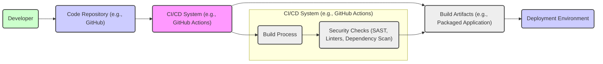

# BUSINESS POSTURE

This project, the `symfonycasts/reset-password-bundle`, addresses the common business need for users to reset their passwords when they are forgotten or lost. This functionality is crucial for maintaining user access to web applications and services, directly impacting user satisfaction and reducing support requests related to password issues.

- Business Priorities:
  - Ensure users can regain access to their accounts efficiently and securely.
  - Minimize user frustration and support burden related to forgotten passwords.
  - Maintain a positive user experience by providing a straightforward password reset process.
  - Protect user accounts from unauthorized access during the password reset process.

- Business Goals:
  - Implement a reliable and user-friendly password reset feature within Symfony applications.
  - Reduce the number of user support tickets related to password recovery.
  - Enhance the security posture of user accounts by providing a secure password reset mechanism.

- Business Risks:
  - Account Takeover: Insecure password reset process could be exploited to gain unauthorized access to user accounts.
  - Data Breach: Vulnerabilities in the password reset mechanism could leak sensitive user information, such as email addresses or temporary tokens.
  - Service Disruption:  A malfunctioning or unavailable password reset feature can prevent users from accessing the application, leading to business disruption.
  - Reputational Damage: Security breaches or usability issues related to password reset can damage the organization's reputation and user trust.
  - Compliance Violations: Failure to implement secure password reset mechanisms may violate data protection regulations (e.g., GDPR, CCPA) if personal data is compromised.

# SECURITY POSTURE

This Symfony bundle aims to provide a secure and robust password reset functionality. The security posture relies on secure software development practices within the Symfony ecosystem and the security features implemented within the bundle itself.

- Existing Security Controls:
  - security control: Secure Coding Practices: Symfony framework encourages secure coding practices, and the bundle is developed within this ecosystem. (Implemented by: Symfony framework and bundle developers)
  - security control: Dependency Management: Composer is used for dependency management, allowing for updates and security patches of underlying libraries. (Implemented by: Composer and Symfony ecosystem)
  - security control: Input Validation: Symfony framework provides tools for input validation, which are likely used within the bundle to validate user inputs like email addresses. (Implemented by: Symfony framework and bundle code)
  - security control: Cryptographic Token Generation: The bundle likely uses secure random number generation for creating password reset tokens. (Implemented by: Bundle code)
  - security control: HTTPS Enforcement: It is assumed that applications using this bundle will enforce HTTPS for all communication, protecting password reset requests in transit. (Implemented by: Application deployment configuration)

- Accepted Risks:
  - accepted risk: Dependency Vulnerabilities:  Vulnerabilities in third-party dependencies used by the bundle could introduce security risks. Mitigation relies on regular dependency updates.
  - accepted risk: Configuration Errors: Misconfiguration of the bundle or the application using it could lead to security vulnerabilities. Proper documentation and testing are needed to mitigate this.
  - accepted risk:  Zero-day Vulnerabilities:  Unforeseen vulnerabilities in the bundle or its dependencies could exist until discovered and patched.

- Recommended Security Controls:
  - security control: Automated Security Scanning (SAST/DAST): Implement automated static and dynamic analysis security testing in the CI/CD pipeline to identify potential vulnerabilities in the bundle code and its configuration.
  - security control: Regular Dependency Updates: Establish a process for regularly updating dependencies to patch known vulnerabilities. Use tools like `composer audit` to identify vulnerable dependencies.
  - security control: Security Code Reviews: Conduct regular security code reviews of the bundle code to identify and address potential security flaws.
  - security control: Penetration Testing: Perform periodic penetration testing of applications using the bundle to assess the effectiveness of security controls and identify vulnerabilities in a realistic attack scenario.
  - security control: Rate Limiting: Implement rate limiting on the password reset request endpoint to prevent brute-force attacks and denial-of-service attempts.
  - security control:  Token Expiration: Ensure password reset tokens have a limited lifespan to reduce the window of opportunity for token reuse or theft.

- Security Requirements:
  - Authentication:
    - Requirement: The password reset process must reliably authenticate the user requesting the reset, ensuring only the legitimate account holder can reset the password.
    - Requirement: The system must prevent unauthorized password resets by malicious actors.
  - Authorization:
    - Requirement: The password reset process must authorize the user to reset *their own* password and prevent them from resetting passwords of other users.
  - Input Validation:
    - Requirement: All user inputs, such as email addresses and reset tokens, must be thoroughly validated to prevent injection attacks and other input-related vulnerabilities.
    - Requirement: Email addresses must be validated to ensure they are in a valid format and potentially exist in the system's user database.
    - Requirement: Reset tokens must be validated to ensure they are correctly formatted, associated with a valid user, and not expired or already used.
  - Cryptography:
    - Requirement: Password reset tokens must be generated using cryptographically secure random number generators.
    - Requirement: Sensitive data, such as password reset tokens if stored, must be encrypted at rest and in transit.
    - Requirement: Communication during the password reset process, especially when submitting new passwords, must be protected using HTTPS.

# DESIGN

The `symfonycasts/reset-password-bundle` is designed to be integrated into Symfony applications to provide password reset functionality. It handles the process of generating, sending, and validating password reset tokens, and updating user passwords.

## C4 CONTEXT

```mermaid
graph LR
    subgraph "Symfony Application"
        RPB("Reset Password Bundle")
    end
    WebApp("Web Application")
    User("Website User")
    EmailService("Email Service")

    User --> WebApp: Requests Password Reset
    WebApp --> RPB: Initiates Password Reset Process
    RPB --> EmailService: Sends Reset Link
    EmailService --> User: Receives Reset Link
    User --> WebApp: Submits New Password via Reset Link
    WebApp --> RPB: Validates Token and Resets Password
    RPB --> WebApp: Notifies Password Reset Success
    WebApp --> User: Confirms Password Reset Success

    style RPB fill:#f9f,stroke:#333,stroke-width:2px
    style WebApp fill:#ccf,stroke:#333,stroke-width:2px
    style User fill:#cfc,stroke:#333,stroke-width:2px
    style EmailService fill:#eee,stroke:#333,stroke-width:2px
```

- Context Diagram Elements:
  - Element:
    - Name: Website User
    - Type: Person
    - Description: End-users of the web application who may need to reset their passwords.
    - Responsibilities: Initiates password reset requests, receives reset links via email, and submits new passwords through the web application.
    - Security controls: Strong password management practices on user side, secure email account.
  - Element:
    - Name: Web Application
    - Type: Software System
    - Description: The Symfony web application that integrates the Reset Password Bundle. It handles user interactions, routing, and application logic.
    - Responsibilities: Receives password reset requests from users, interacts with the Reset Password Bundle, displays user interfaces, and manages user sessions.
    - Security controls: Authentication and authorization mechanisms, input validation, session management, HTTPS enforcement, web application firewall (WAF).
  - Element:
    - Name: Reset Password Bundle
    - Type: Software System (Symfony Bundle)
    - Description: The `symfonycasts/reset-password-bundle` itself. It provides the core logic for generating, sending, and validating password reset tokens and updating user passwords.
    - Responsibilities: Generates password reset tokens, stores token requests (temporarily), sends reset links via email, validates reset tokens, and updates user passwords in the database.
    - Security controls: Secure token generation, token validation, protection against common password reset vulnerabilities (e.g., token reuse, brute-force attacks), secure password hashing (delegated to Symfony framework).
  - Element:
    - Name: Email Service
    - Type: External System
    - Description: An external email service (e.g., SendGrid, Mailgun, SMTP server) used to send password reset emails to users.
    - Responsibilities:  Delivers password reset emails generated by the Reset Password Bundle to user email addresses.
    - Security controls: SPF, DKIM, DMARC email authentication, TLS encryption for email transmission, email service provider security controls.

## C4 CONTAINER

```mermaid
graph LR
    subgraph "Symfony Application"
        WebAppContainer("Web Application Container")
        RPBContainer("Reset Password Bundle Container")
        DatabaseContainer("Database Container")
    end
    EmailServiceContainer("Email Service Container")
    UserContainer("Website User")

    UserContainer --> WebAppContainer: HTTP Requests (Password Reset)
    WebAppContainer --> RPBContainer: Symfony Service Calls
    RPBContainer --> DatabaseContainer: Database Queries (Token Storage)
    RPBContainer --> EmailServiceContainer: Sends Email (Reset Link)
    EmailServiceContainer --> UserContainer: Email Delivery (Reset Link)
    UserContainer --> WebAppContainer: HTTP Requests (New Password Submission)
    WebAppContainer --> RPBContainer: Symfony Service Calls (Token Validation, Password Reset)
    RPBContainer --> DatabaseContainer: Database Queries (Password Update)

    style WebAppContainer fill:#ccf,stroke:#333,stroke-width:2px
    style RPBContainer fill:#f9f,stroke:#333,stroke-width:2px
    style DatabaseContainer fill:#eee,stroke:#333,stroke-width:2px
    style EmailServiceContainer fill:#eee,stroke:#333,stroke-width:2px
    style UserContainer fill:#cfc,stroke:#333,stroke-width:2px
```

- Container Diagram Elements:
  - Element:
    - Name: Website User Container
    - Type: Person
    - Description: Represents the end-user interacting with the web application through a web browser.
    - Responsibilities: Interacts with the web application to request and complete the password reset process.
    - Security controls: Browser security features, user's device security.
  - Element:
    - Name: Web Application Container
    - Type: Web Application
    - Description: The main Symfony application runtime environment, likely running on a web server (e.g., Nginx, Apache) with PHP-FPM.
    - Responsibilities: Handles HTTP requests, routes requests to appropriate controllers, renders user interfaces, and orchestrates interactions between different Symfony components and bundles.
    - Security controls: Web server security configuration, application-level firewall, input validation, session management, authentication and authorization mechanisms.
  - Element:
    - Name: Reset Password Bundle Container
    - Type: Symfony Bundle
    - Description: The deployed instance of the `symfonycasts/reset-password-bundle` within the Symfony application. It's a set of PHP classes and configuration files.
    - Responsibilities: Implements the password reset logic, including token generation, validation, email sending, and password updating.
    - Security controls: Secure coding practices within the bundle, input validation, secure token handling, integration with Symfony security components.
  - Element:
    - Name: Database Container
    - Type: Database
    - Description: A database system (e.g., MySQL, PostgreSQL) used by the Symfony application to store user data, including user credentials and potentially temporary password reset tokens.
    - Responsibilities: Persists user data, including hashed passwords and temporary reset tokens.
    - Security controls: Database access controls, encryption at rest (if configured), regular backups, database hardening.
  - Element:
    - Name: Email Service Container
    - Type: Email Service
    - Description: An external email service provider or SMTP server responsible for sending emails.
    - Responsibilities: Sends password reset emails to users as instructed by the Reset Password Bundle.
    - Security controls: Email service provider security controls, SPF, DKIM, DMARC configuration, TLS encryption for email transmission.

## DEPLOYMENT

For a typical Symfony application using the `reset-password-bundle`, a common deployment architecture would involve a cloud-based or on-premises infrastructure. Let's consider a cloud deployment using a platform like AWS, Azure, or Google Cloud.

```mermaid
graph LR
    subgraph "Cloud Environment (e.g., AWS)"
        subgraph "Web Tier"
            LoadBalancer("Load Balancer")
            WebServer("Web Server (e.g., Nginx/Apache)")
        end
        subgraph "Application Tier"
            AppServer("Application Server (PHP-FPM)")
        end
        subgraph "Data Tier"
            DatabaseServer("Database Server (e.g., RDS, Cloud SQL)")
        end
        EmailServiceProvider("Email Service Provider (e.g., SendGrid, SES)")
    end
    UserDevice("User Device")

    UserDevice --> LoadBalancer: HTTPS Requests
    LoadBalancer --> WebServer: HTTP Requests
    WebServer --> AppServer: FastCGI/PHP-FPM
    AppServer --> DatabaseServer: Database Connections
    AppServer --> EmailServiceProvider: Sends Emails (SMTP/API)

    style LoadBalancer fill:#ccf,stroke:#333,stroke-width:2px
    style WebServer fill:#ccf,stroke:#333,stroke-width:2px
    style AppServer fill:#ccf,stroke:#333,stroke-width:2px
    style DatabaseServer fill:#eee,stroke:#333,stroke-width:2px
    style EmailServiceProvider fill:#eee,stroke:#333,stroke-width:2px
    style UserDevice fill:#cfc,stroke:#333,stroke-width:2px
```

- Deployment Diagram Elements:
  - Element:
    - Name: User Device
    - Type: Device
    - Description: The user's computer, laptop, or mobile device used to access the web application.
    - Responsibilities: Runs a web browser to interact with the application.
    - Security controls: User-managed device security, browser security features.
  - Element:
    - Name: Load Balancer
    - Type: Infrastructure
    - Description: Distributes incoming HTTPS traffic across multiple web servers for scalability and high availability.
    - Responsibilities: Traffic distribution, SSL termination, health checks.
    - Security controls: DDoS protection, SSL/TLS configuration, access control lists (ACLs).
  - Element:
    - Name: Web Server (e.g., Nginx/Apache)
    - Type: Software
    - Description: Web server software that serves static content and proxies requests to the application server.
    - Responsibilities: Serving static files, reverse proxy, handling HTTP requests, basic security features.
    - Security controls: Web server hardening, access controls, security modules (e.g., mod_security), regular security updates.
  - Element:
    - Name: Application Server (PHP-FPM)
    - Type: Software
    - Description: PHP-FPM (FastCGI Process Manager) running the Symfony application code, including the Reset Password Bundle.
    - Responsibilities: Executing application logic, handling password reset requests, interacting with the database and email service.
    - Security controls: Application-level security controls, input validation, secure coding practices, regular application updates, runtime environment security.
  - Element:
    - Name: Database Server (e.g., RDS, Cloud SQL)
    - Type: Infrastructure/Service
    - Description: Managed database service in the cloud, storing application data including user credentials and reset tokens.
    - Responsibilities: Data persistence, data integrity, data security, database management.
    - Security controls: Database access controls, encryption at rest and in transit, regular backups, database monitoring, managed service security features.
  - Element:
    - Name: Email Service Provider (e.g., SendGrid, SES)
    - Type: External Service
    - Description: Third-party email service provider used to send password reset emails.
    - Responsibilities: Email delivery, email sending infrastructure.
    - Security controls: Email service provider security controls, SPF, DKIM, DMARC configuration, TLS encryption for email transmission, API access controls.

## BUILD

The build process for a Symfony application with the `reset-password-bundle` typically involves using Composer for dependency management and potentially a CI/CD pipeline for automated builds and deployments.



- Build Process Elements:
  - Element:
    - Name: Developer
    - Type: Person
    - Description: Software developers who write and maintain the Symfony application code and the integration with the Reset Password Bundle.
    - Responsibilities: Writing code, committing code to the repository, performing local testing.
    - Security controls: Secure development practices, code review, access control to code repository.
  - Element:
    - Name: Code Repository (e.g., GitHub)
    - Type: Software System
    - Description: Version control system used to store and manage the application's source code.
    - Responsibilities: Source code management, version control, collaboration, code history.
    - Security controls: Access control, branch protection, audit logs, vulnerability scanning (GitHub Advanced Security).
  - Element:
    - Name: CI/CD System (e.g., GitHub Actions)
    - Type: Software System
    - Description: Continuous Integration and Continuous Delivery system that automates the build, test, and deployment process.
    - Responsibilities: Automated build process, running tests, performing security checks, creating build artifacts, deploying to environments.
    - Security controls: Secure CI/CD pipeline configuration, secret management, access control, audit logs.
  - Element:
    - Name: Build Process
    - Type: Automated Process
    - Description: Steps involved in compiling, packaging, and preparing the application for deployment. Includes dependency installation (Composer), code compilation (if needed), asset building, etc.
    - Responsibilities: Compiling code, installing dependencies, packaging application, running unit tests.
    - Security controls: Dependency vulnerability scanning, build environment security, secure build scripts.
  - Element:
    - Name: Security Checks (SAST, Linters, Dependency Scan)
    - Type: Automated Process
    - Description: Automated security checks integrated into the CI/CD pipeline to identify potential vulnerabilities in the code and dependencies. Includes Static Application Security Testing (SAST), code linters, and dependency vulnerability scanning (e.g., `composer audit`).
    - Responsibilities: Identifying security vulnerabilities, enforcing code quality standards, detecting vulnerable dependencies.
    - Security controls: SAST tools configuration, linter rules, dependency scanning tools, automated reporting of security findings.
  - Element:
    - Name: Build Artifacts (e.g., Packaged Application)
    - Type: File/Package
    - Description: The output of the build process, ready for deployment. Could be a packaged application (e.g., a Docker image, a zip archive).
    - Responsibilities: Deployable application package.
    - Security controls: Artifact signing, artifact integrity checks, secure artifact storage.
  - Element:
    - Name: Deployment Environment
    - Type: Infrastructure
    - Description: Target environment where the application is deployed (e.g., staging, production).
    - Responsibilities: Running the application, serving user requests.
    - Security controls: Infrastructure security, application runtime security, monitoring and logging.

# RISK ASSESSMENT

- Critical Business Processes:
  - User Account Management: Specifically, the password recovery process is critical for user access and account security.
  - User Authentication: The password reset mechanism is an integral part of the user authentication system.

- Data to Protect:
  - User Email Addresses: Used for sending password reset links. Sensitivity: Personally Identifiable Information (PII), potentially sensitive.
  - Password Reset Tokens: Temporary, sensitive tokens used to verify password reset requests. Sensitivity: Highly sensitive, if compromised can lead to account takeover.
  - User Passwords (Hashed): While not directly handled by the reset process (except for updating the hash), the security of password hashes is indirectly related as the reset process allows users to change them. Sensitivity: Highly sensitive, critical for authentication security.

# QUESTIONS & ASSUMPTIONS

- Questions:
  - What is the specific deployment environment for the application using this bundle (cloud, on-premises, hybrid)?
  - What are the specific security compliance requirements for the application (e.g., GDPR, PCI DSS, HIPAA)?
  - What email service provider will be used for sending password reset emails?
  - What database system will be used to store user data and reset tokens?
  - Are there any specific rate limiting or throttling requirements for the password reset functionality?
  - What is the expected lifespan of password reset tokens?
  - What level of security testing (penetration testing, security audits) is planned for the application?

- Assumptions:
  - The application using this bundle will enforce HTTPS for all communication.
  - The application will use a secure email service provider with proper email authentication (SPF, DKIM, DMARC) configured.
  - User passwords are stored securely using strong hashing algorithms provided by the Symfony framework.
  - The underlying Symfony framework and PHP runtime environment are kept up-to-date with security patches.
  - The application will be deployed in a reasonably secure infrastructure environment.
  - The development team follows secure coding practices.