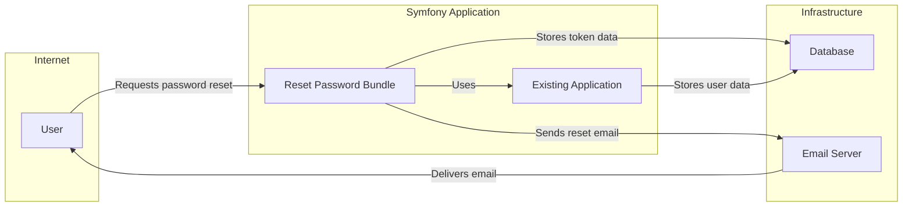
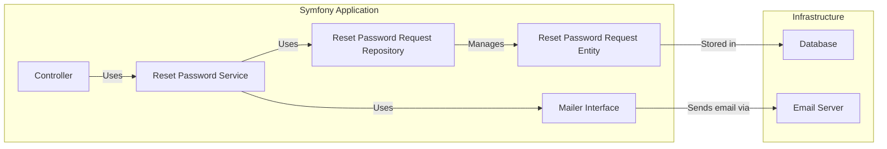
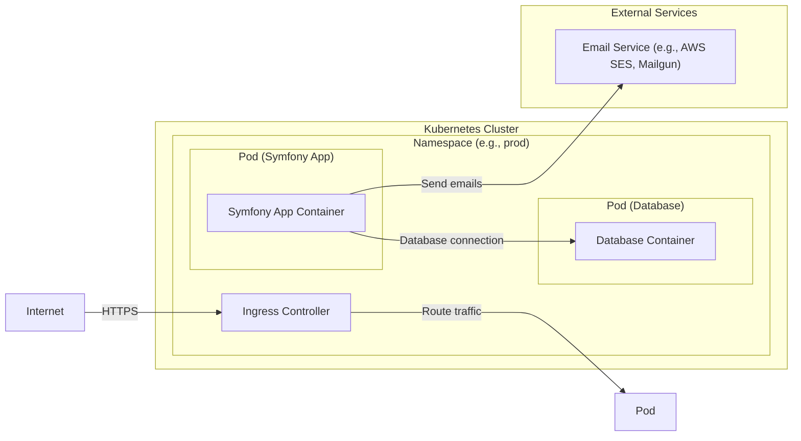
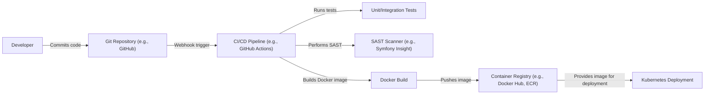

# Project Design Document: Symfonycasts Reset Password Bundle

## BUSINESS POSTURE

_Priorities and Goals:_

*   Provide a secure and user-friendly mechanism for users to reset their forgotten passwords within Symfony applications.
*   Minimize the risk of account takeover through vulnerabilities in the password reset process.
*   Offer a customizable and extensible solution that integrates well with existing Symfony projects.
*   Reduce development time for implementing password reset functionality.
*   Maintain a high level of code quality and security.

_Business Risks:_

*   Account takeover due to vulnerabilities in the password reset flow (e.g., predictable tokens, insufficient token expiration, lack of rate limiting).
*   Exposure of sensitive user data (e.g., email addresses) during the reset process.
*   Non-compliance with data privacy regulations (e.g., GDPR) related to personal data handling.
*   Negative user experience due to a complex or unreliable password reset process.
*   Reputational damage resulting from security breaches related to password resets.

## SECURITY POSTURE

_Existing Security Controls:_

*   security control: Generation of cryptographically secure random tokens for password reset requests (described in bundle's code and documentation).
*   security control: Time-limited validity of reset tokens (configurable, described in documentation).
*   security control: Storage of token hashes rather than plain text tokens in the database (described in bundle's code and documentation).
*   security control: Throttling of password reset requests to mitigate brute-force attacks (configurable, described in documentation).
*   security control: Use of Symfony's security features and best practices (inherent in the framework and encouraged in the documentation).
*   security control: Email-based token delivery, leveraging Symfony's mailer component (described in bundle's code and documentation).

_Accepted Risks:_

*   accepted risk: Reliance on the underlying Symfony framework's security mechanisms.
*   accepted risk: Dependence on the security of the email delivery system.
*   accepted risk: Potential for user error (e.g., weak new passwords) after a successful reset.

_Recommended Security Controls:_

*   security control: Implement stricter password complexity requirements during the new password setting phase.
*   security control: Consider adding multi-factor authentication (MFA) as an additional layer of security, especially after a password reset.
*   security control: Provide clear and concise security guidance in the documentation, emphasizing the importance of secure configuration and deployment.
*   security control: Implement monitoring and alerting for suspicious password reset activity.
*   security control: Regularly audit the codebase for potential security vulnerabilities.

_Security Requirements:_

*   Authentication:
    *   The system must securely authenticate users before allowing them to change their password. This is achieved through the validation of the unique, time-limited reset token.
    *   The system must verify that the reset token has not expired.
    *   The system must ensure that the reset token belongs to the user attempting to reset the password.

*   Authorization:
    *   Only users with a valid, unexpired reset token should be authorized to change their password.
    *   The system should prevent unauthorized access to the password reset functionality.

*   Input Validation:
    *   The system must validate all user inputs, including email addresses and new passwords.
    *   New passwords must meet defined complexity requirements (e.g., minimum length, character types).
    *   Input validation should be performed on both the client-side (for user experience) and server-side (for security).

*   Cryptography:
    *   The system must use cryptographically secure random number generators for token generation.
    *   Password reset tokens should be hashed before being stored in the database.
    *   The system should use secure password hashing algorithms (e.g., bcrypt, Argon2) for storing user passwords.

## DESIGN

### C4 CONTEXT

_Element Descriptions:_

*   Element:
    *   Name: User
    *   Type: Person
    *   Description: A user of the Symfony application who needs to reset their password.
    *   Responsibilities: Initiates the password reset process, receives the reset email, and sets a new password.
    *   Security controls: Strong password selection, potential MFA.

*   Element:
    *   Name: Reset Password Bundle
    *   Type: Software System
    *   Description: The Symfonycasts Reset Password Bundle, providing the password reset functionality.
    *   Responsibilities: Handles password reset requests, generates tokens, sends emails, validates tokens, and updates user passwords.
    *   Security controls: Secure token generation, token hashing, time-limited tokens, throttling, input validation.

*   Element:
    *   Name: Existing Application
    *   Type: Software System
    *   Description: The Symfony application that integrates the Reset Password Bundle.
    *   Responsibilities: Provides the user interface and integrates with the bundle's functionality.
    *   Security controls: Leverages Symfony's security features, input validation.

*   Element:
    *   Name: Database
    *   Type: Database
    *   Description: The database used to store user data and password reset tokens.
    *   Responsibilities: Persistently stores data.
    *   Security controls: Access controls, encryption at rest, regular backups.

*   Element:
    *   Name: Email Server
    *   Type: Software System
    *   Description: The email server used to send password reset emails.
    *   Responsibilities: Delivers emails to users.
    *   Security controls: Secure email protocols (e.g., TLS), spam filtering, sender authentication.

### C4 CONTAINER

_Element Descriptions:_

*   Element:
    *   Name: Controller
    *   Type: Controller
    *   Description: Symfony controller that handles user requests related to password reset.
    *   Responsibilities: Receives requests, interacts with the Reset Password Service, and renders views.
    *   Security controls: Input validation, CSRF protection.

*   Element:
    *   Name: Reset Password Service
    *   Type: Service
    *   Description: The core service of the bundle, implementing the password reset logic.
    *   Responsibilities: Generates tokens, validates tokens, handles password updates, interacts with the repository and mailer.
    *   Security controls: Secure token generation, token hashing, time-limited tokens, throttling.

*   Element:
    *   Name: Reset Password Request Repository
    *   Type: Repository
    *   Description: Responsible for interacting with the database to manage ResetPasswordRequest entities.
    *   Responsibilities: Persists and retrieves reset password request data.
    *   Security controls: Secure database interactions.

*   Element:
    *   Name: Reset Password Request Entity
    *   Type: Entity
    *   Description: Represents a password reset request in the system.
    *   Responsibilities: Holds data related to a password reset request (e.g., user, token, expiration).
    *   Security controls: Data validation.

*   Element:
    *   Name: Mailer Interface
    *   Type: Interface
    *   Description: Symfony's mailer interface, used to send emails.
    *   Responsibilities: Provides an abstraction for sending emails.
    *   Security controls: Uses secure email protocols.

*   Element:
    *   Name: Database
    *   Type: Database
    *   Description: The database used to store user data and password reset tokens.
    *   Responsibilities: Persistently stores data.
    *   Security controls: Access controls, encryption at rest, regular backups.

*   Element:
    *   Name: Email Server
    *   Type: Software System
    *   Description: The email server used to send password reset emails.
    *   Responsibilities: Delivers emails to users.
    *   Security controls: Secure email protocols (e.g., TLS), spam filtering, sender authentication.

### DEPLOYMENT

_Possible Deployment Solutions:_

1.  Traditional LAMP/LEMP stack.
2.  Containerized deployment using Docker and Kubernetes.
3.  Platform-as-a-Service (PaaS) solutions like Heroku, Platform.sh, or AWS Elastic Beanstalk.
4.  Serverless deployment using AWS Lambda or similar.

_Chosen Solution (Containerized Deployment with Kubernetes):_

_Element Descriptions:_

*   Element:
    *   Name: Internet
    *   Type: Network
    *   Description: The public internet.
    *   Responsibilities: Provides access to the application.
    *   Security controls: Firewall, DDoS protection.

*   Element:
    *   Name: Kubernetes Cluster
    *   Type: Infrastructure
    *   Description: The Kubernetes cluster hosting the application.
    *   Responsibilities: Orchestrates containers.
    *   Security controls: Network policies, RBAC, pod security policies.

*   Element:
    *   Name: Namespace (e.g., prod)
    *   Type: Logical Grouping
    *   Description: A Kubernetes namespace isolating the application's resources.
    *   Responsibilities: Provides isolation and resource management.
    *   Security controls: Network policies, resource quotas.

*   Element:
    *   Name: Pod (Symfony App)
    *   Type: Pod
    *   Description: A Kubernetes pod running the Symfony application container.
    *   Responsibilities: Executes the application code.
    *   Security controls: Least privilege, image security scanning.

*   Element:
    *   Name: Container
    *   Type: Container
    *   Description: The Docker container running the Symfony application.
    *   Responsibilities: Executes the application code.
    *   Security controls: Image security scanning, minimal base image, non-root user.

*   Element:
    *   Name: Pod (Database)
    *   Type: Pod
    *   Description: A Kubernetes pod running the database container.
    *   Responsibilities: Executes the database server.
    *   Security controls: Least privilege, image security scanning, data encryption.

*   Element:
    *   Name: DBContainer
    *   Type: Container
    *   Description: The Docker container running the database server (e.g., PostgreSQL, MySQL).
    *   Responsibilities: Stores application data.
    *   Security controls: Secure configuration, access controls, encryption at rest, regular backups.

*   Element:
    *   Name: Ingress Controller
    *   Type: Ingress Controller
    *   Description: A Kubernetes ingress controller managing external access to the application.
    *   Responsibilities: Routes traffic to the correct pods.
    *   Security controls: TLS termination, web application firewall (WAF).

*   Element:
    *   Name: Email Service (e.g., AWS SES, Mailgun)
    *   Type: External Service
    *   Description: A third-party email service used to send password reset emails.
    *   Responsibilities: Delivers emails to users.
    *   Security controls: Secure API keys, sender authentication, DKIM/SPF/DMARC.

### BUILD

_Build Process Description:_

1.  Developer commits code changes to the Git repository (e.g., GitHub).
2.  A webhook triggers the CI/CD pipeline (e.g., GitHub Actions).
3.  The CI pipeline runs unit and integration tests to ensure code quality.
4.  The CI pipeline performs Static Application Security Testing (SAST) using a tool like Symfony Insight to identify potential security vulnerabilities.
5.  If tests and SAST pass, the CI pipeline builds a Docker image for the application.
6.  The Docker image is pushed to a container registry (e.g., Docker Hub, Amazon ECR).
7.  The Kubernetes deployment pulls the image from the registry and deploys it to the cluster.

_Security Controls:_

*   security control: Code review before merging changes to the main branch.
*   security control: Automated unit and integration tests to catch bugs and regressions.
*   security control: SAST scanning to identify security vulnerabilities in the code.
*   security control: Use of a minimal base image for the Docker container to reduce the attack surface.
*   security control: Running the application as a non-root user within the container.
*   security control: Image security scanning in the container registry to identify vulnerabilities in dependencies.
*   security control: Secure storage of secrets (e.g., API keys, database credentials) using Kubernetes secrets or a secrets management solution.
*   security control: Regularly updating dependencies to patch security vulnerabilities.

## RISK ASSESSMENT

_Critical Business Processes:_

*   User authentication and authorization.
*   Password reset functionality.
*   User data management.

_Data to Protect and Sensitivity:_

*   User email addresses (Personally Identifiable Information - PII, Medium sensitivity).
*   Password reset tokens (High sensitivity, as they grant temporary access).
*   Hashed user passwords (High sensitivity, although protected by hashing).
*   Any other user data stored by the application (Sensitivity depends on the specific data).

## QUESTIONS & ASSUMPTIONS

_Questions:_

*   What specific database system is being used?
*   What email service provider is being used?
*   Are there any existing security policies or compliance requirements that need to be considered?
*   What is the expected volume of password reset requests?
*   What is the desired level of customization for the password reset flow?
*   Are there any specific logging or monitoring requirements?

_Assumptions:_

*   BUSINESS POSTURE: The organization has a moderate risk appetite and prioritizes security, but also needs a functional and user-friendly solution.
*   SECURITY POSTURE: The underlying Symfony framework and its security components are properly configured and maintained. The email service provider is secure and reliable.
*   DESIGN: The application uses a relational database. A third-party email service is used for sending emails. The deployment environment is a Kubernetes cluster. The build process uses a CI/CD pipeline with automated testing and SAST scanning.