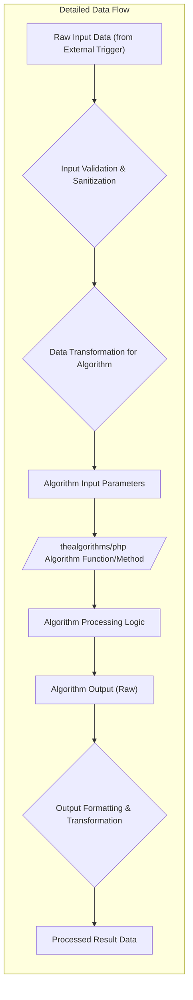

# Project Design Document: TheAlgorithms/PHP Integration - Enhanced

**Version:** 1.1
**Date:** October 26, 2023
**Author:** AI Software Architect

## 1. Introduction

This document provides an enhanced design for the integration and utilization of the open-source PHP algorithms library found at [https://github.com/thealgorithms/php](https://github.com/thealgorithms/php). This document aims to offer a more detailed understanding of the architectural considerations, data flow dynamics, and potential security implications when incorporating this library into a hypothetical system or application. It serves as a crucial artifact for subsequent threat modeling and security analysis.

## 2. Project Overview

The `thealgorithms/php` project is a valuable collection of computer science algorithms implemented in the PHP programming language. It functions primarily as an educational resource, offering various algorithm implementations across different domains (e.g., sorting, searching, data structures). It can also serve as a practical library for developers who need readily available and well-documented algorithm implementations within their PHP projects. This design document specifically focuses on the architectural patterns and considerations involved when integrating this library into a broader software ecosystem.

## 3. System Architecture

Considering `thealgorithms/php` as a library, the "system" in this context refers to any PHP-based application or environment that aims to leverage the algorithms it provides. The central architectural decision revolves around how this library is included, instantiated, and invoked within the context of the integrating system.

```mermaid
graph LR
    subgraph "Integrating System Context"
        direction LR
        A["External Trigger (e.g., User Action, API Call, Scheduled Job)"] --> B{"Orchestration Layer/Controller"};
        B --> C{"Service Layer/Business Logic"};
        C --> D[/"Algorithm Interface/Wrapper"];
        D --> E[/"thealgorithms/php" Library Functions/Classes/];
        E --> F["Algorithm Execution Engine"];
        F --> G["Result Object"];
        G --> H{"Service Layer"};
        H --> I{"Orchestration Layer/Controller"};
        I --> J["Response/Output to External Trigger"];
    end
```

### 3.1. Components

*   **External Trigger:** Represents the initiating event or request that necessitates the execution of an algorithm. Examples include:
    *   A user interacting with a web application's user interface.
    *   An incoming request to a REST API endpoint.
    *   A scheduled task executed by a cron job or similar scheduler.
*   **Orchestration Layer/Controller:**  Responsible for receiving the external trigger, routing the request, and coordinating the overall workflow. This component often handles authentication, authorization, and input validation at a high level.
*   **Service Layer/Business Logic:** Contains the core business logic of the integrating system. This layer determines when and which algorithms from `thealgorithms/php` need to be invoked to fulfill the request.
*   **Algorithm Interface/Wrapper:** An optional but recommended component that provides an abstraction layer between the service layer and the `thealgorithms/php` library. This can simplify integration, improve testability, and allow for easier swapping of algorithm implementations in the future.
*   **"thealgorithms/php" Library Functions/Classes:** The specific functions or classes within the imported `thealgorithms/php` library that implement the desired algorithm.
*   **Algorithm Execution Engine:** The PHP interpreter's engine responsible for executing the code within the selected algorithm.
*   **Result Object:**  A data structure or object containing the output generated by the executed algorithm.
*   **Response/Output to External Trigger:** The final output or response sent back to the entity that initiated the process.

### 3.2. Integration Methods - Detailed

The `thealgorithms/php` library can be incorporated into a PHP project using several methods, each with its own implications:

*   **Direct Inclusion (Manual):**
    *   Involves downloading or copying the relevant PHP files from the `thealgorithms/php` repository directly into the project's source code directory.
    *   Utilizing PHP's `require` or `include` statements to load the necessary files within the integrating system's code.
    *   **Considerations:**  This method requires manual management of updates and dependencies. It can lead to namespace collisions if not carefully managed.
*   **Composer Dependency Management (Recommended):**
    *   Adding `thealgorithms/php` as a dependency within the `require` or `require-dev` section of the project's `composer.json` file.
    *   Executing `composer install` or `composer update` to download and install the library and its potential dependencies.
    *   Leveraging Composer's autoloader to automatically load the library's classes and functions.
    *   **Considerations:** This is the standard and recommended approach for modern PHP development, providing automated dependency management and version control.
*   **Framework-Specific Integrations:**
    *   Some PHP frameworks (e.g., Symfony, Laravel) might offer specific mechanisms or best practices for integrating external libraries. This could involve service providers, facades, or configuration files.
    *   **Considerations:** Following framework conventions ensures consistency and maintainability within the project.

### 3.3. Deployment Architecture

The deployment strategy for a system utilizing `thealgorithms/php` depends heavily on the nature of the integrating application:

*   **Web Applications (Traditional):**
    *   Deployment on web servers (e.g., Apache, Nginx) with a PHP interpreter (e.g., PHP-FPM).
    *   The `thealgorithms/php` library files will reside within the application's codebase on the server's file system.
*   **Containerized Applications (e.g., Docker):**
    *   Packaging the application and the `thealgorithms/php` library within a Docker image.
    *   Deployment and orchestration using container platforms like Kubernetes or Docker Compose.
    *   **Considerations:** Ensures consistent environments and simplifies deployment processes.
*   **Serverless Functions (e.g., AWS Lambda, Azure Functions):**
    *   Including the `thealgorithms/php` library within the deployment package of the serverless function.
    *   **Considerations:** Requires careful consideration of package size and cold start times.
*   **Command-Line Tools (CLI):**
    *   Distributing the CLI application as a standalone executable or script, including the necessary `thealgorithms/php` files.

## 4. Data Flow - Enhanced

The flow of data within the system involves the transmission of input data to the selected algorithm and the subsequent retrieval of the processed output.



### 4.1. Data Elements - Detailed

*   **Raw Input Data (from External Trigger):** The initial data received by the integrating system, originating from the external trigger. This data might be in various formats (e.g., JSON, XML, form data).
*   **Input Validation & Sanitization:** A crucial step to ensure the input data conforms to expected formats and does not contain malicious content. This helps prevent vulnerabilities like code injection.
*   **Data Transformation for Algorithm:** The process of converting the validated input data into the specific format and structure required by the chosen algorithm within `thealgorithms/php`.
*   **Algorithm Input Parameters:** The formatted data passed as arguments to the algorithm function or method.
*   **"thealgorithms/php" Algorithm Function/Method:** The specific function or method within the library that implements the desired algorithm logic.
*   **Algorithm Processing Logic:** The internal steps and computations performed by the algorithm to process the input parameters.
*   **Algorithm Output (Raw):** The direct output generated by the algorithm. The data type and structure will be algorithm-specific.
*   **Output Formatting & Transformation:**  The process of converting the raw algorithm output into a format suitable for the integrating system's needs or for returning to the external trigger.
*   **Processed Result Data:** The final, formatted output data ready for consumption.

## 5. Security Considerations - Expanded

Integrating external libraries necessitates a thorough evaluation of potential security risks. When utilizing `thealgorithms/php`, the following aspects require careful attention:

*   **Input Validation and Sanitization (Crucial):**  Since the algorithms operate on input data, rigorous validation and sanitization of all external input *before* it reaches the library is paramount. Failure to do so can expose the system to:
    *   **Code Injection:** Malicious input crafted to execute arbitrary code within the PHP environment.
    *   **Cross-Site Scripting (XSS):** If algorithm outputs are directly rendered in web pages without proper escaping.
    *   **SQL Injection:** If algorithm inputs are used in database queries without proper sanitization (less likely with this library directly, but possible in the integrating system).
*   **Denial of Service (DoS) Attacks:** Certain algorithms, particularly those with high time or space complexity (e.g., some graph algorithms, complex sorting algorithms), can be exploited by providing large or specifically crafted inputs that consume excessive resources (CPU, memory), leading to a denial of service. Mitigation strategies include:
    *   **Input Size Limits:** Restricting the size of input data.
    *   **Timeouts:** Implementing execution timeouts for algorithm calls.
    *   **Resource Monitoring:** Monitoring CPU and memory usage.
*   **Dependency Vulnerabilities (Indirect):** While `thealgorithms/php` itself might have minimal direct dependencies, it's crucial to stay informed about any potential vulnerabilities reported in the library itself. Using Composer helps manage this by allowing for easy updates.
*   **Information Disclosure Risks:** If the algorithms are used to process sensitive data, ensure that:
    *   Data is encrypted at rest and in transit.
    *   Access to the integrating system and its logs is properly controlled.
    *   Temporary files or memory used by the algorithms do not inadvertently expose sensitive information.
*   **Integrity of the `thealgorithms/php` Library:** To prevent the use of compromised or backdoored code:
    *   Obtain the library from trusted sources (official GitHub repository, Packagist).
    *   Verify package signatures or checksums when possible.
    *   Implement Software Composition Analysis (SCA) tools to monitor for known vulnerabilities.
*   **Error Handling and Exception Management:** Improper error handling within the integrating system when calling algorithms can reveal sensitive information or create unexpected behavior. Implement robust error handling and logging mechanisms.

## 6. Assumptions and Constraints - Clarified

*   **PHP Execution Environment:**  The integrating system is assumed to have a functioning and appropriately configured PHP environment that meets the requirements of the `thealgorithms/php` library.
*   **Trust in Core Algorithm Logic:** This design assumes the correctness and intended behavior of the algorithms implemented within `thealgorithms/php`. Security concerns primarily focus on the *integration* and usage of these algorithms.
*   **Responsibility for Security:** The `thealgorithms/php` library is a collection of algorithms, not a security framework. The responsibility for ensuring the security of the integrating system lies with the developers of that system.
*   **Scope Limitation:** This document focuses on the integration aspects and does not delve into the internal implementation details or performance characteristics of individual algorithms within the library.

## 7. Future Considerations - Strategic

*   **Standardized Algorithm Interface:**  Developing a standardized interface or abstract class within the integrating system for interacting with algorithms could improve modularity and allow for easier swapping of algorithm implementations (potentially from other libraries or custom implementations) in the future.
*   **Performance Benchmarking:**  Conducting performance benchmarks for frequently used algorithms from the library under various load conditions can help identify potential bottlenecks and optimize resource allocation.
*   **Security Audits and Penetration Testing:** Regularly performing security audits and penetration testing on the integrating system, specifically focusing on areas where `thealgorithms/php` is used, is crucial for identifying and mitigating potential vulnerabilities.
*   **Policy Enforcement for Algorithm Usage:** For larger organizations, establishing policies and guidelines around the usage of external libraries like `thealgorithms/php` can promote secure development practices. This might include approved versions, mandatory security reviews, and guidelines for input validation.
*   **Consideration of Alternative Implementations:**  While `thealgorithms/php` is a valuable resource, evaluating alternative algorithm implementations or libraries for specific use cases might be beneficial in terms of performance, security, or specific feature sets.

This enhanced design document provides a more comprehensive understanding of the architectural considerations, data flow, and security implications when integrating the `thealgorithms/php` library. This detailed information will be invaluable for conducting thorough threat modeling exercises and implementing robust security measures within any system that leverages this library.
