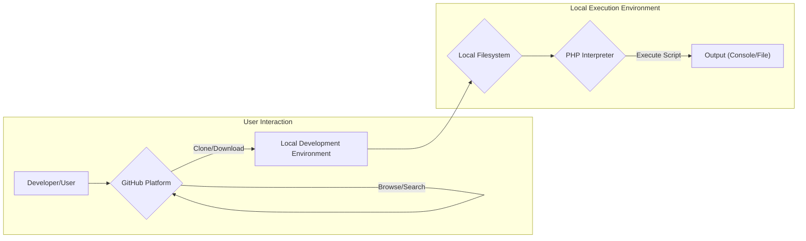
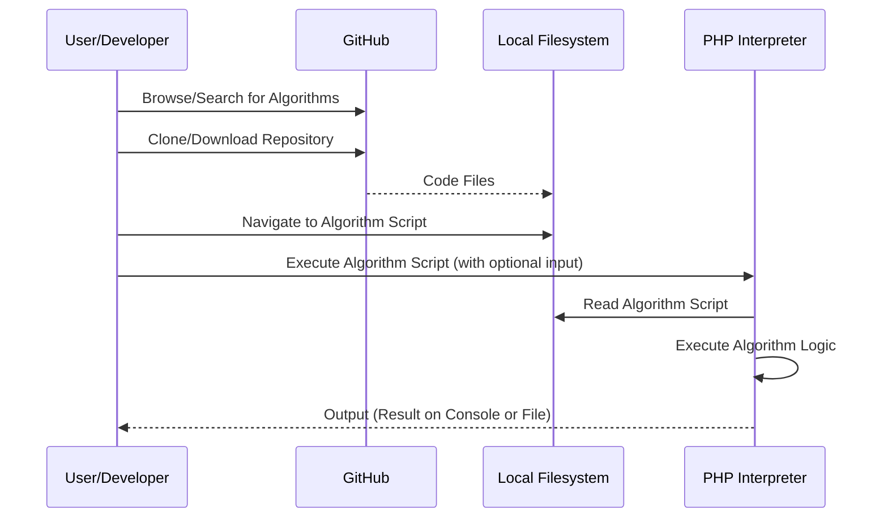

# Project Design Document: thealgorithms/php

**Version:** 1.1
**Date:** October 26, 2023
**Author:** AI Software Architect

## 1. Project Overview

The `thealgorithms/php` project, hosted on GitHub, is a community-driven, open-source repository providing implementations of various computer science algorithms and data structures written in the PHP programming language. It serves as a valuable educational resource for individuals learning about algorithms and as a practical code reference for developers. The project emphasizes clarity, conciseness, and well-documented implementations of fundamental algorithms.

## 2. Goals and Objectives

* **Comprehensive Educational Resource:** To offer a wide range of algorithm and data structure implementations for educational purposes, aiding in understanding their logic and behavior.
* **Practical Code Reference:** To provide developers with readily available, tested, and understandable code examples that can be used directly or adapted for their projects.
* **Foster Community Contribution:** To encourage contributions from the global developer community, leading to a richer collection of algorithms and continuous improvement of existing implementations.
* **Demonstrate PHP Best Practices:** To showcase good coding practices, clear variable naming, and logical structure within the PHP language for implementing algorithms.
* **Promote Algorithmic Thinking:** To inspire users to think algorithmically and understand the underlying principles behind common computational tasks.

## 3. Target Audience

* **Computer Science Students:** Learning the fundamentals of algorithms and data structures as part of their academic curriculum.
* **Software Developers:** Seeking reference implementations of algorithms for use in their projects or to refresh their understanding of specific algorithms.
* **Educators and Teachers:** Utilizing the repository as a supplementary resource for teaching algorithm concepts and providing practical examples.
* **Open-Source Contributors:** Developers interested in contributing new algorithm implementations, improving existing code, or adding documentation.
* **Hobbyist Programmers:** Individuals exploring algorithms and data structures for personal learning and development.

## 4. System Architecture

The project's architecture is fundamentally file-based, organized logically into directories that categorize algorithms by type or data structure. It doesn't represent a continuously running application but rather a collection of individual, executable PHP scripts. The primary interaction points are through accessing the code repository and executing the individual scripts.

### 4.1. Components

* **GitHub Platform:**
    * **Description:** The web-based platform hosting the project's Git repository.
    * **Functionality:** Provides version control, issue tracking, pull request management, code browsing, search functionality, and community interaction features.
    * **Technology:** Git, GitHub infrastructure.

* **Local Development Environment:**
    * **Description:** The developer's or user's local machine equipped with the necessary tools to interact with the repository and execute PHP scripts.
    * **Functionality:**  Provides the environment for cloning the repository, storing files, and running the PHP interpreter.

* **Local Filesystem:**
    * **Description:** The file system on the user's local machine where the project's files are stored after cloning or downloading.
    * **Functionality:** Organizes and stores the PHP scripts, documentation, and any other project-related files.

* **PHP Interpreter:**
    * **Description:** The software that executes PHP code. Users will need this installed on their local machine.
    * **Functionality:** Parses and executes the PHP scripts containing the algorithm implementations.
    * **Technology:** PHP (specific versions may be required or recommended).

* **Algorithm Scripts (.php files):**
    * **Description:** Individual PHP files, each containing the implementation of a specific algorithm or data structure.
    * **Functionality:** Contains the PHP code that defines the logic of the algorithm. May accept input and produce output.
    * **Technology:** PHP.

* **Documentation Files (e.g., README.md, algorithm-specific READMEs):**
    * **Description:** Markdown files providing project-level information, instructions on usage, and explanations of individual algorithms.
    * **Functionality:** Explains the purpose, implementation details, usage examples, and potential complexities of the algorithms.
    * **Technology:** Markdown.

* **Example/Test Scripts (Potentially within algorithm files or separate):**
    * **Description:** Snippets of PHP code or separate files demonstrating how to use the implemented algorithms.
    * **Functionality:** Provides practical examples of how to call the algorithm functions and interpret the results. May include basic unit tests.
    * **Technology:** PHP.

## 5. Data Flow

The primary data flow involves a user obtaining the code and then executing specific algorithm scripts.

**Detailed Flow:**

1. **Discovery and Acquisition:** A user discovers the project on GitHub, potentially browsing through the directory structure or searching for specific algorithms. They then acquire the code by cloning the repository using Git or downloading a ZIP archive.
2. **Local Storage:** The repository's files are stored on the user's local filesystem, maintaining the directory structure.
3. **Script Selection:** The user navigates to the specific directory containing the algorithm script they wish to execute using a command-line interface or a file explorer.
4. **Execution Initiation:** The user invokes the PHP interpreter, specifying the path to the desired algorithm script as an argument (e.g., `php sorting/bubble_sort.php`). They might also provide input data as command-line arguments or the script might contain hardcoded input.
5. **Code Reading and Interpretation:** The PHP interpreter reads the contents of the specified PHP file from the local filesystem. It then parses and begins executing the PHP code.
6. **Algorithm Execution:** The PHP interpreter executes the logic defined within the algorithm script. This may involve processing input data, performing calculations or manipulations according to the algorithm's steps, and generating output.
7. **Output Generation:** The algorithm script produces output, which is typically displayed on the user's console (standard output) or potentially written to a file, depending on the script's implementation.

## 6. Security Considerations

Given the nature of the project as a collection of code examples, the primary security considerations focus on the potential risks associated with using or integrating these algorithms into other systems.

* **Input Validation Vulnerabilities:** If the algorithms are incorporated into larger applications and directly process user-supplied data without proper validation and sanitization, they could be susceptible to various injection attacks (e.g., SQL injection if the algorithm interacts with a database, command injection if it executes system commands).
* **Algorithmic Complexity and Denial of Service (DoS):** Certain algorithms, particularly those with high time or space complexity, could be exploited with carefully crafted input to cause excessive resource consumption (CPU, memory), leading to a denial of service if used in a live application.
* **Supply Chain Attacks:** The risk of malicious code being introduced into the repository through compromised contributor accounts, malicious pull requests, or vulnerabilities in development dependencies (though the project has minimal dependencies). Rigorous code review processes are crucial.
* **Information Disclosure through Algorithmic Flaws:** In scenarios where algorithms process sensitive data within a larger system, subtle flaws in the algorithm's logic could unintentionally leak or expose sensitive information.
* **Code Execution Vulnerabilities (Less likely in isolation):** While less probable in the context of simply running individual scripts, if the algorithms are used in a dynamic evaluation context (e.g., `eval()` in PHP, which is generally discouraged), it could introduce severe code execution vulnerabilities.
* **Licensing and Intellectual Property:** Ensuring that all contributed code adheres to the project's licensing terms and respects the intellectual property rights of others.
* **Cross-Site Scripting (XSS) (Indirect Risk):** If the output of these algorithms is directly displayed in a web application without proper encoding, it could potentially lead to XSS vulnerabilities in that application.

## 7. Deployment Model

The `thealgorithms/php` project is not deployed as a standalone application. Instead, its components are intended for the following uses:

* **Local Cloning/Download for Learning:** Users clone or download the repository to their local machines to browse the code, understand algorithm implementations, and execute individual scripts for educational purposes.
* **Inclusion in Other PHP Projects:** Developers may copy or include specific algorithm files or functions into their own PHP projects to leverage the implemented algorithms within their applications. This is the primary "deployment" scenario.
* **Direct Execution for Testing and Demonstration:** Individual algorithm scripts can be executed directly from the command line using the PHP interpreter for testing, debugging, or demonstrating the algorithm's behavior.

## 8. Technologies Used

* **Programming Language:** PHP
* **Version Control System:** Git
* **Platform for Hosting:** GitHub
* **Markup Language for Documentation:** Markdown

## 9. Assumptions and Constraints

* **PHP Interpreter Availability:** It is assumed that users have a correctly configured PHP interpreter installed on their local system to execute the provided scripts.
* **Basic PHP Programming Knowledge:** Users are expected to possess a foundational understanding of PHP syntax and concepts to effectively utilize and understand the code.
* **GitHub Account for Contributions:** Contributing to the project requires a GitHub account for submitting pull requests and participating in discussions.
* **Open Source and Community-Driven:** The project's development and maintenance rely on the contributions of the open-source community.
* **Focus on Algorithmic Logic:** The primary focus is on the implementation of algorithms and data structures, not on building a complete, user-facing application.
* **No Persistent Data Storage within the Project:** The project itself does not incorporate any persistent data storage mechanisms like databases. Data is typically handled in-memory or through input/output operations during script execution.
* **Security of User's Environment:** The security of the user's local development environment (e.g., protection against malware) is assumed and is outside the scope of this project's direct security considerations.

This improved design document provides a more detailed and nuanced understanding of the `thealgorithms/php` project, offering a stronger foundation for subsequent threat modeling activities. The expanded descriptions of components, data flow, and security considerations aim to provide a comprehensive overview of the project's architecture and potential risk areas.