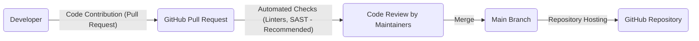

# BUSINESS POSTURE

This project, the 'php' repository within 'thealgorithms' organization on GitHub, serves as a comprehensive collection of algorithms implemented in PHP. It aims to be an educational resource and a practical guide for developers and students interested in learning and using algorithms in PHP.

- Business priorities:
  - Provide accurate and well-implemented algorithms in PHP.
  - Maintain a high standard of code quality and readability.
  - Offer a diverse range of algorithms covering various computer science domains.
  - Serve as a valuable educational resource for the community.
  - Encourage contributions and community involvement to expand and improve the repository.

- Business goals:
  - Become a widely recognized and trusted resource for PHP algorithms.
  - Increase community engagement and contributions to the repository.
  - Enhance the learning experience for users studying algorithms in PHP.
  - Maintain the repository as a relevant and up-to-date resource.

- Business risks:
  - Inaccurate or poorly implemented algorithms could mislead users and damage the repository's reputation.
  - Security vulnerabilities in the code examples, if copied and used in production, could lead to security incidents for users.
  - Lack of maintenance and updates could result in the repository becoming outdated and less useful over time.
  - Insufficient community engagement could hinder the growth and improvement of the repository.
  - Legal risks if algorithms infringe on patents or copyrights (though less likely for educational code).

# SECURITY POSTURE

The 'php' algorithms repository, being an open-source educational project, inherently carries a different security posture compared to a commercial application. The primary concern is to avoid disseminating insecure coding practices or vulnerable algorithms that could be misused if adopted by users in their projects.

- Existing security controls:
  - security control: GitHub platform security features - Access control to the repository is managed by GitHub roles.
  - security control: GitHub platform security features - Vulnerability scanning by GitHub Dependabot for dependencies (though this project likely has minimal dependencies).
  - security control: Code review process - Implicitly through pull request reviews by maintainers before merging contributions.

- Accepted risks:
  - accepted risk: Vulnerabilities in example code - Given the educational nature, the risk of vulnerabilities in example algorithms is accepted to a degree, with the understanding that these are examples and not production-ready code. However, efforts should be made to minimize this risk.
  - accepted risk: Misuse of code examples - Users might copy code examples directly into production systems without proper security review. This risk is accepted as the repository cannot control user behavior, but disclaimers and secure coding practices in examples can mitigate it.

- Recommended security controls:
  - security control: Implement automated static analysis security testing (SAST) in the CI/CD pipeline to scan code contributions for potential vulnerabilities before merging.
  - security control: Introduce code linters and formatters to enforce coding standards and reduce potential security issues arising from inconsistent code.
  - security control: Establish clear security guidelines for contributors, emphasizing secure coding practices and vulnerability prevention.
  - security control: Regularly review and update dependencies (if any) and algorithm implementations to address newly discovered vulnerabilities.
  - security control: Add a security policy file to the repository outlining the project's approach to security and how to report vulnerabilities.

- Security requirements:
  - Authentication: Not directly applicable to the repository itself as it is publicly accessible for reading. Contribution requires GitHub authentication, managed by GitHub.
  - Authorization: GitHub's role-based access control manages who can contribute (write access) to the repository.
  - Input validation: In algorithm examples that simulate user input or data processing, implement input validation to demonstrate secure practices and prevent potential injection vulnerabilities (e.g., in string manipulation examples).
  - Cryptography: If the repository includes cryptographic algorithms, ensure they are implemented correctly and securely, using well-established libraries or best practices. Avoid demonstrating insecure cryptographic practices.

# DESIGN

The 'php' algorithms repository is fundamentally a collection of code files organized within a GitHub repository. The design is centered around making these algorithms accessible, understandable, and maintainable.

## C4 CONTEXT

```mermaid
graph LR
    subgraph GitHub "GitHub Cloud"
        SystemBoundary(php Repository)
    end
    User(Developers) --> SystemBoundary
    User(Students) --> SystemBoundary
    User(Educators) --> SystemBoundary
    SystemBoundary -- "Uses for version control, hosting, access" --> GitHub
```

- Elements of Context Diagram:
  - - Name: Developers
    - Type: User
    - Description: Software developers who use the repository as a reference, learning resource, or to contribute algorithms.
    - Responsibilities: Learning algorithms, using code examples, contributing new algorithms, reporting issues.
    - Security controls: GitHub account security (for contributors).
  - - Name: Students
    - Type: User
    - Description: Students learning about algorithms and data structures, using the repository for educational purposes.
    - Responsibilities: Studying algorithms, understanding code examples, potentially running examples locally.
    - Security controls: None directly interacting with the repository's security.
  - - Name: Educators
    - Type: User
    - Description: Teachers and educators who use the repository as a teaching aid or reference material for their courses.
    - Responsibilities: Using algorithms in teaching, recommending the repository to students.
    - Security controls: None directly interacting with the repository's security.
  - - Name: php Repository
    - Type: System
    - Description: The GitHub repository containing PHP implementations of various algorithms.
    - Responsibilities: Storing and providing access to algorithm code, managing contributions, version control.
    - Security controls: GitHub platform security controls, recommended security controls for code quality and vulnerability prevention (SAST, linters).
  - - Name: GitHub
    - Type: System
    - Description: The GitHub platform hosting the repository, providing version control, access control, and collaboration features.
    - Responsibilities: Hosting the repository, providing access control, managing issues and pull requests, providing platform security.
    - Security controls: GitHub platform security controls (authentication, authorization, infrastructure security, vulnerability scanning).

## C4 CONTAINER

```mermaid
graph LR
    subgraph GitHub "GitHub Cloud"
        subgraph RepositoryContainer [PHP Algorithms Repository]
            CodeFiles(Code Files)
        end
    end
    Developers -- "Clone, Fork, Contribute" --> RepositoryContainer
    Students -- "Browse, Clone" --> RepositoryContainer
    Educators -- "Browse, Clone" --> RepositoryContainer
```

- Elements of Container Diagram:
  - - Name: Code Files
    - Type: Container
    - Description: PHP files containing implementations of various algorithms, organized by category.
    - Responsibilities: Storing algorithm implementations, providing code examples, being the core content of the repository.
    - Security controls: Code review, SAST, linters, secure coding practices applied to the code within these files.
  - - Name: PHP Algorithms Repository
    - Type: Container
    - Description: Logical container representing the entire GitHub repository and its contents.
    - Responsibilities: Organizing code files, managing versions, handling contributions, providing access to users.
    - Security controls: GitHub platform security controls, repository-level settings (branch protection, etc.), recommended security controls for the repository (security policy, contribution guidelines).

## DEPLOYMENT

The 'php' algorithms repository is deployed on the GitHub platform. Users access it through web browsers or Git clients. There isn't a traditional "deployment" in the sense of deploying software to servers, as it's a code repository.

```mermaid
graph LR
    subgraph GitHub Infrastructure "GitHub Infrastructure"
        WebServer(Web Servers) -- "HTTPS" --> UserBrowser(User's Browser)
        GitServers(Git Servers) -- "Git Protocol" --> GitClient(User's Git Client)
        FileStorage(File Storage) --> WebServer
        FileStorage --> GitServers
    end
    UserBrowser -- "Browse Repository" --> WebServer
    GitClient -- "Clone, Fork, Pull, Push" --> GitServers
    RepositoryContent(Repository Content) --> FileStorage
```

- Elements of Deployment Diagram:
  - - Name: User's Browser
    - Type: Device
    - Description: Web browser used by users to access the GitHub website and browse the repository.
    - Responsibilities: Rendering web pages, interacting with the GitHub website.
    - Security controls: Browser security features, user's personal device security.
  - - Name: User's Git Client
    - Type: Application
    - Description: Git client application used by developers to clone, fork, and contribute to the repository.
    - Responsibilities: Interacting with Git servers, managing local repository copies.
    - Security controls: Git client security features, user's local system security.
  - - Name: Web Servers
    - Type: Infrastructure
    - Description: GitHub's web servers that host the website and provide access to repositories via HTTPS.
    - Responsibilities: Serving web pages, handling user requests, providing access to repository content via web interface.
    - Security controls: GitHub's web server security controls (firewalls, intrusion detection, access logs, HTTPS encryption).
  - - Name: Git Servers
    - Type: Infrastructure
    - Description: GitHub's Git servers that manage repository data and handle Git protocol interactions.
    - Responsibilities: Storing repository data, managing version control, handling Git client requests (clone, push, pull).
    - Security controls: GitHub's Git server security controls (access control, authentication, authorization, data encryption at rest and in transit).
  - - Name: File Storage
    - Type: Infrastructure
    - Description: GitHub's storage infrastructure for storing repository files and data.
    - Responsibilities: Persistently storing repository content, providing access to web and Git servers.
    - Security controls: GitHub's storage security controls (data encryption at rest, backups, access control).
  - - Name: Repository Content
    - Type: Data
    - Description: The files and data comprising the 'php' algorithms repository.
    - Responsibilities: Storing algorithm implementations, documentation, and repository metadata.
    - Security controls: Access control via GitHub, integrity checks, version control.

## BUILD

The build process for this repository is primarily focused on code contributions and quality checks rather than a traditional software build.



- Elements of Build Diagram:
  - - Name: Developer
    - Type: Actor
    - Description: Individual contributing code to the repository.
    - Responsibilities: Writing code, submitting pull requests, addressing feedback.
    - Security controls: Developer's local development environment security, secure coding practices.
  - - Name: GitHub Pull Request
    - Type: Process
    - Description: GitHub's pull request mechanism for submitting and reviewing code contributions.
    - Responsibilities: Facilitating code review, tracking changes, managing contribution workflow.
    - Security controls: GitHub's pull request security features (branch protection, required reviews).
  - - Name: Automated Checks (Linters, SAST - Recommended)
    - Type: Process
    - Description: Automated checks (linters, static analysis security testing) run on pull requests to ensure code quality and security. (Recommended to be implemented).
    - Responsibilities: Automatically verifying code quality, identifying potential vulnerabilities, enforcing coding standards.
    - Security controls: Configuration of linters and SAST tools, secure configuration of CI/CD pipeline (if used).
  - - Name: Code Review by Maintainers
    - Type: Process
    - Description: Manual code review performed by repository maintainers to ensure code quality, correctness, and security before merging.
    - Responsibilities: Reviewing code changes, providing feedback, ensuring code quality and security.
    - Security controls: Maintainer's code review expertise, adherence to security guidelines.
  - - Name: Main Branch
    - Type: Data Store
    - Description: The main branch of the repository, containing the accepted and merged code.
    - Responsibilities: Storing the current stable version of the algorithm implementations.
    - Security controls: Branch protection rules on GitHub, access control to merge into the main branch.
  - - Name: GitHub Repository
    - Type: System
    - Description: The hosted GitHub repository containing the main branch and all code.
    - Responsibilities: Hosting the code, providing access to users, managing versions.
    - Security controls: GitHub platform security controls.

# RISK ASSESSMENT

- Critical business process: Maintaining the integrity and accuracy of the algorithm implementations and providing a secure and reliable educational resource.
- Data we are trying to protect:
  - Code examples: Sensitivity - Publicly available, but integrity is crucial. Modification or corruption could lead to incorrect or insecure examples being disseminated.
  - Repository metadata (issues, pull requests, etc.): Sensitivity - Publicly available, but integrity is important for maintaining the project's history and workflow.
- Data sensitivity classification: Public. However, integrity and availability are key to the repository's value and reputation. The main security concern is ensuring that the code examples are not vulnerable or misleading, and that the repository itself is available and accessible.

# QUESTIONS & ASSUMPTIONS

- Questions:
  - Are there any existing automated checks (linters, SAST) in place for pull requests?
  - Are there any formal security guidelines for contributors?
  - What is the process for handling reported security vulnerabilities in the repository?
  - Is there a roadmap for future development and maintenance of the repository?
  - What are the maintainers' priorities regarding security improvements for the repository?

- Assumptions:
  - The primary purpose of the repository is educational.
  - Security is considered important to avoid teaching insecure practices, but it's not a mission-critical production system.
  - The maintainers are open to improving the security posture of the repository.
  - Contributions are reviewed by maintainers before being merged.
  - The repository is intended to be a community resource and welcomes contributions.