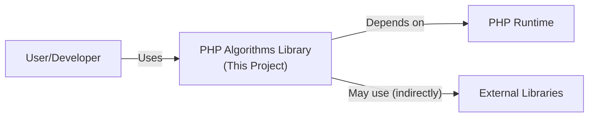
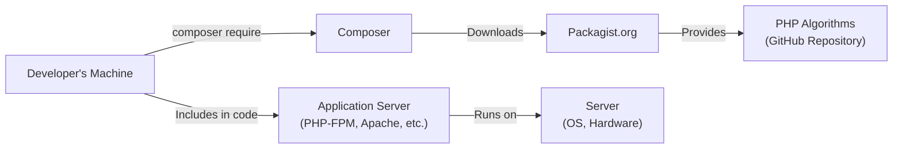
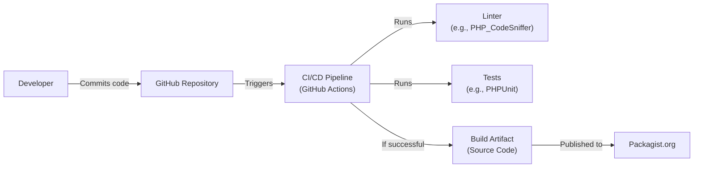

Okay, let's create a design document for the PHP algorithms repository.

# BUSINESS POSTURE

Business Priorities and Goals:

*   Provide a publicly accessible, open-source library of algorithms implemented in PHP.
*   Serve as an educational resource for learning and understanding various algorithms.
*   Facilitate code reuse and reduce the need for developers to "reinvent the wheel."
*   Maintain a high level of code quality and correctness.
*   Foster a community of contributors to expand and maintain the library.

Most Important Business Risks:

*   Malicious code injection: The primary risk is that a contributor (either intentionally or unintentionally) introduces malicious code into the repository. This could lead to vulnerabilities in applications that use this library.
*   Incorrect algorithm implementations: Bugs or errors in the algorithms could lead to incorrect results, potentially causing data corruption or other application failures.
*   Reputational damage: Vulnerabilities or significant quality issues could damage the reputation of the project and its maintainers.
*   Lack of maintenance: If the project is not actively maintained, it may become outdated, insecure, or incompatible with newer PHP versions.
*   License violations: Improper use or attribution of code could lead to legal issues.

# SECURITY POSTURE

Existing Security Controls:

*   security control: Code Review: Pull requests are used, implying a code review process before merging changes. (Described in contribution guidelines).
*   security control: Community Vetting: Being open-source, the code is subject to scrutiny by a wider community, increasing the chances of identifying issues. (Implicit in the open-source nature).
*   security control: Static Analysis: Basic linting is likely used to enforce coding standards. (Implied by the presence of .editorconfig and basic CI).
*   security control: Version Control: Git is used for version control, allowing for tracking changes and reverting to previous states. (Fundamental to GitHub).

Accepted Risks:

*   accepted risk: Limited Security Testing: There's no explicit mention of comprehensive security testing (e.g., SAST, DAST, fuzzing) beyond basic linting.
*   accepted risk: Dependency Vulnerabilities: The project may indirectly depend on external libraries (though this is minimized in this specific case), which could introduce vulnerabilities.
*   accepted risk: Single Point of Failure: Reliance on GitHub as the sole hosting platform.
*   accepted risk: Contributor Trust: The project relies on the good faith and competence of contributors.

Recommended Security Controls:

*   security control: Implement SAST: Integrate a Static Application Security Testing tool into the CI pipeline to automatically scan for common vulnerabilities.
*   security control: Implement Dependency Analysis: Use a tool to scan for known vulnerabilities in any dependencies (even indirect ones).
*   security control: Code Signing: Consider code signing releases to ensure integrity and authenticity.
*   security control: Security Policy: Create a `SECURITY.md` file outlining the project's security policy and vulnerability reporting process.
*   security control: Contributor Guidelines: Enhance contributor guidelines to explicitly address security best practices.

Security Requirements:

*   Authentication: Not directly applicable, as this is a library, not an application with user accounts. Authentication would be handled by the applications *using* the library.
*   Authorization: Not directly applicable, as there are no user roles or permissions within the library itself. Authorization would be the responsibility of applications using the library.
*   Input Validation:
    *   Requirement: Algorithms should handle edge cases and invalid inputs gracefully. This might involve throwing exceptions or returning specific error codes.
    *   Requirement: Type hinting should be used extensively to enforce expected data types.
    *   Requirement: Input validation should be performed at the entry points of public-facing functions.
*   Cryptography:
    *   Requirement: If any cryptographic algorithms are implemented, they must adhere to industry best practices and use established, well-vetted libraries (or built-in PHP functions) whenever possible. Avoid "rolling your own crypto."
    *   Requirement: Cryptographic keys should never be hardcoded within the library.
*   General:
    *   Requirement: Follow secure coding practices for PHP, avoiding common vulnerabilities like injection flaws, cross-site scripting (XSS), etc. (though XSS is less relevant for a library).
    *   Requirement: Regularly update any dependencies to their latest secure versions.

# DESIGN

## C4 CONTEXT

Element Descriptions:

*   Element:
    *   Name: User/Developer
    *   Type: Person
    *   Description: A software developer who uses the PHP Algorithms library in their application.
    *   Responsibilities: Integrates the library into their application, calls the library's functions, handles any errors or exceptions.
    *   Security controls: Implements appropriate security controls within their own application, including input validation, authentication, and authorization.

*   Element:
    *   Name: PHP Algorithms Library (This Project)
    *   Type: Software System
    *   Description: A collection of algorithms implemented in PHP.
    *   Responsibilities: Provides implementations of various algorithms, maintains code quality, ensures correctness.
    *   Security controls: Code review, static analysis (linting), community vetting.

*   Element:
    *   Name: PHP Runtime
    *   Type: Software System
    *   Description: The PHP interpreter that executes the code.
    *   Responsibilities: Executes PHP code, provides built-in functions and libraries.
    *   Security controls: Relies on the security of the installed PHP version and its configuration.

*   Element:
    *   Name: External Libraries
    *   Type: Software System
    *   Description: Any external libraries that the algorithms might use (though this is minimized in this project).
    *   Responsibilities: Provides specific functionality not covered by the PHP standard library.
    *   Security controls: Relies on the security of the external libraries themselves.

## C4 CONTAINER

Since this project is a simple library, the container diagram is essentially the same as the context diagram.  It doesn't have separate deployable units.

Element Descriptions:

*   Element:
    *   Name: User/Developer
    *   Type: Person
    *   Description: A software developer who uses the PHP Algorithms library in their application.
    *   Responsibilities: Integrates the library into their application, calls the library's functions, handles any errors or exceptions.
    *   Security controls: Implements appropriate security controls within their own application, including input validation, authentication, and authorization.

*   Element:
    *   Name: PHP Algorithms Library (This Project)
    *   Type: Software System
    *   Description: A collection of algorithms implemented in PHP. This is a single, cohesive codebase.
    *   Responsibilities: Provides implementations of various algorithms, maintains code quality, ensures correctness.
    *   Security controls: Code review, static analysis (linting), community vetting.

*   Element:
    *   Name: PHP Runtime
    *   Type: Software System
    *   Description: The PHP interpreter that executes the code.
    *   Responsibilities: Executes PHP code, provides built-in functions and libraries.
    *   Security controls: Relies on the security of the installed PHP version and its configuration.

*   Element:
    *   Name: External Libraries
    *   Type: Software System
    *   Description: Any external libraries that the algorithms might use (though this is minimized in this project).
    *   Responsibilities: Provides specific functionality not covered by the PHP standard library.
    *   Security controls: Relies on the security of the external libraries themselves.

## DEPLOYMENT

Possible Deployment Solutions:

1.  Manual Download: Users download the source code directly from GitHub.
2.  Composer: Users include the library as a dependency via Composer (preferred).
3.  Git Submodule/Subtree: Users include the repository as a submodule or subtree within their own Git repository.

Chosen Solution (Composer):

Element Descriptions:

*   Element:
    *   Name: Developer's Machine
    *   Type: Infrastructure Node
    *   Description: The developer's local development environment.
    *   Responsibilities: Writing code, running tests, managing dependencies.
    *   Security controls: Relies on the security of the developer's machine and their development tools.

*   Element:
    *   Name: Composer
    *   Type: Software System
    *   Description: PHP's dependency manager.
    *   Responsibilities: Resolves and downloads project dependencies.
    *   Security controls: Relies on the integrity of Packagist.org and the downloaded packages. Uses HTTPS.

*   Element:
    *   Name: Packagist.org
    *   Type: Software System
    *   Description: The main Composer package repository.
    *   Responsibilities: Hosts and serves PHP packages.
    *   Security controls: Packagist.org's own security measures (HTTPS, etc.).

*   Element:
    *   Name: PHP Algorithms (GitHub Repository)
    *   Type: Software System
    *   Description: The source code repository on GitHub.
    *   Responsibilities: Stores the code, manages versions, handles pull requests.
    *   Security controls: GitHub's security features, code review process.

*   Element:
    *   Name: Application Server (PHP-FPM, Apache, etc.)
    *   Type: Software System
    *   Description: The server environment that runs the PHP application.
    *   Responsibilities: Executes the application code, including the algorithms library.
    *   Security controls: Relies on the security configuration of the server software (e.g., PHP-FPM, Apache), including file permissions, security modules, etc.

*   Element:
    *   Name: Server (OS, Hardware)
    *   Type: Infrastructure Node
    *   Description: The physical or virtual server that hosts the application.
    *   Responsibilities: Provides the underlying infrastructure for the application.
    *   Security controls: Relies on the security of the operating system, network configuration, and physical security (if applicable).

## BUILD

Build Process Description:

1.  A developer commits code to the GitHub repository.
2.  This triggers the CI/CD pipeline (GitHub Actions).
3.  The CI pipeline runs a linter (e.g., PHP_CodeSniffer) to check for coding style violations.
4.  The CI pipeline runs unit tests (likely using PHPUnit, although not explicitly present in the repository at the time of this analysis) to verify the correctness of the algorithms.
5.  If both the linting and tests pass, the build is considered successful.
6.  The build artifact (which in this case is simply the source code itself) is implicitly "published" by virtue of being in the repository.  A tagged release on GitHub would typically be used to create a version for Packagist.
7.  Packagist.org indexes the repository and makes it available for download via Composer.

Security Controls in Build Process:

*   security control: Linting: Enforces coding standards and can help prevent some basic errors.
*   security control: Automated Testing: Unit tests help ensure the correctness of the algorithms and can catch regressions.
*   security control: CI/CD Pipeline: Automates the build and testing process, ensuring consistency and reducing the risk of manual errors.
*   security control: (Recommended) SAST: Integrate a Static Application Security Testing tool into the CI pipeline.
*   security control: (Recommended) Dependency Analysis: Integrate a tool to scan for vulnerable dependencies.

# RISK ASSESSMENT

Critical Business Processes:

*   Providing correct and reliable algorithm implementations.
*   Maintaining a secure and trustworthy code repository.
*   Fostering a healthy and active community of contributors.

Data to Protect:

*   Source Code: Sensitivity - Medium. While the code is public, unauthorized modifications could introduce vulnerabilities.
*   Contributor Information (e.g., email addresses): Sensitivity - Low. Publicly available on GitHub.
*   (Potentially) Usage Data: Sensitivity - Low to Medium. If the project were to collect usage data (which it currently doesn't), this data could be sensitive depending on its nature.

# QUESTIONS & ASSUMPTIONS

Questions:

*   Are there any plans to add more formal testing (e.g., PHPUnit) to the repository?
*   Are there any specific performance requirements for the algorithms?
*   Are there any plans to support older versions of PHP, or is there a minimum supported version?
*   Is there a process for handling security vulnerability reports? (Should be documented in a `SECURITY.md` file).
*   What is the long-term maintenance plan for the project?

Assumptions:

*   BUSINESS POSTURE: The primary goal is to provide a freely available and educational resource.  Profit is not a primary driver.
*   SECURITY POSTURE: The project relies heavily on community contributions and the inherent security of GitHub.  There is a limited budget for dedicated security tooling.
*   DESIGN: The library is intended to be simple and easy to use, with minimal external dependencies. The project is assumed to be used as a library within other PHP applications, and not as a standalone application.