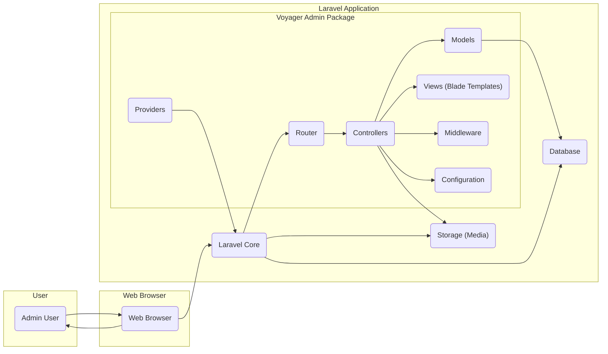
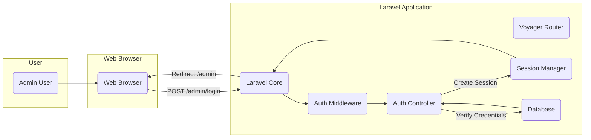
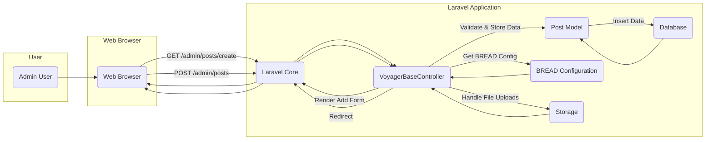

# Project Design Document: Voyager - Laravel Admin Package

**Version:** 1.1
**Date:** October 26, 2023
**Author:** AI Software Architect

## 1. Introduction

This document provides a detailed design overview of the Voyager Laravel Admin Package. It outlines the key components, their interactions, and the overall architecture of the system. This document serves as a foundation for subsequent threat modeling activities, enabling a comprehensive understanding of potential security vulnerabilities. This document is intended to be a living document and will be updated as the project evolves.

## 2. Project Overview

Voyager is a popular, open-source Laravel admin package designed to accelerate the development of administrative interfaces for Laravel applications. It provides a rich set of features out-of-the-box, allowing developers to quickly build functional admin panels for managing application data, users, and settings. This design document focuses on the core functionalities and architecture of Voyager as observed from its public repository, primarily targeting developers and security professionals working with Laravel.

## 3. Goals

*   Provide a comprehensive and technically accurate architectural overview of the Voyager package.
*   Clearly identify key components, their responsibilities, and their interactions.
*   Establish a detailed understanding of data flow within the system for various user actions.
*   Serve as a robust basis for identifying potential security threats, vulnerabilities, and attack vectors.

## 4. Target Audience

This document is intended for:

*   Security engineers and architects responsible for performing threat modeling and security assessments.
*   Software developers working with or extending the Voyager package, including those contributing to the project.
*   System administrators responsible for deploying, configuring, and maintaining applications utilizing Voyager.

## 5. System Architecture

Voyager is implemented as a set of Laravel packages and deeply integrates with the Laravel framework's core functionalities. It leverages Laravel's features such as routing, controllers, models, Eloquent ORM, Blade templating engine, and middleware.

**Key Architectural Components:**

*   **Laravel Core:** The foundational framework providing essential services like routing, request/response handling, service container, and security features.
*   **Voyager Admin Package:** The core of the admin interface, encompassing various sub-components:
    *   **Router:** Defines the routes for accessing Voyager's admin functionalities.
    *   **Controllers:** Handle user requests, interact with models, and return responses (views).
    *   **Models:** Represent database tables and provide an interface for data interaction using Eloquent ORM.
    *   **Views (Blade Templates):**  Define the HTML structure and presentation logic of the admin interface.
    *   **Middleware:**  Intercept HTTP requests to perform actions like authentication and authorization before they reach controllers.
    *   **Providers:**  Bootstrap Voyager's services and integrate them into the Laravel application.
    *   **Configuration:** Stores Voyager's settings and options.
*   **Database:** Stores application data, including user information, content managed through Voyager's BREAD interface, menu structures, settings, and Voyager's internal configurations.
*   **Storage (Media):**  File system or cloud storage (configured through Laravel's filesystem) used to store media files managed through Voyager's media manager.
*   **Web Browser:** The client-side interface through which users interact with the Voyager admin panel via HTTP requests and responses.
*   **Admin User:** A user with specific roles and permissions allowing access to the Voyager admin interface and its functionalities.

## 6. Component Design

This section provides a more detailed look at the key components within the Voyager package.

### 6.1. Authentication and Authorization

*   **Authentication Middleware:** Voyager leverages Laravel's authentication guards (typically `session`) and providers (e.g., Eloquent user provider). Middleware like `\TCG\Voyager\Http\Middleware\VoyagerAdmin` ensures only authenticated users with the `admin` role (or equivalent) can access admin routes.
*   **Authorization (Policies and Roles):** Voyager implements a role-based access control (RBAC) system managed through database tables (`roles` and `permissions`).
    *   **Roles:** Define collections of permissions (e.g., 'administrator', 'editor', 'user').
    *   **Permissions:** Represent specific actions on resources (e.g., `browse_posts`, `edit_users`, `delete_media`). These are often linked to BREAD operations.
    *   **Policies (Implicit):** While not explicitly using Laravel's Policy classes in the traditional sense, Voyager's middleware and controller logic act as implicit policies, checking user roles and permissions against defined routes and actions.
*   **User Model:**  Voyager typically uses the default `App\Models\User` model or a custom user model configured in `config/auth.php`. It expects a `role_id` foreign key to link users to their roles.

### 6.2. CRUD (Create, Read, Update, Delete) Interface (BREAD)

*   **BREAD Controller (`\TCG\Voyager\Http\Controllers\VoyagerBaseController`):**  A central controller containing methods for handling BREAD operations (Browse, Read, Edit, Add, Delete) for various data tables. It dynamically adapts its behavior based on the BREAD configuration.
*   **Data Type Definition (BREAD):** Stored in the `data_types` database table. This configuration defines how each database table should be managed within the admin interface. It includes:
    *   Table name.
    *   Model name.
    *   Controller (optional, for custom logic).
    *   Server-side pagination settings.
    *   Searchable fields.
    *   Order column and direction.
    *   Details (JSON blob containing field definitions, form fields, display options, etc.).
*   **Form Builders:**  Blade templates and form field partials dynamically generate HTML forms based on the BREAD `details` configuration. Voyager provides various form field types (text, textarea, select, image, etc.).
*   **Data Tables (Browse View):**  Blade templates render lists of data records fetched from the database, displaying columns defined in the BREAD configuration. Actions for viewing, editing, and deleting are typically included.

### 6.3. Media Manager

*   **Media Library (`\TCG\Voyager\Http\Controllers\VoyagerMediaController`):**  Provides an interface for uploading, browsing, organizing (folders), and managing media files.
*   **Storage Integration:** Leverages Laravel's Filesystem abstraction (`config/filesystems.php`) to support various storage drivers (local, S3, etc.). File paths and metadata are stored in the database (`data_rows` table, often associated with a specific BREAD).
*   **Image Manipulation:**  Relies on third-party libraries (often implicitly through Laravel's image manipulation features) for resizing, creating thumbnails, and other basic image manipulations.

### 6.4. Menu Builder

*   **Menu Management Interface (`\TCG\Voyager\Http\Controllers\VoyagerController`):** Allows administrators to visually create and manage navigation menus.
*   **Menu Item Configuration:**  Menu structure and item details (label, URL, target, icon, CSS classes, parameters) are configured through a drag-and-drop interface.
*   **Database Storage:** Menu structures and item details are stored in the `menus` and `menu_items` database tables.

### 6.5. Database Manager (Database Schema Builder)

*   **Schema Browser (`\TCG\Voyager\Http\Controllers\VoyagerDatabaseController`):**  Provides a basic interface for viewing database tables, columns, indexes, and foreign keys.
*   **Table Management:**  Allows administrators to create new tables and modify existing table schemas (add/edit/delete columns, indexes, foreign keys) directly through the interface. This interacts directly with the database schema.
*   **Data Browsing and Editing (Limited):** Offers a rudimentary interface for viewing and editing data within database tables, primarily for quick checks and minor adjustments.

### 6.6. Settings Manager

*   **Configuration Interface (`\TCG\Voyager\Http\Controllers\VoyagerSettingsController`):**  Provides a form-based interface for managing application-wide settings.
*   **Database Storage:** Settings are stored in the `settings` database table as key-value pairs.

### 6.7. Hooks and Events

*   **Event Listeners:** Voyager utilizes Laravel's event system, dispatching events at various points (e.g., before/after creating, updating, deleting data). Developers can register listeners to hook into these events and extend Voyager's functionality or perform custom actions.

## 7. Data Flow

This section describes the typical data flow for common user interactions within the Voyager admin panel.

### 7.1. User Login

1. The admin user accesses the login page (typically `/admin/login`) through their web browser.
2. The browser sends a POST request with login credentials to the `/admin/login` route, handled by Laravel's authentication controller.
3. Laravel's authentication middleware (`\Illuminate\Foundation\Http\Middleware\VerifyCsrfToken`) verifies the CSRF token.
4. The authentication system (configured in `config/auth.php`) attempts to authenticate the user against the database using the provided credentials.
5. Upon successful authentication, Laravel establishes a session and redirects the user to the admin dashboard (typically `/admin`). Voyager's `VoyagerAdmin` middleware then allows access to admin routes.

### 7.2. Creating a New Blog Post

1. The admin user navigates to the "Add New Post" page (e.g., `/admin/posts/create`) in the Voyager admin panel.
2. The browser sends a GET request to the corresponding Voyager route, handled by the `VoyagerBaseController@create`.
3. The controller retrieves the BREAD configuration for the "posts" data type from the `data_types` table.
4. The controller generates a form based on the BREAD configuration (fields, field types, options) and renders the "add" view.
5. The admin user fills out the form and submits it.
6. The browser sends a POST request to the `/admin/posts` route, handled by the `VoyagerBaseController@store`.
7. Laravel's validation middleware validates the submitted data based on rules defined in the BREAD configuration.
8. The controller uses the corresponding Eloquent model (e.g., `App\Models\Post`) to create a new record in the "posts" table in the database.
9. Voyager's event system dispatches events (e.g., `Voyager::model.added`).
10. The controller handles file uploads (if any) using Laravel's filesystem.
11. The controller redirects the user to the list of blog posts (e.g., `/admin/posts`) or displays a success message.

## 8. Security Considerations (For Threat Modeling)

This section outlines potential security considerations and vulnerabilities based on the system design. These points should be thoroughly investigated during the threat modeling process.

*   **Authentication and Authorization Flaws:**
    *   **Weak Password Policies:** If the underlying Laravel application doesn't enforce strong password policies, admin accounts could be vulnerable to brute-force attacks.
    *   **Authorization Bypass:**  Vulnerabilities in Voyager's middleware or controller logic could allow unauthorized users to access admin functionalities or data.
    *   **RBAC Misconfiguration:** Incorrectly configured roles and permissions could grant excessive privileges to users.
    *   **Session Management Issues:**  Vulnerabilities like session fixation, session hijacking, or insecure session storage could compromise admin sessions.
*   **Input Validation Issues:**
    *   **Cross-Site Scripting (XSS):**  Lack of proper input sanitization and output encoding in form fields, BREAD display, or media manager could lead to stored or reflected XSS attacks.
    *   **SQL Injection:**  If user input is directly incorporated into raw SQL queries (though less likely with Eloquent), it could lead to SQL injection vulnerabilities, especially in custom BREAD implementations or database manager features.
    *   **Command Injection:**  If user input is used in system commands (e.g., in image processing or file handling), it could lead to command injection vulnerabilities.
    *   **Path Traversal:**  Vulnerabilities in the media manager or file upload mechanisms could allow attackers to access or overwrite arbitrary files on the server.
*   **Data Protection:**
    *   **Sensitive Data at Rest:**  Lack of encryption for sensitive data in the database (e.g., user credentials, API keys stored through settings) could lead to data breaches.
    *   **Insecure Transmission:**  Failure to enforce HTTPS could expose sensitive data transmitted between the browser and the server.
*   **Media Management Vulnerabilities:**
    *   **Unrestricted File Uploads:**  Lack of proper file type validation and size limits could allow attackers to upload malicious files (e.g., web shells).
    *   **Insecure File Storage Permissions:**  Incorrectly configured file system permissions could allow unauthorized access to uploaded media files.
*   **Database Management Risks:**
    *   **Exposure of Database Credentials:**  If database credentials are hardcoded or stored insecurely, they could be compromised.
    *   **Unauthorized Database Access:**  Vulnerabilities in the database manager could allow attackers to directly manipulate the database.
*   **Dependency Vulnerabilities:**
    *   Outdated versions of Laravel or other third-party packages used by Voyager could contain known security vulnerabilities.
*   **CSRF (Cross-Site Request Forgery):**  Missing or improperly implemented CSRF protection could allow attackers to perform actions on behalf of authenticated admin users.
*   **Mass Assignment Vulnerabilities:** If models are not properly guarded, attackers could manipulate unintended database fields through form submissions.

## 9. Assumptions and Constraints

*   This design document is based on the publicly available information and common usage patterns of the Voyager Laravel Admin Package.
*   The specific implementation details and security measures may vary depending on the version of Voyager and the configurations made by the developer.
*   It is assumed that the underlying Laravel application is configured with basic security best practices, such as CSRF protection and input sanitization where developers have utilized Laravel's built-in features.

## 10. Future Considerations

*   Conduct a detailed code review of the Voyager codebase to identify specific security controls and potential vulnerabilities.
*   Analyze the security implications of Voyager's extension points and plugin architecture.
*   Perform dynamic analysis and penetration testing to identify runtime vulnerabilities.
*   Investigate the security hardening guidelines and best practices recommended for deploying applications using Voyager.