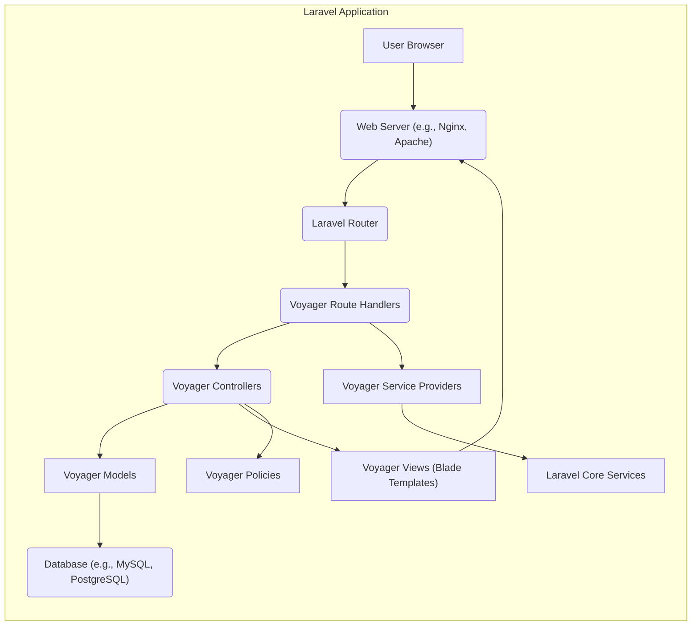
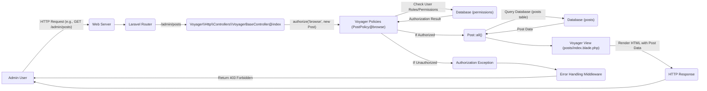

# Project Design Document: Voyager - Laravel Admin Package

**Version:** 1.1
**Date:** October 26, 2023
**Author:** AI Software Architect

## 1. Introduction

This document provides a detailed design overview of the Voyager Laravel Admin Package. It outlines the architecture, key components, data flow, and security considerations of the system. This document will serve as a foundation for future threat modeling activities.

Voyager is a Laravel package that provides a comprehensive admin interface for managing the content and settings of a web application. It offers features like a BREAD (Browse, Read, Edit, Add, Delete) interface for database tables, a media manager, a menu builder, and more. This document aims to provide a clear understanding of Voyager's internal workings for security analysis.

## 2. Goals and Objectives

The primary goals of Voyager are:

*   Provide a user-friendly interface for managing application data.
*   Simplify common administrative tasks for developers.
*   Offer a customizable and extensible admin panel.
*   Integrate seamlessly with Laravel applications, adhering to its conventions.
*   Reduce the development time required for building administrative interfaces.

## 3. Target Audience

This document is intended for:

*   Security engineers and architects performing threat modeling and security audits.
*   Developers working with or extending the Voyager package, requiring a deeper understanding of its architecture.
*   Operations teams responsible for deploying and maintaining applications using Voyager, needing insights into its dependencies and structure.

## 4. High-Level Architecture

Voyager is implemented as a set of Laravel Service Providers, Facades, Controllers, Models, Policies, Views, and Assets. It deeply leverages Laravel's routing, authentication, authorization, and database features.

*   **User Browser:** The interface through which administrators interact with Voyager, typically using standard web browsers.
*   **Web Server:**  Handles incoming HTTP requests and routes them to the Laravel application's entry point (e.g., `public/index.php`).
*   **Laravel Router:**  Directs incoming requests to the appropriate Voyager controllers based on routes defined in Voyager's service provider and route files.
*   **Voyager Route Handlers:** Specific routes defined by Voyager, typically under the `/admin` prefix, to handle admin panel requests for various functionalities.
*   **Voyager Controllers:**  Handle user requests, orchestrate interactions with models to fetch or manipulate data, and return responses, often rendering Blade templates.
*   **Voyager Models:**  Eloquent models representing database tables managed by Voyager, providing an interface for data interaction using Laravel's ORM.
*   **Database:** Stores application data, including content managed through Voyager's BREAD interface, user accounts, roles, permissions, and Voyager's internal configuration settings.
*   **Voyager Views (Blade Templates):**  Blade templates located within Voyager's `resources/views` directory, responsible for generating the HTML rendered in the user's browser.
*   **Voyager Service Providers:** Bootstrap Voyager's functionality into the Laravel application during the application's boot process, registering routes, views, view composers, commands, and other components.
*   **Laravel Core Services:**  Fundamental services provided by the Laravel framework, such as authentication, authorization, session management, caching, and event handling, which Voyager utilizes.
*   **Voyager Policies:**  Authorization policies define the logic for determining if a user is authorized to perform specific actions on Voyager resources (e.g., editing a specific post).

## 5. Detailed Component Design

Voyager is composed of several key components, each responsible for specific functionalities:

*   **BREAD (Browse, Read, Edit, Add, Delete) Interface:**
    *   Dynamically generates admin interfaces for managing database tables based on their structure and configured settings.
    *   Allows administrators to perform CRUD operations (Create, Read, Update, Delete) on database records.
    *   Configuration is primarily driven through database table settings stored within Voyager's internal tables (e.g., `data_types`, `data_rows`).
    *   Relies heavily on Eloquent models for data interaction and form generation.
    *   Includes features for defining form fields, their types, validation rules, and relationships.
*   **Media Manager:**
    *   Provides a user interface for uploading, browsing, organizing, and managing files (images, documents, etc.).
    *   Stores files in the application's configured storage disks (local or cloud-based services like Amazon S3).
    *   Offers basic image manipulation features such as resizing and cropping, often utilizing image processing libraries.
    *   Permissions and access control are critical for this component to prevent unauthorized access or modification of files.
    *   File upload handling needs to be secure to prevent malicious uploads.
*   **Menu Builder:**
    *   Enables administrators to create and manage navigation menus for the frontend application or even the backend admin panel itself.
    *   Stores menu structure and individual menu items (labels, URLs, icons, target attributes) in the database.
    *   Allows for hierarchical menu structures and drag-and-drop reordering.
    *   Menu items can link to internal routes, external URLs, or specific content pages within the application.
*   **Role and Permission Management:**
    *   Provides an interface for defining roles (e.g., administrator, editor, user) and assigning specific permissions to these roles.
    *   Integrates deeply with Laravel's authentication and authorization features, utilizing Gates and Policies.
    *   Controls access to different parts of the Voyager admin panel and specific actions within the BREAD interface.
    *   Permissions are typically stored in the database and checked before allowing users to perform actions.
*   **Settings Manager:**
    *   Provides a centralized way to manage application-wide configuration settings that can be modified through the admin interface.
    *   Stores settings in the database, often in a `settings` table, with key-value pairs and potentially data types and descriptions.
    *   Allows administrators to modify configuration values without directly editing code or configuration files.
    *   Care must be taken to secure access to sensitive settings.
*   **User Management:**
    *   Provides an interface for managing user accounts who have access to the Voyager admin panel.
    *   Allows creating, editing, and deleting user accounts, as well as managing their roles and permissions.
    *   Integrates with Laravel's user authentication system and password hashing.
*   **Hooks System (Events and Listeners):**
    *   Leverages Laravel's event system to allow developers to extend Voyager's functionality without directly modifying core files.
    *   Provides predefined events that are fired at various points within Voyager's execution flow.
    *   Developers can create listeners to respond to these events and execute custom logic.
    *   This is crucial for maintaining upgradeability and facilitating customizations.
*   **Database Migrations and Seeders:**
    *   Includes Laravel migrations to create the necessary database tables required for Voyager's functionality (e.g., `data_types`, `data_rows`, `menus`, `menu_items`, `roles`, `permissions`, `users`).
    *   Seeders can populate initial data into these tables, such as default roles (Administrator) and initial permissions.
*   **Assets (CSS, JavaScript, Images):**
    *   Provides the styling, client-side interactivity, and visual elements for the admin interface.
    *   Assets are typically located within Voyager's `public` directory (under `vendor/tcg/voyager`) and served through the application's public directory.
    *   Includes JavaScript for form interactions, AJAX requests, and UI enhancements.

## 6. Data Flow

A more detailed request flow within Voyager, focusing on the BREAD functionality, might look like this:

*   **Admin User:** Initiates an action, such as viewing a list of posts, through the browser.
*   **Web Server:** Receives the HTTP request.
*   **Laravel Router:** Matches the request URI to a defined Voyager route.
*   **VoyagerBaseController@index:**  The specific controller action handling the request. For BREAD operations, `VoyagerBaseController` is commonly used.
*   **Voyager Policies (PostPolicy@browse):** Voyager utilizes Laravel Policies to handle authorization. The `authorize` method checks if the user has the 'browse' permission for the 'Post' resource.
*   **Database (permissions):** The database is queried to retrieve the user's roles and associated permissions.
*   **Post::all():** If authorized, the controller interacts with the Eloquent model (`Post` in this case) to fetch all post records.
*   **Database (posts):** The database is queried to retrieve the post data.
*   **Voyager View (posts/index.blade.php):** The appropriate Blade template is selected to render the list of posts.
*   **HTTP Response:** The rendered HTML is sent back to the user's browser.
*   **Authorization Exception:** If the user is not authorized, an exception is thrown.
*   **Error Handling Middleware:** Laravel's middleware catches the exception.
*   **Return 403 Forbidden:** An HTTP 403 Forbidden response is sent back to the user.

For actions like file uploads, the data flow involves interaction with the configured filesystem driver.

## 7. Security Considerations (Detailed)

Security considerations for Voyager can be categorized as follows:

*   **Authentication and Authorization:**
    *   **Threat:** Weak or default credentials for admin users.
        *   **Mitigation:** Enforce strong password policies, encourage multi-factor authentication.
    *   **Threat:** Insufficiently restricted access based on roles and permissions.
        *   **Mitigation:** Regularly review and audit role-based access control configurations. Utilize Voyager's permission management features effectively.
    *   **Threat:** Privilege escalation by exploiting vulnerabilities in permission checks.
        *   **Mitigation:** Ensure thorough testing of authorization logic in Policies and Controllers.
*   **Input Validation and Output Encoding:**
    *   **Threat:** Cross-Site Scripting (XSS) attacks through unvalidated input in form fields or the Media Manager.
        *   **Mitigation:** Sanitize user input before displaying it in views. Utilize Blade's escaping features (`{{ }}`). Implement Content Security Policy (CSP).
    *   **Threat:** SQL Injection attacks through unsanitized input used in database queries (though Eloquent helps mitigate this).
        *   **Mitigation:** Always use Eloquent ORM for database interactions, which provides protection against SQL injection. Avoid raw database queries where possible.
    *   **Threat:** Cross-Site Request Forgery (CSRF) attacks.
        *   **Mitigation:** Ensure all forms use Laravel's `@csrf` directive.
*   **File Upload Security:**
    *   **Threat:** Uploading malicious files (e.g., PHP scripts) that can be executed on the server.
        *   **Mitigation:** Implement strict file type validation based on file extensions and MIME types. Store uploaded files outside the web root or in protected directories. Consider using a file scanning service.
    *   **Threat:** Path traversal vulnerabilities during file uploads, allowing overwriting of arbitrary files.
        *   **Mitigation:** Sanitize filenames and enforce secure file storage mechanisms.
*   **Session Management:**
    *   **Threat:** Session fixation or hijacking.
        *   **Mitigation:** Configure secure session settings (HTTPOnly, Secure flags). Regenerate session IDs upon login. Implement appropriate session timeouts.
*   **Password Management:**
    *   **Threat:** Weak password hashing algorithms.
        *   **Mitigation:** Laravel's default password hashing is secure. Avoid custom password hashing implementations unless absolutely necessary and with expert review.
*   **Database Security:**
    *   **Threat:** Unauthorized access to the database.
        *   **Mitigation:** Follow secure database configuration practices. Use strong database credentials. Restrict database access to the application server.
*   **Dependency Management:**
    *   **Threat:** Vulnerabilities in Voyager's dependencies.
        *   **Mitigation:** Regularly update Voyager and its dependencies using Composer. Monitor security advisories for known vulnerabilities.
*   **Error Handling and Logging:**
    *   **Threat:** Information leakage through verbose error messages.
        *   **Mitigation:** Configure error reporting to avoid displaying sensitive information in production environments.
    *   **Threat:** Insufficient logging for security auditing.
        *   **Mitigation:** Implement comprehensive logging of user actions, especially administrative actions.
*   **Security Headers:**
    *   **Threat:** Lack of security headers, making the application vulnerable to various attacks.
        *   **Mitigation:** Configure security headers like `X-Frame-Options`, `X-Content-Type-Options`, `Strict-Transport-Security`, and Content Security Policy (CSP).

## 8. Deployment Considerations

Secure deployment of applications using Voyager requires attention to several aspects:

*   **Web Server Configuration:**
    *   Ensure the web server is configured to prevent direct access to sensitive files (e.g., `.env`, Composer files).
    *   Configure HTTPS to encrypt communication.
*   **PHP Configuration:**
    *   Disable potentially dangerous PHP functions.
    *   Configure appropriate error reporting levels.
*   **File System Permissions:**
    *   Set appropriate file system permissions to prevent unauthorized access or modification of application files.
*   **Environment Variables:**
    *   Securely manage environment variables, especially database credentials and API keys. Avoid storing them in version control.
*   **Regular Updates:**
    *   Keep the operating system, web server, PHP, and all application dependencies (including Voyager) updated with the latest security patches.
*   **Network Security:**
    *   Implement firewalls and network segmentation to restrict access to the application server and database.
*   **Backups and Recovery:**
    *   Regularly back up the database and application files to enable recovery in case of security incidents or data loss.

## 9. Assumptions and Constraints

*   It is assumed that the underlying Laravel application is developed and configured following security best practices.
*   Voyager's security is heavily reliant on the proper configuration and usage of Laravel's security features.
*   This document focuses on the design of the Voyager package itself and does not cover the security of custom code or frontend applications built using the data managed by Voyager.
*   It is assumed that administrators using Voyager have appropriate security awareness and follow secure practices.

This improved document provides a more detailed and structured overview of the Voyager Laravel Admin Package's design, incorporating specific security considerations and deployment aspects relevant for threat modeling.