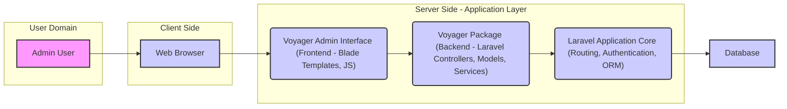
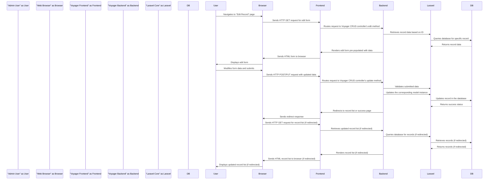

# Project Design Document: Voyager - The Missing Laravel Admin

**Version:** 1.1
**Date:** October 26, 2023
**Author:** AI Software Architect

## 1. Introduction

This document provides an enhanced design overview of the Voyager project, an open-source admin interface for Laravel applications. This iteration aims to provide even greater clarity and detail regarding the system's architecture, components, and data flow, specifically tailored for effective threat modeling and security analysis. The information presented here is based on the project's GitHub repository: [https://github.com/thedevdojo/voyager](https://github.com/thedevdojo/voyager).

### 1.1. Project Overview

Voyager is a Laravel package designed to streamline the creation of administrative interfaces for Laravel applications. It offers a suite of features, including a powerful CRUD (Create, Read, Update, Delete) interface generator, a flexible menu builder, a robust media management system, and a convenient settings management module. Voyager integrates seamlessly into existing Laravel projects, extending their capabilities with a user-friendly backend.

### 1.2. Goals

* Deliver a highly detailed and unambiguous description of Voyager's architecture and its constituent components.
* Provide a comprehensive illustration of the data flow within the system, highlighting key interaction points.
* Identify specific areas of security concern and potential vulnerabilities to guide the threat modeling process.
* Serve as a definitive reference document for security audits, penetration testing, and ongoing security assessments.

### 1.3. Scope

This document encompasses the core functionalities and architectural elements of the Voyager package as documented in the project's resources and discernible from its source code. The focus remains on the components directly contributing to the admin interface and their interactions within the broader Laravel application ecosystem. While acknowledging the underlying Laravel framework, this document primarily addresses Voyager's specific implementation and contributions.

## 2. System Architecture

Voyager functions as a tightly integrated package within a Laravel application, leveraging and extending Laravel's inherent capabilities to provide a rich administrative experience.

### 2.1. High-Level Architecture

* **Admin User:** The authorized individual interacting with the Voyager administrative interface to manage the application.
* **Web Browser:** The client-side application used by the admin user to access and interact with the Voyager interface.
* **Voyager Admin Interface (Frontend - Blade Templates, JS):** The presentation layer of Voyager, constructed using Laravel's Blade templating engine, along with JavaScript and CSS for dynamic behavior and styling. This layer handles user input and displays information.
* **Voyager Package (Backend - Laravel Controllers, Models, Services):** The core logic of the Voyager package, implemented as Laravel controllers, models, service providers, and middleware. This layer processes user requests, interacts with the database, and orchestrates the application's backend functionalities.
* **Laravel Application Core (Routing, Authentication, ORM):** The foundational Laravel framework providing essential services such as routing HTTP requests, managing user authentication and authorization, and facilitating database interactions through its Eloquent ORM. Voyager heavily relies on these core Laravel features.
* **Database:** The persistent storage layer where the application's data, including content managed through Voyager, is stored and retrieved.

### 2.2. Component-Level Architecture

Voyager's functionality is modularized into several key components:

* **Authentication and Authorization Module:**
    * Leverages Laravel's built-in authentication system for user login and session management.
    * Implements its own role and permission management system, allowing granular control over access to Voyager's features and data.
    * Utilizes middleware to enforce authentication and authorization checks on admin routes.
    * Defines specific roles (e.g., administrator, editor) with associated permissions.
* **CRUD Interface Generator Component:**
    * Provides a user interface for defining and generating CRUD interfaces for database tables.
    * Allows administrators to configure form fields, validation rules, and display settings for each data model.
    * Dynamically generates controllers, views, and routes for managing data.
    * Supports various field types (text, textarea, image, relationship selectors, etc.).
* **Menu Builder Component:**
    * Enables administrators to visually construct and manage the navigation menu of the admin interface.
    * Allows the creation of menu items with labels, icons, and links to internal routes or external URLs.
    * Supports hierarchical menu structures (nested menus).
    * Stores menu configurations in the database.
* **Media Manager Component:**
    * Offers a graphical interface for uploading, browsing, organizing, and managing media files (images, videos, documents).
    * Integrates with Laravel's filesystem configuration, supporting various storage drivers (local, cloud storage).
    * May include features for image manipulation (resizing, cropping).
    * Stores metadata about uploaded files in the database.
* **Settings Manager Component:**
    * Provides a user interface for managing application-wide configuration settings stored in the database.
    * Allows administrators to modify setting values through forms.
    * Settings can be accessed and utilized throughout the Laravel application.
    * Often used for managing branding, API keys, and other global configurations.
* **Hooks and Events System:**
    * Offers a mechanism for developers to extend and customize Voyager's functionality without modifying its core code.
    * Provides predefined hooks and events that are triggered at various points in the application lifecycle.
    * Allows developers to register listeners to these hooks and execute custom logic.
* **Breadcrumbs Component:**
    * Automatically generates breadcrumb navigation for admin pages, enhancing user orientation and navigation within the interface.
    * Typically based on the current route and menu structure.
* **Widgets Component:**
    * Enables developers to create reusable dashboard widgets to display key information or provide quick access to specific functionalities.
    * Widgets can be customized and placed on the admin dashboard.

## 3. Data Flow

A typical user interaction within Voyager follows a structured data flow:

1. **Admin User Initiates Action:** An administrator interacts with the Voyager admin interface through their web browser (e.g., navigating to a page, submitting a form, uploading a file).
2. **Browser Sends HTTP Request:** The web browser sends an HTTP request (GET, POST, PUT, DELETE) to the Laravel application.
3. **Laravel Routing:** Laravel's router matches the incoming request URI to a specific route defined by Voyager's route service provider.
4. **Voyager Middleware Interception:** Voyager's middleware (e.g., `admin.user`, `admin.permission`) intercepts the request to verify the user's authentication status and authorization to access the requested resource.
5. **Controller Action Execution:** The request is dispatched to the appropriate Voyager controller action responsible for handling the specific request.
6. **Data Retrieval or Manipulation:**
    * The controller interacts with Laravel models (often generated by Voyager's CRUD) to retrieve data from the database using Eloquent ORM.
    * For data modification requests (create, update, delete), the controller validates user input against defined rules.
    * For file uploads, the Media Manager component handles file storage using Laravel's filesystem abstraction and updates relevant database records with file metadata.
7. **View Rendering:** The controller prepares the necessary data and passes it to a Blade template located within Voyager's views directory. The Blade template renders the HTML response to be sent back to the browser.
8. **HTTP Response to Browser:** The rendered HTML, along with any necessary JavaScript and CSS, is sent back to the user's web browser.
9. **Browser Renders Response:** The web browser interprets the HTML, CSS, and JavaScript to display the updated admin interface to the user.

**Detailed Data Flow Example (Editing an existing record):**

## 4. Security Considerations

Given its role as an administrative interface, Voyager's security is paramount. Key areas of concern include:

* **Authentication and Authorization Vulnerabilities:**
    * **Brute-force attacks:** Attempts to guess user credentials. Mitigation: Implement rate limiting, account lockout policies.
    * **Credential stuffing:** Using compromised credentials from other breaches. Mitigation: Enforce strong password policies, multi-factor authentication.
    * **Insufficient authorization checks:** Allowing users to access functionalities or data they are not permitted to. Mitigation: Rigorous testing of role-based access controls.
* **Input Validation and Output Encoding Issues:**
    * **SQL Injection:** Malicious SQL code injected through user inputs. Mitigation: Use parameterized queries provided by Eloquent ORM.
    * **Cross-Site Scripting (XSS):** Injecting malicious scripts into web pages viewed by other users. Mitigation: Sanitize user inputs and properly escape output data in Blade templates using `{{ }}`. Consider using Content Security Policy (CSP).
    * **Cross-Site Request Forgery (CSRF):** Exploiting authenticated sessions to perform unauthorized actions. Mitigation: Utilize Laravel's built-in CSRF protection mechanisms (CSRF tokens in forms).
* **Session Management Weaknesses:**
    * **Session fixation:** Attacker forces a user to use a specific session ID. Mitigation: Regenerate session IDs upon login.
    * **Session hijacking:** Attacker steals a valid session ID. Mitigation: Use secure session cookies (HTTPOnly, Secure flags), implement appropriate session timeouts.
* **File Upload Security Risks:**
    * **Unrestricted file uploads:** Allowing users to upload any type of file, potentially including malicious executables. Mitigation: Validate file types and extensions, store uploaded files outside the webroot, use a dedicated storage service.
    * **Path traversal vulnerabilities:** Allowing attackers to access or overwrite files outside the intended upload directory. Mitigation: Sanitize file paths and filenames.
* **Dependency Vulnerabilities:**
    * Using outdated or vulnerable versions of Voyager's dependencies. Mitigation: Regularly update dependencies using Composer and monitor security advisories.
* **Insecure Direct Object References (IDOR):**
    * Exposing internal object IDs that can be easily guessed or manipulated to access unauthorized resources. Mitigation: Implement proper authorization checks before accessing resources based on IDs.
* **Insufficient Security Headers:**
    * Lack of security-related HTTP headers can leave the application vulnerable to various attacks. Mitigation: Implement headers like `Strict-Transport-Security`, `X-Frame-Options`, `X-Content-Type-Options`, and `Referrer-Policy`.

## 5. Deployment

Voyager, being a Laravel package, shares the deployment considerations of typical Laravel applications. Common deployment strategies include:

* **Traditional Web Server Deployment:** Deploying the application on a web server (e.g., Apache, Nginx) with PHP and a database server. Security considerations include securing the server operating system, web server configuration, and PHP installation.
* **Cloud Platform Deployment:** Utilizing cloud services like AWS (EC2, Elastic Beanstalk, ECS), Google Cloud Platform (Compute Engine, App Engine, Cloud Run), or Azure (Virtual Machines, App Service). Security best practices for the chosen cloud platform should be followed, including IAM configuration, network security groups, and encryption.
* **Containerization (Docker):** Packaging the application and its dependencies into Docker containers for consistent deployment across environments. Security considerations include securing the Docker images and the container runtime environment.
* **Serverless Deployment (with limitations):** While feasible for parts of a Laravel application, deploying the entire application with Voyager in a purely serverless environment might present challenges due to file system dependencies. Security considerations in serverless environments include managing function permissions and securing API gateways.

**Key Deployment Security Considerations:**

* **Secure Environment Variables:** Store sensitive information like database credentials and API keys securely using environment variables or dedicated secrets management services. Avoid hardcoding credentials.
* **File System Permissions:** Configure appropriate file system permissions to prevent unauthorized access to application files and directories.
* **HTTPS Enforcement:** Enforce HTTPS for all communication using TLS certificates to encrypt data in transit.
* **Regular Security Audits and Penetration Testing:** Conduct periodic security assessments to identify and address potential vulnerabilities in the deployed environment.
* **Web Application Firewall (WAF):** Consider using a WAF to protect against common web attacks.

## 6. Technologies Used

* **Programming Language:** PHP
* **Web Application Framework:** Laravel
* **Templating Engine:** Blade
* **Frontend Technologies:** JavaScript, CSS
* **Markup Language:** HTML
* **Database Systems (Supported by Laravel):** MySQL, PostgreSQL, SQLite, SQL Server
* **Dependency Management:** Composer
* **Version Control:** Git (as seen on GitHub)
* **Potentially other packages and libraries used by Voyager's dependencies.**

## 7. Future Considerations

* **API for Voyager Functionality:** Exposing Voyager's features through a well-defined API could enable integration with other systems and headless CMS capabilities.
* **Enhanced Dashboard Customization:** Providing more flexibility in customizing the admin dashboard with widgets and layouts.
* **Improved Media Management Features:** Adding advanced features like image editing, versioning, and integration with cloud storage services.
* **Accessibility Enhancements:** Continuously improving the accessibility of the admin interface for users with disabilities.
* **Strengthened Security Measures:** Regularly reviewing and implementing new security best practices and features to mitigate emerging threats.

This revised document offers a more detailed and structured understanding of the Voyager project's design, specifically focusing on aspects relevant to security analysis and threat modeling. It serves as a valuable resource for security professionals and developers working with Voyager.