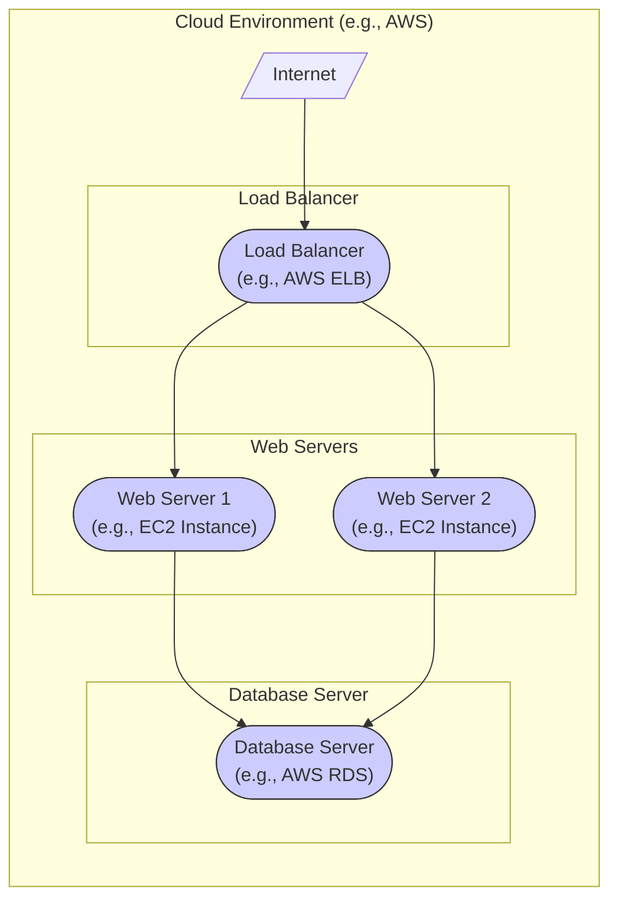

# BUSINESS POSTURE

This project, Voyager, is a Laravel Admin Package that provides a user-friendly interface for managing the backend of Laravel applications. It aims to simplify and accelerate the development of administrative panels, content management systems, and other backend functionalities.

Business Priorities and Goals:
- Accelerate development of administrative interfaces for Laravel applications.
- Reduce development costs associated with building backend management systems from scratch.
- Provide a feature-rich and user-friendly admin panel out-of-the-box.
- Enable non-technical users to manage website content and application data.
- Offer a customizable and extensible admin solution to fit various project needs.

Business Risks:
- Security vulnerabilities in the admin panel could lead to unauthorized access and data breaches.
- Misconfiguration of the admin panel could expose sensitive data or functionalities.
- Dependency on a third-party package introduces supply chain risks and potential compatibility issues.
- Performance issues in the admin panel could negatively impact user experience and productivity.
- Lack of customization options might limit its applicability for specific project requirements.

# SECURITY POSTURE

Existing Security Controls:
- security control Laravel Framework Security: Leverages the security features provided by the Laravel framework, including protection against common web vulnerabilities like CSRF, XSS, and SQL injection. Implemented within the Laravel core framework.
- security control Authentication: Provides built-in authentication for admin users to access the admin panel. Implemented within Voyager package and Laravel authentication system.
- security control Authorization: Offers role-based access control to manage user permissions within the admin panel. Implemented within Voyager package.
- security control Input Validation: Relies on Laravel's input validation mechanisms to sanitize and validate user inputs within the admin panel forms. Implemented within Laravel framework and Voyager controllers.
- security control Password Hashing: Uses bcrypt hashing algorithm provided by Laravel to securely store user passwords. Implemented within Laravel authentication system.

Accepted Risks:
- accepted risk Reliance on Community Security Audits: Security of Voyager package relies on community contributions and audits, which might not be as comprehensive as dedicated security reviews.
- accepted risk Dependency Vulnerabilities: Potential vulnerabilities in third-party dependencies used by Voyager package.
- accepted risk Misconfiguration Risks: Incorrect configuration of Voyager or the underlying Laravel application can introduce security vulnerabilities.

Recommended Security Controls:
- security control Regular Security Audits: Conduct periodic security audits and penetration testing of Voyager and the applications using it.
- security control Vulnerability Scanning: Implement automated vulnerability scanning for dependencies and code within the project.
- security control Strong Password Policies: Enforce strong password policies for admin users, including complexity requirements and password rotation.
- security control Multi-Factor Authentication (MFA): Implement MFA for admin user accounts to enhance authentication security.
- security control Rate Limiting: Implement rate limiting on login attempts and other sensitive admin panel actions to prevent brute-force attacks.
- security control Content Security Policy (CSP): Implement CSP headers to mitigate XSS vulnerabilities.
- security control Security Headers: Implement other security headers like HSTS, X-Frame-Options, and X-Content-Type-Options.
- security control Dependency Scanning: Regularly scan project dependencies for known vulnerabilities and update them promptly.

Security Requirements:
- Authentication:
    - Requirement: Securely authenticate admin users accessing the Voyager admin panel.
    - Implementation: Leverage Voyager's built-in authentication system integrated with Laravel's authentication features. Consider implementing MFA for enhanced security.
- Authorization:
    - Requirement: Implement role-based access control to restrict access to specific functionalities and data within the admin panel based on user roles.
    - Implementation: Utilize Voyager's role and permission management system to define and enforce access control policies.
- Input Validation:
    - Requirement: Validate all user inputs within the admin panel to prevent injection attacks and data integrity issues.
    - Implementation: Utilize Laravel's validation features in Voyager controllers and forms to sanitize and validate user inputs.
- Cryptography:
    - Requirement: Protect sensitive data at rest and in transit using encryption.
    - Implementation: Leverage Laravel's encryption features to encrypt sensitive data stored in the database. Ensure HTTPS is enabled for all communication with the admin panel to protect data in transit.

# DESIGN

## C4 CONTEXT

```mermaid
flowchart LR
    subgraph "Voyager Admin Panel"
        V(["Voyager\nAdmin Panel"])
    end
    U[/"Admin User"/] --> V
    D[/"Database\n(e.g., MySQL, PostgreSQL)"/] <-- V
    LA[/"Laravel\nApplication"/] <-- V
    U --> LA
    style V fill:#f9f,stroke:#333,stroke-width:2px
```

Context Diagram Elements:

- Element:
    - Name: Admin User
    - Type: Person
    - Description: Users who manage the backend of the Laravel application through the Voyager admin panel. This includes content editors, administrators, and developers.
    - Responsibilities: Managing content, users, settings, and other aspects of the Laravel application via the admin panel.
    - Security controls: Authentication to access the admin panel, authorization based on roles and permissions.

- Element:
    - Name: Voyager Admin Panel
    - Type: System
    - Description: The Voyager Laravel Admin Package, providing a web-based interface for backend management.
    - Responsibilities: Providing a user interface for managing data, users, settings, media, and other administrative tasks for the Laravel application. Handling user authentication and authorization within the admin panel. Interacting with the database to read and write data.
    - Security controls: Laravel Framework Security, Authentication, Authorization, Input Validation, Password Hashing, recommended security controls listed in SECURITY POSTURE section.

- Element:
    - Name: Database (e.g., MySQL, PostgreSQL)
    - Type: System
    - Description: The database system used by the Laravel application to store application data, including data managed through the Voyager admin panel.
    - Responsibilities: Storing and retrieving application data. Ensuring data persistence and integrity.
    - Security controls: Database access controls, encryption at rest (if configured), regular backups.

- Element:
    - Name: Laravel Application
    - Type: System
    - Description: The main Laravel web application that Voyager is integrated into. Voyager extends the functionality of this application by providing an admin interface.
    - Responsibilities: Serving the front-end application to end-users. Utilizing data managed through Voyager. Providing core application logic and functionalities.
    - Security controls: Laravel Framework Security, input validation, authorization in the front-end application, security controls implemented within the application code.

## C4 CONTAINER

```mermaid
flowchart LR
    subgraph "Voyager Admin Panel"
        subgraph "Web Application Container"
            WC(["Web Application\n(PHP, Laravel)"])
        end
    end
    U[/"Admin User"/] --> WC
    D[/"Database\n(e.g., MySQL, PostgreSQL)"/] <-- WC
    LA[/"Laravel\nApplication"/] <-- WC
    style WC fill:#f9f,stroke:#333,stroke-width:2px
```

Container Diagram Elements:

- Element:
    - Name: Web Application Container
    - Type: Container
    - Description: This container represents the Voyager web application built using PHP and the Laravel framework. It handles HTTP requests from admin users, processes user inputs, interacts with the database, and renders the admin panel interface.
    - Responsibilities: Handling user authentication and authorization. Processing user requests from the admin panel. Interacting with the database to manage data. Rendering the admin panel UI. Implementing business logic for admin functionalities.
    - Security controls: Laravel Framework Security, Authentication, Authorization, Input Validation, Password Hashing, Session Management, Output Encoding, all security controls from the Web Application Container are inherited from the Laravel Framework and Voyager package itself.

- Element:
    - Name: Admin User
    - Type: Person
    - Description: Same as in Context Diagram.
    - Responsibilities: Same as in Context Diagram.
    - Security controls: Same as in Context Diagram.

- Element:
    - Name: Database (e.g., MySQL, PostgreSQL)
    - Type: System
    - Description: Same as in Context Diagram.
    - Responsibilities: Same as in Context Diagram.
    - Security controls: Same as in Context Diagram.

- Element:
    - Name: Laravel Application
    - Type: System
    - Description: Same as in Context Diagram.
    - Responsibilities: Same as in Context Diagram.
    - Security controls: Same as in Context Diagram.

## DEPLOYMENT

Deployment Solution: Cloud-based Deployment (e.g., AWS, Google Cloud, Azure)



Deployment Diagram Elements:

- Element:
    - Name: Internet
    - Type: Environment
    - Description: The public internet, from where admin users access the Voyager admin panel.
    - Responsibilities: Providing network connectivity for users to access the application.
    - Security controls: N/A - external environment.

- Element:
    - Name: Load Balancer (e.g., AWS ELB)
    - Type: Infrastructure
    - Description: A load balancer distributing incoming traffic across multiple web servers for high availability and scalability.
    - Responsibilities: Distributing traffic, handling SSL termination, providing a single point of entry.
    - Security controls: DDoS protection, SSL/TLS termination, security groups to control inbound traffic.

- Element:
    - Name: Web Server 1 & Web Server 2 (e.g., EC2 Instances)
    - Type: Infrastructure
    - Description: Virtual machines running the Voyager web application (PHP, Laravel).
    - Responsibilities: Hosting and running the Voyager application code, processing requests, serving responses.
    - Security controls: Operating system hardening, web server configuration (e.g., Apache/Nginx), security groups to restrict inbound and outbound traffic, regular patching, intrusion detection systems (IDS).

- Element:
    - Name: Database Server (e.g., AWS RDS)
    - Type: Infrastructure
    - Description: A managed database service hosting the application database (e.g., MySQL, PostgreSQL).
    - Responsibilities: Storing and managing application data, ensuring data availability and durability.
    - Security controls: Database access controls, encryption at rest and in transit, regular backups, database monitoring, security groups to restrict database access.

- Element:
    - Name: Cloud Environment (e.g., AWS)
    - Type: Environment
    - Description: The cloud provider infrastructure hosting all components of the deployment.
    - Responsibilities: Providing the underlying infrastructure, ensuring availability and reliability of services.
    - Security controls: Cloud provider's security controls, IAM roles and policies, network security configurations, logging and monitoring.

## BUILD

```mermaid
flowchart LR
    Developer[/"Developer"/] --> VCS[/"Version Control System\n(e.g., GitHub)"/]
    VCS --> CI[/"CI/CD System\n(e.g., GitHub Actions)"/]
    CI --> Build[/"Build Process\n(Composer, npm)"/]
    Build --> Tests[/"Security Checks & Tests\n(SAST, Dependency Scan, Unit Tests)"/]
    Tests --> Artifacts[/"Build Artifacts\n(Deployable Package)"/]
    Artifacts --> Deployment[/"Deployment\nEnvironment"/]
    style CI fill:#ccf,stroke:#333,stroke-width:1px
    style Build fill:#ccf,stroke:#333,stroke-width:1px
    style Tests fill:#ccf,stroke:#333,stroke-width:1px
    style Artifacts fill:#ccf,stroke:#333,stroke-width:1px
```



Build Process Description:

1.  Developer: Developers write code for Voyager or applications using Voyager and commit changes to a Version Control System.
2.  Version Control System (VCS):  A platform like GitHub, GitLab, or Bitbucket is used to manage the source code and track changes.
3.  CI/CD System: A Continuous Integration/Continuous Delivery system, such as GitHub Actions, Jenkins, or GitLab CI, is triggered by code changes in the VCS.
4.  Build Process: The CI/CD system executes the build process. For a PHP Laravel project like Voyager, this typically involves:
    -   Dependency Management: Using Composer to install PHP dependencies.
    -   Asset Compilation: Using npm or yarn to manage and compile front-end assets (if applicable).
    -   Configuration: Setting up build configurations.
5.  Security Checks & Tests:  Automated security checks and tests are performed as part of the build process:
    -   SAST (Static Application Security Testing): Tools to scan the codebase for potential security vulnerabilities.
    -   Dependency Scanning: Tools to check for known vulnerabilities in project dependencies.
    -   Unit Tests: Running unit tests to ensure code functionality and catch regressions.
    -   Linters: Code linters to enforce code quality and coding standards, which can indirectly improve security.
6.  Build Artifacts: If security checks and tests pass, the build process produces deployable artifacts. This could be a packaged application, container image, or simply the application code ready for deployment.
7.  Deployment Environment: The build artifacts are then deployed to the target deployment environment (e.g., staging, production).

Build Process Security Controls:

- security control Automated Build Process: Using a CI/CD system automates the build process, reducing manual errors and ensuring consistency.
- security control Version Control: Using VCS provides traceability of code changes and enables rollback if necessary.
- security control Static Application Security Testing (SAST): SAST tools integrated into the CI/CD pipeline help identify potential security vulnerabilities in the code early in the development lifecycle.
- security control Dependency Scanning: Automated dependency scanning during the build process helps detect and manage vulnerabilities in third-party libraries.
- security control Automated Testing: Unit tests and integration tests help ensure code quality and reduce the likelihood of introducing vulnerabilities through code changes.
- security control Secure Build Environment: Ensuring the CI/CD environment itself is secure, with proper access controls and security configurations.
- security control Artifact Signing/Verification: Signing build artifacts to ensure integrity and authenticity, preventing tampering during deployment.

# RISK ASSESSMENT

Critical Business Processes:
- Management of website content: Ensuring content is accurate, up-to-date, and appropriate.
- User management: Managing admin user accounts, roles, and permissions to control access to the admin panel.
- Application settings management: Configuring application settings and parameters that affect the functionality and security of the Laravel application.
- Data management: Managing application data stored in the database, ensuring data integrity and availability.

Data Sensitivity:
- User credentials (admin users): Highly sensitive. Compromise can lead to unauthorized access to the entire admin panel and potentially the underlying application and data.
- Application configuration data: Sensitive. May contain database credentials, API keys, and other sensitive settings.
- Website content: Sensitivity depends on the nature of the content. Public content might be less sensitive, while confidential or proprietary content is highly sensitive.
- Application data: Sensitivity depends on the type of data stored by the Laravel application. Could range from low sensitivity (e.g., public blog posts) to highly sensitive (e.g., personal user data, financial information).

# QUESTIONS & ASSUMPTIONS

Questions:
- What is the specific deployment environment (cloud provider, on-premises)?
- What are the specific security compliance requirements (e.g., GDPR, HIPAA, PCI DSS)?
- What is the expected user base and traffic volume for the admin panel?
- Are there any specific integrations with other systems or services?
- What is the process for handling security incidents and vulnerabilities?

Assumptions:
- BUSINESS POSTURE: The primary business goal is to efficiently manage the backend of a Laravel application, prioritizing ease of use and speed of development. Security is a significant concern due to the sensitive nature of admin panels.
- SECURITY POSTURE: The project currently relies on the security features of the Laravel framework and basic built-in security controls of Voyager. There is an awareness of security risks, but a need for more proactive and comprehensive security measures.
- DESIGN: The deployment is assumed to be cloud-based for scalability and availability. The build process includes basic CI/CD practices but can be enhanced with more robust security checks.