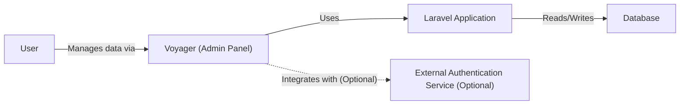
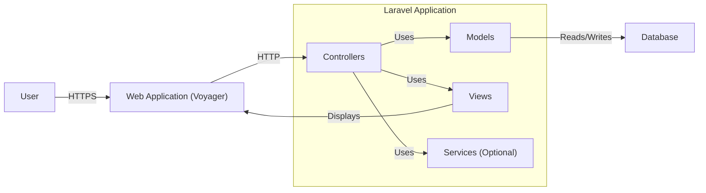
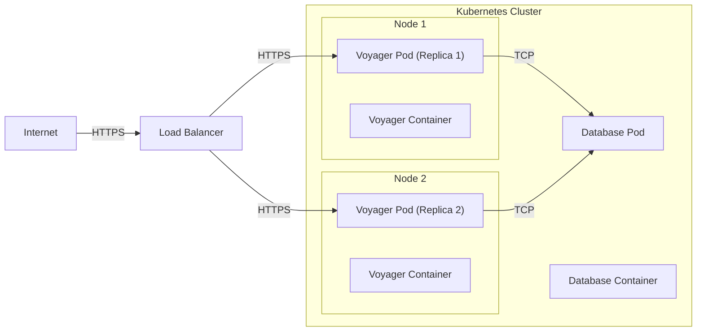
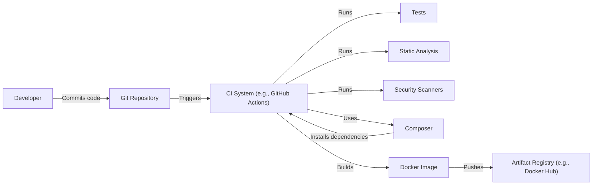

Okay, let's create a design document for the Voyager project based on the provided GitHub repository.

# BUSINESS POSTURE

Voyager is an admin panel for the Laravel framework. It appears to be targeted towards developers and small to medium-sized businesses (SMBs) or teams within larger organizations that need a quick and easy way to create admin interfaces for their Laravel applications. The project prioritizes ease of use, rapid development, and a visually appealing interface.

Business Priorities:

*   Enable rapid development of admin panels for Laravel applications.
*   Provide a user-friendly and intuitive interface for managing application data.
*   Offer a customizable and extensible platform to meet diverse admin panel needs.
*   Reduce development time and costs associated with building custom admin panels.

Business Goals:

*   Increase developer productivity.
*   Simplify application management.
*   Provide a visually appealing and modern admin interface.

Most Important Business Risks:

*   Unauthorized access to sensitive application data through the admin panel.
*   Data breaches or data loss due to vulnerabilities in the admin panel.
*   Injection attacks (SQL, XSS, etc.) exploiting vulnerabilities in the admin panel.
*   Compromise of the underlying Laravel application through vulnerabilities exposed by the admin panel.
*   Lack of proper auditing and logging, hindering incident response and accountability.
*   Supply chain attacks through compromised dependencies.

# SECURITY POSTURE

Existing Security Controls:

*   security control: Authentication: Voyager provides built-in authentication mechanisms, likely leveraging Laravel's authentication features (described in Laravel documentation and Voyager documentation).
*   security control: Authorization: Voyager includes role-based access control (RBAC) to manage user permissions (described in Voyager documentation).
*   security control: CSRF Protection: Laravel's built-in CSRF protection is likely utilized (described in Laravel documentation).
*   security control: Input Validation: Voyager likely uses Laravel's validation features to validate user inputs (described in Laravel documentation and Voyager documentation).
*   security control: Database Security: Relies on Laravel's Eloquent ORM and database configuration for secure database interactions (described in Laravel documentation).

Accepted Risks:

*   accepted risk: The security of the Voyager admin panel is heavily reliant on the correct configuration and security practices of the underlying Laravel application.
*   accepted risk: The use of third-party packages and dependencies introduces potential supply chain risks.
*   accepted risk: Customizations and extensions to Voyager, if not implemented securely, could introduce new vulnerabilities.

Recommended Security Controls:

*   security control: Implement robust logging and auditing of all admin panel actions.
*   security control: Enforce strong password policies and consider multi-factor authentication (MFA).
*   security control: Regularly update Voyager and all its dependencies to patch security vulnerabilities.
*   security control: Conduct regular security assessments and penetration testing of the admin panel and the underlying application.
*   security control: Implement Content Security Policy (CSP) to mitigate XSS attacks.
*   security control: Implement strict input sanitization and output encoding to prevent injection attacks.
*   security control: Use parameterized queries or ORM to prevent SQL injection.
*   security control: Regularly review and update security configurations.

Security Requirements:

*   Authentication:
    *   All users must be authenticated before accessing the admin panel.
    *   Support for strong password policies.
    *   Consider integration with existing authentication systems (e.g., LDAP, OAuth).
*   Authorization:
    *   Implement granular role-based access control (RBAC) to restrict user permissions.
    *   Ensure that users can only access and modify data they are authorized to.
*   Input Validation:
    *   Validate all user inputs on the server-side to prevent injection attacks.
    *   Use a whitelist approach to allow only specific characters and patterns.
*   Cryptography:
    *   Use strong encryption algorithms to protect sensitive data at rest and in transit.
    *   Securely store and manage cryptographic keys.
    *   Use HTTPS for all communication with the admin panel.

# DESIGN

## C4 CONTEXT

Context Diagram Element List:

*   Element:
    *   Name: User
    *   Type: Person
    *   Description: A person who interacts with the Voyager admin panel to manage application data.
    *   Responsibilities: Accessing the admin panel, viewing data, creating data, updating data, deleting data.
    *   Security controls: Authentication, Authorization, Session Management.

*   Element:
    *   Name: Voyager (Admin Panel)
    *   Type: Software System
    *   Description: The Voyager admin panel, built on Laravel.
    *   Responsibilities: Providing an interface for managing the Laravel application, handling user authentication and authorization, displaying and manipulating data.
    *   Security controls: Authentication, Authorization, Input Validation, CSRF Protection, Output Encoding.

*   Element:
    *   Name: Laravel Application
    *   Type: Software System
    *   Description: The underlying Laravel application that Voyager manages.
    *   Responsibilities: Handling business logic, interacting with the database, providing data to Voyager.
    *   Security controls: All security controls of a standard Laravel application, including input validation, output encoding, authentication, authorization, and secure database interactions.

*   Element:
    *   Name: Database
    *   Type: Software System
    *   Description: The database used by the Laravel application.
    *   Responsibilities: Storing application data.
    *   Security controls: Database access controls, encryption at rest, regular backups.

*   Element:
    *   Name: External Authentication Service (Optional)
    *   Type: Software System
    *   Description: An optional external service for user authentication (e.g., LDAP, OAuth).
    *   Responsibilities: Authenticating users.
    *   Security controls: Depends on the specific service; generally includes secure communication and authentication protocols.

## C4 CONTAINER

Container Diagram Element List:

*   Element:
    *   Name: User
    *   Type: Person
    *   Description: A person interacting with the Voyager admin panel.
    *   Responsibilities: Accessing the admin panel, viewing, creating, updating, and deleting data.
    *   Security controls: Authentication, Authorization, Session Management.

*   Element:
    *   Name: Web Application (Voyager)
    *   Type: Web Application
    *   Description: The Voyager admin panel, running as a web application.
    *   Responsibilities: Handling user requests, rendering the user interface, interacting with the Laravel application.
    *   Security controls: Authentication, Authorization, Input Validation, CSRF Protection, Output Encoding, Session Management.

*   Element:
    *   Name: Laravel Application
    *   Type: Web Application
    *   Description: Container for Laravel application components.
    *   Responsibilities: Handling business logic, interacting with the database, providing data to Voyager.
    *   Security controls: All security controls of a standard Laravel application.

*   Element:
    *   Name: Controllers
    *   Type: Component
    *   Description: Laravel controllers that handle user requests and interact with models and views.
    *   Responsibilities: Processing user input, interacting with models, rendering views.
    *   Security controls: Input Validation, Authorization.

*   Element:
    *   Name: Models
    *   Type: Component
    *   Description: Laravel models that represent application data and interact with the database.
    *   Responsibilities: Retrieving, creating, updating, and deleting data in the database.
    *   Security controls: Data validation, secure database interactions.

*   Element:
    *   Name: Views
    *   Type: Component
    *   Description: Laravel views that define the user interface.
    *   Responsibilities: Rendering data to the user.
    *   Security controls: Output Encoding.

*   Element:
    *   Name: Services (Optional)
    *   Type: Component
    *   Description: Optional Laravel services that encapsulate specific business logic.
    *   Responsibilities: Performing specific business operations.
    *   Security controls: Depends on the specific service; should follow secure coding practices.

*   Element:
    *   Name: Database
    *   Type: Database
    *   Description: The database used by the Laravel application.
    *   Responsibilities: Storing application data.
    *   Security controls: Database access controls, encryption at rest, regular backups.

## DEPLOYMENT

Possible Deployment Solutions:

1.  Traditional Web Server (Apache/Nginx) + PHP + Database Server (MySQL/PostgreSQL/etc.)
2.  Cloud-based Platform-as-a-Service (PaaS) (e.g., Heroku, AWS Elastic Beanstalk, Google App Engine)
3.  Containerized Deployment (Docker, Kubernetes)

Chosen Solution (for detailed description): Containerized Deployment (Docker, Kubernetes)

Deployment Diagram Element List:

*   Element:
    *   Name: Internet
    *   Type: External
    *   Description: The public internet.
    *   Responsibilities: Routing user requests to the load balancer.
    *   Security controls: Firewall, DDoS protection.

*   Element:
    *   Name: Load Balancer
    *   Type: Load Balancer
    *   Description: A load balancer that distributes traffic across multiple Voyager instances.
    *   Responsibilities: Distributing traffic, SSL termination.
    *   Security controls: SSL/TLS configuration, firewall rules.

*   Element:
    *   Name: Kubernetes Cluster
    *   Type: Infrastructure
    *   Description: Container for Kubernetes nodes.
    *   Responsibilities: Orchestrating containers.
    *   Security controls: Kubernetes RBAC, network policies, pod security policies.

*   Element:
    *   Name: Node 1, Node 2
    *   Type: Infrastructure Node
    *   Description: Kubernetes worker nodes.
    *   Responsibilities: Running pods.
    *   Security controls: Node-level security hardening, OS patching.

*   Element:
    *   Name: Voyager Pod (Replica 1, Replica 2)
    *   Type: Pod
    *   Description: Kubernetes pods running the Voyager application.
    *   Responsibilities: Running the Voyager container.
    *   Security controls: Pod security policies, resource limits.

*   Element:
    *   Name: Voyager Container
    *   Type: Container
    *   Description: Docker containers running the Voyager application code.
    *   Responsibilities: Running the Voyager application.
    *   Security controls: Container image security scanning, minimal base image.

*   Element:
    *   Name: Database Pod
    *   Type: Pod
    *   Description: A Kubernetes pod running the database.
    *   Responsibilities: Running the database container.
    *   Security controls: Pod security policies, resource limits.

*   Element:
    *   Name: Database Container
    *   Type: Container
    *   Description: A Docker container running the database server.
    *   Responsibilities: Storing application data.
    *   Security controls: Database access controls, encryption at rest, regular backups, container image security scanning.

## BUILD

The Voyager project itself is a Laravel package. The build process for a project *using* Voyager would typically involve:

1.  Developer writes code (PHP, JavaScript, CSS, etc.).
2.  Code is committed to a version control system (e.g., Git).
3.  A Continuous Integration (CI) system (e.g., GitHub Actions, Travis CI, Jenkins) is triggered.
4.  The CI system runs tests (unit tests, integration tests, etc.).
5.  The CI system may run static analysis tools (e.g., PHPStan, ESLint, Stylelint) to check code quality and potential security issues.
6.  The CI system may run security scanners (e.g., SAST tools) to identify vulnerabilities in the code.
7.  Composer (PHP dependency manager) installs dependencies, including Voyager.
8.  If all tests and checks pass, the CI system may build a deployment artifact (e.g., a Docker image).
9.  The deployment artifact is pushed to a registry (e.g., Docker Hub, a private container registry).

Security Controls in Build Process:

*   security control: Version Control: Using Git for version control allows tracking changes and reverting to previous versions if necessary.
*   security control: CI/CD: Automating the build and deployment process with a CI/CD system ensures consistency and reduces manual errors.
*   security control: Automated Testing: Running automated tests helps catch bugs and regressions early.
*   security control: Static Analysis: Using static analysis tools helps identify code quality issues and potential security vulnerabilities.
*   security control: Security Scanners: Using SAST tools helps identify security vulnerabilities in the code.
*   security control: Dependency Management: Using Composer to manage dependencies helps ensure that the project is using the latest versions of libraries and that dependencies are tracked.
*   security control: Artifact Registry: Storing build artifacts in a registry provides a central location for managing and deploying applications.
*   security control: Supply Chain Security: Regularly scanning dependencies for known vulnerabilities. Using tools like Dependabot (for GitHub) to automatically update dependencies.

# RISK ASSESSMENT

Critical Business Processes:

*   Application Data Management: The primary business process is managing the data of the underlying Laravel application through the Voyager admin panel. This includes creating, reading, updating, and deleting data.
*   User Management: Managing users and their permissions within the admin panel is critical for controlling access to sensitive data.
*   Application Configuration: Configuring the Laravel application through the admin panel.

Data Sensitivity:

The data sensitivity depends entirely on the specific Laravel application that Voyager is managing. It could range from non-sensitive public data to highly sensitive personal data, financial data, or intellectual property.  Therefore, a data classification exercise is *essential* for any application using Voyager.  Examples:

*   Usernames and Passwords (if stored directly): Highly Sensitive
*   User Roles and Permissions: Sensitive
*   Application Data (generic):  Sensitivity varies *widely* depending on the application.  This could be anything from blog post content (low sensitivity) to medical records (extremely high sensitivity).
*   Audit Logs: Sensitive
*   Configuration Data: Potentially sensitive, depending on what is configured.

# QUESTIONS & ASSUMPTIONS

Questions:

*   What specific type of data will the Laravel application manage? (This is crucial for determining data sensitivity and appropriate security controls.)
*   Are there any specific compliance requirements (e.g., GDPR, HIPAA, PCI DSS) that need to be considered?
*   Will Voyager be integrated with any external systems (e.g., authentication providers, payment gateways)?
*   What is the expected user base size and growth rate?
*   What is the deployment environment (cloud provider, on-premise, etc.)?
*   What level of logging and auditing is required?
*   Are there any existing security policies or guidelines that need to be followed?

Assumptions:

*   BUSINESS POSTURE: The organization using Voyager has a basic understanding of security principles and is willing to invest in securing their application.
*   SECURITY POSTURE: The underlying Laravel application is developed and maintained following secure coding practices. The server infrastructure is properly secured and maintained.
*   DESIGN: Voyager will be deployed in a containerized environment using Kubernetes. A load balancer will be used to distribute traffic. The database will be separate from the application containers.