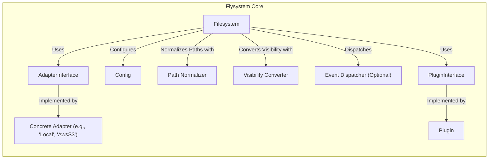
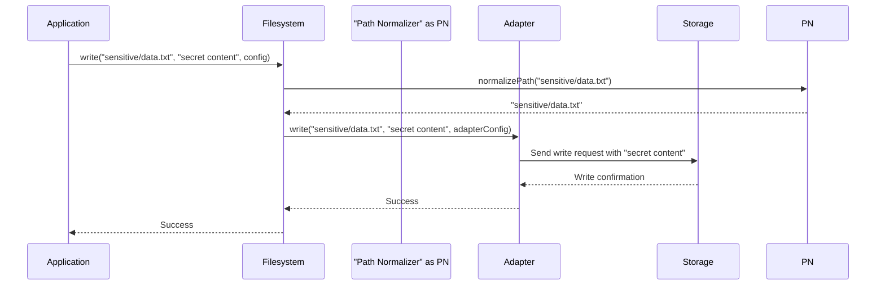

# Project Design Document: Flysystem

**Version:** 1.1
**Date:** October 26, 2023
**Author:** AI Software Architect

## 1. Introduction

This document provides an enhanced design overview of the Flysystem library, a widely used PHP package for filesystem abstraction. This detailed description is specifically crafted to facilitate comprehensive threat modeling. It clearly outlines the key components, architectural patterns, data flow mechanisms, and potential security considerations inherent in Flysystem's design.

## 2. Goals

*   Deliver a refined and more detailed explanation of Flysystem's architecture and functionalities.
*   Precisely identify core components, elaborating on their responsibilities and interactions.
*   Illustrate the movement of data within the system with greater clarity and specificity.
*   Sharpen the focus on potential security vulnerabilities and concerns to directly support threat modeling activities.

## 3. Target Audience

*   Security engineers tasked with performing threat modeling and security assessments.
*   Developers integrating Flysystem into their applications who need a deeper security understanding.
*   Anyone seeking an in-depth technical understanding of Flysystem's internal workings and security implications.

## 4. Overview

Flysystem offers a powerful abstraction layer for filesystem operations in PHP. It enables developers to interact with diverse storage solutions – ranging from local disks to cloud-based object stores – through a unified API. This abstraction promotes code reusability, enhances application portability across different environments, and simplifies unit testing. The central element is the `Filesystem` class, which relies on interchangeable `Adapter` implementations to communicate with the underlying storage. Extensibility is provided through `Plugin` interfaces, allowing for custom functionality.

## 5. Architectural Design

Flysystem employs a modular architecture, emphasizing separation of concerns and flexibility through its adapter pattern.

### 5.1. Key Components

*   **`Filesystem`:** This is the primary interface for application code to perform filesystem operations. It orchestrates actions by delegating to the configured `Adapter` and managing registered `Plugin` instances. It also handles path normalization and visibility conversions.
*   **`AdapterInterface`:** This interface defines the contract that all concrete storage adapters must adhere to. It specifies methods for common filesystem operations like reading, writing, deleting, and listing files.
*   **Concrete Adapters:** These are implementations of the `AdapterInterface`, each tailored to interact with a specific storage system. Examples include:
    *   `Local`: Provides access to the server's local filesystem.
    *   `AwsS3`: Enables interaction with Amazon Simple Storage Service (S3).
    *   `Ftp`: Facilitates communication with File Transfer Protocol (FTP) servers.
    *   `Sftp`: Enables secure file transfer over SSH (SFTP).
    *   Numerous other adapters exist for services like Dropbox, Google Cloud Storage, Azure Blob Storage, and more.
*   **`PluginInterface`:** This interface defines the structure for creating extensions that add custom methods to the `Filesystem` class, enhancing its functionality beyond the core operations.
*   **Plugins:** These are concrete implementations of the `PluginInterface`, providing custom functionalities that can be registered with a `Filesystem` instance.
*   **`Config`:** This object holds configuration parameters for the `Filesystem` and its associated `Adapter`. This can include sensitive information like API keys, access tokens, server addresses, and port numbers.
*   **`PathNormalizer`:** This component ensures consistency in file paths across different adapters by standardizing path separators and handling relative paths.
*   **`VisibilityConverter`:** This component translates the abstract concept of file visibility (public or private) into the specific permission mechanisms of the underlying storage system.
*   **`EventDispatcher` (Optional):** Flysystem can optionally integrate with an event dispatcher (such as the one provided by Symfony) to allow applications to subscribe to and react to filesystem events.

### 5.2. Component Diagram (Mermaid)

### 5.3. Interaction Flow

Consider the scenario of writing data to a file:

1. The application invokes a write method on the `Filesystem` object, such as `write($path, $contents, $config)`.
2. The `Filesystem` might first execute any registered `Plugin` methods that are configured to run before a write operation.
3. The `Filesystem` utilizes the `Path Normalizer` to standardize the provided file path.
4. The `Filesystem` retrieves the appropriate `Adapter` based on its configuration.
5. The `Filesystem` calls the `write()` method on the selected `Adapter`, passing the normalized path, the file contents, and relevant adapter-specific configuration from the `Config` object.
6. The `Adapter` establishes a connection (if necessary) with the underlying storage service and performs the write operation using the storage service's specific API or protocol.
7. The `Adapter` receives a success or failure response from the storage service.
8. The `Adapter` returns the result of the operation (success or failure) back to the `Filesystem`.
9. The `Filesystem` might then execute any registered `Plugin` methods configured to run after a write operation.
10. The `Filesystem` returns the final result to the calling application.
11. Optionally, the `Filesystem` may dispatch events through the `EventDispatcher` at various stages of the operation.

## 6. Data Flow

Data flows through Flysystem in several forms, each with its own security implications:

*   **File Content:** The actual binary or textual data being read from or written to storage. This data passes between the application and the storage system via the `Filesystem` and the active `Adapter`. Security concerns include confidentiality and integrity of this data in transit and at rest.
*   **Metadata:** Information about files, such as size, modification timestamps, MIME types, and visibility settings. This metadata is exchanged between the application and the storage system during operations like listing directories or retrieving file information. Tampering with metadata could have security implications.
*   **Configuration Data:** Sensitive information stored in the `Config` object, including API keys, secret keys, access tokens, usernames, passwords, and connection strings. Secure handling of this data is paramount.
*   **Path Information:** File paths are manipulated and passed between components. Improper handling or sanitization of paths can lead to vulnerabilities like path traversal.
*   **Visibility Settings:** The abstract public/private visibility settings are translated into storage-specific permissions. Incorrect conversion or enforcement can lead to unauthorized access.
*   **Event Data:** If an `EventDispatcher` is used, data associated with filesystem events is passed between components. This data might contain sensitive information depending on the event.

### 6.1. Data Flow Diagram (Mermaid)

## 7. Security Considerations

This section details potential security considerations for threat modeling, categorized for clarity.

*   **Adapter Security:**
    *   **Credential Exposure:** How are adapter credentials (API keys, passwords, tokens) stored and managed? Are they vulnerable to exposure through insecure storage (e.g., hardcoding, environment variables without proper protection) or logging?
    *   **Insecure Connections:** Are connections to remote storage systems properly secured using encryption (e.g., HTTPS for S3, TLS for FTP/SFTP)? Lack of encryption can lead to eavesdropping and data interception.
    *   **Insufficient Authorization:** Does the adapter correctly implement and enforce the necessary authorization and access control mechanisms of the underlying storage system? Weak authorization can lead to unauthorized access or modification of data.
    *   **Man-in-the-Middle Attacks:** If connections are not properly secured, attackers could intercept and manipulate data in transit.
*   **Local Adapter Security:**
    *   **Path Traversal Vulnerabilities:** Can malicious input in file paths bypass intended directory restrictions, allowing access to sensitive files outside the designated storage area?
    *   **Inadequate File Permissions:** Are default file permissions set appropriately when creating or modifying files on the local filesystem? Overly permissive permissions can lead to unauthorized access.
    *   **Symbolic Link Exploitation:** Can attackers manipulate symbolic links to access or modify files outside the intended scope?
*   **Data Integrity:**
    *   **Data Corruption in Transit/At Rest:** Is there a risk of data corruption during transfer or storage? Are mechanisms like checksums or content verification used to ensure data integrity?
    *   **Lack of Data Validation:** Is the data being written validated before being sent to the storage system? This could lead to the storage of malicious or unexpected content.
*   **Input Validation:**
    *   **Path Sanitization Failures:** Is user-provided or external path information properly sanitized to prevent injection attacks or unexpected behavior?
    *   **Metadata Injection:** Can malicious actors inject harmful code or data through file metadata? Is metadata properly validated and sanitized?
*   **Error Handling:**
    *   **Information Disclosure through Errors:** Do error messages reveal sensitive information about the system's configuration, file paths, or internal workings?
    *   **Lack of Proper Error Handling:** Can failures in error handling lead to unexpected states or security vulnerabilities?
*   **Plugin Security:**
    *   **Malicious or Vulnerable Plugins:** If plugins from untrusted sources are used, they could introduce vulnerabilities or malicious functionality.
    *   **Plugin Permission Issues:** Do plugins operate with appropriate permissions, or can they escalate privileges or bypass security restrictions?
*   **Dependency Management:**
    *   **Vulnerabilities in Dependencies:** Does Flysystem rely on third-party libraries with known security vulnerabilities? Regular dependency updates are crucial.
*   **Visibility Settings:**
    *   **Misconfiguration of Visibility:** Can incorrect configuration of visibility settings lead to unintended public access to private files or vice versa?
    *   **Visibility Bypass:** Are there potential ways to bypass the intended visibility restrictions?
*   **Event Handling:**
    *   **Exposure of Sensitive Data in Events:** If an event dispatcher is used, does the event data contain sensitive information that could be logged or accessed inappropriately?
    *   **Event Injection/Manipulation:** Can attackers inject or manipulate events to trigger unintended actions or gain unauthorized access?

## 8. Dependencies

Flysystem's dependencies vary based on the adapters used. Key dependencies include:

*   **PHP >= 7.2.5:** The fundamental requirement for running Flysystem. Security vulnerabilities in the PHP runtime itself are a concern.
*   **`league/mime-type-detection`:** Used for determining file MIME types. Vulnerabilities in this library could affect Flysystem.
*   **Adapter-Specific Dependencies:** Each adapter introduces its own dependencies (e.g., `aws/aws-sdk-s3` for the `AwsS3` adapter, `league/flysystem-ftp` for the `Ftp` adapter). These dependencies need to be assessed for security vulnerabilities. For example, older versions of HTTP client libraries might be susceptible to various attacks.

## 9. Deployment Considerations

Secure deployment of applications using Flysystem requires careful attention to:

*   **Secure Configuration:** Ensuring that adapter configurations, especially those containing credentials, are stored securely (e.g., using environment variables with proper access controls, dedicated secrets management solutions).
*   **Dependency Management:** Regularly updating Flysystem and its dependencies to patch known security vulnerabilities. Using tools like Composer for dependency management is essential.
*   **Filesystem Permissions:** Properly configuring filesystem permissions for the application's access to local storage (if the `Local` adapter is used) to prevent unauthorized access or modification.
*   **Network Security:** Implementing appropriate network security measures (e.g., firewalls, network segmentation) to protect communication with remote storage services.
*   **Input Validation and Sanitization:** Implementing robust input validation and sanitization throughout the application to prevent path traversal and other injection attacks.

## 10. Future Considerations

*   Ongoing development of new adapters to support emerging storage technologies.
*   Performance optimizations and efficiency improvements.
*   Enhanced logging and auditing capabilities for security monitoring.
*   Potential integration of encryption at rest as a core feature or through standardized plugin interfaces.
*   Further refinement of the plugin system to ensure secure and isolated plugin execution.

This enhanced design document provides a more detailed and security-focused overview of Flysystem, serving as a solid foundation for comprehensive threat modeling activities. The identified components, data flows, and specific security considerations will enable a more thorough analysis of potential vulnerabilities and the development of effective mitigation strategies.