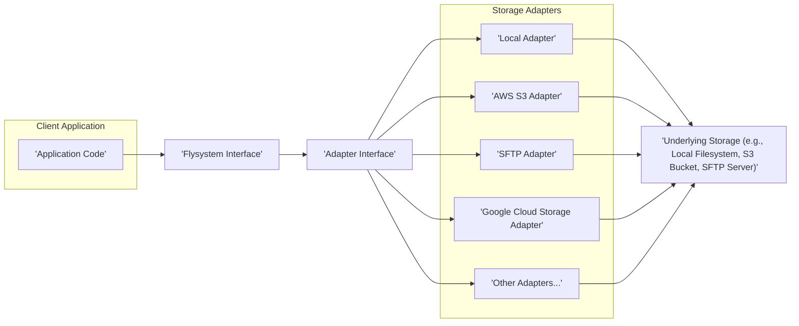

# Project Design Document: Flysystem

**Version:** 1.1
**Date:** October 26, 2023
**Author:** AI Software Architect

## 1. Introduction

This document provides an enhanced design overview of the Flysystem library, a widely adopted PHP package offering an abstraction layer for diverse file storage systems. This detailed design aims to provide a clear understanding of Flysystem's architecture, components, and data flow, specifically for the purpose of subsequent threat modeling activities. A strong grasp of the system's design is paramount for effectively identifying potential security vulnerabilities and implementing appropriate mitigation strategies.

## 2. Goals and Objectives

The core objectives of Flysystem are:

*   To establish a unified and consistent API for interacting with various file storage solutions.
*   To abstract the underlying complexities and inherent inconsistencies of different storage backends.
*   To promote code portability and enhance maintainability by decoupling application logic from specific storage implementations.
*   To deliver a consistent set of file system operations across a range of supported adapters.

## 3. System Architecture

Flysystem employs a flexible, adapter-driven architecture. The central library defines interfaces and abstract classes, while concrete implementations for specific storage systems are provided by individual adapter packages. This design allows for easy extension and support for new storage platforms.

### 3.1. High-Level Architecture

### 3.2. Detailed Architecture and Interaction Flow

The interaction within Flysystem typically unfolds as follows:

*   The client application instantiates a `League\Flysystem\Filesystem` object. This instantiation requires a configured adapter instance.
*   The `Filesystem` object serves as the primary point of interaction, implementing the core Flysystem interface.
*   When the application invokes a file operation method (e.g., `read()`, `write()`, `delete()`) on the `Filesystem` object, it delegates the call to the associated adapter.
*   The adapter translates the generic Flysystem operation into the specific API calls mandated by the underlying storage system. This translation is the core responsibility of the adapter.
*   The adapter then communicates with the underlying storage system to execute the requested operation.
*   The adapter receives the response from the storage system (which could be data, a success/failure indication, or metadata).
*   The adapter returns this result back to the `Filesystem` object.
*   The `Filesystem` object might perform some post-processing, normalization, or error handling on the result before returning it to the calling client application.

## 4. Data Flow

The movement of data within Flysystem is operation-specific. Below are the data flows for common actions:

### 4.1. Reading a File

*   The application initiates a read operation by calling the `read()` method on the `Filesystem` object, providing the file path as an argument.
*   The `Filesystem` object forwards this request to the `read()` method of the configured adapter.
*   The adapter interacts with the underlying storage system to retrieve the content of the specified file.
*   The adapter receives the file content (typically as a string or a stream) from the storage system.
*   The adapter passes the file content back to the `Filesystem` object.
*   The `Filesystem` object returns the retrieved file content to the application.

### 4.2. Writing a File

*   The application initiates a write operation by calling a writing method (e.g., `write()`, `put()`, `update()`) on the `Filesystem` object, providing the file path and the content to be written.
*   The `Filesystem` object forwards the request to the corresponding writing method of the configured adapter.
*   The adapter interacts with the underlying storage system to store the provided content at the specified path.
*   The adapter receives a success or failure indication from the storage system.
*   The adapter returns this status to the `Filesystem` object.
*   The `Filesystem` object returns the success or failure status to the application.

### 4.3. Listing Files

*   The application requests a list of files by calling a listing method (e.g., `listContents()`, `listPaths()`, `listDeeply()`) on the `Filesystem` object, potentially specifying a directory path.
*   The `Filesystem` object forwards the request to the appropriate listing method of the configured adapter.
*   The adapter interacts with the underlying storage system to retrieve a list of files and directories at the specified location (if provided).
*   The adapter receives an array of file metadata objects (or paths) from the storage system.
*   The adapter returns this list to the `Filesystem` object.
*   The `Filesystem` object returns the list of files and/or directories to the application.

### 4.4. Deleting a File

*   The application initiates a delete operation by calling the `delete()` method on the `Filesystem` object, providing the path of the file to be deleted.
*   The `Filesystem` object forwards this request to the `delete()` method of the configured adapter.
*   The adapter interacts with the underlying storage system to remove the file at the specified path.
*   The adapter receives a success or failure indication from the storage system.
*   The adapter returns this status to the `Filesystem` object.
*   The `Filesystem` object returns the success or failure status to the application.

## 5. Key Components

This section provides a detailed description of the essential components within the Flysystem architecture.

*   **`League\Flysystem\Filesystem`:** This class implements the core Flysystem interface, providing the high-level API for file system operations. Client applications primarily interact with instances of this class. It orchestrates operations by delegating to the configured adapter.
*   **Adapters (Implementing `League\Flysystem\FilesystemAdapter`):** These concrete classes are responsible for the actual communication with and manipulation of the underlying storage system. Each adapter is tailored to a specific storage technology. Examples include:
    *   `League\Flysystem\Local\LocalFilesystemAdapter`: Facilitates interaction with the local file system.
    *   `League\Flysystem\AwsS3v3\AwsS3Adapter`: Enables interaction with Amazon Simple Storage Service (S3).
    *   `League\Flysystem\Ftp\FtpAdapter`: Provides connectivity to File Transfer Protocol (FTP) servers.
    *   `League\Flysystem\InMemory\InMemoryFilesystemAdapter`: Offers an in-memory storage solution, primarily useful for testing and development.
    *   `League\Flysystem\PhpseclibV2\SftpAdapter`: Allows interaction with SFTP servers using the phpseclib library.
    *   `League\Flysystem\WebDAV\WebDAVAdapter`: Enables interaction with WebDAV servers.
*   **Configuration (`League\Flysystem\Config`):** The `Config` object is used to configure the `Filesystem` object. This includes specifying which adapter to use and providing any adapter-specific options (e.g., API keys, server addresses, credentials).
*   **Path Normalization:** Flysystem internally handles path normalization to ensure consistent behavior across different operating systems and storage backends. This helps to avoid issues caused by differing path separators or conventions.
*   **Metadata Handling (`League\Flysystem\StorageAttributes`):** Flysystem provides a consistent way to access file metadata such as size, last modified timestamp, and MIME type, regardless of the underlying storage system. This metadata is often encapsulated in `StorageAttributes` objects.
*   **Plugins (Extending Functionality):** While less central than adapters, plugins offer a mechanism to extend the functionality of a `Filesystem` object with custom methods. This allows developers to add specific operations or utilities relevant to their application.

## 6. Security Considerations

This section highlights potential security considerations relevant to Flysystem. These points will serve as a foundation for a more in-depth threat modeling exercise.

*   **Access Control and Permissions:** Flysystem itself does not enforce access control. Security relies heavily on the underlying storage system's access control mechanisms and how the application configures and utilizes Flysystem. Incorrectly configured permissions on the storage backend can lead to unauthorized data access or modification. *Impact: Confidentiality and Integrity violation.*
*   **Data Integrity and Corruption:** Flysystem primarily relies on the underlying storage system for ensuring data integrity. Consider the potential for data corruption during transmission or storage. Evaluate if the chosen adapter and storage backend offer mechanisms for verifying data integrity (e.g., checksums, content hashing). *Impact: Integrity violation.*
*   **Injection Vulnerabilities (Path Traversal):** If user-supplied data is directly incorporated into file paths or metadata without proper sanitization and validation, it could lead to path traversal vulnerabilities, allowing attackers to access or manipulate files outside of the intended scope. *Impact: Confidentiality, Integrity, and Availability violation.*
*   **Denial of Service (DoS):** Malicious actors could potentially overload the underlying storage system by initiating a large number of read, write, or list operations. Implementing rate limiting or other protective measures at the application or storage layer is crucial. *Impact: Availability violation.*
*   **Information Disclosure through Metadata:**  Exposed or improperly secured metadata (e.g., file names, timestamps) could unintentionally reveal sensitive information about the stored data or the system itself. *Impact: Confidentiality violation.*
*   **Dependency Management Vulnerabilities:**  Security vulnerabilities in Flysystem itself or in its adapter dependencies can introduce significant risks. Regularly updating dependencies is essential to patch known vulnerabilities. *Impact: Various, depending on the vulnerability.*
*   **Configuration Security (Credentials Management):** Sensitive information, such as storage credentials (API keys, passwords), must be securely managed and never hardcoded into the application. Employing environment variables, secure configuration files, or dedicated secret management solutions is recommended. *Impact: Confidentiality and Integrity violation.*
*   **Adapter-Specific Security Risks:** The security characteristics of different adapters can vary significantly. For instance, connecting to an unsecured FTP server exposes different vulnerabilities compared to using a properly configured AWS S3 bucket with robust IAM roles. Thoroughly understand the security implications of each adapter used. *Impact: Various, depending on the adapter and its vulnerabilities.*
*   **Insecure File Upload Handling:** If Flysystem is used for handling file uploads, ensure proper validation of file types, sizes, and contents to prevent malicious uploads (e.g., malware, scripts). *Impact: Availability, Integrity, and potentially Confidentiality violation.*

## 7. Deployment Considerations

Deploying applications utilizing Flysystem involves several considerations:

*   **PHP Version Compatibility:** Ensure the application is running on a PHP version supported by the specific version of Flysystem being used.
*   **Adapter Dependencies Installation:** The necessary adapter packages must be installed using Composer.
*   **Storage Backend Configuration:** The application needs to be accurately configured with the appropriate credentials and settings for the selected storage backend. This often involves setting environment variables or configuring a dedicated configuration file.
*   **Permissions and Access Rights:** The PHP process executing the application requires the necessary permissions to interact with the underlying storage system. This might involve file system permissions for local storage or IAM roles for cloud-based storage like S3.
*   **Network Connectivity:** Ensure the server running the application has the necessary network connectivity to reach the chosen storage backend (e.g., internet access for cloud storage, network access for SFTP).

## 8. Future Considerations

Potential future enhancements and areas for further exploration include:

*   **Enhanced Error Handling and Reporting:** Implementing more granular and consistent error reporting across different adapters to aid in debugging and troubleshooting.
*   **Advanced Metadata Capabilities:** Supporting more advanced metadata operations and potentially standardizing metadata attributes across adapters.
*   **Integration with PHP Stream Wrappers:** Exploring deeper integration with PHP stream wrappers for potentially more seamless and idiomatic file operations.
*   **Improved Testing and Extensibility for Adapters:** Providing better tools and interfaces for developing and testing custom adapters.

This revised document offers a more detailed and structured design overview of the Flysystem library, specifically tailored for the purpose of threat modeling. The enhanced descriptions of components, data flows, and security considerations aim to facilitate a more thorough and effective security analysis.
