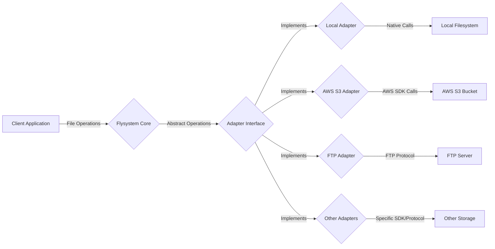
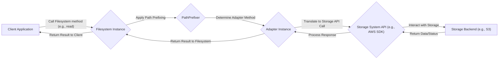

# Project Design Document: Flysystem

**Version:** 1.1
**Date:** October 26, 2023
**Author:** AI Software Architect

## 1. Introduction

This document provides an enhanced design overview of the Flysystem library, a PHP package offering an abstraction layer for diverse file storage systems. The purpose is to provide a clear understanding of Flysystem's architecture, components, and data flow, specifically tailored for effective threat modeling and security analysis.

## 2. Goals and Objectives

The core objectives of Flysystem are:

*   **Storage Abstraction:** To present a unified API for interacting with various file storage solutions, hiding the underlying implementation details.
*   **Adapter Interchangeability:** To enable seamless switching between different storage backends with minimal code modifications in the consuming application.
*   **Consistent Functionality:** To provide a common set of file system operations across different adapters, ensuring a predictable developer experience.
*   **Extensible Architecture:** To facilitate the creation of custom adapters for integrating with new or proprietary storage systems.

## 3. System Architecture

### 3.1. High-Level Architecture

*   **Client Application:** The PHP application utilizing the Flysystem library to perform file storage operations. This is the entry point for all interactions.
*   **Flysystem Core:** The central part of the library, responsible for managing and coordinating interactions with different storage adapters. It exposes the primary API for file operations.
*   **Adapter Interface:** Defines the contract that all concrete storage adapters must adhere to. This interface ensures a consistent set of methods for file manipulation.
*   **Local Adapter:** A concrete implementation of the `AdapterInterface` designed for interacting with the local server's file system.
*   **AWS S3 Adapter:** A concrete implementation of the `AdapterInterface` for interacting with Amazon Simple Storage Service (S3) buckets, leveraging the AWS SDK.
*   **FTP Adapter:** A concrete implementation of the `AdapterInterface` for interacting with File Transfer Protocol (FTP) servers.
*   **Other Adapters:** Represents the various other supported storage adapters, such as those for Dropbox, Google Cloud Storage, Azure Blob Storage, etc. Each uses its specific SDK or protocol.
*   **Local Filesystem:** The actual file system on the server where the application is running.
*   **AWS S3 Bucket:** A storage container within the Amazon S3 service.
*   **FTP Server:** A server running the FTP service for file storage and retrieval.
*   **Other Storage:** Represents the underlying storage mechanism for other specific adapters.

### 3.2. Component Architecture

Flysystem is composed of several key components working together:

*   **`Filesystem` Class:** The primary class developers interact with. It's instantiated with a specific adapter and provides the high-level API for file operations.
    *   **Responsibilities:**
        *   Delegates file operations to the configured adapter.
        *   Provides a consistent and user-friendly API.
        *   Handles path normalization and prefixing.
        *   Manages plugins and event listeners.
*   **`AdapterInterface`:**  An interface defining the contract for all storage adapters.
    *   **Responsibilities:**
        *   Defines methods for core file system operations like `read()`, `write()`, `delete()`, `fileExists()`, `getMetadata()`, `createDirectory()`, etc.
        *   Ensures all adapters implement a common set of functionalities.
*   **Concrete Adapters (e.g., `League\Flysystem\Local\LocalFilesystemAdapter`, `League\Flysystem\AwsS3V3\AwsS3V3Adapter`):** Implementations of the `AdapterInterface` for specific storage systems.
    *   **Responsibilities:**
        *   Contain the specific logic for interacting with the underlying storage API or protocol.
        *   Handle authentication and authorization with the target storage system.
        *   Translate Flysystem's abstract operations into storage-specific API calls.
        *   Manage connection details and error handling for the specific storage.
*   **`Config` Class:**  Used to configure the `Filesystem` instance, including adapter-specific options and settings.
    *   **Responsibilities:**
        *   Stores configuration parameters like visibility settings, directory separators, and adapter-specific credentials.
        *   Provides a way to pass configuration to the adapter during `Filesystem` instantiation.
*   **`PathPrefixer` Class:**  Manages path prefixes, allowing for namespacing or scoping within a storage system.
    *   **Responsibilities:**
        *   Prepends a configured prefix to all paths before passing them to the adapter.
        *   Ensures operations are confined within the specified namespace.
*   **`UnableToReadFile` / `UnableToWriteFile` / etc. Exceptions:** Specific exception classes for different failure scenarios.
    *   **Responsibilities:**
        *   Provide structured information about errors encountered during file operations.
        *   Allow for more specific error handling in the client application.
*   **Plugins (e.g., `League\Flysystem\Plugin\ListWith`)**: Optional extensions that add extra functionality to the `Filesystem` class.
    *   **Responsibilities:**
        *   Provide a mechanism to extend Flysystem's capabilities without modifying the core.
        *   Offer reusable functionalities that can be applied to different adapters.

## 4. Data Flow

A typical file operation within Flysystem follows this sequence:

1. **Client Application Initiates Operation:** The application calls a method on the `Filesystem` instance, such as `read('path/to/file.txt')`.
2. **Path Prefixing:** The `Filesystem` instance utilizes the `PathPrefixer` to apply any configured prefix to the provided path.
3. **Adapter Method Determination:** Based on the requested operation (read, write, delete, etc.), the `Filesystem` determines the corresponding method on the configured adapter.
4. **Storage API Call Translation:** The adapter translates the abstract Flysystem operation into a specific API call or protocol interaction required by the underlying storage system (e.g., an AWS SDK call for S3, an FTP command for an FTP server).
5. **Storage System Interaction:** The adapter uses the appropriate SDK or protocol to communicate with the storage backend, sending the request.
6. **Storage Backend Processing:** The storage backend processes the request (e.g., retrieves the file from S3, writes data to the local filesystem).
7. **Return Data/Status:** The storage backend returns the requested data or a status code indicating the success or failure of the operation.
8. **Response Processing:** The adapter processes the response from the storage backend, potentially handling errors or transforming data.
9. **Result to Filesystem:** The adapter returns the result of the operation (e.g., the file contents, a boolean indicating success) back to the `Filesystem` instance.
10. **Result to Client:** The `Filesystem` instance returns the final result to the calling client application.

## 5. Security Considerations

Security is paramount when using Flysystem, as it interacts with various storage systems, each with its own security model.

*   **Adapter Security Vulnerabilities:**  Security flaws within specific adapter implementations can expose the application and storage to risks.
    *   **Threat:** Outdated dependencies in adapters (e.g., an old AWS SDK version) might contain known vulnerabilities.
    *   **Mitigation:** Regularly update Flysystem and its adapter dependencies. Implement Software Composition Analysis (SCA) to identify vulnerable dependencies.
*   **Credential Management:** Improper handling of storage credentials within adapter configurations is a significant risk.
    *   **Threat:** Hardcoding credentials in code or configuration files can lead to exposure.
    *   **Mitigation:** Utilize secure credential management practices, such as environment variables, dedicated secrets management services (e.g., HashiCorp Vault), or cloud provider credential management. Avoid storing credentials directly in version control.
*   **Path Traversal Vulnerabilities:**  Insufficient validation of file paths can allow attackers to access or manipulate files outside the intended directories.
    *   **Threat:** An attacker might craft a malicious path (e.g., `../../sensitive_data.txt`) to access unauthorized files.
    *   **Mitigation:** While Flysystem provides some basic path normalization, the application should implement robust input validation and sanitization of user-provided file paths before passing them to Flysystem.
*   **Insecure Transport:**  Data transmitted between the application and the storage system might be vulnerable to interception if not properly secured.
    *   **Threat:**  Using unencrypted protocols like plain FTP can expose data in transit.
    *   **Mitigation:** Ensure adapters are configured to use secure protocols like HTTPS for cloud storage and SFTP for FTP. Enforce TLS encryption.
*   **Storage System Permissions:** Misconfigured permissions on the underlying storage system can lead to unauthorized access or data breaches.
    *   **Threat:** Publicly accessible S3 buckets or overly permissive file system permissions can expose sensitive data.
    *   **Mitigation:**  Properly configure permissions on the storage backend according to the principle of least privilege. Understand the specific permission model of the chosen storage system.
*   **Visibility Settings Misinterpretation:**  The `public` and `private` visibility settings in Flysystem are hints to the adapter, and their implementation varies.
    *   **Threat:**  Assuming `private` visibility guarantees absolute security across all adapters can be misleading.
    *   **Mitigation:** Understand how each adapter handles visibility settings and rely on the underlying storage system's access control mechanisms for robust security.
*   **Error Handling and Information Disclosure:**  Verbose error messages from adapters might reveal sensitive information about the storage system or internal configurations.
    *   **Threat:**  Detailed error messages could expose internal paths, storage account names, or other sensitive details to attackers.
    *   **Mitigation:** Implement proper error handling and logging within the application and adapters, ensuring that error messages are informative but do not expose sensitive information.
*   **Denial of Service (DoS):**  Malicious actors might attempt to overload the storage system through Flysystem.
    *   **Threat:**  Repeatedly requesting large files or performing numerous write operations can exhaust storage resources or exceed API limits.
    *   **Mitigation:** Implement rate limiting and request throttling at the application level or leverage storage system features for DoS protection.
*   **Temporary File Handling:**  Insecure handling of temporary files created during operations can introduce vulnerabilities.
    *   **Threat:**  Temporary files might be stored with insecure permissions or left behind after an operation fails.
    *   **Mitigation:** Ensure adapters and the application handle temporary files securely, including setting appropriate permissions and cleaning them up promptly.

## 6. Deployment Considerations

Secure deployment of applications using Flysystem requires careful attention to several aspects:

*   **Secure Credential Provisioning:**  Use secure methods for providing storage credentials to the application during deployment (e.g., environment variables managed by orchestration tools, secrets management services).
*   **Network Security:** Ensure network traffic between the application and the storage system is secured using appropriate network configurations (e.g., firewalls, VPNs).
*   **Least Privilege Principle:**  Grant the application only the necessary permissions to interact with the storage system. Avoid using overly permissive credentials or IAM roles.
*   **Regular Updates:** Keep Flysystem and its adapter dependencies updated to patch any security vulnerabilities.
*   **Monitoring and Logging:** Implement monitoring and logging to detect suspicious activity or potential security breaches related to file storage operations.
*   **Secure Configuration Management:**  Store and manage Flysystem configurations securely, avoiding exposure of sensitive information.
*   **Infrastructure Security:** Ensure the underlying infrastructure where the application is deployed is secure and hardened.

## 7. Future Considerations

*   **Standardized Security Events:**  Introduce a standardized way for adapters to emit security-related events for better monitoring and auditing.
*   **Built-in Encryption Capabilities:** Explore the possibility of adding optional built-in encryption/decryption capabilities within Flysystem for enhanced data protection.
*   **Improved Input Validation:**  Enhance Flysystem's built-in path validation and sanitization mechanisms.
*   **Formal Security Audits:**  Conduct regular security audits of the Flysystem core and popular adapters to identify and address potential vulnerabilities proactively.

This enhanced design document provides a more detailed and security-focused overview of the Flysystem library. By understanding these architectural details and security considerations, developers and security professionals can build more secure and resilient applications that leverage Flysystem for file storage abstraction.