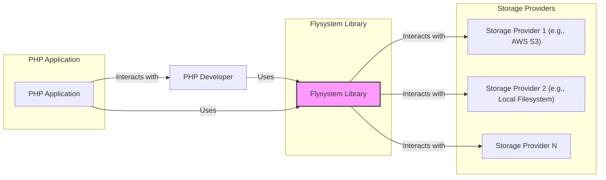
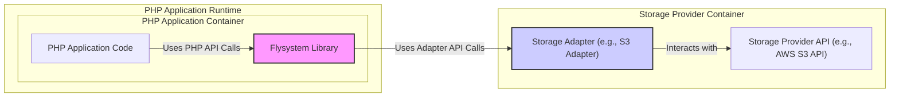
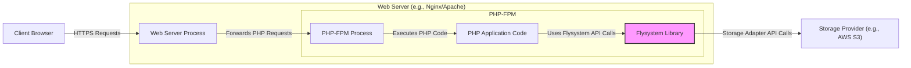
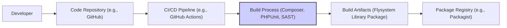

# BUSINESS POSTURE

- Business Priorities:
  - Provide a versatile and adaptable file system abstraction for PHP developers.
  - Simplify interactions with diverse storage systems, promoting code portability and reducing vendor lock-in.
- Business Goals:
  - Enable PHP applications to seamlessly integrate with various storage solutions using a unified API.
  - Enhance developer productivity by abstracting away the complexities of different storage systems.
  - Facilitate easy switching between storage backends without significant code modifications.
- Business Risks:
  - Data integrity and availability risks if the abstraction layer introduces bugs or mishandles storage operations.
  - Security vulnerabilities in the library could expose applications to unauthorized data access or manipulation.
  - Performance bottlenecks if the abstraction layer adds overhead or is not optimized for specific storage systems.
  - Compatibility issues with certain storage providers or PHP environments if not thoroughly tested and maintained.

# SECURITY POSTURE

- Existing Security Controls:
  - security control: Input validation to prevent path traversal and other file system related vulnerabilities. Implemented within the Flysystem library code.
  - security control: Reliance on underlying storage provider's security mechanisms for access control and data protection. Documented in Flysystem's adapter documentation.
  - security control: Secure coding practices followed during development. Evidenced by code quality and community contributions in the GitHub repository.
- Accepted Risks:
  - accepted risk: Security vulnerabilities in underlying storage providers are outside the scope of Flysystem's control.
  - accepted risk: Misconfiguration of storage adapters by users leading to security issues.
  - accepted risk:  Vulnerabilities in PHP runtime environment or dependent libraries.
- Recommended Security Controls:
  - security control: Implement automated security scanning (SAST/DAST) in the CI/CD pipeline for Flysystem library development.
  - security control: Provide secure configuration guidelines and best practices for users when integrating Flysystem with different storage adapters.
  - security control: Conduct regular security audits and penetration testing of the Flysystem library.
  - security control: Implement dependency vulnerability scanning to ensure no known vulnerabilities are present in Flysystem's dependencies.
- Security Requirements:
  - Authentication:
    - Requirement: Flysystem itself does not handle user authentication. Authentication is delegated to the underlying storage provider and managed by the application using Flysystem.
    - Requirement: Ensure that applications using Flysystem are properly authenticating requests to storage providers using secure methods (e.g., API keys, OAuth tokens).
  - Authorization:
    - Requirement: Flysystem relies on the authorization mechanisms of the underlying storage provider.
    - Requirement: Applications using Flysystem must implement appropriate authorization logic to control access to files based on user roles and permissions, leveraging the storage provider's capabilities where possible.
  - Input Validation:
    - Requirement: Flysystem must rigorously validate all input parameters, especially file paths and names, to prevent path traversal and injection attacks. Implemented within the Flysystem library code.
    - Requirement: Applications using Flysystem should also perform input validation on data before passing it to Flysystem operations.
  - Cryptography:
    - Requirement: Flysystem should support encryption of data at rest and in transit if required by the storage provider or application. This is typically handled by the storage adapter or the underlying storage service.
    - Requirement: Applications should consider encrypting sensitive data before storing it using Flysystem, especially when using storage providers that do not offer built-in encryption.

# DESIGN

## C4 CONTEXT

- Context Diagram Elements:
  - - Name: PHP Application
    - Type: Software System
    - Description: The PHP application that utilizes the Flysystem library to manage files.
    - Responsibilities:
      - Implementing application logic for file storage and retrieval.
      - Authenticating and authorizing users accessing files.
      - Handling application-specific data validation and processing.
    - Security controls:
      - Application-level authentication and authorization.
      - Input validation for application-specific data.
      - Secure session management.
  - - Name: Flysystem Library
    - Type: Software System / Library
    - Description: A PHP library providing an abstraction layer for interacting with various storage systems.
    - Responsibilities:
      - Providing a consistent API for file system operations across different storage providers.
      - Adapting application requests to the specific protocols of storage providers.
      - Handling low-level file system operations and interactions with storage systems.
      - Input validation to prevent path traversal and other file system vulnerabilities.
    - Security controls:
      - Input validation and sanitization within the library.
      - Secure coding practices in library development.
      - Dependency vulnerability management.
  - - Name: Storage Provider 1 (e.g., AWS S3)
    - Type: External System
    - Description: An example of an external storage service that Flysystem can interact with, such as Amazon S3.
    - Responsibilities:
      - Storing and retrieving files.
      - Managing access control and permissions for stored files.
      - Ensuring data durability and availability.
      - Providing authentication and authorization mechanisms.
    - Security controls:
      - Storage provider's access control mechanisms (IAM, ACLs).
      - Encryption at rest and in transit (if offered).
      - Physical security of data centers.
  - - Name: Storage Provider 2 (e.g., Local Filesystem)
    - Type: External System
    - Description: An example of an external storage system, in this case the local filesystem of the server running the PHP application.
    - Responsibilities:
      - Storing and retrieving files on the local filesystem.
      - Relying on operating system's file permissions for access control.
    - Security controls:
      - Operating system's file permissions.
      - Server's physical security.
  - - Name: Storage Provider N
    - Type: External System
    - Description: Represents any other storage provider supported by Flysystem.
    - Responsibilities:
      - Similar responsibilities as Storage Provider 1 and 2, depending on the specific provider.
    - Security controls:
      - Storage provider specific security controls.
  - - Name: PHP Developer
    - Type: Person
    - Description: Developers who use the Flysystem library to build PHP applications.
    - Responsibilities:
      - Integrating Flysystem into PHP applications.
      - Configuring Flysystem adapters for specific storage providers.
      - Implementing application logic using Flysystem API.
      - Ensuring secure usage of Flysystem and storage providers.
    - Security controls:
      - Secure coding practices.
      - Following security guidelines for Flysystem and storage providers.
      - Proper configuration of Flysystem adapters.

## C4 CONTAINER

- Container Diagram Elements:
  - - Name: PHP Application Code
    - Type: Container / Code
    - Description: The application-specific PHP code that utilizes the Flysystem library.
    - Responsibilities:
      - Implementing business logic for file operations.
      - Calling Flysystem library functions to interact with storage.
      - Handling user authentication and authorization (application level).
    - Security controls:
      - Application-level input validation.
      - Secure coding practices in application code.
      - Authorization logic within the application.
  - - Name: Flysystem Library
    - Type: Container / PHP Library
    - Description: The Flysystem PHP library providing the abstraction layer.
    - Responsibilities:
      - Providing the core Flysystem API.
      - Managing adapters for different storage providers.
      - Handling core file system operations abstraction.
      - Input validation and sanitization within the library.
    - Security controls:
      - Input validation and sanitization within the library.
      - Secure coding practices in library development.
      - Dependency vulnerability management.
  - - Name: Storage Adapter (e.g., S3 Adapter)
    - Type: Container / PHP Code
    - Description: A specific Flysystem adapter for a particular storage provider, like the S3 adapter for AWS S3.
    - Responsibilities:
      - Translating Flysystem API calls into storage provider specific API calls.
      - Handling authentication and communication with the storage provider API.
      - Mapping Flysystem's abstract file system operations to the storage provider's capabilities.
    - Security controls:
      - Secure handling of storage provider credentials.
      - Secure communication with the storage provider API (e.g., HTTPS).
      - Input validation specific to the storage provider API.
  - - Name: Storage Provider API (e.g., AWS S3 API)
    - Type: Container / API
    - Description: The API provided by the external storage service (e.g., AWS S3 API).
    - Responsibilities:
      - Providing the interface for interacting with the storage service.
      - Handling authentication and authorization for API requests.
      - Performing actual file storage and retrieval operations.
    - Security controls:
      - Storage provider's API authentication and authorization mechanisms.
      - API rate limiting and security measures.
      - Encryption in transit for API communication (HTTPS).

## DEPLOYMENT

- Deployment Options:
  - Option 1: Deployed as a PHP library within a web application running on a web server (e.g., Apache, Nginx) and PHP-FPM.
  - Option 2: Deployed as a PHP library within a CLI application running in a command-line environment.
  - Option 3: Deployed as part of a serverless PHP function (e.g., AWS Lambda, Azure Functions).

- Detailed Deployment (Option 1 - Web Application):

- Deployment Diagram Elements:
  - - Name: Web Server Process (e.g., Nginx/Apache)
    - Type: Infrastructure / Web Server
    - Description: The web server responsible for handling incoming HTTP requests and serving the PHP application.
    - Responsibilities:
      - Receiving and processing HTTP requests from clients.
      - Serving static content.
      - Forwarding PHP requests to PHP-FPM.
      - Handling TLS/SSL termination for HTTPS.
    - Security controls:
      - Web server security configurations (e.g., disabling unnecessary modules, setting appropriate headers).
      - TLS/SSL configuration for HTTPS.
      - Web application firewall (WAF) integration (optional).
  - - Name: PHP-FPM Process
    - Type: Infrastructure / PHP Processor
    - Description: FastCGI Process Manager for PHP, responsible for executing PHP code.
    - Responsibilities:
      - Executing PHP application code.
      - Managing PHP processes.
      - Handling requests from the web server.
    - Security controls:
      - PHP-FPM security configurations (e.g., process isolation, resource limits).
      - Operating system level security controls for the PHP-FPM process.
  - - Name: PHP Application Code
    - Type: Software / Application Code
    - Description: The deployed PHP application code that uses Flysystem.
    - Responsibilities:
      - Implementing application logic.
      - Utilizing Flysystem for file operations.
    - Security controls:
      - Application-level security controls as described in Container Diagram.
  - - Name: Flysystem Library
    - Type: Software / PHP Library
    - Description: The deployed Flysystem library.
    - Responsibilities:
      - Providing file system abstraction.
    - Security controls:
      - Library-level security controls as described in Container Diagram.
  - - Name: Storage Provider (e.g., AWS S3)
    - Type: External Service / Storage
    - Description: The external storage service used by Flysystem.
    - Responsibilities:
      - Storing and retrieving files.
    - Security controls:
      - Storage provider security controls as described in Context Diagram.
  - - Name: Client Browser
    - Type: External / User Client
    - Description: User's web browser accessing the PHP application.
    - Responsibilities:
      - Sending HTTP requests to the web application.
      - Rendering web pages.
    - Security controls:
      - Browser security features (e.g., Content Security Policy, Same-Origin Policy).
      - User's responsibility to maintain browser security.

## BUILD

- Build Process Description:
  - Developer commits code changes to a code repository (e.g., GitHub).
  - A CI/CD pipeline (e.g., GitHub Actions) is triggered on code changes.
  - Build Process:
    - Dependency Management: Composer is used to manage PHP dependencies.
    - Testing: PHPUnit is used to run unit tests and integration tests.
    - Static Analysis Security Testing (SAST): SAST tools (e.g., Psalm, PHPStan, SonarQube) are used to scan the code for potential security vulnerabilities and code quality issues.
    - Linting: Code linters (e.g., PHP-CS-Fixer) are used to enforce code style and standards.
  - Build Artifacts: The build process produces a packaged version of the Flysystem library, typically as a Composer package.
  - Package Registry: The build artifacts are published to a package registry (e.g., Packagist) for distribution and consumption by PHP developers.

- Build Diagram Elements:
  - - Name: Developer
    - Type: Person
    - Description: Software developers contributing to the Flysystem project.
    - Responsibilities:
      - Writing and committing code.
      - Running local tests.
      - Participating in code reviews.
    - Security controls:
      - Secure development practices.
      - Code review process.
      - Access control to code repository.
  - - Name: Code Repository (e.g., GitHub)
    - Type: Tool / Version Control
    - Description: A version control system (e.g., Git on GitHub) used to store and manage the Flysystem source code.
    - Responsibilities:
      - Storing source code.
      - Managing code versions and branches.
      - Tracking code changes.
      - Access control to the repository.
    - Security controls:
      - Access control and permissions management.
      - Audit logging of code changes.
      - Branch protection policies.
  - - Name: CI/CD Pipeline (e.g., GitHub Actions)
    - Type: Tool / Automation
    - Description: An automated CI/CD pipeline used to build, test, and publish the Flysystem library.
    - Responsibilities:
      - Automating the build process.
      - Running tests and security scans.
      - Publishing build artifacts.
      - Ensuring build integrity and repeatability.
    - Security controls:
      - Secure configuration of CI/CD pipeline.
      - Access control to CI/CD configurations and secrets.
      - Audit logging of CI/CD activities.
  - - Name: Build Process (Composer, PHPUnit, SAST)
    - Type: Process / Automation
    - Description: The automated build process that includes dependency management, testing, and security checks.
    - Responsibilities:
      - Resolving dependencies using Composer.
      - Executing unit and integration tests using PHPUnit.
      - Performing static analysis security testing (SAST).
      - Linting code.
    - Security controls:
      - SAST tools to identify vulnerabilities.
      - Dependency vulnerability scanning (Composer audit).
      - Secure build environment.
  - - Name: Build Artifacts (Flysystem Library Package)
    - Type: Data / Software Package
    - Description: The packaged version of the Flysystem library produced by the build process.
    - Responsibilities:
      - Containing the compiled and packaged Flysystem library code.
      - Being ready for distribution and consumption.
    - Security controls:
      - Code signing (optional).
      - Integrity checks (e.g., checksums).
  - - Name: Package Registry (e.g., Packagist)
    - Type: Tool / Package Repository
    - Description: A public package registry (e.g., Packagist) where the Flysystem library package is published for distribution.
    - Responsibilities:
      - Hosting and distributing PHP packages.
      - Providing package management tools (Composer).
    - Security controls:
      - Package integrity checks.
      - Malware scanning (if implemented by registry).
      - Access control for package publishing.

# RISK ASSESSMENT

- Critical Business Processes:
  - File storage and retrieval for PHP applications using Flysystem.
  - Developer productivity and ease of integration with various storage systems.
  - Maintaining the integrity and availability of data managed by Flysystem.
- Data to Protect:
  - Files stored and managed by applications using Flysystem.
  - Sensitivity of data depends on the application using Flysystem. Data can range from public assets to sensitive user data, application configurations, and business-critical documents.
  - Sensitivity levels should be determined by the applications using Flysystem based on their specific context and data classification policies.

# QUESTIONS & ASSUMPTIONS

- Questions:
  - What are the primary use cases and types of applications that are expected to use Flysystem? (e.g., web applications, content management systems, file backup solutions).
  - What are the most commonly used storage providers with Flysystem? (e.g., AWS S3, Azure Blob Storage, Google Cloud Storage, local filesystem).
  - Are there any specific compliance requirements or industry regulations that applications using Flysystem need to adhere to? (e.g., GDPR, HIPAA, PCI DSS).
  - What is the expected performance and scalability requirements for applications using Flysystem?
  - Are there any specific security concerns or threat vectors that are particularly relevant to Flysystem and its users?

- Assumptions:
  - BUSINESS POSTURE:
    - The primary business goal is to provide a flexible and easy-to-use file system abstraction for PHP developers.
    - The project prioritizes developer productivity and code portability across different storage systems.
    - Security is a significant concern, but usability and flexibility are also important.
  - SECURITY POSTURE:
    - Security of the underlying storage providers is primarily the responsibility of those providers.
    - Applications using Flysystem are responsible for implementing application-level authentication and authorization.
    - Flysystem library aims to prevent common file system related vulnerabilities like path traversal.
  - DESIGN:
    - Flysystem is designed as a PHP library to be integrated into PHP applications.
    - The architecture is centered around the abstraction layer and adapter pattern to support various storage providers.
    - Deployment is primarily within PHP application environments, such as web servers or CLI environments.
    - Build process includes automated testing and basic security checks.