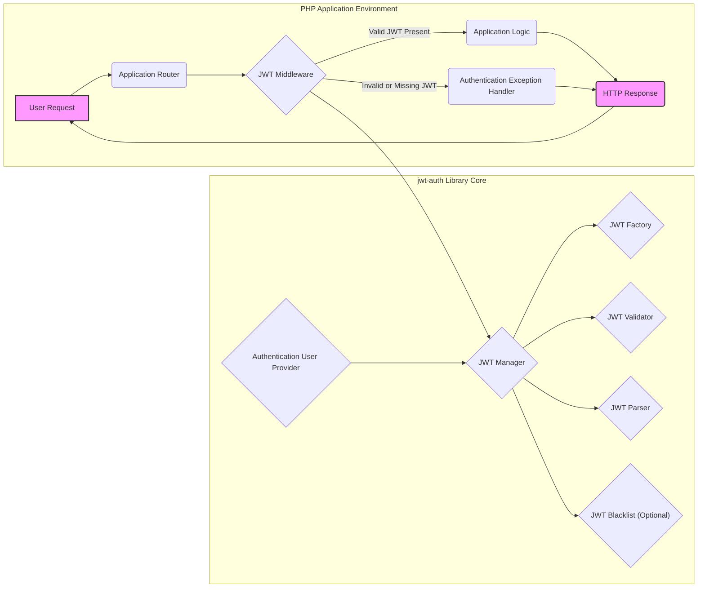
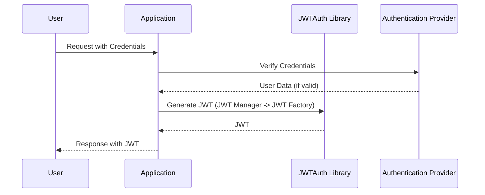
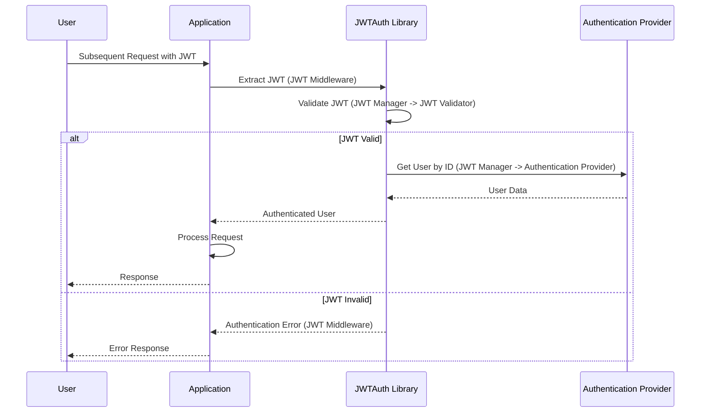
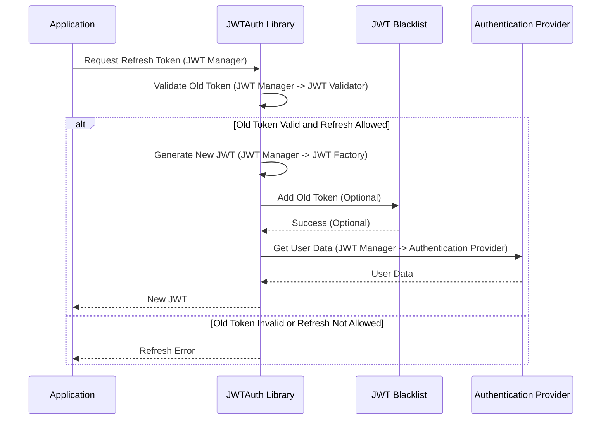

# Project Design Document: tymondesigns/jwt-auth Library

**Version:** 1.1
**Date:** October 26, 2023
**Author:** AI Software Architect

## 1. Introduction

This document provides an enhanced and detailed design overview of the `tymondesigns/jwt-auth` library, a widely adopted PHP package for implementing JSON Web Token (JWT) authentication in web applications. This revised document aims to offer a more granular understanding of the library's architecture, components, and data flow, specifically tailored for effective threat modeling and security analysis.

## 2. Goals and Objectives

The primary goals of the `tymondesigns/jwt-auth` library are to:

* Offer a straightforward and robust mechanism for implementing JWT-based authentication within PHP applications.
* Provide extensive configurability for JWT settings, including signing algorithms, token expiration, and custom claims.
* Facilitate seamless integration with prominent PHP frameworks such as Laravel and Lumen through dedicated service providers and middleware.
* Abstract the underlying complexities of JWT creation, validation, and refresh operations, simplifying developer implementation.
* Bolster the security posture of web applications by adhering to industry-standard JWT best practices and offering features like token blacklisting.

## 3. Architectural Overview

The `tymondesigns/jwt-auth` library functions as a crucial middleware component and a set of injectable services within a PHP application's request lifecycle. It intercepts incoming requests, authenticates users based on the presence and validity of JWTs, and manages the entire lifecycle of these tokens.

**Key Architectural Components and their Interactions:**

* **Application Router:** The initial point of contact for incoming HTTP requests, responsible for directing requests to the appropriate application handlers or middleware.
* **JWT Middleware:**  A crucial interceptor in the request pipeline. It examines incoming requests for a JWT, typically in the `Authorization` header with a `Bearer` scheme. It delegates JWT validation to the `JWT Manager`.
* **Application Logic:** The core business logic of the application, executed only after successful user authentication by the JWT Middleware.
* **Authentication Exception Handler:**  Handles scenarios where JWT authentication fails (e.g., invalid or missing token), typically returning an unauthorized response.
* **JWT Manager:** The central orchestrator within the library. It configures and manages the lifecycle of JWTs, delegating specific tasks to the Factory, Validator, Parser, and Blacklist components. It also interacts with the application's `Authentication User Provider`.
* **JWT Factory:**  Responsible for the creation of new JWT strings. It takes user data and configured claims as input, signs the JWT using the specified algorithm and secret key, and constructs the final JWT string.
* **JWT Validator:**  Performs the critical task of verifying the integrity and validity of a received JWT. This includes signature verification, checking the expiration time (`exp` claim), and optionally verifying other standard claims.
* **JWT Parser:**  Handles the decoding of the base64-encoded header and payload sections of a JWT, allowing access to the claims and header information.
* **JWT Blacklist (Optional):**  Provides a mechanism to explicitly invalidate specific JWTs before their natural expiration. This component typically relies on an external storage mechanism like Redis or a database.
* **Authentication User Provider:** An interface that the application implements to allow `jwt-auth` to interact with the application's user model and authentication logic. It provides methods for retrieving user details based on identifiers.

## 4. Component Design

This section provides a more detailed breakdown of the key components within the `jwt-auth` library and their specific functionalities.

### 4.1. JWT Manager

* **Core Responsibilities:**
    * Acts as the primary interface for interacting with the library's JWT functionality.
    * Configures and manages the internal components: `JWT Factory`, `JWT Validator`, `JWT Parser`, and `JWT Blacklist`.
    * Provides methods for:
        * `generate(User $user, array $customClaims = [])`: Creates a new JWT for a given user with optional custom claims.
        * `parseToken()`: Attempts to parse a JWT from the current request.
        * `validateToken(string $token)`: Validates a given JWT string.
        * `refreshToken(string $token)`: Generates a new JWT from a valid, non-expired token (if refresh is enabled).
        * `invalidateToken(string $token)`: Adds a token to the blacklist (if enabled).
        * `check()`: Checks if a valid token is present in the request.
        * `user()`: Returns the authenticated user object based on the token.
    * Manages the interaction with the configured `Authentication User Provider`.

### 4.2. JWT Factory

* **Core Responsibilities:**
    * `make(array $payload, array $headers = [])`: Creates a JWT object with the given payload and headers.
    * `fromUser(Authenticatable $user, array $customClaims = [])`: Creates a JWT payload from a user object, including the user's identifier as the `sub` claim, and merges custom claims.
    * Signs the JWT using the configured algorithm and secret key (or public/private key pair).
    * Sets standard JWT claims:
        * `iss` (issuer): Identifies the issuer of the JWT.
        * `sub` (subject): Identifies the principal that is the subject of the JWT (typically the user ID).
        * `iat` (issued at):  Timestamp indicating when the JWT was created.
        * `exp` (expiration time): Timestamp after which the JWT is no longer valid.
        * `nbf` (not before) (optional): Timestamp before which the JWT is not valid.
        * `jti` (JWT ID) (optional): Unique identifier for the JWT.
    * Allows for the inclusion of custom claims in the JWT payload.

### 4.3. JWT Validator

* **Core Responsibilities:**
    * `check(string $token)`: Performs the complete validation process for a given JWT.
    * Verifies the signature of the JWT using the configured algorithm and key.
    * Checks the `exp` claim to ensure the token has not expired.
    * Optionally checks the `nbf` claim if present.
    * Optionally checks other standard claims like `iss` and `aud` (audience), if configured.
    * If the `JWT Blacklist` is enabled, checks if the token is present in the blacklist.
    * Throws specific exceptions (e.g., `TokenExpiredException`, `TokenInvalidException`, `TokenBlacklistedException`) to indicate the reason for validation failure.

### 4.4. JWT Parser

* **Core Responsibilities:**
    * `parse(string $token)`: Decodes the JWT string into its constituent parts (header, payload, signature).
    * `getHeader(string $token)`: Extracts the header claims from the JWT.
    * `getPayload(string $token)`: Extracts the payload claims from the JWT.
    * Performs base64 decoding of the header and payload segments.
    * Verifies the structure of the JWT string.

### 4.5. JWT Blacklist

* **Core Responsibilities:**
    * `add(string $token)`: Adds a JWT to the blacklist.
    * `has(string $token)`: Checks if a given JWT is present in the blacklist.
    * `remove(string $token)`: Removes a JWT from the blacklist.
    * Typically interacts with a storage backend (e.g., Redis, database) to persist the blacklist.
    * May implement a time-to-live (TTL) for blacklisted tokens to automatically remove them after a certain period.

### 4.6. Authentication User Provider

* **Core Responsibilities:**
    * This is an interface that *must* be implemented by the application.
    * Provides methods for:
        * `retrieveById($identifier)`: Retrieves a user model instance based on its primary identifier. This is used when validating a token and fetching the associated user.
        * `retrieveByCredentials(array $credentials)`: Retrieves a user model instance based on authentication credentials (e.g., username and password). This is typically used during the initial login process (outside the scope of JWT validation).
        * `validateCredentials(Authenticatable $user, array $credentials)`: Validates the provided credentials against the user model.

### 4.7. JWT Middleware

* **Core Responsibilities:**
    * `handle($request, Closure $next)`: The main method invoked for each incoming request.
    * Attempts to extract the JWT from the request headers (typically the `Authorization` header).
    * Calls the `JWTManager` to `parseToken()` and then `validateToken()`.
    * If the token is valid:
        * Calls the `JWTManager`'s `user()` method to retrieve the authenticated user.
        * Sets the authenticated user on the request object or authentication guard.
        * Allows the request to proceed to the next middleware or application logic.
    * If the token is invalid or missing:
        * Catches exceptions thrown by the `JWTManager` (e.g., `TokenExpiredException`, `TokenInvalidException`).
        * Returns an appropriate HTTP response (typically a 401 Unauthorized).
        * Allows for configuration of behavior when a token is absent (e.g., allowing anonymous access).

## 5. Data Flow

The following diagrams illustrate the typical data flow for authentication and authorization using the `tymondesigns/jwt-auth` library.

**Detailed Data Flow Steps:**

1. **Authentication (Token Generation):**
    * The user submits their credentials to the application.
    * The application's authentication logic verifies these credentials against the `Authentication Provider`.
    * Upon successful verification, the application calls the `JWTAuth` library's `generate()` method on the `JWTManager`, passing the authenticated user object.
    * The `JWTManager` delegates the JWT creation to the `JWTFactory`, which constructs and signs the JWT.
    * The generated JWT is returned to the application.
    * The application sends the JWT back to the user, typically in the response body or as an HTTP-only cookie.

2. **Authorization (Token Validation):**
    * The user sends subsequent requests, including the JWT in the `Authorization` header.
    * The `JWT Middleware` intercepts the request and calls the `JWTManager`'s `parseToken()` to extract the JWT.
    * The middleware then calls `JWTManager`'s `validateToken()`, which utilizes the `JWTValidator` to verify the token's signature, expiration, and other claims.
    * If the JWT is valid:
        * The `JWTManager` extracts the user identifier from the `sub` claim.
        * The `JWTManager` uses the `Authentication Provider`'s `retrieveById()` method to fetch the corresponding user object.
        * The authenticated user object is made available to the application.
        * The request proceeds to the application's logic.
    * If the JWT is invalid or missing, the `JWT Middleware` catches the exception and returns an appropriate error response.

3. **Token Refresh:**
    * When a token is nearing expiration, the application can request a new token.
    * The application calls the `JWTManager`'s `refreshToken()` method, passing the current (valid but soon-to-expire) token.
    * The `JWTManager` validates the old token.
    * If the old token is valid and refresh is allowed, the `JWTManager` uses the `JWTFactory` to generate a new JWT.
    * Optionally, the old token can be added to the `JWT Blacklist` to prevent its further use.
    * The new JWT is returned to the application.

## 6. Security Considerations

This section provides a more in-depth look at the security considerations relevant to the `tymondesigns/jwt-auth` library, crucial for effective threat modeling.

* **Secret Key Management:** The confidentiality and integrity of the JWT signing key are paramount.
    * **Risk:** If the secret key is compromised, attackers can forge arbitrary valid JWTs, impersonating any user.
    * **Mitigation:**
        * Store the secret key securely using environment variables, secrets management systems (e.g., HashiCorp Vault, AWS Secrets Manager), or secure configuration files with restricted access.
        * Avoid hardcoding the secret key in the application code.
        * Implement regular key rotation to limit the impact of a potential compromise.
        * Use strong, randomly generated keys with sufficient length.
* **Algorithm Selection:** The choice of the JWT signing algorithm directly impacts the security of the token.
    * **Risk:** Using weak or insecure algorithms (e.g., `none`, older SHA algorithms with insufficient key lengths) can make the tokens vulnerable to forgery.
    * **Mitigation:**
        * Use strong, industry-recommended algorithms like HS256 (for symmetric keys) or RS256/ES256 (for asymmetric key pairs).
        * Understand the implications of symmetric vs. asymmetric algorithms. Symmetric keys require secure sharing, while asymmetric keys allow for public key distribution for verification.
        * Avoid the `none` algorithm in production environments.
* **Token Storage and Transmission:** The methods used to store and transmit JWTs are critical to prevent unauthorized access.
    * **Risk:** Storing JWTs in insecure locations (e.g., local storage, session storage without proper protection) or transmitting them over unencrypted HTTP connections exposes them to interception and theft.
    * **Mitigation:**
        * Store JWTs securely in HTTP-only cookies with the `Secure` flag set, preventing JavaScript access and ensuring transmission only over HTTPS.
        * Always enforce HTTPS for all application traffic to encrypt JWT transmission.
        * Consider using short-lived access tokens and refresh tokens for improved security.
* **Expiration Time (`exp` claim):**  Setting an appropriate expiration time balances security and user experience.
    * **Risk:**  Excessively long expiration times increase the window of opportunity for attackers if a token is compromised. Very short expiration times can lead to frequent authentication requests and a degraded user experience.
    * **Mitigation:**
        * Choose an expiration time that aligns with the sensitivity of the data and the typical user session duration.
        * Implement a robust token refresh mechanism to allow users to maintain authenticated sessions without frequent re-login prompts.
* **JWT Blacklisting:**  Provides a mechanism to revoke compromised or suspicious tokens.
    * **Risk:** Without blacklisting, a compromised token remains valid until its natural expiration, even if the user's account is compromised.
    * **Mitigation:**
        * Implement JWT blacklisting using a persistent storage mechanism like Redis or a database.
        * Consider the performance implications of blacklist lookups, especially for high-traffic applications.
        * Implement a strategy for managing the blacklist size and removing expired entries.
* **Replay Attacks:** Attackers might attempt to reuse a valid JWT obtained from a legitimate user.
    * **Mitigation:**
        * Employ short expiration times for access tokens.
        * Consider implementing refresh token rotation, where a new refresh token is issued with each access token refresh, invalidating the old refresh token.
        * The `nbf` (not before) claim can be used to specify a time before which the token is not valid.
* **Brute-Force Attacks:** While JWT signatures are cryptographically secure with strong algorithms, weak secrets are vulnerable.
    * **Mitigation:** Enforce the use of strong, randomly generated secret keys with sufficient entropy.
* **Input Validation:**  Validate all data used to generate JWTs to prevent injection attacks or the inclusion of malicious data.
* **Dependency Vulnerabilities:** Regularly update the `tymondesigns/jwt-auth` library and its dependencies to patch any known security vulnerabilities. Use dependency management tools to track and update dependencies.

## 7. Deployment Considerations

Deploying `tymondesigns/jwt-auth` requires careful consideration of configuration and integration.

* **Configuration Management:** Securely manage the library's configuration, particularly the signing key.
    * **Best Practices:** Utilize environment variables or dedicated secrets management services to store sensitive configuration values. Avoid hardcoding secrets in configuration files.
* **Framework Integration:** Leverage the provided integration packages for Laravel and Lumen for simplified setup and seamless integration with the framework's authentication system.
* **Blacklist Storage:** If JWT blacklisting is enabled, ensure that the chosen storage backend (e.g., Redis, database) is properly configured, secured, and accessible to the application. Consider factors like performance, scalability, and persistence when selecting the storage mechanism.
* **HTTPS Enforcement:**  Ensure that the application is served over HTTPS in production environments to protect JWTs during transmission. Configure web servers and load balancers accordingly.

## 8. Future Enhancements (Optional)

Potential future enhancements for the `tymondesigns/jwt-auth` library could include:

* **Enhanced Refresh Token Handling:** Implement more sophisticated refresh token rotation strategies and mechanisms for detecting and mitigating refresh token reuse.
* **Standardized Claim Support:** Provide more built-in support for registered JWT claims as defined in the JWT specification.
* **Integration with OAuth 2.0 Flows:** Extend the library to facilitate integration with standard OAuth 2.0 authorization flows, such as authorization code grant or client credentials grant.
* **Improved Documentation:**  Further enhance the documentation with more detailed examples and best practices for secure implementation.

This revised document provides a more comprehensive and detailed design overview of the `tymondesigns/jwt-auth` library, with a strong focus on aspects relevant to security and threat modeling. The enhanced explanations and diagrams aim to provide a solid foundation for identifying and mitigating potential security risks associated with its use.