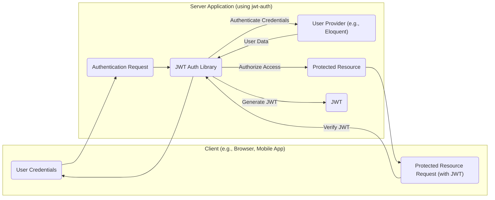
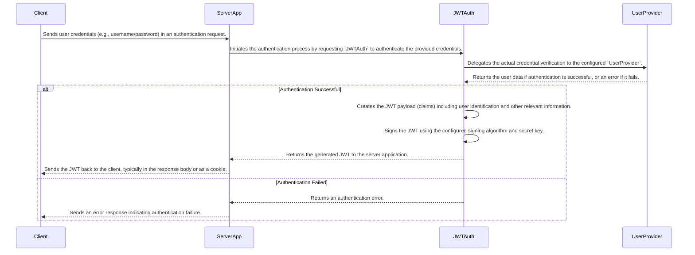
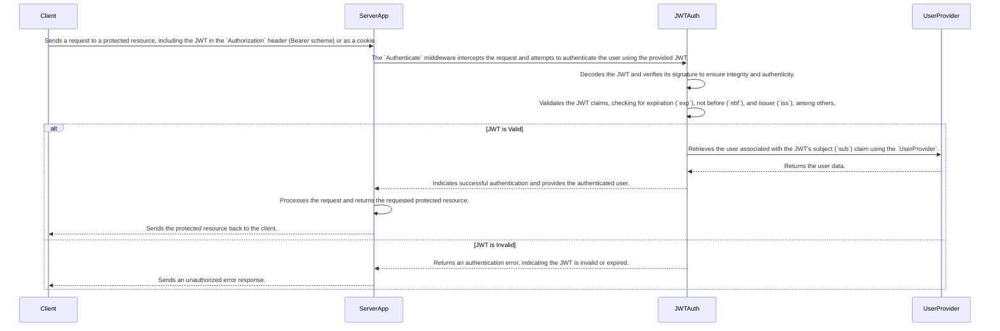
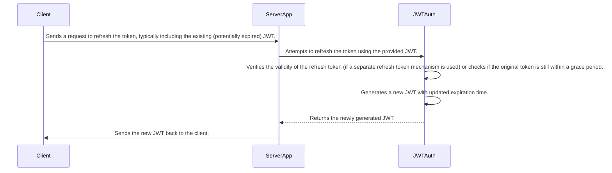

# Project Design Document: tymondesigns/jwt-auth

**Version:** 1.1
**Date:** October 26, 2023
**Author:** AI Software Architect

## 1. Introduction

This document provides a detailed design overview of the `tymondesigns/jwt-auth` library, a widely used PHP package designed to facilitate JSON Web Token (JWT) based authentication in web applications, particularly within the Laravel framework. This document serves as a foundational resource for subsequent threat modeling exercises.

## 2. Goals and Objectives

The primary objectives of the `jwt-auth` library are to:

* Offer a straightforward and reliable mechanism for the generation and verification of JWTs.
* Enable stateless authentication paradigms in web applications.
* Provide extensive configuration options for customizing JWT behavior and settings.
* Integrate seamlessly with Laravel's existing authentication infrastructure.
* Support a range of standard JWT signing algorithms, ensuring flexibility and security.
* Implement functionalities for token invalidation and blacklisting, enhancing security.
* Supply middleware components for securing API endpoints through JWT validation.

## 3. Scope

This design document specifically examines the architecture and internal workings of the `tymondesigns/jwt-auth` library. It explicitly excludes:

* Specific implementations and usage patterns of the library within individual user applications.
* The underlying details of the HTTP protocol or the configuration of web servers hosting applications using the library.
* The intricacies of database interactions related to user management, although the library interacts with user model data.
* Front-end code and logic responsible for handling and managing JWTs on the client-side.

## 4. Architectural Overview

The `jwt-auth` library is structured around several interconnected components that collectively manage the JWT authentication process.

**Detailed Component Descriptions:**

* **`JWT` Class:** This is the central class responsible for the core JWT operations: encoding (serializing claims into a JWT string) and decoding (parsing a JWT string back into its claims). It also handles the cryptographic signing and verification of the JWT signature.
* **`JWTManager` Class:** This class orchestrates the JWT lifecycle. It provides methods for generating new JWTs, refreshing existing tokens (issuing new tokens based on valid, potentially expiring ones), and invalidating tokens (e.g., by adding them to a blacklist). It serves as the primary interface for interacting with the library's JWT functionality.
* **`Claims` Collection:**  Represents the payload section of the JWT. It's a collection of key-value pairs, including standard registered claims (like `iss`, `sub`, `aud`, `exp`, `nbf`, `iat`, `jti`) and any custom claims added by the application.
* **`PayloadFactory`:** This component is responsible for constructing the JWT payload (the `Claims` collection) based on user-specific data and the library's configuration settings. It ensures the inclusion of necessary standard claims and allows for the addition of custom claims.
* **`Token` Class:** A simple value object that encapsulates the raw JWT string. It provides a type-safe way to represent and pass around JWTs within the application.
* **`BlacklistManager` (Interface and Implementations):** This component provides the mechanism for invalidating JWTs before their natural expiration time. The interface defines the contract for adding tokens to and checking tokens against a blacklist. Implementations can vary, using storage mechanisms like in-memory arrays, database tables, or dedicated caching systems like Redis.
* **`Providers`:**
    * **`Auth` Provider:**  Handles the process of authenticating user credentials provided during login attempts. This often integrates with Laravel's built-in authentication guards, allowing `jwt-auth` to leverage existing authentication logic (e.g., checking credentials against a database).
    * **`User` Provider:**  Responsible for retrieving user data based on the `sub` (subject) claim extracted from a valid JWT. This allows the application to fetch the authenticated user's information when processing requests with a valid token.
* **`Validators`:** These components enforce rules and constraints on the structure and content of JWTs during the verification process. They check for things like the presence of required claims, the validity of the signature, and whether the token has expired or is not yet valid (based on `exp` and `nbf` claims).
* **`Middleware` (e.g., `Authenticate`):**  Laravel middleware components that intercept incoming HTTP requests. The `Authenticate` middleware is crucial for protecting API endpoints. It extracts the JWT from the request headers or cookies, passes it to the `JWTAuth` library for validation, and, if the token is valid, authenticates the user for the current request.

## 5. Data Flow

The following diagrams illustrate the typical data flow for authentication and authorization using the `jwt-auth` library:

**Authentication (Token Generation):**

**Authorization (Accessing Protected Resources):**

**Token Refresh (Optional):**

## 6. Security Considerations (Crucial for Threat Modeling)

This section outlines key security considerations relevant for threat modeling activities:

* **Secret Key Management (Critical):** The secret key used to sign JWTs is the most sensitive piece of information. Its compromise allows attackers to forge valid JWTs, impersonating legitimate users.
    * **Threat:** Key Derivation Function (KDF) weakness, insecure storage (e.g., hardcoding), insufficient access controls.
    * **Mitigation:** Utilize strong KDFs if deriving keys, store keys in secure vaults or use environment variables with restricted access, implement key rotation policies.
* **Algorithm Selection:** The choice of signing algorithm directly impacts the security of the JWT.
    * **Threat:** Algorithm downgrade attacks (forcing the use of weaker algorithms), brute-force attacks on weak algorithms.
    * **Mitigation:** Enforce the use of strong, well-vetted algorithms like RS256 (using public/private key pairs) or HS256 (using a shared secret). Avoid deprecated algorithms like `none`.
* **JWT Structure and Claims:** The information contained within the JWT claims needs careful consideration.
    * **Threat:** Information leakage through sensitive data in claims, claim manipulation if not properly signed, replay attacks if `jti` (JWT ID) is not used or validated.
    * **Mitigation:** Minimize sensitive data in claims, always verify the JWT signature, consider using the `jti` claim for replay attack prevention and implement token blacklisting.
* **Token Storage on the Client-Side:** How the client stores the JWT significantly affects its security.
    * **Threat:** Cross-Site Scripting (XSS) attacks can steal tokens stored in local storage, Cross-Site Request Forgery (CSRF) if cookies are not properly handled.
    * **Mitigation:** Prefer HTTP-only and Secure cookies for storing JWTs in browsers to prevent JavaScript access. Implement robust CSRF protection mechanisms.
* **Token Invalidation and Blacklisting:**  The effectiveness of token invalidation mechanisms is crucial for mitigating the impact of compromised tokens.
    * **Threat:**  Use of compromised tokens if blacklisting is not implemented or is inefficient, race conditions in blacklist updates.
    * **Mitigation:** Implement a robust and efficient token blacklisting mechanism (e.g., using a database or Redis). Consider the performance implications of blacklist lookups.
* **Replay Attacks:** Attackers might try to reuse a valid JWT to gain unauthorized access.
    * **Threat:** Unauthorized access using previously intercepted valid tokens.
    * **Mitigation:** Use short token expiration times, implement the `jti` claim and track used `jti` values, consider adding nonce or other single-use values to the payload.
* **JSON Injection:** If user input is directly used to construct JWT claims without proper sanitization, it could lead to vulnerabilities.
    * **Threat:** Ability to inject arbitrary claims into the JWT.
    * **Mitigation:**  Avoid directly using unsanitized user input when creating JWT claims.
* **Timing Attacks:** Although less common, potential timing discrepancies during signature verification could be exploited.
    * **Threat:** Ability to infer information about the secret key through timing differences.
    * **Mitigation:** Use constant-time string comparison functions for signature verification.

## 7. Dependencies

The `jwt-auth` library relies on several other PHP packages:

* **Core PHP:** The fundamental programming language.
* **Composer:**  The standard dependency management tool for PHP.
* **Laravel Framework Components (`illuminate/*`):**  Specifically, components related to authentication, support classes, and potentially database interactions (depending on the user provider).
* **Cryptographic Libraries (Indirectly via Laravel):**  Laravel abstracts the underlying cryptographic operations, but it relies on PHP extensions like `openssl` for signing and verifying JWTs. The specific cryptographic algorithms available depend on the installed PHP extensions.

## 8. Deployment Considerations

Secure deployment of applications using `jwt-auth` requires careful attention to several factors:

* **Secure Configuration:**  Ensure all `jwt-auth` configuration settings, especially the secret key and algorithm, are securely managed.
    * **Recommendation:** Store the secret key in environment variables or a dedicated secrets management service. Avoid hardcoding it in configuration files.
* **HTTPS Enforcement:**  Always enforce HTTPS to encrypt all communication between the client and the server, protecting JWTs in transit.
    * **Recommendation:** Configure your web server to redirect HTTP traffic to HTTPS. Use HSTS (HTTP Strict Transport Security) headers.
* **Web Server Security:**  The underlying web server must be properly secured to prevent unauthorized access and potential compromise of the application and its secrets.
    * **Recommendation:** Keep the web server software up-to-date with security patches, follow security best practices for server configuration, and restrict access to sensitive files.
* **CORS Configuration:** If your API is accessed from different domains, configure Cross-Origin Resource Sharing (CORS) headers appropriately to prevent unauthorized cross-origin requests.
* **Regular Updates:** Keep the `jwt-auth` library and its dependencies updated to benefit from security patches and bug fixes.

## 9. Future Considerations (Potential Enhancements)

Potential future enhancements for the `jwt-auth` library could include:

* **Standardized Token Revocation:** Implementing support for more standardized token revocation mechanisms, such as those defined in RFC 7009.
* **Enhanced Blacklisting Strategies:** Exploring more advanced and scalable blacklisting techniques, potentially using distributed caching or dedicated revocation services.
* **Integration with OIDC (OpenID Connect):**  Expanding the library's capabilities to better support OpenID Connect flows and features.
* **Improved Documentation and Examples:** Continuously improving the documentation with more detailed explanations, best practices, and security considerations.
* **Support for More Cryptographic Libraries:**  Providing more explicit control over the underlying cryptographic library used for JWT signing and verification.

This revised document provides a more detailed and comprehensive design overview of the `tymondesigns/jwt-auth` library, offering a stronger foundation for subsequent threat modeling activities. By elaborating on the components, data flow, and security considerations, potential vulnerabilities can be more effectively identified and mitigated.