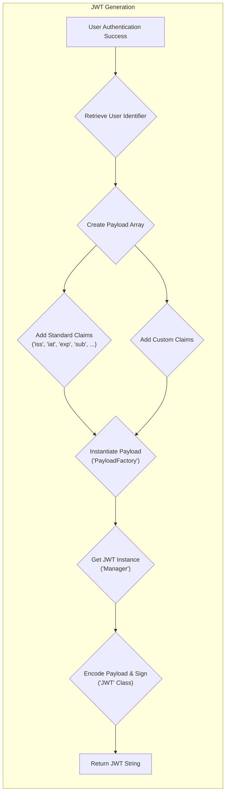
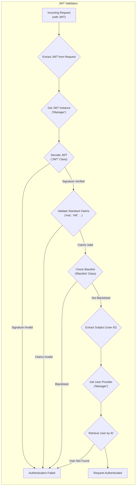

# Project Design Document: tymondesigns/jwt-auth

**Version:** 1.1
**Date:** October 26, 2023
**Author:** Gemini (AI Language Model)

## 1. Project Overview

This document details the design of the `tymondesigns/jwt-auth` library, a widely used PHP package for implementing JSON Web Token (JWT) based authentication in web applications. The primary purpose of this document is to provide a clear and comprehensive understanding of the library's architecture, components, and data flow to facilitate effective threat modeling.

The `jwt-auth` library offers functionalities to:

* **Generate JWTs:** Create signed JWTs upon successful user authentication.
* **Validate JWTs:** Verify the authenticity and integrity of JWTs presented by clients.
* **Refresh JWTs:** Issue new JWTs to extend user sessions without requiring re-authentication.
* **Blacklist JWTs:**  Invalidate specific JWTs before their natural expiration.
* **Integrate with PHP Frameworks:** Provide seamless integration with popular PHP frameworks, particularly Laravel and Lumen, through middleware and service providers.

This document focuses on the core mechanisms and architectural elements that are pertinent to security analysis and the identification of potential vulnerabilities.

## 2. Goals and Objectives

The core goals of the `jwt-auth` library are:

* **Secure and Standard Authentication:** Implement a secure authentication mechanism adhering to JWT standards (RFC 7519).
* **Stateless Authentication:** Enable stateless authentication, reducing server-side session management complexity and improving scalability.
* **Configurability and Flexibility:** Offer extensive configuration options for JWT claims, signing algorithms, user data retrieval, and blacklist management.
* **Developer Experience:** Provide a well-documented and easy-to-use API for integrating JWT authentication into PHP applications.

For the specific purpose of threat modeling, the objectives of this document are to:

* **Define System Boundaries:** Clearly delineate the scope and boundaries of the `jwt-auth` library within an application.
* **Identify Key Components:**  Detail the internal components of the library and their respective responsibilities.
* **Map Data Flow:** Illustrate the flow of data during JWT generation, validation, and refresh processes.
* **Highlight Security-Critical Areas:** Pinpoint the components and processes that are most relevant to security considerations and potential attack vectors.
* **Serve as a Basis for Threat Identification:** Provide the necessary information for security professionals to systematically identify potential threats and vulnerabilities.

## 3. Architecture and Components

The `jwt-auth` library comprises several interconnected components, each with a specific role:

* **`Tymon\JWTAuth\JWT` Class:** The central class responsible for the core JWT operations:
    * **Encoding:**  Takes a payload array and signs it using the configured algorithm and secret key to produce a JWT string.
    * **Decoding:**  Parses a JWT string, verifies its signature, and extracts the payload.
    * **Signature Verification:**  Ensures the JWT has not been tampered with by verifying the cryptographic signature.
* **`Tymon\JWTAuth\Manager` Class:**  A facade and central configuration point for JWT operations:
    * **Configuration Management:**  Loads and manages the library's configuration settings (e.g., signing algorithm, secret key, TTL).
    * **Token Generation Orchestration:**  Coordinates the process of creating a new JWT by utilizing the `PayloadFactory` and `JWT` class.
    * **Token Validation Orchestration:**  Coordinates the process of validating a JWT, including signature verification and claim validation.
    * **Blacklist Interaction:**  Provides methods for blacklisting and checking the blacklist status of JWTs.
* **`Tymon\JWTAuth\Factory\PayloadFactory` Class:** Responsible for constructing the JWT payload (the set of claims):
    * **Standard Claim Handling:**  Adds standard JWT claims like `iss` (issuer), `iat` (issued at), `exp` (expiration time), `nbf` (not before), and `sub` (subject).
    * **Custom Claim Handling:**  Allows developers to add application-specific claims to the payload.
    * **Claim Validation:**  May perform basic validation on the claims being added.
* **`Tymon\JWTAuth\Claims\*` (Individual Claim Classes):**  Represent individual JWT claims as objects, providing type hinting and potential validation logic for specific claims (e.g., `Expiration`, `Subject`).
* **`Tymon\JWTAuth\Providers\User\` (User Provider Interface and Implementations):** Defines an interface for retrieving user data based on the `sub` claim in the JWT:
    * **Interface:**  Specifies the contract for fetching a user by their identifier.
    * **Implementations:**  Provides concrete implementations for popular ORMs like Eloquent (Laravel) and Doctrine.
* **`Tymon\JWTAuth\Providers\JWT\` (JWT Provider Interface and Implementations):**  Defines an interface for storing and retrieving JWT identifiers, primarily used for the blacklist functionality:
    * **Interface:** Specifies the contract for adding, checking, and removing JWTs from the blacklist.
    * **Implementations:**  Provides implementations for various storage mechanisms (e.g., `Null`, `Illuminate`, `LRedis`).
* **`Tymon\JWTAuth\Blacklist` Class:** Manages the storage and retrieval of blacklisted JWT identifiers:
    * **Adding to Blacklist:**  Stores the `jti` (JWT ID) or a hash of the JWT to mark it as invalid.
    * **Checking Blacklist Status:**  Verifies if a given JWT is present in the blacklist.
    * **Removing from Blacklist (Purging):**  Provides mechanisms to remove expired entries from the blacklist.
* **`Tymon\JWTAuth\Http\Middleware\*` (Middleware Classes):**  Provide a way to protect routes by verifying the presence and validity of a JWT in incoming requests:
    * **`Authenticate`:**  The primary middleware that attempts to authenticate the request based on the provided JWT.
    * **`RefreshToken`:**  Middleware for handling token refresh requests.
* **`Tymon\JWTAuth\Facades\JWTAuth` (Laravel Facade):**  Provides a convenient, static-like interface for accessing the `Manager` class within Laravel applications.
* **Configuration Files (`config/jwt.php`):**  Centralized configuration settings for the library, including:
    * **`secret`:** The secret key used for signing JWTs (for symmetric algorithms like HS256).
    * **`keys`:** Configuration for public and private keys (for asymmetric algorithms like RS256).
    * **`algo`:** The signing algorithm to be used (e.g., HS256, RS256, ES256).
    * **`ttl`:** The default time-to-live (expiration time) for JWTs.
    * **`refresh_ttl`:** The time-to-live for refresh tokens (if used implicitly).
    * **`blacklist_enabled`:**  A flag to enable or disable the blacklist functionality.
    * **`providers`:** Configuration for the user and JWT providers.

## 4. Data Flow

The following diagrams illustrate the typical data flow for JWT generation and validation within the `jwt-auth` library.

### 4.1. JWT Generation Flow

**Steps:**

* **User Authentication Success:** The application successfully authenticates the user (e.g., via username/password).
* **Retrieve User Identifier:** The unique identifier of the authenticated user is retrieved.
* **Create Payload Array:** An array is prepared to hold the JWT claims.
* **Add Standard Claims:** Standard JWT claims, such as issuer (`iss`), issued at time (`iat`), expiration time (`exp`), and subject (`sub` - the user identifier), are added to the payload array.
* **Add Custom Claims:** Any application-specific claims are added to the payload array.
* **Instantiate Payload ('PayloadFactory'):** The `PayloadFactory` class is used to create a `Payload` object from the array of claims, potentially performing validation.
* **Get JWT Instance ('Manager'):** The `Manager` class is used to obtain an instance of the `JWT` class, configured with the necessary settings.
* **Encode Payload & Sign ('JWT' Class):** The `JWT` class encodes the payload into a JSON string and signs it using the configured algorithm and secret key.
* **Return JWT String:** The generated JWT string is returned to the application for transmission to the client.

### 4.2. JWT Validation Flow

**Steps:**

* **Incoming Request (with JWT):** The client sends a request to a protected resource, including the JWT (typically in the `Authorization` header).
* **Extract JWT from Request:** Middleware or application code extracts the JWT string from the request headers or cookies.
* **Get JWT Instance ('Manager'):** The `Manager` class is used to obtain an instance of the `JWT` class.
* **Decode JWT ('JWT' Class):** The `JWT` class attempts to decode the JWT string, which includes verifying the signature.
* **Signature Verified/Invalid:** The signature verification process determines if the JWT has been tampered with. If invalid, authentication fails.
* **Validate Standard Claims:** Standard claims like expiration time (`exp`) and not before time (`nbf`) are validated. If invalid, authentication fails.
* **Check Blacklist ('Blacklist' Class):** If blacklisting is enabled, the `Blacklist` class is consulted to check if the JWT has been revoked. If blacklisted, authentication fails.
* **Extract Subject (User ID):** The `sub` claim (user identifier) is extracted from the validated payload.
* **Get User Provider ('Manager'):** The configured user provider is retrieved from the `Manager`.
* **Retrieve User by ID:** The user provider is used to fetch the user record based on the extracted subject.
* **Request Authenticated/User Not Found:** If a user is found, the request is considered authenticated. If no user is found for the given subject, authentication may fail depending on the application's logic.

## 5. Security Considerations

This section details crucial security considerations and potential vulnerabilities associated with the `jwt-auth` library:

* **Secret Key Security (Symmetric Algorithms):** When using symmetric algorithms like HS256, the `secret` key is used for both signing and verification.
    * **Risk:** If the `secret` key is compromised, attackers can forge valid JWTs, impersonate users, and potentially gain unauthorized access.
    * **Mitigation:** Store the `secret` key securely using environment variables, dedicated secrets management systems (e.g., HashiCorp Vault), or secure configuration management. Use strong, randomly generated keys with sufficient entropy. Implement key rotation strategies.
* **Private Key Security (Asymmetric Algorithms):** When using asymmetric algorithms like RS256 or ES256, a private key is used for signing, and a corresponding public key is used for verification.
    * **Risk:** If the private key is compromised, attackers can forge valid JWTs.
    * **Mitigation:** Securely store the private key, restricting access. The public key can be distributed more freely.
* **Algorithm Choice:** The selected signing algorithm significantly impacts security.
    * **Risk:** Using weak or deprecated algorithms (e.g., `none` algorithm, older SHA versions) can lead to vulnerabilities.
    * **Mitigation:**  Strongly recommend using robust and widely accepted algorithms like RS256 or ES256 for production environments. HS256 is acceptable if the secret key is managed with extreme care. Avoid the `none` algorithm.
* **Token Expiration (`exp` claim):**  The `exp` claim defines the lifetime of a JWT.
    * **Risk:**  Tokens with excessively long expiration times increase the window of opportunity for attackers if a token is compromised.
    * **Mitigation:** Set appropriate and relatively short `ttl` values based on the application's security requirements and risk assessment. Implement token refresh mechanisms to provide continued access.
* **Token Refresh Security:** The process of obtaining new access tokens.
    * **Risk:**  Insecure refresh token implementations can lead to vulnerabilities like refresh token reuse, lack of refresh token rotation, and potential account takeover.
    * **Mitigation:** Implement secure refresh token flows. Consider using refresh tokens with shorter lifespans than access tokens. Implement refresh token rotation, invalidating old refresh tokens upon issuing new ones. Securely store refresh tokens (if stored server-side).
* **JWT Blacklisting/Revocation:** The ability to invalidate JWTs before their natural expiration.
    * **Risk:** Without a revocation mechanism, compromised or misused tokens remain valid until they expire.
    * **Mitigation:** Utilize the `Blacklist` functionality provided by the library. Choose an appropriate and performant storage mechanism for the blacklist based on the application's scale (e.g., Redis for high-traffic applications).
* **"Not Before" Claim (`nbf`):**  Specifies the time before which the JWT must not be accepted.
    * **Risk:**  If not used or validated correctly, tokens might be accepted prematurely.
    * **Mitigation:**  Consider using and validating the `nbf` claim to prevent the use of tokens before their intended activation time.
* **Issuer (`iss`) and Audience (`aud`) Claims Validation:**  These claims help identify the issuer and intended recipient of the JWT.
    * **Risk:**  Failure to validate these claims can lead to token reuse in unintended contexts or "confused deputy" attacks.
    * **Mitigation:**  Validate the `iss` and `aud` claims to ensure the token is being used by the intended party and within the correct system.
* **JSON Injection Vulnerabilities:** While JWTs are signed, the payload is base64 encoded JSON.
    * **Risk:**  If data from the JWT payload is used directly in database queries or other sensitive operations without proper sanitization, it could lead to JSON injection vulnerabilities.
    * **Mitigation:**  Treat data from the JWT payload as untrusted input. Sanitize and validate data before using it in database queries or other sensitive operations.
* **Cross-Site Scripting (XSS) and JWT Storage:** If JWTs are stored in browser storage (e.g., `localStorage`), they are vulnerable to XSS attacks.
    * **Risk:**  Attackers exploiting XSS can steal JWTs and impersonate users.
    * **Mitigation:**  Avoid storing JWTs in `localStorage`. Consider using `httpOnly` and `Secure` cookies for storing access tokens, which are less susceptible to XSS. Implement robust XSS prevention measures.
* **Cross-Site Request Forgery (CSRF):** If using cookie-based authentication with JWTs, standard CSRF prevention measures are necessary.
    * **Risk:**  Attackers can potentially perform actions on behalf of an authenticated user.
    * **Mitigation:** Implement CSRF protection mechanisms like synchronizer tokens (e.g., using Laravel's `@csrf` directive).

## 6. Deployment Considerations

Proper deployment and configuration are crucial for the security of `jwt-auth`.

* **Secure Configuration Management:**  Ensure that sensitive configuration values, such as the secret key or private key, are managed securely and are not hardcoded in the application. Utilize environment variables or dedicated secrets management solutions.
* **HTTPS Enforcement:**  Always serve the application over HTTPS to protect JWTs during transmission.
* **Middleware Placement:**  Ensure the `Authenticate` middleware is correctly applied to all protected routes.
* **User Provider Configuration:**  Configure the user provider to interact with the application's user database securely. Avoid exposing sensitive user data in the JWT payload unnecessarily.
* **Blacklist Storage Selection:**  Choose a blacklist storage mechanism that is appropriate for the application's scale and performance requirements. Consider the trade-offs between different storage options (e.g., database, Redis).
* **Client-Side Token Handling:**  Educate developers on secure client-side JWT storage practices, emphasizing the risks of `localStorage` and recommending `httpOnly` cookies.
* **Regular Updates:** Keep the `jwt-auth` library and its dependencies up-to-date to benefit from security patches and bug fixes.

## 7. Future Considerations

Potential future enhancements and security considerations for the `jwt-auth` library:

* **Support for JWE (JSON Web Encryption):**  Adding support for encrypting the JWT payload to protect sensitive information from being exposed even if the token is intercepted.
* **Enhanced Refresh Token Rotation Mechanisms:**  Implementing more sophisticated refresh token rotation strategies with features like concurrent session management and device tracking.
* **Standardized Claim Validation Rules:**  Providing more built-in validation rules for standard JWT claims.
* **Integration with OpenID Connect (OIDC):**  Potentially offering features to facilitate integration with OIDC providers.
* **Improved Documentation on Security Best Practices:**  Providing more comprehensive guidance on secure configuration and usage of the library.

This improved design document provides a more detailed and security-focused overview of the `tymondesigns/jwt-auth` library. It serves as a valuable resource for conducting thorough threat modeling and identifying potential security vulnerabilities in applications utilizing this library.