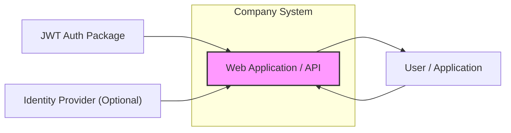
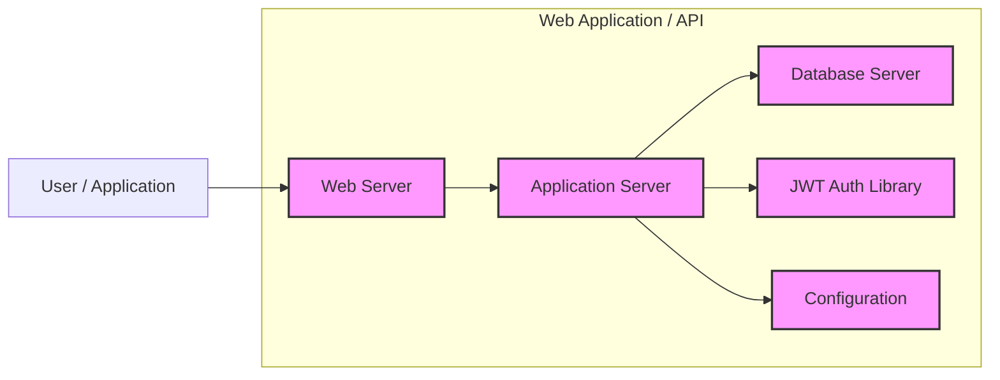
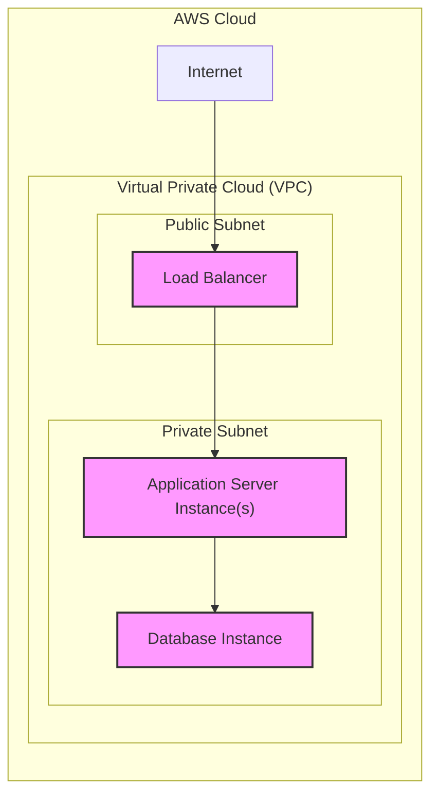
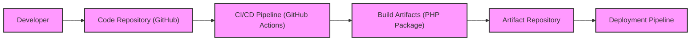

# BUSINESS POSTURE

This project aims to implement secure authentication and authorization for web applications and APIs using JSON Web Tokens (JWT). The primary business goal is to protect sensitive resources and data by ensuring only authenticated and authorized users or applications can access them. This is crucial for maintaining data confidentiality, integrity, and availability, and for complying with relevant security and privacy regulations.

Business priorities for this project are:
- Security: Robust and reliable authentication and authorization mechanisms are paramount to protect business assets and user data.
- Ease of Integration: The solution should be relatively easy to integrate into existing and new applications without significant development overhead.
- Performance: Authentication and authorization processes should be efficient and not introduce noticeable latency for users.
- Scalability: The solution should be able to handle increasing user loads and application growth.

Key business risks associated with this project include:
- Authentication Bypass: Unauthorized access to resources due to vulnerabilities in the authentication mechanism.
- Data Breaches: Exposure of sensitive data due to compromised authentication or authorization.
- Service Disruption: Denial of service or performance degradation due to authentication system failures or attacks.
- Compliance Violations: Failure to meet regulatory requirements related to data protection and access control.

# SECURITY POSTURE

Existing security controls:
- security control: Secure coding practices are assumed to be followed during the development of the JWT Auth package (as a third-party library). Location: Implicit in the development process of the library.
- security control: HTTPS is assumed to be used for all communication between clients and the application/API. Location: Infrastructure level, web server configuration.
- security control: Input validation is expected to be implemented within the application using the JWT Auth package to handle user credentials and JWT claims. Location: Application code using the JWT Auth package.
- accepted risk: Vulnerabilities in third-party dependencies of the JWT Auth package. Mitigation: Dependency scanning and updates.
- accepted risk: Misconfiguration of the JWT Auth package or the application using it. Mitigation: Secure configuration guidelines and testing.

Recommended security controls:
- security control: Implement dependency scanning for the JWT Auth package and its dependencies to identify and address known vulnerabilities.
- security control: Implement static application security testing (SAST) on the application code that integrates with the JWT Auth package to identify potential security flaws.
- security control: Implement dynamic application security testing (DAST) on the deployed application to identify runtime security vulnerabilities.
- security control: Implement rate limiting and throttling on authentication endpoints to prevent brute-force attacks and denial-of-service attempts.
- security control: Implement security logging and monitoring for authentication and authorization events to detect and respond to security incidents.

Security requirements:
- Authentication:
    - requirement: Securely authenticate users or applications attempting to access protected resources.
    - requirement: Support password-based authentication and potentially other authentication methods (e.g., API keys, OAuth).
    - requirement: Implement protection against brute-force attacks on authentication endpoints.
- Authorization:
    - requirement: Enforce authorization policies to ensure that only authorized users or applications can access specific resources or perform certain actions.
    - requirement: Utilize JWT claims to represent user roles and permissions for fine-grained access control.
    - requirement: Implement role-based access control (RBAC) or attribute-based access control (ABAC) as needed.
- Input Validation:
    - requirement: Validate all inputs related to authentication and authorization, including user credentials, JWTs, and API requests.
    - requirement: Sanitize inputs to prevent injection attacks (e.g., SQL injection, command injection).
    - requirement: Implement proper error handling and avoid exposing sensitive information in error messages.
- Cryptography:
    - requirement: Use strong cryptographic algorithms for JWT signing and encryption (if applicable).
    - requirement: Securely manage cryptographic keys used for JWT signing and encryption.
    - requirement: Enforce HTTPS for all communication involving sensitive data, including JWT transmission.

# DESIGN

## C4 CONTEXT

Context Diagram Elements:

- Element:
    - Name: User / Application
    - Type: Person / Software System
    - Description: Represents end-users accessing the web application or external applications interacting with the API.
    - Responsibilities: Initiates requests to the Web Application / API, consumes data provided by the Web Application / API.
    - Security controls: Authentication at the user/application level (e.g., username/password, API keys), authorization based on user roles or application permissions.

- Element:
    - Name: Web Application / API
    - Type: Software System
    - Description: The web application or API being secured by JWT authentication. This is the system being designed and secured.
    - Responsibilities: Provides business functionality to users or applications, protects resources and data, implements authentication and authorization using the JWT Auth Package.
    - Security controls: Input validation, authentication using JWT Auth Package, authorization based on JWT claims, secure session management, output encoding, error handling, security logging and monitoring.

- Element:
    - Name: JWT Auth Package
    - Type: Software System (External Library)
    - Description: A third-party PHP library (tymondesigns/jwt-auth) used to implement JWT-based authentication and authorization.
    - Responsibilities: JWT generation, JWT verification, JWT parsing, handling token lifecycle (refresh, invalidate).
    - Security controls: Relies on the security controls implemented within the library itself (secure coding practices, vulnerability management by the library maintainers). Dependency scanning should be performed by the application using this package.

- Element:
    - Name: Identity Provider (Optional)
    - Type: Software System (External System)
    - Description: An optional external system responsible for user identity management and authentication. Could be an OAuth 2.0 provider, SAML IdP, or a custom identity service. If used, the Web Application/API would delegate authentication to this provider.
    - Responsibilities: User authentication, user identity management, issuing tokens or assertions.
    - Security controls: Authentication mechanisms implemented by the Identity Provider, access control policies, secure communication protocols (e.g., OAuth 2.0, SAML).

## C4 CONTAINER

Container Diagram Elements:

- Element:
    - Name: Web Server
    - Type: Container (Web Server)
    - Description: Handles incoming HTTP/HTTPS requests from users/applications, reverse proxy, SSL termination, static content serving. Examples: Nginx, Apache.
    - Responsibilities:  Receives user requests, routes requests to the Application Server, serves static content, enforces HTTPS, provides basic security features like request filtering.
    - Security controls: HTTPS configuration, web server hardening, request filtering (e.g., rate limiting, WAF), access logs, security updates.

- Element:
    - Name: Application Server
    - Type: Container (Application Runtime)
    - Description: Executes the application code (e.g., PHP runtime), handles business logic, integrates with the JWT Auth Library and Database Server. Examples: PHP-FPM, Laravel framework.
    - Responsibilities: Implements application logic, handles authentication and authorization using JWT Auth Library, interacts with the database, processes user requests, generates responses.
    - Security controls: Input validation, output encoding, secure session management, error handling, authorization logic based on JWT claims, integration with JWT Auth Library for secure token handling, application-level security logging.

- Element:
    - Name: Database Server
    - Type: Container (Database)
    - Description: Stores application data, including user credentials (hashed passwords), user roles, and other application-specific data. Examples: MySQL, PostgreSQL.
    - Responsibilities: Data persistence, data retrieval, data integrity, user authentication data storage.
    - Security controls: Database access control (authentication and authorization), data encryption at rest and in transit, database hardening, regular backups, audit logs, principle of least privilege for database access.

- Element:
    - Name: JWT Auth Library
    - Type: Container (Software Library)
    - Description: The tymondesigns/jwt-auth PHP library integrated into the Application Server. Provides JWT functionality.
    - Responsibilities: JWT generation, JWT verification, JWT parsing, token management.
    - Security controls: Security controls are inherent in the library's code. Dependency scanning and updates are crucial. Secure configuration of the library within the Application Server.

- Element:
    - Name: Configuration
    - Type: Container (Configuration Files/Environment Variables)
    - Description: Stores configuration settings for the Web Application/API, including JWT secret keys, database connection details, and other environment-specific parameters.
    - Responsibilities: Provides configuration parameters to the Application Server and other components.
    - Security controls: Secure storage of configuration data (e.g., using environment variables, secrets management systems), access control to configuration files, principle of least privilege for configuration access, avoiding hardcoding secrets in code.

## DEPLOYMENT

Deployment Architecture: Cloud-based Deployment (Example using AWS)

Deployment Diagram Elements:

- Element:
    - Name: Load Balancer
    - Type: Infrastructure (Load Balancer)
    - Description: Distributes incoming traffic across multiple Application Server instances for high availability and scalability. Terminates SSL and provides DDoS protection. Example: AWS Application Load Balancer.
    - Responsibilities: Traffic distribution, load balancing, SSL termination, health checks, DDoS protection, routing requests to healthy Application Server instances.
    - Security controls: SSL/TLS configuration, DDoS protection features, access control lists, security groups, web application firewall (WAF) integration.

- Element:
    - Name: Application Server Instance(s)
    - Type: Infrastructure (Virtual Machine / Container Instance)
    - Description: Virtual machines or container instances running the Application Server software. Deployed in a private subnet for security.
    - Responsibilities: Running the application code, processing requests, interacting with the Database Instance, handling JWT authentication and authorization.
    - Security controls: Operating system hardening, security patching, security groups, intrusion detection/prevention systems (IDS/IPS), access control, regular security audits, application-level security controls (as described in Container Diagram).

- Element:
    - Name: Database Instance
    - Type: Infrastructure (Managed Database Service)
    - Description: Managed database service providing a scalable and reliable database backend. Deployed in a private subnet for security. Example: AWS RDS.
    - Responsibilities: Data storage, data retrieval, data persistence, database management.
    - Security controls: Database access control, data encryption at rest and in transit, database hardening, regular backups, security monitoring, managed security features provided by the cloud provider.

- Element:
    - Name: Internet
    - Type: Environment (External Network)
    - Description: The public internet from which users and applications access the Web Application/API.
    - Responsibilities: Provides network connectivity for users and applications.
    - Security controls: No direct security controls within the project's scope, but relies on the security controls implemented by internet service providers and end-user devices.

## BUILD

Build Process Diagram:

Build Process Description:

- Developer: Writes code, performs local testing, and commits changes to the Code Repository.
- Code Repository (GitHub): Stores the source code of the application. Provides version control and collaboration features. Security controls: Access control to the repository, branch protection, code review processes.
- CI/CD Pipeline (GitHub Actions): Automates the build, test, and deployment process. Security controls: Secure pipeline configuration, secret management for credentials, vulnerability scanning in the pipeline, build environment security.
- Build Artifacts (PHP Package): The packaged application code ready for deployment. Security controls: Integrity checks (e.g., checksums), vulnerability scanning of dependencies included in the package.
- Artifact Repository: Stores build artifacts. Security controls: Access control to the repository, integrity checks, vulnerability scanning of stored artifacts.
- Deployment Pipeline: Automates the deployment of build artifacts to the target environment. Security controls: Secure deployment process, access control to deployment environments, audit logs.

Build Process Security Controls:
- security control: Automated build process using CI/CD pipeline (GitHub Actions). Location: CI/CD Pipeline.
- security control: Static Application Security Testing (SAST) integrated into the CI/CD pipeline to scan code for vulnerabilities. Location: CI/CD Pipeline.
- security control: Dependency scanning integrated into the CI/CD pipeline to identify vulnerable dependencies. Location: CI/CD Pipeline.
- security control: Code linters and formatters to enforce code quality and security best practices. Location: CI/CD Pipeline.
- security control: Unit and integration tests to ensure code functionality and security. Location: CI/CD Pipeline.
- security control: Secure storage of build artifacts in an artifact repository with access controls. Location: Artifact Repository.
- security control: Immutable build process to ensure build reproducibility and prevent tampering. Location: CI/CD Pipeline configuration.
- security control: Secret management for API keys, database credentials, and other sensitive information used in the build and deployment process. Location: CI/CD Pipeline and Configuration Management.

# RISK ASSESSMENT

Critical business processes we are trying to protect:
- User Authentication: Verifying the identity of users or applications accessing the system. Failure can lead to unauthorized access and data breaches.
- API Access Control: Ensuring that only authorized users or applications can access specific API endpoints and resources. Failure can lead to data breaches and unauthorized actions.

Data we are trying to protect and their sensitivity:
- User Credentials (passwords): Highly sensitive. If compromised, attackers can impersonate users and gain unauthorized access.
- User Roles and Permissions: Sensitive. Incorrect authorization can lead to unauthorized access to data and functionality.
- Application Data: Sensitivity depends on the specific application. Could range from low to high sensitivity depending on the nature of the data (e.g., personal data, financial data, confidential business information).

# QUESTIONS & ASSUMPTIONS

Questions:
- What is the specific use case for JWT authentication? (e.g., API security, web application session management, microservices authentication).
- What are the expected user volumes and transaction rates? (To inform scalability and performance considerations).
- Are there any specific compliance requirements (e.g., GDPR, HIPAA, PCI DSS)?
- What is the organization's risk appetite? (To prioritize security controls).
- Are there any existing identity providers or authentication systems that need to be integrated with?
- What is the expected lifespan of the application and the JWT Auth integration? (To plan for long-term maintenance and security updates).

Assumptions:
- BUSINESS POSTURE: The project is critical for securing access to valuable resources and data. Security is a high priority. The organization has a moderate risk appetite and is willing to invest in reasonable security controls.
- SECURITY POSTURE: Standard web security practices are currently in place (HTTPS, basic input validation). There is a need to enhance security controls, particularly around dependency management, SAST/DAST, and rate limiting. Secure software development lifecycle principles are generally followed but can be strengthened.
- DESIGN: A typical three-tier web application architecture is assumed (Web Server, Application Server, Database Server). Cloud-based deployment on AWS is considered as a likely scenario. GitHub Actions is used for CI/CD. The JWT Auth package is used as a core component for authentication and authorization.