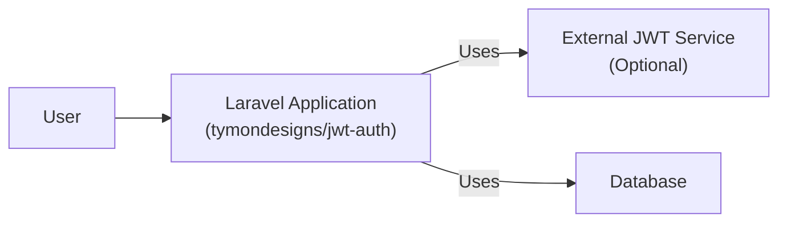
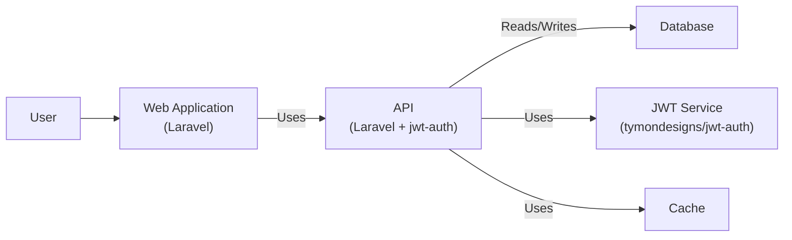
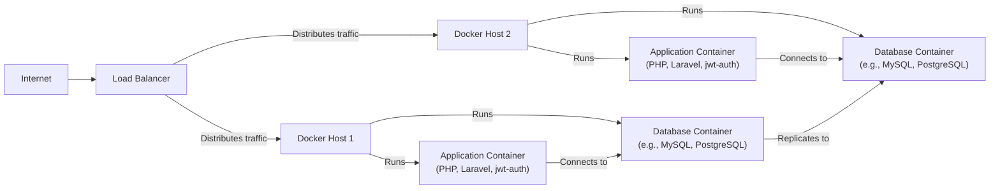
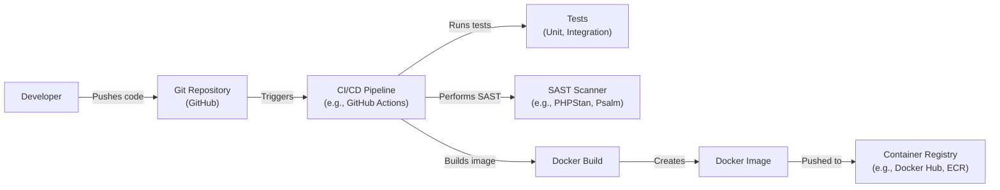

Okay, let's create a design document for the `tymondesigns/jwt-auth` project.

# BUSINESS POSTURE

Business Priorities and Goals:

*   Provide a simple and easy-to-use package for implementing JSON Web Token (JWT) authentication in Laravel applications.
*   Enable developers to quickly secure their APIs and applications with JWT.
*   Offer a flexible and customizable solution that can be adapted to different project needs.
*   Maintain a well-documented and actively supported package.
*   Minimize external dependencies to reduce potential conflicts and vulnerabilities.

Most Important Business Risks:

*   Compromised JWT secrets leading to unauthorized access to user data and application resources.
*   Vulnerabilities in the package allowing attackers to bypass authentication or forge tokens.
*   Lack of proper documentation or support hindering adoption and causing developer frustration.
*   Incompatibility with newer Laravel versions or other dependencies breaking existing implementations.
*   Performance bottlenecks impacting application responsiveness under heavy load.

# SECURITY POSTURE

Existing Security Controls:

*   security control: Uses JWT standard for authentication, leveraging established cryptographic algorithms (HS256, HS384, HS512, RS256) for signing and verifying tokens. (Implemented in the core logic of the package and utilizes underlying PHP JWT libraries).
*   security control: Provides configuration options for customizing token claims, expiration time, and other parameters. (Described in the package documentation and configuration files).
*   security control: Offers helper functions and middleware for protecting routes and validating tokens. (Implemented in the package's middleware and service providers).
*   security control: Includes basic exception handling for common JWT-related errors. (Implemented in the package's exception classes).
*   security control: Leverages Laravel's built-in authentication system and integrates with its features. (Described in the package documentation and utilizes Laravel's authentication components).

Accepted Risks:

*   accepted risk: Relies on the security of the underlying PHP JWT library and its dependencies.
*   accepted risk: Assumes developers will properly configure and secure their application's environment, including the JWT secret.
*   accepted risk: Does not implement advanced features like token refresh or blacklisting out of the box (although it provides the building blocks for developers to implement them).
*   accepted risk: Potential for timing attacks if developers do not use constant-time string comparison when validating signatures (this is mitigated by using secure underlying libraries, but developers should be aware).

Recommended Security Controls:

*   security control: Implement automated security testing (SAST, DAST) in the CI/CD pipeline to identify potential vulnerabilities.
*   security control: Provide clear guidance and examples on securely storing and managing the JWT secret (e.g., using environment variables, secrets management services).
*   security control: Offer built-in support for token refresh and blacklisting to enhance security and usability.
*   security control: Conduct regular security audits and penetration testing of the package.
*   security control: Implement rate limiting and other measures to protect against brute-force attacks on token validation.

Security Requirements:

*   Authentication:
    *   The system MUST use JWT (JSON Web Token) for authentication.
    *   The system MUST support configurable signing algorithms (HS256, HS384, HS512, RS256).
    *   The system MUST validate the token signature, expiration time, and other relevant claims.
    *   The system MUST securely store the JWT secret and prevent unauthorized access.
*   Authorization:
    *   The system SHOULD provide mechanisms for associating JWT claims with user roles and permissions.
    *   The system SHOULD allow developers to define authorization rules based on token claims.
*   Input Validation:
    *   The system MUST validate all input data received from clients, including token payloads.
    *   The system SHOULD sanitize input data to prevent cross-site scripting (XSS) and other injection attacks.
*   Cryptography:
    *   The system MUST use strong cryptographic algorithms for signing and verifying tokens.
    *   The system MUST generate cryptographically secure random numbers for secrets and nonces.
    *   The system SHOULD follow cryptographic best practices and avoid using deprecated or vulnerable algorithms.

# DESIGN

## C4 CONTEXT

Element Descriptions:

*   Element:
    *   Name: User
    *   Type: Person
    *   Description: A user of the Laravel application, who authenticates via JWT.
    *   Responsibilities: Initiates authentication requests, provides credentials (if necessary), consumes API resources.
    *   Security controls: Strong password policies (if applicable), multi-factor authentication (if applicable), session management.
*   Element:
    *   Name: Laravel Application (tymondesigns/jwt-auth)
    *   Type: Software System
    *   Description: The Laravel application that uses the tymondesigns/jwt-auth package for JWT authentication.
    *   Responsibilities: Handles authentication requests, validates JWTs, protects API resources, manages user sessions.
    *   Security controls: JWT validation, input validation, authorization checks, secure configuration, rate limiting.
*   Element:
    *   Name: External JWT Service (Optional)
    *   Type: Software System
    *   Description: An external service that might be used for generating or validating JWTs (e.g., a third-party authentication provider).
    *   Responsibilities: Generating JWTs, validating JWTs, managing user identities.
    *   Security controls: Depends on the specific service; should adhere to industry best practices for JWT security.
*   Element:
    *   Name: Database
    *   Type: Software System
    *   Description: Database used by Laravel Application.
    *   Responsibilities: Store user information, and other application data.
    *   Security controls: Access control, encryption at rest, regular backups.

## C4 CONTAINER

Element Descriptions:

*   Element:
    *   Name: User
    *   Type: Person
    *   Description: A user interacting with the application.
    *   Responsibilities: Initiates requests, provides input, receives responses.
    *   Security controls: Authentication, authorization, session management.
*   Element:
    *   Name: Web Application (Laravel)
    *   Type: Container (Web Application)
    *   Description: The front-end part of the Laravel application, potentially serving HTML, CSS, and JavaScript.
    *   Responsibilities: Handles user interface, interacts with the API.
    *   Security controls: Input validation, output encoding, CSRF protection, XSS prevention.
*   Element:
    *   Name: API (Laravel + jwt-auth)
    *   Type: Container (API Application)
    *   Description: The back-end API of the Laravel application, secured with tymondesigns/jwt-auth.
    *   Responsibilities: Handles API requests, authenticates users via JWT, authorizes access to resources, interacts with the database and JWT service.
    *   Security controls: JWT validation, input validation, authorization checks, rate limiting, secure configuration.
*   Element:
    *   Name: Database
    *   Type: Container (Database)
    *   Description: The database used by the Laravel application.
    *   Responsibilities: Stores user data, application data, potentially token-related information (if blacklisting is implemented).
    *   Security controls: Access control, encryption at rest, regular backups, auditing.
*   Element:
    *   Name: JWT Service (tymondesigns/jwt-auth)
    *   Type: Container (Library/Component)
    *   Description: The tymondesigns/jwt-auth package, providing JWT functionality.
    *   Responsibilities: Generates JWTs, validates JWTs, provides helper functions for authentication.
    *   Security controls: Secure implementation of JWT standard, secure configuration options.
*   Element:
    *   Name: Cache
    *   Type: Container (Cache)
    *   Description: Cache used by Laravel Application.
    *   Responsibilities: Store data to improve performance.
    *   Security controls: Access control.

## DEPLOYMENT

Possible Deployment Solutions:

1.  Traditional Web Server (Apache/Nginx) + PHP-FPM:  Common for Laravel applications.
2.  Containerized Deployment (Docker):  Increasingly popular for portability and scalability.
3.  Serverless Deployment (AWS Lambda, Azure Functions, Google Cloud Functions):  Suitable for specific use cases, especially APIs.
4.  PaaS Solutions (Heroku, AWS Elastic Beanstalk, Google App Engine):  Simplified deployment and management.

Chosen Solution (Detailed Description): Containerized Deployment (Docker)

Element Descriptions:

*   Element:
    *   Name: Internet
    *   Type: External Entity
    *   Description: The public internet.
    *   Responsibilities: Source of incoming requests.
    *   Security controls: Firewall, DDoS protection.
*   Element:
    *   Name: Load Balancer
    *   Type: Infrastructure Node
    *   Description: Distributes incoming traffic across multiple Docker hosts.
    *   Responsibilities: Load balancing, SSL termination (optional).
    *   Security controls: SSL/TLS configuration, access control lists.
*   Element:
    *   Name: Docker Host 1, Docker Host 2
    *   Type: Infrastructure Node (Server)
    *   Description: Physical or virtual servers running Docker Engine.
    *   Responsibilities: Hosting Docker containers.
    *   Security controls: OS hardening, Docker security best practices, network segmentation.
*   Element:
    *   Name: Application Container 1, Application Container 2
    *   Type: Container
    *   Description: Docker containers running the Laravel application with jwt-auth.
    *   Responsibilities: Handling application logic, processing requests, interacting with the database.
    *   Security controls: Secure container image, limited privileges, network isolation.
*   Element:
    *   Name: Database Container 1, Database Container 2
    *   Type: Container
    *   Description: Docker containers running the database (e.g., MySQL, PostgreSQL).
    *   Responsibilities: Storing application data.
    *   Security controls: Secure container image, limited privileges, network isolation, data encryption, access control.

## BUILD

Build Process Description:

1.  Developer pushes code changes to the Git repository (GitHub).
2.  The push triggers the CI/CD pipeline (e.g., GitHub Actions).
3.  The CI/CD pipeline runs automated tests (unit and integration tests) to ensure code quality.
4.  The CI/CD pipeline performs Static Application Security Testing (SAST) using a tool like PHPStan or Psalm to identify potential vulnerabilities.
5.  If tests and SAST pass, the pipeline builds a Docker image for the application.
6.  The Docker image is tagged with a version number and pushed to a container registry (e.g., Docker Hub, Amazon ECR).

Security Controls in Build Process:

*   security control: Git Repository: Access control to the repository, branch protection rules.
*   security control: CI/CD Pipeline: Secure configuration, limited access, use of secrets management.
*   security control: Tests: Comprehensive test suite to catch bugs and regressions.
*   security control: SAST Scanner: Identification of potential vulnerabilities in the code.
*   security control: Docker Build: Use of secure base images, minimization of dependencies, secure build context.
*   security control: Container Registry: Access control, image scanning for vulnerabilities.

# RISK ASSESSMENT

Critical Business Processes:

*   User authentication and authorization.
*   API access control.
*   Data protection (user data, application data).

Data Sensitivity:

*   JWTs (contain user identifiers and potentially other sensitive claims): High sensitivity.  Compromised JWTs can lead to unauthorized access.
*   User data (stored in the database):  Sensitivity depends on the specific application, but likely includes personally identifiable information (PII) and potentially other sensitive data.
*   Application configuration (including JWT secret):  High sensitivity.  Compromise of the secret allows attackers to forge tokens.

# QUESTIONS & ASSUMPTIONS

Questions:

*   What specific database is being used?  This impacts security configuration and data protection strategies.
*   Are there any specific compliance requirements (e.g., GDPR, HIPAA)?
*   What is the expected load on the API (requests per second)?  This informs performance and scalability considerations.
*   Are there any existing security policies or guidelines that need to be followed?
*   Is there a preference for a specific CI/CD platform or container registry?
*   Will there be any third-party integrations that require authentication or authorization?

Assumptions:

*   BUSINESS POSTURE: The primary goal is to secure a Laravel API using JWT. The business is willing to invest in reasonable security measures but prioritizes ease of use and development speed.
*   SECURITY POSTURE: Developers have a basic understanding of JWT and security best practices.  The underlying Laravel framework and PHP environment are reasonably secure.
*   DESIGN: A containerized deployment using Docker is acceptable.  The application uses a relational database.  The CI/CD pipeline will include automated testing and SAST.