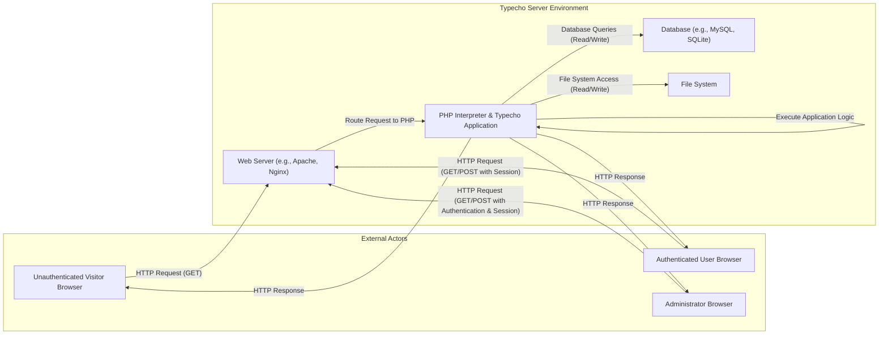

## Project Design Document: Typecho Blog Platform (Improved)

**1. Introduction**

This document provides an enhanced architectural design of the Typecho blog platform, based on the repository at https://github.com/typecho/typecho. This iteration aims to provide a more detailed and security-focused understanding of the system's components, their interactions, and data flow, specifically tailored for subsequent threat modeling activities.

**1.1. Purpose**

The purpose of this document is to:

* Provide a refined description of the architecture of the Typecho blog platform.
* Identify key components and their specific responsibilities with a security lens.
* Detail the data flow within the system, highlighting potential security-relevant interactions.
* Serve as a robust foundation for identifying potential security threats and vulnerabilities during threat modeling.

**1.2. Scope**

This document covers the core architectural components of the Typecho platform, including:

* Web server interaction and request handling.
* PHP application logic, including core modules and functionalities.
* Database interaction, including data storage and retrieval mechanisms.
* File system usage, focusing on areas with security implications.
* Key user roles and their associated privileges (administrator, authenticated user, unauthenticated visitor).

This document does not cover:

* Fine-grained implementation details of individual functions or methods.
* Exact database schema definitions.
* Specific implementation details of third-party plugins or themes (unless they are part of the core repository).
* Low-level infrastructure details such as operating system configurations or network topologies.

**1.3. Target Audience**

This document is intended for:

* Security engineers and analysts responsible for performing threat modeling and security assessments.
* Developers involved in the development, maintenance, and extension of the Typecho platform.
* Technical stakeholders requiring a comprehensive understanding of the Typecho architecture from a security perspective.

**2. System Overview**

Typecho is a lightweight, open-source blog platform developed in PHP. Its design emphasizes simplicity and performance, offering core blogging functionalities. The system's operation revolves around interactions between a web server, the PHP interpreter executing the application logic, and a database for persistent data storage.

**2.1. Key Features**

* **Content Management:** Creation, modification, and management of blog posts and static pages using a Markdown-based editor.
* **User Authentication and Authorization:** Secure management of administrator accounts and their access privileges.
* **Comment Management:** Functionality for visitors to submit comments on posts, with moderation capabilities for administrators.
* **Theme Engine:** Support for customizable themes to control the visual presentation of the blog.
* **Plugin Architecture:** A mechanism for extending the platform's functionality through plugins.
* **Media Management:** Handling the upload and storage of media files (images, etc.).

**3. Architectural Design**

The following diagram illustrates the high-level architecture of the Typecho platform, emphasizing key components and their interactions:

**3.1. Component Description**

* **Unauthenticated Visitor Browser:** The web browser used by visitors accessing public content without logging in.
* **Authenticated User Browser:** The web browser used by users who have logged in (if user accounts are enabled for front-end features).
* **Administrator Browser:** The web browser used by administrators to access the administrative backend.
* **Web Server (e.g., Apache, Nginx):** Acts as the entry point for all HTTP requests. It handles request routing, serves static files, and passes dynamic requests to the PHP interpreter. Key security responsibilities include:
    * Handling TLS/SSL encryption.
    * Implementing basic security headers.
    * Potentially acting as a reverse proxy with security features.
* **PHP Interpreter & Typecho Application:** Executes the core PHP code of the Typecho application. This component is responsible for:
    * Handling routing and request processing.
    * Implementing business logic and application features.
    * Interacting with the database for data persistence.
    * Reading and writing files on the file system.
    * Generating HTTP responses.
    * Managing user sessions and authentication.
* **Database (e.g., MySQL, SQLite):** Stores all persistent data for the blog. Key data includes:
    * Blog posts and pages content.
    * User account credentials and roles.
    * Comments submitted by visitors.
    * Configuration settings for the blog.
    * Theme and plugin data.
* **File System:** Stores various files required for the application's operation. Key files and directories include:
    * PHP source code of the Typecho application.
    * Theme files (templates, CSS, JavaScript).
    * Plugin files.
    * Uploaded media files (images, documents).
    * Configuration files.

**3.2. Data Flow**

The following outlines the typical data flow for key user interactions, highlighting security considerations:

* **Viewing a Public Blog Post (Unauthenticated Visitor):**
    * The visitor's browser sends an HTTP GET request to the web server for the post URL.
    * The web server forwards the request to the PHP interpreter.
    * The PHP application retrieves the requested post content from the database.
    * The PHP application renders the HTML page using the appropriate theme.
    * The PHP interpreter sends the HTTP response (HTML) back to the web server.
    * The web server sends the response to the visitor's browser.
    * **Security Considerations:** Potential for information disclosure if access controls are misconfigured. Risk of XSS if post content is not properly sanitized.

* **Submitting a Comment (Unauthenticated/Authenticated Visitor):**
    * The visitor fills out the comment form and submits it.
    * The browser sends an HTTP POST request to the web server with the comment data.
    * The web server forwards the request to the PHP interpreter.
    * The PHP application validates the comment data (potential for spam and malicious input).
    * The PHP application inserts the comment into the database.
    * The PHP interpreter sends an HTTP response (e.g., redirect or success message).
    * **Security Considerations:** Risk of XSS through comment content. Potential for comment spam and abuse. CSRF vulnerability if proper tokens are not used.

* **Administrator Login:**
    * The administrator accesses the login page through their browser (HTTP GET).
    * The administrator submits their credentials via an HTTP POST request to the web server.
    * The web server forwards the request to the PHP interpreter.
    * The PHP application authenticates the administrator against the stored credentials in the database.
    * Upon successful authentication, a session is established (session ID stored in a cookie).
    * The PHP interpreter sends a redirect response to the administrative dashboard.
    * **Security Considerations:** Brute-force attack vulnerability on the login endpoint. Risk of session hijacking if the session cookie is compromised. Importance of strong password hashing.

* **Creating a New Post (Administrator):**
    * The administrator, after logging in, uses the admin interface to create a new post.
    * The browser sends an HTTP POST request to the web server with the post content.
    * The web server forwards the request to the PHP interpreter.
    * The PHP application validates the input data.
    * The PHP application stores the new post content in the database.
    * If media is uploaded, the files are stored in the file system.
    * The PHP interpreter sends a success response.
    * **Security Considerations:** Risk of XSS in post content. Potential for file upload vulnerabilities if not handled correctly. Authorization checks are crucial to ensure only administrators can perform this action.

**4. Security Considerations (Detailed)**

This section expands on potential security concerns based on the architecture and data flows:

* **Web Server:**
    * **HTTP Header Injection:** Vulnerabilities in how the application sets HTTP headers.
    * **Denial of Service (DoS):** Potential for resource exhaustion attacks.
    * **TLS/SSL Configuration:** Weak or outdated TLS configurations.
* **PHP Interpreter & Typecho Application:**
    * **SQL Injection:**  Risk of malicious SQL queries being executed through vulnerable input fields.
    * **Cross-Site Scripting (XSS):**  Potential for injecting malicious scripts into web pages viewed by other users.
    * **Cross-Site Request Forgery (CSRF):**  Risk of unauthorized actions being performed on behalf of an authenticated user.
    * **Insecure Deserialization:**  If the application uses object serialization, vulnerabilities could allow arbitrary code execution.
    * **Remote Code Execution (RCE):**  Critical vulnerabilities that allow attackers to execute arbitrary code on the server.
    * **Insecure File Uploads:**  Allowing the upload of malicious files that can be executed by the server.
    * **Authentication and Authorization Flaws:**  Weaknesses in how users are authenticated and their access is controlled.
    * **Session Management Vulnerabilities:**  Risks associated with how user sessions are created, managed, and invalidated.
    * **Input Validation Failures:**  Insufficient validation of user-provided data leading to various attacks.
    * **Output Encoding Failures:**  Improper encoding of data before displaying it in web pages, leading to XSS.
    * **Vulnerable Dependencies:**  Using outdated or vulnerable third-party libraries or components.
* **Database:**
    * **SQL Injection (as mentioned above).**
    * **Database Credential Exposure:**  Risk of database credentials being leaked or compromised.
    * **Insufficient Access Controls:**  Overly permissive database user privileges.
* **File System:**
    * **Directory Traversal:**  Vulnerabilities allowing access to files and directories outside the intended scope.
    * **File Inclusion Vulnerabilities:**  Exploiting the application's file inclusion mechanisms to execute arbitrary code.
    * **Insecure File Permissions:**  Incorrectly set file permissions allowing unauthorized access or modification.

**5. Dependencies**

The Typecho platform relies on the following key dependencies:

* **PHP:**  The core programming language. Specific version requirements should be consulted in the official documentation.
* **Database System:**  Supports various database systems, including:
    * MySQL/MariaDB
    * SQLite
    * PostgreSQL (potentially through community plugins or extensions)
* **Web Server:** Requires a web server capable of processing PHP scripts, such as:
    * Apache HTTP Server
    * Nginx

**6. Deployment**

A typical deployment of Typecho involves the following steps:

* **Web Server Installation and Configuration:** Installing and configuring a web server (e.g., Apache or Nginx).
* **PHP Installation and Configuration:** Installing the PHP interpreter and necessary PHP extensions (e.g., database drivers, XML support).
* **Database Setup:** Installing and configuring a supported database server.
* **Typecho Source Code Deployment:** Downloading and extracting the Typecho source code to the web server's document root or a designated directory.
* **Configuration:** Configuring the database connection details and other settings within the Typecho configuration file (typically `config.inc.php`).
* **File System Permissions:** Setting appropriate file system permissions to ensure the web server can read necessary files and write to specific directories (e.g., for uploads).

**7. Future Considerations**

Potential future developments and architectural changes that could impact security include:

* **API Integration:** Introduction of a RESTful API for programmatic access, requiring careful consideration of API security best practices.
* **Enhanced Plugin System:**  More complex plugin architectures might introduce new attack surfaces if not designed securely.
* **Cloud-Native Adaptations:**  Migrating to cloud-native architectures could introduce new security considerations related to containerization, orchestration, and cloud service configurations.
* **Adoption of New Web Technologies:**  Integrating new front-end frameworks or technologies could introduce new client-side security concerns.

This improved design document provides a more detailed and security-focused overview of the Typecho blog platform's architecture. It serves as a valuable resource for conducting thorough threat modeling and identifying potential vulnerabilities within the system. The detailed component descriptions, data flow diagrams, and specific security considerations aim to facilitate a comprehensive security analysis.