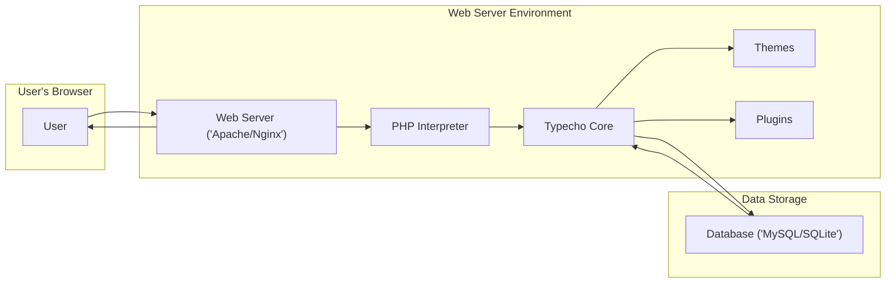
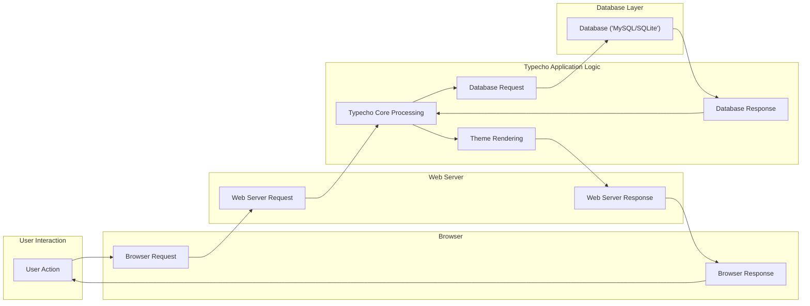

## Project Design Document: Typecho Blogging Platform (Improved)

**1. Introduction**

*   **1.1 Purpose:** This document provides a detailed architectural design of the Typecho blogging platform. It outlines the key components, data flows, and security considerations of the system. This document serves as a foundational resource for subsequent threat modeling activities, enabling a comprehensive understanding of the system's attack surface.
*   **1.2 Scope:** This document covers the core functionality of the Typecho platform as described in the provided GitHub repository (https://github.com/typecho/typecho). It focuses on the web application itself, its internal structure, and its interactions with its operational environment. It specifically details components and processes relevant to security analysis. Infrastructure details are included only when directly impacting the application's architecture and security.
*   **1.3 Target Audience:** This document is intended for security architects, threat modeling engineers, developers, security auditors, and anyone involved in the security assessment and hardening of the Typecho platform.

**2. System Overview**

*   **2.1 High-Level Architecture:** Typecho is a lightweight, open-source blogging platform built using PHP, adhering to a traditional three-tier architecture:
    *   **Presentation Tier:** The user interface, rendered by the user's web browser using HTML, CSS, and JavaScript generated by the application.
    *   **Application Tier:** The PHP codebase, encompassing the core logic, routing, data processing, and user interaction handling. This includes the Typecho core, themes, and plugins.
    *   **Data Tier:** The persistent storage layer, typically a relational database (MySQL or SQLite), responsible for storing blog content, user data, and configuration settings.

*   **2.2 Key Components:**
    *   **Web Server ("Apache/Nginx"):**  Acts as the entry point, receiving incoming HTTP requests and serving static assets. It forwards dynamic requests to the PHP interpreter. Configuration plays a crucial role in security.
    *   **PHP Interpreter:** Executes the PHP code that constitutes the Typecho application. The interpreter's configuration and enabled extensions are important security considerations.
    *   **Typecho Core:** The central codebase, managing request routing, authentication, content management, template rendering, and plugin management. This is where most of the application's logic resides.
    *   **Themes:** Control the visual presentation of the blog. They are composed of template files (primarily PHP and HTML), CSS stylesheets, and potentially JavaScript files. Themes can introduce security vulnerabilities if not carefully developed.
    *   **Plugins:** Extend Typecho's functionality, adding features or modifying existing behavior. Plugins, being third-party code, represent a significant potential attack vector.
    *   **Database ("MySQL/SQLite"):** Stores all persistent data. Secure database configuration and protection against injection attacks are paramount.
    *   **Browser (User Agent):** The application used by end-users to access and interact with the blog, representing the client-side of the interaction.

*   **2.3 High-Level Diagram:**

**3. Component Details**

*   **3.1 Web Server ("Apache/Nginx"):**
    *   **Functionality:** Listens for incoming HTTP/HTTPS requests, serves static files (images, CSS, JavaScript), and acts as a reverse proxy, forwarding dynamic requests to the PHP interpreter via protocols like FastCGI or PHP-FPM.
    *   **Key Security Considerations:** Proper configuration of virtual hosts, enforcement of HTTPS via TLS certificates, access control mechanisms (e.g., `.htaccess` for Apache), handling of static content to prevent information disclosure, and protection against common web server vulnerabilities.

*   **3.2 PHP Interpreter:**
    *   **Functionality:** Executes the PHP code of the Typecho application.
    *   **Key Security Considerations:** PHP version (using the latest stable and secure version), configuration settings in `php.ini` (e.g., `disable_functions`, `open_basedir`), enabled extensions (disabling unnecessary or vulnerable extensions), and proper error handling to prevent information leakage.

*   **3.3 Typecho Core:**
    *   **Functionality:**
        *   **Request Routing:**  Maps incoming HTTP requests to specific controllers and actions within the application.
        *   **Authentication and Authorization:** Manages user logins, sessions, and access control to different parts of the application (e.g., admin panel).
        *   **Content Management:** Provides interfaces and logic for creating, editing, and publishing blog posts, pages, and managing media.
        *   **Template Engine:** Processes theme files (PHP and HTML) to dynamically generate HTML output for the user's browser.
        *   **Plugin Management:**  Loads, initializes, and manages installed plugins, providing hooks for extending functionality.
        *   **Database Abstraction:** Provides an interface for interacting with the underlying database, abstracting away database-specific details.
        *   **API Endpoints:** May expose internal or plugin-provided API endpoints for programmatic interaction.
    *   **Key Security Considerations:** Robust input validation and sanitization to prevent injection attacks (SQL injection, XSS, command injection), secure session management (using secure and HTTP-only cookies), protection against CSRF attacks (using anti-CSRF tokens), proper output encoding to prevent XSS, secure handling of file uploads, and protection against common web application vulnerabilities.

*   **3.4 Themes:**
    *   **Functionality:** Control the visual presentation, layout, and user experience of the blog. They consist of template files, stylesheets, JavaScript, and potentially images.
    *   **Key Security Considerations:** Themes, especially those from third-party sources, can introduce XSS vulnerabilities if they don't properly handle user-generated content or if they include malicious JavaScript. Regularly updating themes and vetting their code is important.

*   **3.5 Plugins:**
    *   **Functionality:** Extend the core functionality of Typecho, adding features such as comment systems, SEO tools, social media integration, and more.
    *   **Key Security Considerations:** Plugins represent a significant attack surface. Vulnerabilities in plugins can compromise the entire application. It's crucial to only install plugins from trusted sources, keep them updated, and monitor for security advisories.

*   **3.6 Database ("MySQL/SQLite"):**
    *   **Functionality:** Stores all persistent data, including blog posts, user accounts, comments, settings, and plugin data.
    *   **Key Security Considerations:** Secure database configuration (strong passwords, restricted access), protection against SQL injection vulnerabilities in the application code, regular backups, and potentially encryption of sensitive data at rest.

**4. Data Flow**

*   **4.1 Viewing a Public Blog Post:**
    1. User interacts with their "Browser" by requesting a blog post URL.
    2. The "Browser Request" is sent to the "Web Server ('Apache/Nginx')".
    3. The "Web Server Request" is received. The web server identifies it as a dynamic request and forwards it to the "PHP Interpreter".
    4. The "PHP Interpreter" executes the "Typecho Core" code.
    5. "Typecho Core" processes the request, identifies the requested post, and sends a "Database Request" to the "Database ('MySQL/SQLite')".
    6. The "Database" retrieves the post data and sends a "Database Response" back to "Typecho Core".
    7. "Typecho Core" uses the active "Themes" to render the HTML for the post.
    8. "Typecho Processing" completes, and a "Web Server Response" (HTML content) is sent back to the "Web Server ('Apache/Nginx')".
    9. The "Web Server Response" is forwarded to the "Browser" as a "Browser Response".
    10. The "Browser" renders the content for the "User".

*   **4.2 User Authentication (Login):**
    1. "User" interacts with the "Browser" to submit login credentials.
    2. "Browser Request" (POST request with credentials) is sent to the "Web Server ('Apache/Nginx')".
    3. "Web Server Request" is forwarded to the "PHP Interpreter".
    4. "PHP Interpreter" executes "Typecho Core" authentication logic.
    5. "Typecho Core" sends a "Database Request" to the "Database ('MySQL/SQLite')" to retrieve user data.
    6. The "Database" returns the user data in a "Database Response".
    7. "Typecho Core" verifies the credentials. If successful, it creates a session and potentially sets cookies.
    8. "Typecho Processing" completes, and a "Web Server Response" (often a redirect) is sent.
    9. The "Browser" receives the "Browser Response" and may redirect the user.

*   **4.3 Creating a New Blog Post (Admin Panel):**
    1. Authenticated "User" interacts with the "Browser" to create a new post.
    2. "Browser Request" (POST request with post data) is sent to the "Web Server ('Apache/Nginx')".
    3. "Web Server Request" is forwarded to the "PHP Interpreter".
    4. "PHP Interpreter" executes "Typecho Core" post creation logic.
    5. "Typecho Core" validates and sanitizes the input data.
    6. "Typecho Core" sends a "Database Request" to the "Database ('MySQL/SQLite')" to store the new post.
    7. The "Database" confirms the operation with a "Database Response".
    8. "Typecho Processing" completes, and a "Web Server Response" (often a redirect) is sent.
    9. The "Browser" receives the "Browser Response".

*   **4.4 Data Flow Diagram (Detailed):**

**5. Security Considerations**

*   **5.1 Authentication and Authorization:**
    *   Typecho relies on username/password authentication, which must be protected against brute-force attacks and credential stuffing.
    *   Secure session management is critical, utilizing secure, HTTP-only, and same-site cookies to prevent session hijacking and cross-site scripting attacks.
    *   Role-based access control (if implemented through core functionality or plugins) needs to be rigorously enforced to prevent unauthorized access to sensitive features.

*   **5.2 Input Validation and Output Encoding:**
    *   Comprehensive input validation on all user-supplied data (including GET and POST parameters, cookies, and headers) is essential to prevent injection attacks (SQL injection, XSS, command injection). Validation should be performed on the server-side.
    *   Context-aware output encoding is crucial to prevent XSS vulnerabilities when displaying user-generated content. Different encoding schemes are needed depending on the output context (HTML, URL, JavaScript).

*   **5.3 Cross-Site Scripting (XSS):**
    *   XSS vulnerabilities can arise from insufficient input validation or improper output encoding in the core application, themes, or plugins. Both reflected and stored XSS vulnerabilities should be considered.

*   **5.4 SQL Injection:**
    *   SQL injection vulnerabilities occur when user input is directly incorporated into database queries without proper sanitization or the use of parameterized queries (prepared statements).

*   **5.5 Cross-Site Request Forgery (CSRF):**
    *   CSRF vulnerabilities allow attackers to trick authenticated users into performing unintended actions. Implementing anti-CSRF tokens for state-changing requests is essential.

*   **5.6 File Upload Vulnerabilities:**
    *   If file uploads are allowed, rigorous validation of file types, sizes, and content is necessary to prevent the upload of malicious files (e.g., web shells). Stored files should be served from a separate domain or with appropriate headers to prevent their execution.

*   **5.7 Security Misconfiguration:**
    *   Insecure configurations of the web server, PHP interpreter, and database can introduce vulnerabilities. This includes default credentials, exposed administrative interfaces, and overly permissive file permissions.

*   **5.8 Dependency Management:**
    *   Keeping the Typecho core, themes, and plugins up-to-date with the latest security patches is crucial. Vulnerability scanning tools can help identify outdated components.

*   **5.9 Insecure Deserialization:**
    *   If Typecho or its plugins use PHP's `unserialize` function on untrusted data, it can lead to remote code execution vulnerabilities.

**6. Deployment Considerations**

*   **6.1 Hosting Environment:** The security of the underlying hosting environment (shared hosting, VPS, cloud platform) significantly impacts the application's security. Factors include server hardening, network security, and access controls.
*   **6.2 Database Security:** Secure database configuration, strong credentials, restricted network access, and regular backups are essential. Consider using database firewall rules.
*   **6.3 Web Server Hardening:** Implement security best practices for the web server, such as disabling unnecessary modules, setting appropriate file permissions, and configuring security headers (e.g., HSTS, X-Frame-Options, Content-Security-Policy).
*   **6.4 SSL/TLS Configuration:** Enforce HTTPS by properly configuring SSL/TLS certificates and redirecting HTTP traffic. Use strong cipher suites and keep certificates up to date.

**7. Assumptions and Dependencies**

*   **7.1 Assumptions:**
    *   The analysis focuses on the publicly available codebase of Typecho.
    *   Standard web server and database configurations are assumed unless otherwise specified.
    *   The application is deployed in a standard web hosting environment.

*   **7.2 Dependencies:**
    *   PHP (version compatibility should be checked against Typecho's requirements).
    *   A compatible database system (MySQL or SQLite).
    *   A web server (Apache or Nginx).
    *   Potentially other PHP extensions depending on the functionality used.

**8. Future Considerations**

*   **8.1 API Security:** If Typecho develops or expands its API functionality, robust authentication (e.g., OAuth 2.0), authorization, and input validation will be critical. Rate limiting should be implemented to prevent abuse.
*   **8.2 Content Security Policy (CSP):** Implementing a strict CSP can significantly mitigate the risk of XSS vulnerabilities by controlling the sources from which the browser is allowed to load resources.
*   **8.3 Security Audits and Penetration Testing:** Regular security audits and penetration testing by qualified professionals are recommended to proactively identify and address potential vulnerabilities.
*   **8.4 Security Headers:**  Leveraging security headers beyond basic HTTPS can further enhance security. This includes headers like `Strict-Transport-Security`, `X-Content-Type-Options`, `Referrer-Policy`, and `Permissions-Policy`.

This improved design document provides a more detailed and security-focused overview of the Typecho blogging platform, enhancing its utility for threat modeling and security assessments.