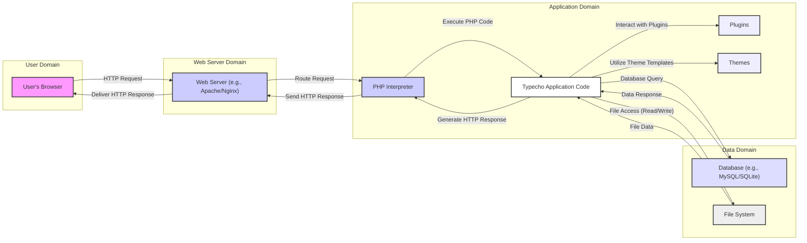

# Project Design Document: Typecho Blogging Platform

**Version:** 1.1
**Date:** October 26, 2023
**Prepared By:** AI Software Architect

## 1. Introduction

This document provides a detailed architectural design of the Typecho blogging platform, based on the project repository found at [https://github.com/typecho/typecho](https://github.com/typecho/typecho). This document serves as a foundation for subsequent threat modeling activities, providing a comprehensive understanding of the system's components, data flows, and interactions. The focus is on providing the necessary context for identifying potential security vulnerabilities.

### 1.1. Purpose

The primary purpose of this document is to outline the architecture of Typecho in sufficient detail to facilitate effective threat modeling. It aims to identify key components, data flows, and potential attack surfaces within the application, enabling a structured approach to security analysis.

### 1.2. Scope

This document covers the core architectural components of the Typecho platform, including its web application, database, file system usage, and interaction with the user's browser. It focuses on the aspects directly relevant to security considerations and potential vulnerabilities.

### 1.3. Target Audience

This document is intended for security engineers, threat modelers, developers, and anyone involved in assessing the security posture of the Typecho platform. It assumes a basic understanding of web application architecture and security principles.

## 2. System Overview

Typecho is an open-source, lightweight blogging platform built using PHP. It is designed for simplicity and speed, offering a straightforward interface for creating and managing blog content. Its minimalist design and focus on core blogging functionalities make it a popular choice for personal blogs and smaller websites.

### 2.1. Key Features

*   **Content Management:**  Creation, editing, and publishing of blog posts and static pages. Supports various content formats, including Markdown.
*   **Theme Support:**  Customizable front-end appearance and functionality through the use of themes. Themes control the presentation layer of the application.
*   **Plugin Support:**  Extending core functionality through plugins. Plugins can introduce new features, modify existing behavior, and integrate with external services.
*   **Comment System:**  Built-in functionality for users to leave comments on blog posts. Includes moderation features for administrators.
*   **User Management:**  Basic user roles (administrator, editor, contributor) and permission management for controlling access to administrative functions.
*   **Markdown Support:**  Primary content writing format, allowing for easy formatting and embedding of media.

## 3. Architectural Design

The Typecho architecture adheres to a traditional three-tier web application model, separating concerns into distinct layers:

*   **Presentation Tier:**  The user interface rendered in the user's web browser, responsible for displaying information and handling user interactions.
*   **Application Tier:**  The PHP code that implements the core business logic, handles data processing, and manages interactions between the presentation and data tiers.
*   **Data Tier:**  The persistent storage layer, typically a database, where application data is stored and retrieved.

### 3.1. Components

*   **Web Server:** (e.g., Apache, Nginx)
    *   **Responsibility:**  Receives incoming HTTP requests from users and serves static files (HTML, CSS, JavaScript, images). Acts as the entry point for all web traffic.
    *   **Security Relevance:** Misconfiguration can lead to information disclosure or access control bypasses. Vulnerabilities in the web server software itself can be exploited.
*   **PHP Interpreter:**
    *   **Responsibility:** Executes the Typecho PHP code. Processes requests, interacts with the database, renders templates, and generates HTTP responses.
    *   **Security Relevance:** Vulnerabilities in the PHP interpreter can be exploited to execute arbitrary code. Improper handling of user input within PHP scripts can lead to various injection attacks.
*   **Typecho Application Code:**
    *   **Responsibility:**  Implements the core blogging functionality, including content management, user authentication, comment handling, and plugin/theme management.
    *   **Security Relevance:** Contains the application's business logic and is the primary area where application-level vulnerabilities (e.g., XSS, CSRF, SQL injection) can exist.
*   **Database:** (e.g., MySQL, SQLite)
    *   **Responsibility:**  Stores persistent application data, including posts, user accounts, comments, and settings.
    *   **Security Relevance:**  A compromised database can lead to the disclosure of sensitive information, data manipulation, or complete data loss. Proper access control and secure configuration are crucial.
*   **File System:**
    *   **Responsibility:** Stores PHP source code, theme files, plugin files, uploaded media files, and configuration files.
    *   **Security Relevance:**  Improper file permissions or vulnerabilities allowing file uploads can lead to arbitrary code execution or information disclosure. Sensitive configuration files must be protected.
*   **User's Web Browser:**
    *   **Responsibility:** Renders the HTML, CSS, and JavaScript sent by the web server, allowing users to interact with the application.
    *   **Security Relevance:**  The target of client-side attacks like XSS. The browser's security features play a role in mitigating these attacks.
*   **Admin Panel:**
    *   **Responsibility:** A specific section of the web application accessible to authorized administrators for managing the blog.
    *   **Security Relevance:**  A critical component that requires strong authentication and authorization mechanisms. Vulnerabilities in the admin panel can lead to complete compromise of the blog.
*   **Plugins and Themes:**
    *   **Responsibility:** Extend the functionality and customize the appearance of Typecho.
    *   **Security Relevance:**  Third-party code that can introduce vulnerabilities if not developed securely or properly vetted. They operate within the context of the Typecho application and have access to its resources.

### 3.2. Data Flow

The typical data flow for a user accessing a blog post can be broken down as follows:

1. **User Request:** A user's browser sends an HTTP request to the web server for a specific blog post URL.
2. **Web Server Processing:** The web server receives the request. For static files, it serves them directly. For PHP requests, it forwards the request to the PHP interpreter.
3. **PHP Execution:** The PHP interpreter executes the Typecho application code, identifying the requested resource (e.g., a specific blog post).
4. **Database Query:** The application code queries the database to retrieve the content of the requested blog post and any associated data (e.g., author information, comments).
5. **Data Retrieval:** The database returns the requested data to the PHP application.
6. **Template Rendering:** The application code uses a theme template to generate the HTML for the blog post, embedding the retrieved data.
7. **HTTP Response:** The PHP interpreter sends the generated HTML response back to the web server.
8. **Response Delivery:** The web server sends the HTML response to the user's browser.
9. **Browser Rendering:** The user's browser renders the HTML, displaying the blog post to the user.

Administrative actions follow a similar flow but often involve write operations to the database and file system (e.g., creating a new post, installing a plugin, modifying settings). These actions typically require authentication and authorization checks.

### 3.3. Deployment Model

Typecho is commonly deployed in the following configurations:

*   **Single Server Deployment:** All components (web server, PHP interpreter, database, file system) reside on a single server. This is a common setup for smaller blogs.
*   **Separate Database Server Deployment:** The database is hosted on a dedicated server, separate from the web server and PHP interpreter. This improves performance and scalability for larger blogs.

### 3.4. Extensibility

Typecho's architecture is designed for extensibility through:

*   **Themes:** Allow users to customize the visual appearance and layout of their blog without modifying the core application code. Themes consist of template files, CSS stylesheets, JavaScript files, and images.
*   **Plugins:** Provide a mechanism to add new features and functionalities to Typecho. Plugins can hook into various points in the application's execution flow and interact with the database and file system.

## 4. Detailed Component Interaction

**Interaction Breakdown:**

*   **User Interaction:** Users initiate requests through their web browsers.
*   **Request Routing:** The web server routes incoming requests to the appropriate handler (static file server or PHP interpreter).
*   **Application Logic Execution:** The PHP interpreter executes the Typecho application code to process the request.
*   **Plugin and Theme Integration:** The application code interacts with installed plugins and utilizes theme templates to generate the response.
*   **Data Access:** The application code interacts with the database to retrieve or store data as needed.
*   **File System Operations:** The application reads and writes files on the file system for various purposes (e.g., accessing theme files, handling uploads).
*   **Response Generation:** The application generates the HTTP response, typically HTML, to be sent back to the user.
*   **Response Delivery:** The web server delivers the generated response back to the user's browser.

## 5. Security Considerations

Based on the architecture, potential security considerations and threat vectors include:

*   **Presentation Tier Vulnerabilities:**
    *   **Cross-Site Scripting (XSS):**  Improper handling of user-supplied data in themes or plugins can allow attackers to inject malicious scripts into web pages viewed by other users.
    *   **Content Security Policy (CSP) Bypasses:**  Weak or missing CSP configurations can increase the risk of XSS attacks.
    *   **Clickjacking:**  Vulnerabilities allowing attackers to trick users into clicking unintended links or buttons.
*   **Application Tier Vulnerabilities:**
    *   **SQL Injection:**  Improperly sanitized user input in database queries can allow attackers to execute arbitrary SQL commands.
    *   **Cross-Site Request Forgery (CSRF):**  Lack of proper CSRF protection can allow attackers to perform actions on behalf of authenticated users without their knowledge.
    *   **Authentication and Authorization Flaws:**  Weak password policies, insecure session management, or flaws in access control mechanisms can lead to unauthorized access.
    *   **Remote Code Execution (RCE):**  Vulnerabilities in the application or its dependencies that allow attackers to execute arbitrary code on the server. This can arise from insecure file uploads, deserialization flaws, or vulnerabilities in third-party libraries.
    *   **Insecure Deserialization:**  Exploiting vulnerabilities in how the application handles serialized data.
    *   **Server-Side Request Forgery (SSRF):**  Vulnerabilities allowing an attacker to make requests to internal or external resources from the server.
    *   **Insecure File Uploads:**  Lack of proper validation and sanitization of uploaded files can lead to malicious file execution or storage of harmful content.
    *   **Plugin and Theme Vulnerabilities:**  Security flaws in third-party plugins and themes can introduce vulnerabilities into the application.
    *   **Information Disclosure:**  Exposing sensitive information through error messages, debug logs, or insecure configurations.
*   **Data Tier Vulnerabilities:**
    *   **Database Compromise:**  Unauthorized access to the database due to weak credentials, misconfigurations, or SQL injection attacks.
    *   **Data Breaches:**  Theft or unauthorized access to sensitive data stored in the database.
    *   **File System Exploitation:**  Unauthorized access to the file system allowing modification or deletion of critical files, or execution of malicious scripts.
*   **Web Server Vulnerabilities:**
    *   **Web Server Software Exploits:**  Vulnerabilities in the web server software itself (e.g., Apache, Nginx).
    *   **Misconfigurations:**  Insecure configurations that expose sensitive information or allow unauthorized access.
    *   **Denial of Service (DoS) Attacks:**  Exploiting vulnerabilities to overwhelm the server with requests, making it unavailable to legitimate users.

## 6. Data Storage

Typecho stores various types of data, each with its own security considerations:

*   **Relational Data (Database):**
    *   **Examples:** Blog posts (content, title, metadata), user accounts (usernames, password hashes, roles), comments, categories, tags, settings, plugin configurations.
    *   **Security Considerations:** Requires strong access controls, encryption of sensitive data (especially passwords), and protection against SQL injection attacks. Regular backups are crucial for data recovery.
*   **Files (File System):**
    *   **Examples:** PHP source code, theme files (templates, CSS, JavaScript), plugin files, uploaded media files (images, documents), configuration files (database credentials, application settings).
    *   **Security Considerations:** Requires appropriate file permissions to prevent unauthorized access and modification. Uploaded files should be scanned for malware. Sensitive configuration files should be protected from web access.

## 7. External Interfaces

*   **User's Web Browser:** The primary interface for users to access and interact with the blog. Security considerations include protection against XSS and other client-side attacks.
*   **Administrative Interface:** A web-based interface for managing the blog. Requires strong authentication and authorization to prevent unauthorized access.
*   **Potential APIs (Plugins):** Plugins may introduce their own APIs for external interaction. These APIs need to be carefully designed and secured to prevent abuse.

## 8. Future Considerations

*   **Content Delivery Network (CDN) Integration:**  Can improve performance and availability but introduces new security considerations related to CDN configuration and potential vulnerabilities.
*   **Caching Mechanisms:** Implementing caching can reduce database load but may introduce vulnerabilities if cache invalidation is not handled correctly, potentially leading to the serving of stale or incorrect data.
*   **Security Hardening Guides:**  Developing and following security hardening guides for the web server, PHP environment, and database is crucial for minimizing the attack surface.
*   **Automated Security Testing:** Integrating static and dynamic application security testing (SAST/DAST) tools into the development and deployment pipeline can help identify vulnerabilities early.
*   **Regular Security Audits:** Periodic security audits and penetration testing can help identify and address potential security weaknesses.

This document provides a more detailed and security-focused understanding of the Typecho architecture, laying a solid foundation for comprehensive threat modeling activities. The next step involves systematically analyzing each component, data flow, and potential interaction point to identify specific threats and vulnerabilities, and then developing appropriate mitigation strategies.