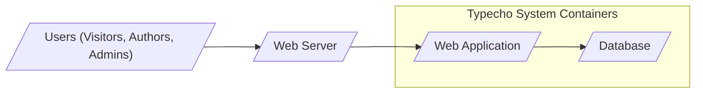
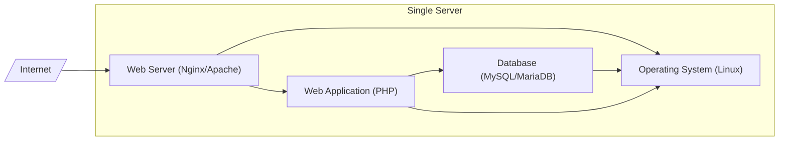
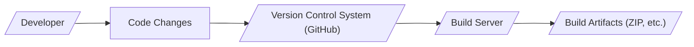

# BUSINESS POSTURE

This project, Typecho, aims to provide a lightweight and efficient blogging platform. The primary business goal is to offer a simple, user-friendly, and fast blogging experience for individuals and potentially small organizations.

Business priorities include:
- Ease of use and setup for non-technical users.
- Performance and speed for a smooth user experience.
- Simplicity and minimalism in design and features.
- Stability and reliability of the platform.
- Community support and extensibility through plugins and themes.

Key business risks associated with this project are:
- Data loss or corruption of blog content.
- Unauthorized access to blog administration and content.
- Service disruption due to security vulnerabilities or performance issues.
- Negative reputation due to security breaches or platform instability.
- Difficulty in attracting and retaining users compared to more feature-rich or commercially supported blogging platforms.

# SECURITY POSTURE

Existing security controls observed or inferred from common web application practices:
- security control Input validation on web forms (inferred, needs verification in code).
- security control Password hashing for user accounts (inferred, needs verification in code).
- security control Protection against common web vulnerabilities (e.g., SQL injection, XSS) is expected to be implemented by developers (inferred, needs verification and testing).
- accepted risk Reliance on user-managed hosting environments for security configuration and patching of underlying infrastructure (web server, operating system, database).
- accepted risk Security vulnerabilities in community-contributed plugins and themes.
- accepted risk Potential for security misconfigurations by users during installation and setup.

Recommended security controls to implement as high priority:
- security control Automated security vulnerability scanning (SAST/DAST) integrated into development and release process.
- security control Regular security audits and penetration testing.
- security control Security awareness training for developers and contributors.
- security control Secure coding guidelines and code review process focusing on security.
- security control Centralized security logging and monitoring.
- security control Implement Content Security Policy (CSP) to mitigate XSS attacks.
- security control Implement HTTP Strict Transport Security (HSTS) to enforce secure connections.
- security control Regular dependency updates and vulnerability patching of third-party libraries.

Security requirements for the project:

- Authentication:
  - Only authenticated administrators should be able to access the administrative interface.
  - Strong password policies should be enforced for administrator accounts.
  - Consider implementing multi-factor authentication (MFA) for administrator accounts.
  - Session management should be secure to prevent session hijacking.

- Authorization:
  - Role-based access control should be implemented to manage permissions for different administrative tasks.
  - Users should only be able to access and modify content they are authorized to manage.
  - Public access to blog content should be controlled and configurable.

- Input Validation:
  - All user inputs, including form data, URL parameters, and headers, must be validated to prevent injection attacks (SQL injection, XSS, etc.).
  - Input validation should be performed on both client-side and server-side.
  - Sanitize user-generated content before displaying it to prevent XSS attacks.

- Cryptography:
  - Sensitive data, such as user passwords, must be securely hashed using strong cryptographic algorithms.
  - Consider encrypting sensitive data at rest in the database.
  - Secure communication channels (HTTPS) must be enforced for all sensitive operations, especially login and administration.
  - Securely store and manage cryptographic keys if encryption is implemented.

# DESIGN

## C4 CONTEXT

```mermaid
graph LR
    subgraph "Blogging Platform Context"
        center "Typecho System"
    end
    User[/"Blog Visitors"/] --> center
    Author[/"Blog Authors"/] --> center
    Admin[/"Blog Administrators"/] --> center
    Database[/"Database System"/] --> center
    WebServer[/"Web Server"/] --> center
    OS[/"Operating System"/] --> WebServer
    center --> Database
    center --> WebServer
    WebServer --> OS
```

Context Diagram Elements:

- Element:
  - Name: Typecho System
  - Type: Software System
  - Description: The Typecho blogging platform itself, providing content management and publishing functionalities.
  - Responsibilities:
    - Managing blog content (posts, pages, media).
    - Handling user authentication and authorization for administration.
    - Rendering blog content for visitors.
    - Interacting with the database to store and retrieve data.
    - Interacting with the web server to handle HTTP requests and responses.
  - Security controls:
    - Input validation.
    - Authentication and authorization mechanisms.
    - Session management.
    - Data sanitization.
    - Security logging.

- Element:
  - Name: Blog Visitors
  - Type: Person
  - Description: Public users who access and read blog content through a web browser.
  - Responsibilities:
    - Viewing blog posts and pages.
    - Interacting with public-facing features (comments, search, etc.).
  - Security controls:
    - None directly implemented by Blog Visitors, but their actions are subject to security controls of the Typecho System and Web Server.

- Element:
  - Name: Blog Authors
  - Type: Person
  - Description: Users who create and manage blog content through the administrative interface.
  - Responsibilities:
    - Writing and editing blog posts and pages.
    - Managing media files.
  - Security controls:
    - Authentication to access the administrative interface.
    - Authorization to manage content.

- Element:
  - Name: Blog Administrators
  - Type: Person
  - Description: Users with full administrative privileges to manage the Typecho system, including users, settings, and plugins.
  - Responsibilities:
    - Managing users and roles.
    - Configuring system settings.
    - Installing and managing plugins and themes.
    - Performing system maintenance tasks.
  - Security controls:
    - Strong authentication (potentially MFA).
    - Authorization to perform all administrative actions.
    - Audit logging of administrative actions.

- Element:
  - Name: Database System
  - Type: Software System
  - Description: The database system (e.g., MySQL, MariaDB, PostgreSQL, SQLite) used to store blog content, user data, and system configuration.
  - Responsibilities:
    - Storing and retrieving data for the Typecho System.
    - Ensuring data persistence and integrity.
  - Security controls:
    - Access control to the database (authentication and authorization).
    - Data encryption at rest (optional, depending on database and hosting configuration).
    - Regular backups.
    - Database hardening and security configuration.

- Element:
  - Name: Web Server
  - Type: Software System
  - Description: The web server (e.g., Apache, Nginx) that hosts the Typecho application and serves web pages to users.
  - Responsibilities:
    - Handling HTTP requests and responses.
    - Serving static files (images, CSS, JavaScript).
    - Forwarding requests to the Typecho application.
    - TLS/SSL termination for HTTPS.
  - Security controls:
    - Web server hardening and security configuration.
    - TLS/SSL configuration for secure communication (HTTPS).
    - Access control to web server resources.
    - Web application firewall (WAF) - optional, depending on deployment needs.
    - Rate limiting and DDoS protection - often provided by hosting environment.

- Element:
  - Name: Operating System
  - Type: Software System
  - Description: The operating system (e.g., Linux, Windows) on which the web server and database system are running.
  - Responsibilities:
    - Providing the underlying platform for the web server and database.
    - Managing system resources.
  - Security controls:
    - Operating system hardening and security patching.
    - Access control to the operating system.
    - Firewall configuration.
    - Intrusion detection/prevention system (IDS/IPS) - often provided by hosting environment.

## C4 CONTAINER



Container Diagram Elements:

- Element:
  - Name: Web Application
  - Type: Container - Web Application
  - Description: The PHP application code that implements the Typecho blogging platform logic. This includes handling requests, managing content, user authentication, and interacting with the database.
  - Responsibilities:
    - Handling HTTP requests from the Web Server.
    - Implementing application logic for content management, user authentication, and other features.
    - Rendering web pages (HTML, CSS, JavaScript).
    - Interacting with the Database to store and retrieve data.
  - Security controls:
    - Input validation.
    - Authentication and authorization logic.
    - Session management.
    - Data sanitization.
    - Security logging.
    - Protection against common web application vulnerabilities (OWASP Top 10).

- Element:
  - Name: Database
  - Type: Container - Database
  - Description: The database system (e.g., MySQL, MariaDB, PostgreSQL, SQLite) containerized as a data store for the Web Application.
  - Responsibilities:
    - Storing blog content, user data, and system configuration.
    - Providing data persistence and retrieval for the Web Application.
  - Security controls:
    - Database access control (usernames, passwords, permissions).
    - Database hardening and security configuration.
    - Regular database backups.
    - Data encryption at rest (optional, depending on database and hosting).
    - Network security controls to restrict access to the database container.

- Element:
  - Name: Web Server
  - Type: Container - Web Server
  - Description: The web server (e.g., Apache, Nginx) container that serves as the entry point for user requests and forwards them to the Web Application.
  - Responsibilities:
    - Receiving HTTP requests from users.
    - Serving static files (images, CSS, JavaScript).
    - Forwarding dynamic requests to the Web Application container.
    - TLS/SSL termination for HTTPS.
  - Security controls:
    - Web server hardening and security configuration.
    - TLS/SSL configuration for secure communication (HTTPS).
    - Access control to web server resources.
    - Web application firewall (WAF) - optional, depending on deployment needs.
    - Rate limiting and DDoS protection - often provided by hosting environment.

## DEPLOYMENT

Deployment Architecture: Single Server Deployment (Example)

This is a common and simple deployment architecture suitable for small to medium-sized blogs. All components are deployed on a single server instance.



Deployment Diagram Elements (Single Server Deployment):

- Element:
  - Name: Single Server
  - Type: Deployment Environment
  - Description: A single physical or virtual server instance hosting all components of the Typecho platform.
  - Responsibilities:
    - Providing the infrastructure for running the Web Server, Web Application, and Database.
    - Managing system resources (CPU, memory, storage, network).
  - Security controls:
    - Server hardening and security configuration.
    - Operating system security patching.
    - Firewall configuration.
    - Intrusion detection/prevention system (IDS/IPS) - often provided by hosting environment.
    - Physical security of the server (if applicable).

- Element:
  - Name: Web Server (Nginx/Apache)
  - Type: Software Deployment Unit
  - Description: Instance of the chosen web server software running on the server.
  - Responsibilities:
    - Handling HTTP requests and responses.
    - Serving static files.
    - Forwarding requests to the Web Application.
    - TLS/SSL termination.
  - Security controls:
    - Web server hardening and security configuration.
    - TLS/SSL configuration.
    - Access control configuration.

- Element:
  - Name: Web Application (PHP)
  - Type: Software Deployment Unit
  - Description: Instance of the Typecho PHP application running within the web server environment.
  - Responsibilities:
    - Executing the application code.
    - Handling application logic.
    - Interacting with the Database.
    - Rendering web pages.
  - Security controls:
    - Application-level security controls (input validation, authentication, etc.).
    - Secure coding practices.
    - Regular application updates.

- Element:
  - Name: Database (MySQL/MariaDB)
  - Type: Software Deployment Unit
  - Description: Instance of the chosen database system running on the server.
  - Responsibilities:
    - Storing and managing data.
    - Providing data access to the Web Application.
  - Security controls:
    - Database access control.
    - Database hardening and security configuration.
    - Regular database backups.

- Element:
  - Name: Operating System (Linux)
  - Type: Software Deployment Unit
  - Description: The Linux operating system running on the server.
  - Responsibilities:
    - Providing the base platform for all other components.
    - Managing system resources.
  - Security controls:
    - Operating system hardening and security patching.
    - Access control to the OS.
    - Firewall configuration.

## BUILD

Build Process Diagram (Simplified Example):



Build Process Description:

1. Developer: Developers write and modify the Typecho source code.
2. Code Changes: Developers commit their code changes.
3. Version Control System (GitHub): Code changes are pushed to the GitHub repository. This is the central repository for the project's source code.
4. Build Server: A build server (e.g., GitHub Actions, Jenkins, or a local build environment) is used to automate the build process.  For a project like Typecho, the build process is likely simple and might involve:
    - Checking out the code from the VCS.
    - Running linters and static analysis security testing (SAST) tools (if configured).
    - Packaging the application files into a distributable archive (e.g., ZIP file).
5. Build Artifacts (ZIP, etc.): The build server produces build artifacts, such as ZIP archives containing the application code, ready for distribution or deployment.

Security Controls in Build Process:

- Supply Chain Security:
  - Use of a reputable version control system (GitHub).
  - Dependency management (if applicable, for PHP dependencies) to track and manage third-party libraries.
  - Verification of the integrity and authenticity of third-party dependencies.

- Build Automation:
  - Automated build process reduces manual errors and ensures consistency.
  - Use of a dedicated build server environment, separate from developer workstations.

- Security Checks During Build:
  - Static Application Security Testing (SAST) scanners can be integrated into the build process to automatically detect potential security vulnerabilities in the code.
  - Code linters can enforce coding standards and identify potential code quality issues that might have security implications.
  - Dependency vulnerability scanning can identify known vulnerabilities in third-party libraries.

- Access Control:
  - Access to the build server and build artifacts should be restricted to authorized personnel.
  - Secure storage and transmission of build artifacts.

# RISK ASSESSMENT

Critical business processes to protect:
- Publishing and maintaining blog content.
- User account management (especially administrator accounts).
- System configuration and availability.

Data to protect and sensitivity:
- Blog content (posts, pages, media): Publicly accessible but integrity and availability are important.
- User accounts (usernames, passwords, email addresses): Sensitive personal data, confidentiality and integrity are critical.
- System configuration data: Sensitive system data, confidentiality and integrity are critical for system security and stability.
- Database backups: Sensitive data, confidentiality and integrity are critical for disaster recovery and data protection.

Data Sensitivity Levels:
- Public: Blog content (posts, pages, media).
- Sensitive: User accounts (usernames, email addresses), system configuration data, database backups.
- Highly Sensitive: User passwords (hashed, but still highly sensitive).

# QUESTIONS & ASSUMPTIONS

Questions:

- BUSINESS POSTURE:
  - What is the target audience for Typecho? Individual bloggers, small businesses, or a broader range?
  - What is the expected level of uptime and data durability for deployments?
  - Are there any specific compliance requirements (e.g., GDPR, HIPAA) that need to be considered?

- SECURITY POSTURE:
  - Are there any existing security guidelines or documentation for developers and users?
  - What is the expected level of security for user deployments? Is it assumed users will implement their own security measures?
  - Are there any plans for formal security audits or penetration testing?
  - What is the process for handling security vulnerability reports and releasing security updates?

- DESIGN:
  - What are the officially supported database systems?
  - What are the recommended web server configurations?
  - Are there any scalability considerations for larger blogs or higher traffic volumes?
  - Is there any built-in support for data encryption at rest or in transit?

Assumptions:

- BUSINESS POSTURE:
  - The primary goal is to provide a simple and lightweight blogging platform for general use.
  - Uptime and data integrity are important but not mission-critical for most users.
  - Compliance requirements are not a primary focus for the core project but might be relevant for specific user deployments.

- SECURITY POSTURE:
  - Security is considered important, but the project relies heavily on community contributions and user-managed hosting environments.
  - Users are expected to take responsibility for securing their own deployments to a certain extent.
  - Security updates will be released reactively in response to reported vulnerabilities.

- DESIGN:
  - The application is designed to be deployed on standard LAMP/LEMP stack environments.
  - Database choice is flexible, supporting common database systems.
  - Scalability is not a primary design goal, focusing on simplicity and efficiency for typical blog use cases.
  - Data encryption is likely not a built-in feature but might be achievable through server/database configuration.