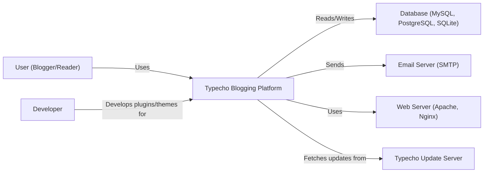
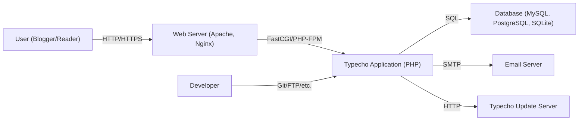
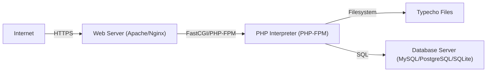
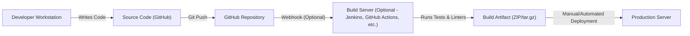

Okay, let's create a design document for the Typecho blogging platform based on the provided GitHub repository.

# BUSINESS POSTURE

Typecho is an open-source blogging platform.  Its primary business goals appear to be:

*   Provide a lightweight and easy-to-use blogging platform.
*   Offer a flexible and customizable system for developers and users.
*   Maintain a small codebase for ease of maintenance and security.
*   Foster a community around the platform for contributions and support.

Business priorities:

*   Ease of use for end-users (bloggers).
*   Extensibility and customizability for developers.
*   Stability and security of the core platform.
*   Community engagement.

Most important business risks:

*   Security vulnerabilities that could lead to website defacement, data breaches, or denial of service.
*   Lack of adoption due to competition from larger, more feature-rich platforms.
*   Difficulty in attracting and retaining contributors to maintain and improve the platform.
*   Inability to scale to meet the needs of larger blogs or high-traffic websites.
*   Reputational damage due to security incidents or poor user experience.

# SECURITY POSTURE

Based on the GitHub repository and common practices for PHP applications, here's an assessment of Typecho's likely security posture:

Existing security controls:

*   security control: Input validation: Typecho likely uses input validation to sanitize user inputs and prevent common web vulnerabilities like Cross-Site Scripting (XSS) and SQL Injection. Implemented in core code and expected in plugins/themes.
*   security control: Output encoding: Typecho likely encodes output to prevent XSS vulnerabilities. Implemented in core code and expected in plugins/themes.
*   security control: Authentication: Typecho provides a built-in authentication system for users and administrators. Implemented in core code.
*   security control: Authorization: Typecho likely has an authorization mechanism to control access to different features and functionalities based on user roles. Implemented in core code.
*   security control: CSRF protection: Typecho likely includes protection against Cross-Site Request Forgery attacks. Implemented in core code.
*   security control: Session management: Typecho uses sessions to manage user logins and state. Implemented in core code.
*   security control: File upload handling: Typecho likely has mechanisms to securely handle file uploads, restricting file types and sizes. Implemented in core code.
*   security control: Database security: Typecho uses prepared statements or an ORM to interact with the database, mitigating SQL injection risks. Implemented in core code.

Accepted risks:

*   accepted risk: Reliance on third-party plugins and themes: Typecho's extensibility model relies on plugins and themes, which may introduce security vulnerabilities if not properly vetted or maintained.
*   accepted risk: Limited built-in security features: Compared to larger platforms, Typecho may have fewer built-in security features, requiring users to rely on plugins or manual configurations.
*   accepted risk: Potential for misconfiguration: Like any web application, Typecho can be vulnerable if misconfigured, such as using weak passwords or leaving debug mode enabled.
*   accepted risk: Dependence on the security of the underlying server environment (PHP, web server, database).

Recommended security controls:

*   security control: Implement a Content Security Policy (CSP) to mitigate XSS and data injection attacks.
*   security control: Implement Subresource Integrity (SRI) to ensure that loaded JavaScript and CSS files haven't been tampered with.
*   security control: Regularly update dependencies to patch known vulnerabilities.
*   security control: Provide security hardening guides and recommendations for users and administrators.
*   security control: Consider implementing two-factor authentication (2FA) for enhanced login security.
*   security control: Implement HTTP security headers (e.g., HSTS, X-Frame-Options, X-XSS-Protection).

Security Requirements:

*   Authentication:
    *   Strong password policies.
    *   Secure session management (e.g., HTTP-only cookies, secure flag).
    *   Protection against brute-force attacks.
    *   Optional two-factor authentication.

*   Authorization:
    *   Role-based access control (RBAC) for different user types (e.g., administrator, editor, contributor).
    *   Granular permissions to control access to specific features and content.

*   Input Validation:
    *   Strict validation of all user inputs on both the client-side and server-side.
    *   Whitelist-based validation where possible.
    *   Sanitization of inputs to prevent XSS and other injection attacks.

*   Cryptography:
    *   Use of strong, industry-standard cryptographic algorithms for password hashing (e.g., bcrypt, Argon2).
    *   Secure storage of sensitive data (e.g., API keys, database credentials).
    *   Use of HTTPS for all communication.

*   Output Encoding:
    *   Context-aware output encoding to prevent XSS vulnerabilities.

# DESIGN

## C4 CONTEXT

Element descriptions:

*   Element:
    *   Name: User (Blogger/Reader)
    *   Type: Person
    *   Description: Represents a person who interacts with the Typecho blogging platform, either as a blogger creating content or a reader consuming content.
    *   Responsibilities: Browsing the blog, reading posts, submitting comments, creating and managing blog content (for bloggers), managing blog settings (for administrators).
    *   Security controls: Authentication, Authorization, CSRF protection, Session management.

*   Element:
    *   Name: Typecho Blogging Platform
    *   Type: Software System
    *   Description: The core Typecho application, responsible for managing blog content, users, and settings.
    *   Responsibilities: Handling user requests, rendering web pages, managing blog data, interacting with the database and email server.
    *   Security controls: Input validation, Output encoding, Authentication, Authorization, CSRF protection, Session management, File upload handling, Database security.

*   Element:
    *   Name: Database (MySQL, PostgreSQL, SQLite)
    *   Type: Database
    *   Description: Stores blog data, including posts, comments, users, and settings.
    *   Responsibilities: Storing and retrieving data, ensuring data integrity.
    *   Security controls: Database access controls, Encryption at rest (if applicable), Regular backups.

*   Element:
    *   Name: Email Server (SMTP)
    *   Type: Software System
    *   Description: Used for sending email notifications, such as password reset emails.
    *   Responsibilities: Sending emails.
    *   Security controls: Secure SMTP configuration, TLS encryption.

*   Element:
    *   Name: Web Server (Apache, Nginx)
    *   Type: Software System
    *   Description: Serves the Typecho application to users.
    *   Responsibilities: Handling HTTP requests, serving static files, proxying requests to the PHP interpreter.
    *   Security controls: Web server security configuration, HTTPS, Firewall.

*   Element:
    *   Name: Typecho Update Server
    *   Type: Software System
    *   Description: Remote server hosting Typecho updates.
    *   Responsibilities: Providing updates to the Typecho core.
    *   Security controls: Code signing, Secure communication (HTTPS).

*   Element:
    *   Name: Developer
    *   Type: Person
    *   Description: A person who develops plugins or themes for Typecho.
    *   Responsibilities: Creating and maintaining plugins/themes.
    *   Security controls: Secure coding practices.

## C4 CONTAINER

Element descriptions:

*   Element:
    *   Name: User (Blogger/Reader)
    *   Type: Person
    *   Description: Represents a person who interacts with the Typecho blogging platform.
    *   Responsibilities: Browsing, reading, commenting, creating/managing content (bloggers), managing settings (administrators).
    *   Security controls: Authentication, Authorization, CSRF protection, Session management.

*   Element:
    *   Name: Web Server (Apache, Nginx)
    *   Type: Container (Web Server)
    *   Description: Serves the Typecho application.
    *   Responsibilities: Handling HTTP requests, serving static files, proxying to PHP.
    *   Security controls: Web server security configuration, HTTPS, Firewall.

*   Element:
    *   Name: Typecho Application (PHP)
    *   Type: Container (Web Application)
    *   Description: The core Typecho application logic.
    *   Responsibilities: Handling requests, rendering pages, managing data, interacting with DB and email.
    *   Security controls: Input validation, Output encoding, Authentication, Authorization, CSRF protection, Session management, File upload handling, Database security.

*   Element:
    *   Name: Database (MySQL, PostgreSQL, SQLite)
    *   Type: Container (Database)
    *   Description: Stores blog data.
    *   Responsibilities: Storing and retrieving data, ensuring integrity.
    *   Security controls: Database access controls, Encryption at rest (if applicable), Regular backups.

*   Element:
    *   Name: Email Server
    *   Type: Container (Software System)
    *   Description: Sends email notifications.
    *   Responsibilities: Sending emails.
    *   Security controls: Secure SMTP configuration, TLS encryption.

*   Element:
    *   Name: Typecho Update Server
    *   Type: Container (Software System)
    *   Description: Remote server for Typecho updates.
    *   Responsibilities: Providing updates.
    *   Security controls: Code signing, Secure communication (HTTPS).

*   Element:
    *   Name: Developer
    *   Type: Person
    *   Description: Develops plugins/themes.
    *   Responsibilities: Creating/maintaining plugins/themes.
    *   Security controls: Secure coding practices.

## DEPLOYMENT

Possible deployment solutions:

1.  Traditional LAMP/LEMP stack on a single server.
2.  Containerized deployment using Docker.
3.  Cloud-based deployment using services like AWS, Google Cloud, or Azure.
4.  Deployment on a Platform-as-a-Service (PaaS) provider.

Chosen solution (for detailed description): Traditional LAMP/LEMP stack on a single server.

Element descriptions:

*   Element:
    *   Name: Internet
    *   Type: External
    *   Description: The global network.
    *   Responsibilities: Routing traffic to the web server.
    *   Security controls: N/A

*   Element:
    *   Name: Web Server (Apache/Nginx)
    *   Type: Server
    *   Description: Handles incoming HTTP requests.
    *   Responsibilities: Serving static content, proxying requests to PHP.
    *   Security controls: Web server configuration, Firewall, HTTPS configuration.

*   Element:
    *   Name: PHP Interpreter (PHP-FPM)
    *   Type: Server Process
    *   Description: Executes PHP code.
    *   Responsibilities: Running the Typecho application.
    *   Security controls: PHP security settings (e.g., disable_functions, open_basedir).

*   Element:
    *   Name: Typecho Files
    *   Type: Filesystem
    *   Description: The Typecho application files.
    *   Responsibilities: Storing the application code, themes, and plugins.
    *   Security controls: File permissions, Regular backups.

*   Element:
    *   Name: Database Server (MySQL/PostgreSQL/SQLite)
    *   Type: Server
    *   Description: Stores and manages the blog data.
    *   Responsibilities: Storing and retrieving data.
    *   Security controls: Database user permissions, Firewall, Encryption at rest (optional).

## BUILD

Typecho, being a relatively simple PHP application, likely has a straightforward build process.  While a sophisticated CI/CD pipeline *could* be used, it's also common for smaller projects like this to have a more manual process.  Here's a likely scenario, incorporating security considerations:

Build process description:

1.  **Development:** Developers write code locally, using version control (Git) and pushing changes to the central GitHub repository.
2.  **Code Review (Optional):**  Pull requests on GitHub can trigger code reviews before merging into the main branch.
3.  **Automated Build (Optional):** A build server (like Jenkins or GitHub Actions) *could* be configured to:
    *   Run unit tests.
    *   Perform static code analysis (SAST) using tools like PHPStan or Psalm.
    *   Run linters to enforce coding standards.
    *   Create a build artifact (e.g., a ZIP file) containing the necessary files for deployment.
4.  **Manual Build (More Likely):**  Given Typecho's size, a manual build process is also plausible.  This might involve:
    *   A developer manually creating a ZIP file of the codebase from a specific Git tag or branch.
    *   Manually running linters and tests locally before creating the archive.
5.  **Deployment:** The build artifact (whether created manually or automatically) is then deployed to the production server. This could be done via FTP, SCP, or a deployment script.

Security Controls in the Build Process:

*   security control: Version Control (Git): Tracks changes, allows for rollbacks, and facilitates collaboration.
*   security control: Code Review (Optional): Helps identify potential security vulnerabilities before they reach production.
*   security control: Static Code Analysis (SAST) (Optional): Automatically detects potential security flaws in the code.
*   security control: Linters: Enforce coding standards, which can indirectly improve security by reducing the likelihood of certain types of errors.
*   security control: Dependency Management: Keeping track of dependencies and updating them regularly to patch vulnerabilities. Tools like Composer (for PHP) can help with this.
*   security control: Build Artifact Integrity: Ensuring the build artifact hasn't been tampered with during the build or deployment process (e.g., using checksums).

# RISK ASSESSMENT

*   Critical Business Processes:
    *   Content creation and publishing.
    *   User management and authentication.
    *   Blog administration and configuration.
    *   Comment management.
    *   Plugin and theme management.

*   Data to Protect:
    *   Blog posts (drafts and published content): Sensitivity varies depending on the content. Could range from public information to private drafts.
    *   User data (usernames, email addresses, hashed passwords): Sensitive personal information.
    *   Comments: Sensitivity varies, but could contain personal information or opinions.
    *   Blog configuration settings: Could expose sensitive information if compromised.
    *   Plugin and theme files: Could contain vulnerabilities if not properly vetted.

# QUESTIONS & ASSUMPTIONS

*   Questions:
    *   What is the expected traffic volume for a typical Typecho installation? This impacts scaling considerations.
    *   What are the most common deployment environments used by Typecho users? (e.g., shared hosting, VPS, cloud)
    *   Are there any specific security certifications or compliance requirements that Typecho aims to meet?
    *   What is the process for reporting and handling security vulnerabilities?
    *   What level of support is provided for older versions of Typecho?
    *   Does Typecho have any built-in mechanisms for detecting or preventing common web attacks (e.g., rate limiting, intrusion detection)?

*   Assumptions:
    *   BUSINESS POSTURE: Assumes a small to medium-sized user base with a focus on simplicity and ease of use.
    *   SECURITY POSTURE: Assumes a basic level of security awareness among users and administrators, but not necessarily expert-level knowledge.
    *   DESIGN: Assumes a traditional LAMP/LEMP stack deployment is the most common scenario. Assumes that most users will rely on the core functionality and a limited number of plugins/themes. Assumes a relatively low frequency of updates to the core platform.
    *   BUILD: Assumes that build process is mostly manual.