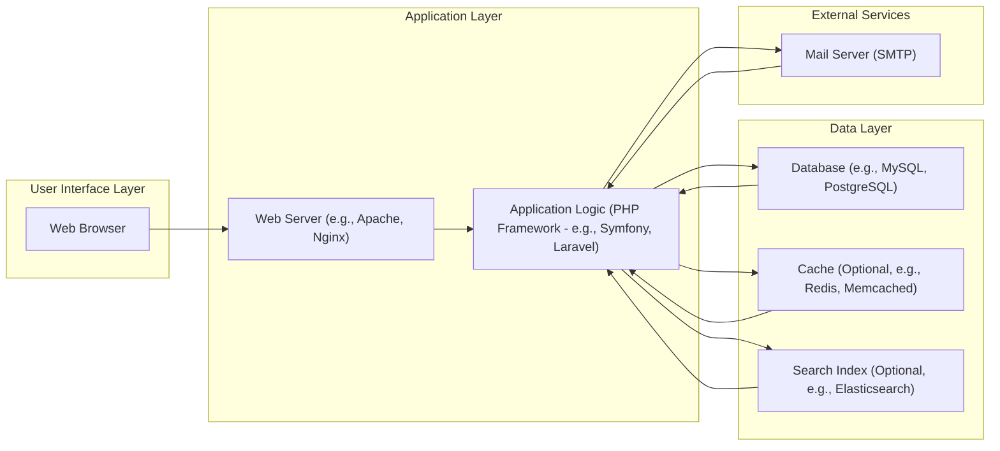
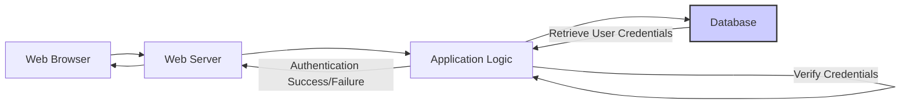

# Project Design Document: UVDesk Community Skeleton

**Version:** 1.1
**Date:** October 26, 2023
**Author:** AI Software Architect

## 1. Introduction

This document provides an enhanced design overview of the UVDesk Community Skeleton project, accessible at [https://github.com/uvdesk/community-skeleton](https://github.com/uvdesk/community-skeleton). This revised document aims to provide a more detailed and refined articulation of the system's architecture, components, data flow, and crucial security considerations. It is intended to serve as a robust foundation for subsequent threat modeling activities and ongoing development efforts.

### 1.1. Project Overview

The UVDesk Community Skeleton serves as a foundational and extensible codebase for constructing a comprehensive customer support help desk system. It furnishes the essential architectural structure and core functionalities necessary for developing a fully featured help desk application. Key features typically include robust ticket management, user administration, and configurable workflow capabilities.

### 1.2. Goals of this Document

*   Present a refined and more detailed architectural overview of the UVDesk Community Skeleton.
*   Provide a deeper understanding of key components, their specific functionalities, and interdependencies.
*   Illustrate the data flow within the system for a broader range of critical operations.
*   Elaborate on initial security considerations, providing more specific examples for threat modeling.
*   Serve as a comprehensive and up-to-date reference point for security assessments, development, and operational activities.

### 1.3. Target Audience

This document is intended for a diverse audience involved with the UVDesk Community Skeleton:

*   Security engineers and architects tasked with performing thorough threat modeling and security assessments.
*   Developers actively engaged in extending, customizing, or contributing to the UVDesk Community Skeleton codebase.
*   Operations teams responsible for the deployment, maintenance, and ongoing monitoring of the application.
*   Project managers and stakeholders requiring a clear understanding of the system's architecture and security posture.

## 2. System Architecture

The UVDesk Community Skeleton adheres to a standard multi-tier web application architecture, likely implementing a Model-View-Controller (MVC) or a similar architectural pattern to promote separation of concerns.



**Architectural Layers and Components:**

*   **User Interface Layer:**
    *   **Web Browser:** The client-side interface enabling user interaction with the application. Responsible for rendering the user interface and sending user requests.
*   **Application Layer:**
    *   **Web Server:**  Acts as the entry point for all client requests. Manages incoming HTTP/HTTPS requests, serves static assets, handles SSL/TLS termination, and routes dynamic requests to the application logic.
    *   **Application Logic:**  The core of the application, responsible for handling business logic, processing user requests, interacting with the data layer, and orchestrating workflows. Likely implemented using a robust PHP framework.
*   **Data Layer:**
    *   **Database:** Provides persistent storage for all application data, including user accounts, tickets, configurations, and audit logs.
    *   **Cache (Optional):** An in-memory data store used to improve application performance by caching frequently accessed data, reducing the load on the database.
    *   **Search Index (Optional):**  Enables efficient and fast full-text searching of tickets, knowledge base articles, and other relevant data.
*   **External Services:**
    *   **Mail Server:**  Handles the sending and potentially receiving of emails, crucial for notifications, password resets, and communication with users.

## 3. Component Breakdown

This section provides a more granular description of the key components and their functionalities.

### 3.1. Web Browser

*   **Functionality:**  Renders the user interface (HTML, CSS, JavaScript), executes client-side logic, and communicates with the web server via HTTP/HTTPS requests.
*   **Technology:**  Standard web browsers such as Google Chrome, Mozilla Firefox, Apple Safari, and Microsoft Edge.
*   **Key Interactions:** Initiates all user-driven interactions with the application by sending requests and displaying server responses.

### 3.2. Web Server

*   **Functionality:**  Receives and processes incoming HTTP/HTTPS requests. Serves static content (images, CSS, JavaScript). Acts as a reverse proxy, forwarding dynamic requests to the application logic. Enforces security policies (e.g., rate limiting, basic authentication). Manages SSL/TLS certificates for secure communication.
*   **Technology:**  Common web servers include Apache HTTP Server and Nginx. Configuration often involves virtual hosts, security headers, and performance tuning.
*   **Key Interactions:** Receives requests from the web browser, forwards requests to the application logic, and sends HTTP responses back to the browser.

### 3.3. Application Logic (PHP Framework)

*   **Functionality:**  Implements the core business logic of the help desk system. This encompasses:
    *   **User Management:** Registration, login, profile management, role-based access control.
    *   **Ticket Management:** Creation, assignment, status updates, prioritization, and resolution of support tickets.
    *   **Workflow Automation:** Defining and executing automated processes for ticket handling.
    *   **Notification System:**  Generating and sending email notifications for various events.
    *   **Reporting and Analytics:**  Generating reports on key metrics and performance indicators.
    *   **API Endpoints:**  Providing interfaces for external integrations (e.g., RESTful APIs).
    *   **Security Features:** Implementing security measures such as input validation, authorization checks, and protection against common web vulnerabilities.
*   **Technology:**  Likely built using a robust PHP framework such as Symfony or Laravel, leveraging components for routing, templating (e.g., Twig, Blade), ORM (e.g., Doctrine, Eloquent), and security. May utilize other PHP libraries for specific functionalities (e.g., PHPMailer for email).
*   **Key Interactions:** Interacts extensively with the database for data persistence, communicates with the mail server for sending emails, interacts with the cache for performance optimization, and potentially interacts with the search index for indexing and querying data.

### 3.4. Database

*   **Functionality:**  Provides persistent and reliable storage for all application data, ensuring data integrity and availability.
*   **Technology:**  Common relational databases like MySQL, PostgreSQL, or potentially MariaDB. Database design includes tables for users, tickets, agents, departments, and other relevant entities.
*   **Key Interactions:** Receives SQL queries (e.g., SELECT, INSERT, UPDATE, DELETE) from the application logic to manage data.

### 3.5. Mail Server (SMTP)

*   **Functionality:**  Handles the reliable delivery of outgoing emails from the application. May also handle incoming emails depending on configuration.
*   **Technology:**  Any standard SMTP server or service (e.g., Sendmail, Postfix, Exim, cloud-based services like SendGrid or Mailgun).
*   **Key Interactions:** Receives email messages from the application logic, including recipient addresses, subject lines, and message bodies, and delivers them to the intended recipients.

### 3.6. Cache (Optional)

*   **Functionality:**  Stores frequently accessed data in memory to reduce database load and improve application response times. Can be used for caching database query results, rendered templates, or other computationally expensive operations.
*   **Technology:**  In-memory data stores like Redis or Memcached are common choices.
*   **Key Interactions:** The application logic interacts with the cache to store (set) and retrieve (get) data based on keys.

### 3.7. Search Index (Optional)

*   **Functionality:**  Provides efficient full-text search capabilities for searching through tickets, knowledge base articles, and other textual data. Enables users to quickly find relevant information.
*   **Technology:**  Popular search engines like Elasticsearch or Solr. Requires indexing data from the database to enable searching.
*   **Key Interactions:** The application logic sends data to the search index for indexing and sends search queries to the index to retrieve relevant results.

## 4. Data Flow

This section illustrates the data flow for several common user interactions, providing a clearer understanding of how data moves through the system.

### 4.1. User Login



**Steps:**

1. The user submits login credentials (username/email and password) through the **Web Browser**.
2. The **Web Browser** sends an HTTPS POST request containing the credentials to the **Web Server**.
3. The **Web Server** forwards the request to the **Application Logic**.
4. The **Application Logic** queries the **Database** to retrieve the stored user credentials based on the provided username/email.
5. The **Database** returns the stored user credentials (typically a hashed password).
6. The **Application Logic** compares the provided password (after hashing) with the retrieved hashed password to verify authenticity.
7. The **Application Logic** determines the authentication result (success or failure).
8. The **Application Logic** sends the authentication result back to the **Web Server**, potentially including a session identifier upon successful authentication.
9. The **Web Server** sends an HTTP response back to the **Web Browser**, potentially setting a session cookie for subsequent requests.

### 4.2. Creating a New Ticket

```mermaid
graph LR
    A["Web Browser"] --> B["Web Server"];
    B --> C["Application Logic"];
    C -- "Validate Ticket Data" --> C;
    C --> D["Database"];
    D -- "Store New Ticket" --> C;
    C --> E["Mail Server"];
    E -- "Send Notification Email" --> "Recipient(s)";
    C --> F["Cache (Optional)"];
    F -- "Invalidate Relevant Cache" --> C;
    C -- "Success Response" --> B;
    B --> A;
    style D fill:#ccf,stroke:#333,stroke-width:2px
    style E fill:#ffc,stroke:#333,stroke-width:2px
```

**Steps:**

1. The user fills out the new ticket form in the **Web Browser**.
2. The **Web Browser** sends an HTTPS POST request containing the ticket data to the **Web Server**.
3. The **Web Server** forwards the request to the **Application Logic**.
4. The **Application Logic** validates the submitted ticket data (e.g., required fields, data formats).
5. The **Application Logic** interacts with the **Database** to store the new ticket information.
6. The **Database** stores the new ticket data.
7. The **Application Logic** interacts with the **Mail Server** to send notification emails to relevant parties (e.g., assigned agents, the ticket creator).
8. The **Mail Server** sends the notification emails.
9. The **Application Logic** (optionally) interacts with the **Cache** to invalidate any cached data related to tickets to ensure data consistency.
10. The **Application Logic** sends a success response back to the **Web Server**.
11. The **Web Server** sends the response back to the **Web Browser**, typically redirecting the user to the newly created ticket.

### 4.3. Searching for Tickets

```mermaid
graph LR
    A["Web Browser"] --> B["Web Server"];
    B --> C["Application Logic"];
    C -- "Determine Search Strategy" --> C;
    alt "Search Index Enabled"
        C --> G["Search Index"];
        G -- "Execute Search Query" --> C;
    else "Search Index Disabled"
        C --> D["Database"];
        D -- "Execute Database Query" --> C;
    end
    C -- "Return Search Results" --> B;
    B --> A;
    style D fill:#ccf,stroke:#333,stroke-width:2px
    style G fill:#cff,stroke:#333,stroke-width:2px
```

**Steps:**

1. The user enters their search query in the **Web Browser**.
2. The **Web Browser** sends a request to the **Web Server** containing the search terms.
3. The **Web Server** forwards the request to the **Application Logic**.
4. The **Application Logic** determines the appropriate search strategy based on system configuration (whether a search index is enabled).
5. **If a Search Index is enabled:**
    *   The **Application Logic** sends the search query to the **Search Index**.
    *   The **Search Index** executes the query and returns the relevant ticket IDs.
6. **If a Search Index is disabled:**
    *   The **Application Logic** constructs and executes a search query directly against the **Database**.
    *   The **Database** returns the matching ticket data.
7. The **Application Logic** formats the search results.
8. The **Application Logic** sends the search results back to the **Web Server**.
9. The **Web Server** sends the response to the **Web Browser** for display.

## 5. Security Considerations

This section expands upon the initial security considerations, providing more specific examples of potential threats and mitigation strategies relevant to the UVDesk Community Skeleton.

**Key Security Areas and Considerations:**

*   **Authentication and Authorization:**
    *   **Threats:** Brute-force attacks, credential stuffing, session hijacking, privilege escalation.
    *   **Mitigations:** Strong password policies, multi-factor authentication (MFA), rate limiting on login attempts, secure session management (HTTPOnly and Secure flags on cookies, session timeouts, regeneration of session IDs), robust role-based access control (RBAC).
*   **Input Validation and Output Encoding:**
    *   **Threats:** Cross-Site Scripting (XSS), SQL Injection, Command Injection, Cross-Site Request Forgery (CSRF).
    *   **Mitigations:**  Strict input validation on all user-supplied data (both client-side and server-side), parameterized queries or ORM usage to prevent SQL Injection, output encoding/escaping based on context to prevent XSS, implementation of CSRF tokens.
*   **Data Protection:**
    *   **Threats:** Data breaches, unauthorized access to sensitive data, data tampering.
    *   **Mitigations:** Encryption of sensitive data at rest (e.g., using database encryption features), encryption of data in transit (enforce HTTPS), secure storage of encryption keys, proper access controls to database and storage systems, regular security audits.
*   **Session Management:**
    *   **Threats:** Session fixation, session hijacking.
    *   **Mitigations:** Securely generate session IDs, use HTTPOnly and Secure flags for session cookies, implement session timeouts, regenerate session IDs after successful login, consider using anti-CSRF tokens.
*   **Error Handling and Logging:**
    *   **Threats:** Information leakage through verbose error messages, insufficient logging for security incident analysis.
    *   **Mitigations:** Implement generic error messages for end-users, log detailed error information securely, log security-relevant events (authentication attempts, authorization failures, etc.), regularly review logs for suspicious activity.
*   **Dependency Management:**
    *   **Threats:** Exploitation of vulnerabilities in third-party libraries and dependencies.
    *   **Mitigations:** Maintain an inventory of all dependencies, regularly update dependencies to the latest secure versions, use dependency scanning tools to identify known vulnerabilities.
*   **Access Control:**
    *   **Threats:** Unauthorized access to sensitive resources, privilege escalation.
    *   **Mitigations:** Implement the principle of least privilege, restrict access to sensitive files and configurations, enforce strong authentication and authorization for administrative interfaces.
*   **Email Security:**
    *   **Threats:** Email spoofing, phishing attacks, man-in-the-middle attacks on email communication.
    *   **Mitigations:** Implement SPF, DKIM, and DMARC records for the application's domain, use secure connections (TLS) for SMTP communication, sanitize email content to prevent injection attacks.
*   **File Uploads:**
    *   **Threats:** Upload of malicious files (e.g., malware, web shells), path traversal vulnerabilities.
    *   **Mitigations:** Validate file types and sizes, sanitize file names, store uploaded files outside the webroot, prevent direct access to uploaded files, consider using virus scanning on uploaded files.

## 6. Deployment Considerations

The security posture of the UVDesk Community Skeleton is significantly influenced by its deployment environment.

*   **Cloud Platforms (AWS, Azure, GCP):**
    *   **Security Advantages:** Leverage the platform's built-in security services (firewalls, intrusion detection, access management).
    *   **Security Considerations:** Proper configuration of cloud security settings, secure storage of credentials and API keys, managing access control lists (ACLs) and security groups.
*   **On-Premises Servers:**
    *   **Security Advantages:** Greater control over the physical security of the infrastructure.
    *   **Security Considerations:** Requires careful configuration and maintenance of the operating system, web server, and network security (firewalls, intrusion prevention systems).
*   **Containerization (Docker, Kubernetes):**
    *   **Security Advantages:** Isolation of application components, easier management of dependencies.
    *   **Security Considerations:** Secure container image creation and management, vulnerability scanning of container images, secure configuration of the container orchestration platform.

## 7. Future Considerations

Potential future developments and enhancements for the UVDesk Community Skeleton could include:

*   **Enhanced Authentication Methods:** Integration with Single Sign-On (SSO) providers (e.g., OAuth 2.0, SAML), support for biometric authentication.
*   **Advanced Reporting and Analytics:**  More detailed dashboards, custom report generation, integration with business intelligence tools.
*   **Improved Workflow Automation:**  A more visual and flexible workflow engine, integration with external services for automation.
*   **Knowledge Base Integration:**  A built-in knowledge base feature for self-service support.
*   **Live Chat Functionality:**  Real-time communication with users.
*   **Enhanced Security Features:**  Implementation of a Web Application Firewall (WAF), integration with Security Information and Event Management (SIEM) systems, regular penetration testing.

This document will be periodically reviewed and updated to reflect changes in the project's architecture, features, and security landscape.