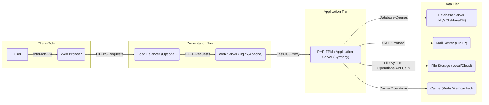
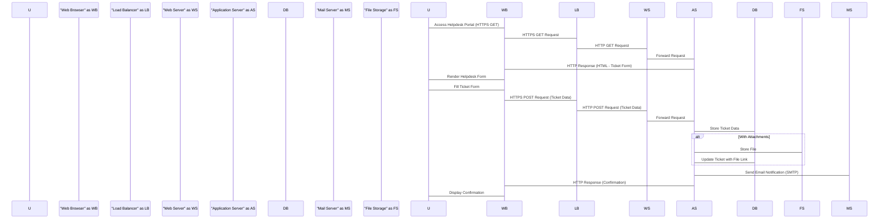
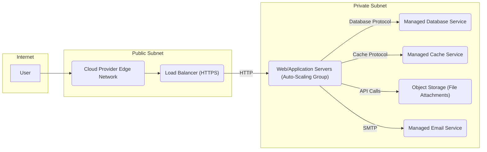

# Project Design Document: UVDesk Community Skeleton

**Version:** 1.1
**Date:** October 26, 2023
**Author:** AI Software Architect

## 1. Introduction

This document provides an enhanced design overview of the UVDesk Community Skeleton project, an open-source helpdesk system built on the Symfony PHP framework. This revised document aims to provide a more detailed and clearer foundation for subsequent threat modeling activities. It elaborates on the system's architecture, key components, data flow, and security considerations, building upon the previous version.

## 2. Goals

*   Provide a more granular and explicit architectural overview of the UVDesk Community Skeleton.
*   Clearly define the responsibilities and interactions of key components within the system.
*   Illustrate the typical data flow for common user interactions with greater detail.
*   Highlight potential security considerations with specific examples related to the design.
*   Serve as a robust and refined basis for conducting thorough threat modeling exercises.

## 3. Scope

This document covers the core architectural design of the UVDesk Community Skeleton as represented in the provided GitHub repository. It focuses on the logical and deployment aspects relevant to security analysis, providing more context and detail than the previous version. It continues to avoid delving into the specifics of individual code modules or detailed implementation choices within the Symfony framework unless directly pertinent to the overall architecture and security.

## 4. System Architecture

The UVDesk Community Skeleton adheres to a standard three-tier web application architecture, with clear distinctions between the layers:

*   **Presentation Tier (Client-Side):**  Responsible for rendering the user interface within web browsers. User interactions occur at this level.
*   **Application Tier (Server-Side Logic):**  The core of the application, handling business logic, data processing, and interactions with the data tier. Built using the Symfony framework in PHP.
*   **Data Tier (Data Storage and Services):** Manages persistent data storage and provides supporting services like email and caching.

## 5. Key Components

This section provides more detailed descriptions of the major components of the UVDesk Community Skeleton:

*   **User:**  An individual interacting with the helpdesk system. This can be a customer seeking support (requester) or a support agent providing assistance.
*   **Web Browser:** The software application on the user's device used to access and interact with the UVDesk web interface (e.g., Chrome, Firefox, Safari).
*   **Load Balancer (Optional):** Distributes incoming HTTPS traffic across multiple web/application server instances. This enhances scalability and availability by preventing a single point of failure and managing traffic distribution. Examples include HAProxy or cloud provider load balancers.
*   **Web Server (Nginx/Apache):**  Receives incoming HTTP/HTTPS requests from users. It serves static content (HTML, CSS, JavaScript, images) directly and forwards dynamic requests to the application server. Nginx and Apache are common choices.
*   **PHP-FPM / Application Server (Symfony):**  Executes the PHP code of the UVDesk application. The Symfony framework handles routing, request processing, business logic execution, database interactions (using Doctrine ORM or similar), and rendering dynamic web pages (using Twig or similar templating engines). PHP-FPM is a widely used PHP FastCGI Process Manager.
*   **Database Server (MySQL/MariaDB):**  Stores all persistent data for the UVDesk application. This includes user accounts, ticket details (subject, description, status, priority), agent information, knowledge base articles, system settings, and audit logs. MySQL and MariaDB are popular open-source relational database management systems.
*   **Mail Server (SMTP):**  Responsible for sending and receiving emails related to the helpdesk system. This includes notifications for new tickets, updates to existing tickets, password reset requests, and other system-generated emails. A standard SMTP server is required for this functionality.
*   **File Storage (Local/Cloud):**  Stores files uploaded by users or agents, such as attachments to support tickets or images embedded in knowledge base articles. This can be local storage on the server(s) or a cloud-based object storage service like Amazon S3 or Google Cloud Storage.
*   **Cache (Redis/Memcached):**  An in-memory data store used to cache frequently accessed data to improve application performance and reduce the load on the database. This can include caching database query results, user session data, or rendered page fragments. Redis and Memcached are common choices for caching in PHP applications.

## 6. Data Flow

This section provides a more detailed breakdown of the data flow for a user submitting a support ticket:

1. **User Accesses Helpdesk Portal:** A user navigates to the UVDesk helpdesk portal URL in their web browser. The browser sends an HTTPS GET request to the load balancer (if present) or directly to the web server.
2. **Web Server Receives Request:** The web server receives the HTTPS request. It might serve static assets related to the page (CSS, JavaScript) directly.
3. **Ticket Submission Form Display:** The web server (or application server if Server-Side Rendering is used) sends an HTML response containing the support ticket submission form back to the user's browser.
4. **User Fills and Submits Form:** The user enters details about their issue in the form fields and clicks the "Submit" button.
5. **Browser Sends Ticket Data:** The browser sends an HTTPS POST request containing the ticket data (subject, description, attachments, etc.) to the web server.
6. **Web Server Forwards Request:** The web server forwards the POST request to the PHP-FPM process running the Symfony application, typically using FastCGI or a similar protocol.
7. **Symfony Application Processing:**
    *   **Routing:** Symfony's router matches the incoming request to a specific controller action.
    *   **Authentication/Authorization:** The application verifies the user's identity and permissions (if applicable).
    *   **Input Validation:** The application validates the submitted data to ensure it meets the required format and constraints, preventing malicious input.
    *   **Data Processing:** The controller action processes the ticket data.
    *   **Database Interaction:** The application uses Doctrine ORM (or a similar database abstraction layer) to interact with the database server, creating a new ticket record.
    *   **File Storage (if attachments):** If files were attached, the application interacts with the file storage service (local filesystem or cloud storage API) to store the uploaded files. The database record for the ticket is updated with links or references to these stored files.
    *   **Caching (optional):**  Relevant data might be cached for future access.
    *   **Event Dispatching:** Symfony's event dispatcher might trigger events for actions like "ticket created."
8. **Email Notification:**  An event listener or service might be triggered to send email notifications. The application connects to the configured SMTP server and sends an email to the appropriate agents (and potentially the ticket requester) informing them about the new ticket.
9. **Response Generation:** The Symfony application generates an HTML response confirming the ticket submission, potentially displaying a success message and the ticket ID.
10. **Response Delivery:** The application server sends the HTML response back to the web server.
11. **Web Server Sends Response:** The web server sends the HTML response back to the user's web browser via HTTPS.
12. **User Sees Confirmation:** The user's browser renders the confirmation message.

## 7. Security Considerations

This section expands on the security considerations, providing more specific examples of potential threats:

*   **Authentication and Authorization:**
    *   **Threats:** Brute-force attacks on login forms, credential stuffing, session hijacking, privilege escalation if authorization is not correctly implemented.
    *   **Considerations:** Implement strong password policies, multi-factor authentication (MFA), robust session management, and role-based access control (RBAC) to restrict access based on user roles.
*   **Input Validation:**
    *   **Threats:** SQL injection, cross-site scripting (XSS), command injection, path traversal vulnerabilities if user input is not properly sanitized and validated.
    *   **Considerations:** Sanitize user inputs, use parameterized queries for database interactions, escape output rendered in HTML, and validate file uploads based on type and content.
*   **Data Protection:**
    *   **Threats:** Man-in-the-middle attacks intercepting sensitive data in transit, data breaches exposing sensitive data at rest.
    *   **Considerations:** Enforce HTTPS for all communication, encrypt sensitive data at rest in the database and file storage, and implement proper key management.
*   **Session Management:**
    *   **Threats:** Session fixation, session hijacking if session IDs are predictable or transmitted insecurely.
    *   **Considerations:** Use secure, HTTP-only, and SameSite cookies, regenerate session IDs after login, and implement appropriate session timeout mechanisms.
*   **Logging and Monitoring:**
    *   **Threats:**  Lack of visibility into malicious activities, delayed detection of security incidents.
    *   **Considerations:** Log all significant events (authentication attempts, access to sensitive data, errors), monitor logs for suspicious patterns, and set up alerts for potential security breaches.
*   **Dependency Management:**
    *   **Threats:** Exploiting known vulnerabilities in outdated third-party libraries and dependencies.
    *   **Considerations:** Regularly update dependencies, use dependency scanning tools to identify vulnerabilities, and follow security best practices for managing external libraries.
*   **File Upload Security:**
    *   **Threats:** Uploading malicious files (e.g., malware, web shells) that can compromise the server or other users.
    *   **Considerations:** Validate file types and sizes, sanitize file content where possible, store uploaded files outside the webroot, and consider using anti-virus scanning for uploaded files.
*   **Email Security:**
    *   **Threats:** Email spoofing, phishing attacks originating from the system, exposure of sensitive information via email.
    *   **Considerations:** Implement SPF, DKIM, and DMARC records to prevent email spoofing, use secure connections to the SMTP server, and be cautious about the information included in email notifications.
*   **Database Security:**
    *   **Threats:** Unauthorized access to sensitive data, data breaches due to database vulnerabilities.
    *   **Considerations:** Use strong database passwords, restrict database access to authorized users and applications, regularly patch the database server, and encrypt sensitive data within the database.
*   **Infrastructure Security:**
    *   **Threats:** Compromise of the underlying servers and network infrastructure.
    *   **Considerations:** Implement firewalls, intrusion detection/prevention systems, regularly patch operating systems and server software, and follow security best practices for server hardening.

## 8. Non-Functional Requirements (Security Relevant)

These non-functional requirements have direct implications for the security posture of the system:

*   **Availability:**  Ensuring the system remains operational and accessible. Security measures are needed to prevent denial-of-service (DoS) and distributed denial-of-service (DDoS) attacks.
*   **Performance:**  While primarily a performance concern, slow performance can sometimes be exploited in denial-of-service attacks or lead to user frustration, potentially encouraging them to bypass security measures.
*   **Scalability:**  The system's ability to handle increasing load. If the system is not scalable, it might become vulnerable to resource exhaustion attacks.
*   **Maintainability:**  A well-maintained codebase is easier to secure. Regular security updates and patching are crucial for addressing vulnerabilities promptly. Secure coding practices also contribute to maintainability and security.

## 9. Technology Stack

This section provides a more specific list of potential technologies used in the UVDesk Community Skeleton:

*   **Programming Language:** PHP (version 7.4 or higher recommended)
*   **Framework:** Symfony (version 5 or 6)
*   **Database:** MySQL (version 5.7 or 8.x), MariaDB
*   **Web Server:** Nginx, Apache HTTP Server
*   **Frontend Technologies:** HTML5, CSS3, JavaScript, potentially using a framework like Bootstrap or Tailwind CSS, and JavaScript frameworks like jQuery or potentially more modern alternatives.
*   **Caching:** Redis, Memcached
*   **Mail Server:**  Any standard SMTP server (e.g., Sendmail, Postfix, cloud-based email services like SendGrid or Mailgun)
*   **ORM/Database Abstraction:** Doctrine ORM (typically used within Symfony)
*   **Templating Engine:** Twig (standard for Symfony)

## 10. Deployment Diagram (Conceptual)

This is a more detailed conceptual deployment diagram illustrating a possible deployment scenario in a cloud environment, highlighting network boundaries:

## 11. Conclusion

This enhanced design document provides a more detailed and refined overview of the UVDesk Community Skeleton's architecture, components, and data flow. By elaborating on the key aspects and providing specific examples, it aims to facilitate a more comprehensive and effective threat modeling process. Understanding the intricacies of the system's design is crucial for identifying potential vulnerabilities and implementing appropriate security measures to ensure a secure and reliable helpdesk platform.