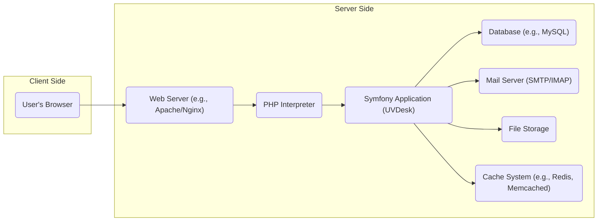
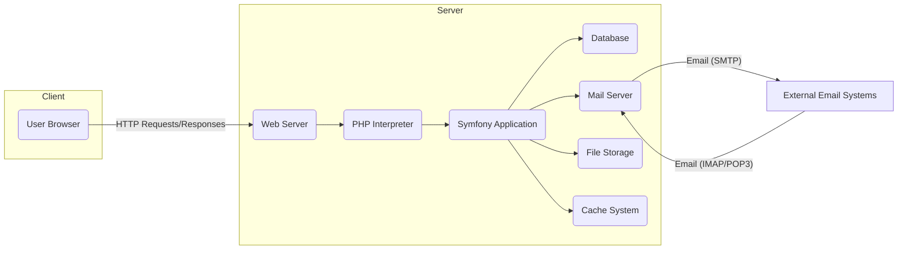
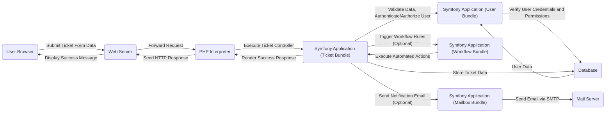

# Project Design Document: UVDesk Community Skeleton - Improved

**Version:** 1.1
**Date:** October 26, 2023
**Author:** AI Software Architect

## 1. Introduction

This document provides an enhanced design overview of the UVDesk Community Skeleton project, as found on GitHub at [https://github.com/uvdesk/community-skeleton](https://github.com/uvdesk/community-skeleton). This iteration aims to provide a more detailed and refined articulation of the system's architecture, components, and data flow, further strengthening its foundation for subsequent threat modeling activities.

### 1.1. Project Overview

The UVDesk Community Skeleton is a robust open-source help desk system built upon the Symfony PHP framework. It serves as a foundational platform for developing comprehensive customer support solutions, empowering organizations to effectively manage and respond to customer inquiries. The skeleton is designed with core functionalities and a modular architecture, facilitating extensive customization and the addition of new features.

### 1.2. Goals of this Document

*   Present a more detailed and comprehensive architectural overview of the UVDesk Community Skeleton.
*   Provide clearer and more specific descriptions of key components and their interactions.
*   Elaborate on the data flow within the system for critical operations, including data transformations.
*   Highlight potential areas of security concern with more specific examples based on the design.
*   Serve as a more robust and informative basis for future threat modeling exercises.

### 1.3. Scope

This document focuses on the core architectural design and data flow of the UVDesk Community Skeleton as represented in the provided GitHub repository. It provides a deeper dive into the responsibilities of key components and the interactions between them. Specific implementation details of individual modules or third-party integrations are not covered unless they are integral to the core functionality and understanding of the system's architecture.

## 2. System Architecture

The UVDesk Community Skeleton adheres to the Model-View-Controller (MVC) architectural pattern, a standard practice within Symfony applications.

### 2.1. High-Level Architecture

*   **User's Browser:** The primary interface through which users, including both support agents and customers, interact with the application. This includes rendering HTML, executing JavaScript, and handling user input.
*   **Web Server:** Responsible for handling incoming HTTP requests from clients and routing them to the appropriate backend service, in this case, the PHP interpreter. It also serves static assets like CSS, JavaScript, and images.
*   **PHP Interpreter:** Executes the PHP code that constitutes the Symfony application. It processes requests, interacts with the database, and generates responses.
*   **Symfony Application (UVDesk):** The core of the help desk system, encompassing the business logic, routing mechanisms, security features, and data management operations. It orchestrates the interaction between different bundles and services.
*   **Database:** Stores persistent data crucial for the application's operation, including user information, ticket details, conversation history, configurations, and more.
*   **Mail Server:** Facilitates the sending and receiving of emails related to ticket updates, notifications, and communication between agents and customers. This typically involves SMTP for sending and IMAP/POP3 for receiving.
*   **File Storage:**  Provides a repository for storing uploaded files, such as attachments included in support tickets. This could be local storage or a cloud-based object storage service.
*   **Cache System:** An optional but highly recommended component for improving performance by storing frequently accessed data in memory, reducing the load on the database.

### 2.2. Component Breakdown

The Symfony application is structured into modular bundles, each responsible for specific functionalities:

*   **Core Bundle:** Provides foundational services and functionalities used across the application, such as event dispatching, dependency injection, and base entities.
*   **User Bundle:** Manages user accounts, including registration, login, profile management, roles, and permissions for both support agents and customers. It handles authentication and authorization.
*   **Ticket Bundle:**  The central component for managing the lifecycle of support tickets, including creation, assignment, status updates, priority management, and resolution.
*   **Agent Bundle:** Offers specific features and interfaces tailored for support agents, such as ticket queues, assignment tools, response templates, and collaboration features.
*   **Customer Bundle:** Provides a dedicated interface and functionalities for customers to submit tickets, track their progress, and communicate with support agents.
*   **Mailbox Bundle:** Manages the integration with email systems, enabling the fetching of emails to create tickets and sending email notifications for ticket updates and replies. It handles email parsing and processing.
*   **Workflow Bundle:** Enables the automation of tasks and processes based on specific ticket events or conditions. This can include automatic assignment, status changes, or sending notifications.
*   **Report Bundle:**  Generates reports and analytics based on ticket data, providing insights into support team performance, common issues, and customer satisfaction.
*   **API Bundle:** Provides a programmatic interface (RESTful or similar) for external applications to interact with the help desk system, enabling integrations and data exchange.
*   **Theme Bundle:** Manages the visual appearance and branding of the application, allowing for customization of the user interface.

### 2.3. Data Flow (Example: Creating a New Ticket via Web Interface)

1. A user (customer or agent) interacts with the **User's Browser**, filling out the details in a ticket submission form. This involves inputting data like subject, description, priority, and potentially attachments.
2. The browser sends an HTTP POST request containing the form data to the **Web Server**.
3. The **Web Server** receives the request and forwards it to the **PHP Interpreter**.
4. The **PHP Interpreter** executes the Symfony application code, specifically routing the request to the appropriate controller within the **Ticket Bundle**.
5. The **Ticket Bundle**'s controller receives the request and performs initial validation of the input data to ensure it meets the required format and constraints.
6. The controller interacts with the **User Bundle** to authenticate and authorize the user, verifying their identity and permissions to create a ticket.
7. The controller interacts with the **Database** to persist the new ticket information, storing details like subject, description, associated user, status, and timestamps.
8. Optionally, the **Workflow Bundle** might be triggered based on the creation of the new ticket, potentially automating actions like assigning the ticket to a specific agent or setting an initial priority.
9. Optionally, the **Mailbox Bundle** might send a notification email via the **Mail Server** to relevant parties, such as the assigned agent or the customer who submitted the ticket, confirming its creation.
10. The controller renders a success response, which is then sent back through the **PHP Interpreter** and **Web Server** to the **User's Browser**, informing the user that the ticket has been created successfully.

### 2.4. Data Flow (Example: Receiving a New Ticket via Email)

1. An external email is sent to a designated support email address configured within the system.
2. The **Mail Server** receives the incoming email.
3. The **Mailbox Bundle**, configured to periodically poll the mail server (using IMAP/POP3) or receive emails via a push mechanism, retrieves the new email.
4. The **Mailbox Bundle** parses the email content, extracting key information such as the sender's address, subject line, email body, and any attachments.
5. The **Mailbox Bundle** interacts with the **User Bundle** to attempt to identify the sender. If the sender is a known user, their information is retrieved. If not, a new customer account might be created (depending on configuration).
6. The **Mailbox Bundle** interacts with the **Ticket Bundle** to create a new ticket, using the parsed email content as the ticket's subject and description. Attachments are also associated with the ticket and stored in **File Storage**.
7. The **Ticket Bundle** interacts with the **Database** to store the newly created ticket information.
8. Optionally, the **Workflow Bundle** might be triggered based on the creation of a ticket via email, potentially applying different rules than tickets created via the web interface.
9. Optionally, the **Mailbox Bundle** might send an automated acknowledgment email to the sender via the **Mail Server**, confirming receipt of their email and the creation of a support ticket.

## 3. Security Considerations

This section provides a more detailed outline of potential security considerations based on the system's architecture. These points will be crucial for in-depth analysis during subsequent threat modeling sessions.

### 3.1. Authentication and Authorization

*   The system relies on robust user authentication mechanisms to verify the identity of users (agents and customers) before granting access. This typically involves username/password combinations, and potentially multi-factor authentication.
*   Authorization mechanisms are critical for controlling access to different features and data based on the user's role and assigned permissions. This ensures that users can only access resources relevant to their responsibilities.
*   Potential vulnerabilities include:
    *   **Weak Password Policies:**  Lack of enforcement for strong passwords, making accounts susceptible to brute-force attacks.
    *   **Brute-Force Attacks on Login Forms:**  Insufficient protection against automated attempts to guess user credentials.
    *   **Insecure Session Management:**  Vulnerabilities in how user sessions are created, maintained, and invalidated, potentially leading to session hijacking.
    *   **Insufficient Role-Based Access Control (RBAC):**  Granularity issues in permission assignments, potentially granting users excessive privileges.
    *   **Lack of Account Lockout Mechanisms:**  Failure to temporarily lock accounts after multiple failed login attempts.

### 3.2. Data Security

*   Sensitive data, including user credentials, personal information, and ticket content, is stored within the **Database**. Protecting this data is paramount.
*   Potential vulnerabilities include:
    *   **SQL Injection Attacks:**  Exploiting vulnerabilities in database queries to gain unauthorized access to or manipulate data.
    *   **Insecure Database Configurations:**  Default or weak database credentials, open ports, or lack of proper access controls.
    *   **Lack of Encryption for Sensitive Data at Rest:**  Failure to encrypt sensitive data stored in the database, making it vulnerable if the database is compromised.
    *   **Lack of Encryption for Sensitive Data in Transit:**  Failure to use HTTPS to encrypt communication between the client and server, exposing data during transmission.
    *   **Unauthorized Access to the Database:**  Insufficient security measures to prevent unauthorized access to the database server itself.

### 3.3. Input Validation and Output Encoding

*   The application processes user-provided input from various sources, including web forms and email content. Proper validation and encoding are essential to prevent various attacks.
*   Potential vulnerabilities include:
    *   **Cross-Site Scripting (XSS) Attacks:**  Injecting malicious scripts into web pages viewed by other users.
    *   **Cross-Site Request Forgery (CSRF) Attacks:**  Tricking authenticated users into performing unintended actions on the application.
    *   **Command Injection Vulnerabilities:**  Injecting malicious commands into the system through user input fields.
    *   **Path Traversal Vulnerabilities:**  Exploiting insufficient validation to access files or directories outside the intended scope.
    *   **Email Header Injection:**  Manipulating email headers to send spam or phishing emails.

### 3.4. Email Security

*   The system's reliance on the **Mail Server** for communication introduces potential security risks related to email handling.
*   Potential vulnerabilities include:
    *   **Email Spoofing:**  Forging the sender address of emails to impersonate legitimate users or domains.
    *   **Man-in-the-Middle Attacks on Email Communication:**  Intercepting and potentially modifying email traffic between the application and the mail server if encryption is not properly implemented.
    *   **Exposure of Sensitive Information in Email Content:**  Sending sensitive data in emails without proper encryption.
    *   **Vulnerabilities in Email Parsing Logic:**  Exploiting flaws in how the **Mailbox Bundle** parses incoming emails to execute malicious code.

### 3.5. File Upload Security

*   The ability for users to upload files to **File Storage** presents opportunities for malicious activity.
*   Potential vulnerabilities include:
    *   **Malicious File Uploads:**  Uploading executable files (e.g., PHP scripts) or files containing malware that could compromise the server or other users.
    *   **Insecure File Storage Permissions:**  Incorrectly configured permissions on the file storage system, allowing unauthorized access to uploaded files.
    *   **Path Traversal Vulnerabilities during File Upload or Retrieval:**  Exploiting flaws to upload or download files to arbitrary locations on the server.

### 3.6. API Security

*   The **API Bundle** exposes functionalities to external applications, requiring careful security considerations.
*   Potential vulnerabilities include:
    *   **Lack of Proper Authentication and Authorization for API Endpoints:**  Allowing unauthorized access to API functionalities and data.
    *   **Exposure of Sensitive Data Through the API:**  Returning excessive or sensitive information in API responses.
    *   **API Rate Limiting Issues:**  Lack of mechanisms to prevent abuse through excessive API requests.
    *   **Injection Vulnerabilities in API Parameters:**  Exploiting vulnerabilities in how API parameters are processed to inject malicious code or queries.

### 3.7. Dependency Management

*   The Symfony application relies on numerous third-party libraries and dependencies, which can introduce security risks if not managed properly.
*   Potential vulnerabilities include:
    *   **Using Outdated or Vulnerable Dependencies:**  Failing to update dependencies with known security vulnerabilities.
    *   **Supply Chain Attacks Targeting Dependencies:**  Compromised dependencies introducing malicious code into the application.

## 4. Deployment

The UVDesk Community Skeleton can be deployed in various environments, each with its own security implications.

*   **On-Premise Servers:**  Deployed on infrastructure managed directly by the organization. This requires careful attention to server hardening, network security, and physical security.
*   **Cloud Infrastructure (IaaS):** Deployed on virtual machines provided by cloud providers like AWS, Azure, or GCP. Security responsibilities are shared between the organization and the cloud provider. Proper configuration of cloud security services is crucial.
*   **Platform as a Service (PaaS):** Deployed on platforms like Heroku or Platform.sh, which abstract away much of the underlying infrastructure management. While the PaaS provider handles some security aspects, application-level security remains the responsibility of the developers.

Deployment considerations relevant to security include:

*   Secure configuration of the **Web Server** (e.g., disabling unnecessary modules, setting appropriate headers).
*   Secure configuration of the **PHP Interpreter** (e.g., disabling dangerous functions, setting appropriate file permissions).
*   Implementation of robust firewall rules and network segmentation to restrict access to the application and its components.
*   Regular application of security updates and patches for the operating system and server software.
*   Secure storage and management of environment variables and secrets (e.g., database credentials, API keys).
*   Proper configuration of HTTPS with valid SSL/TLS certificates.

## 5. Technologies Used

*   **Programming Language:** PHP
*   **Framework:** Symfony (Specific version should be noted for dependency vulnerability tracking)
*   **Database:** Typically MySQL or MariaDB (Specific version should be noted for known database vulnerabilities)
*   **Web Server:** Apache or Nginx (Specific version should be noted for known web server vulnerabilities)
*   **Templating Engine:** Twig
*   **Frontend Technologies:** HTML, CSS, JavaScript (Likely utilizing libraries like jQuery, Bootstrap, or similar)
*   **Email Protocols:** SMTP (for sending), IMAP/POP3 (for receiving)
*   **Caching Systems (Optional):** Redis, Memcached

## 6. Diagrams

### 6.1. High-Level System Diagram

### 6.2. Ticket Creation Data Flow Diagram (Web Interface)

## 7. Future Considerations

*   Enhanced integration with other business systems, such as CRM or asset management platforms.
*   Implementation of more sophisticated reporting and analytics capabilities, potentially leveraging data warehousing solutions.
*   Continuous improvements to the user interface and user experience based on user feedback and evolving best practices.
*   Scalability and performance optimizations to handle increasing user loads and data volumes.
*   Adoption of containerization technologies (e.g., Docker) for easier deployment and management.

## 8. Glossary of Terms

*   **Bundle (Symfony):** A plugin-like structure in Symfony that encapsulates a set of features, including controllers, models, and views.
*   **Controller (MVC):**  A component in the MVC architecture that handles user requests and interacts with the model to retrieve or update data.
*   **Model (MVC):** Represents the data and business logic of the application.
*   **View (MVC):**  Responsible for rendering the user interface, typically using templates.
*   **SMTP (Simple Mail Transfer Protocol):** The standard protocol for sending emails over the internet.
*   **IMAP (Internet Message Access Protocol):** A protocol that allows email clients to access and manage emails stored on a mail server.
*   **POP3 (Post Office Protocol version 3):** Another protocol for retrieving emails from a mail server, typically downloading them to the client.
*   **RESTful API:** An architectural style for designing networked applications, relying on stateless communication and standard HTTP methods.

This improved document provides a more detailed and comprehensive understanding of the UVDesk Community Skeleton's architecture, data flow, and security considerations, making it a more effective foundation for subsequent threat modeling activities.